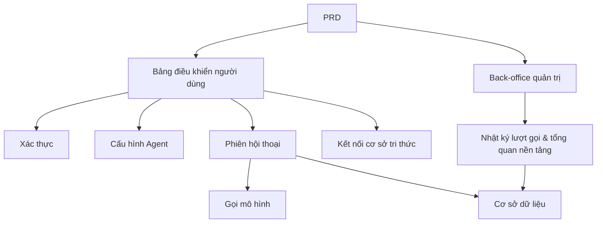

# Thực hành phát triển nền tảng Agent thông minh kiểu Dify

## Tổng quan

Dự án thực chiến này yêu cầu bạn hoàn thành một nền tảng Agent thông minh mô phỏng trải nghiệm cốt lõi của Dify dựa trên một PRD thực tế, xây dựng từ đầu. Bạn sẽ xây dựng bảng điều khiển người dùng, back-office quản trị và backend nền tảng, triển khai các chức năng cốt lõi như quản lý Agent, hội thoại, nhật ký và cơ sở tri thức.

Đây là phần thực hành tổng hợp của Stage 2. Khác với các dự án trang đơn hoặc chức năng đơn lẻ trước đó, dự án này yêu cầu bạn xây dựng một sản phẩm AI có "cảm giác nền tảng" — bao gồm đa vai trò, đa module, lưu trữ dữ liệu bền vững và chuỗi gọi mô hình.

## Kiến thức tiên quyết

Trước khi bắt đầu dự án này, bạn nên đã nắm được các nội dung sau:

- Thiết kế trang frontend và sử dụng thư viện component ([Thiết kế UI](../../frontend/ui-design/), [Thư viện component hiện đại](../../frontend/modern-component-library/))
- Thiết kế và phát triển API backend ([Viết code API](../../backend/ai-interface-code/))
- Cơ sở dữ liệu cơ bản và Supabase ([Từ cơ sở dữ liệu đến Supabase](../../backend/database-supabase/))
- Quy trình làm việc Git và triển khai ([Git và GitHub](../../backend/git-workflow/), [Triển khai ứng dụng Web](../../backend/zeabur-deployment/))

## Mục tiêu học tập

Sau khi hoàn thành bài thực hành này, bạn sẽ có thể:

1. Đọc và hiểu một PRD thực tế, từ đó trích xuất danh sách công việc phát triển
2. Thiết kế kiến trúc trang và mô hình dữ liệu cho nền tảng Agent
3. Triển khai chuỗi hoàn chỉnh tạo Agent, hội thoại, ghi nhật ký
4. Sử dụng AI hỗ trợ phát triển sản phẩm kiểu nền tảng
5. Hoàn thành liên hợp đầu cuối, bàn giao một nguyên mẫu nền tảng AI có thể demo

## Giới thiệu dự án

Sản phẩm bạn cần xây dựng là một nền tảng Agent thông minh kiểu Dify, bao gồm hai hệ thống con:

| Hệ thống con | Trách nhiệm |
|--------|------|
| **Bảng điều khiển người dùng** | Tạo Agent, cấu hình Prompt, khởi động hội thoại, xem nhật ký, quản lý cơ sở tri thức |
| **Back-office quản trị** | Xem dữ liệu người dùng, tình hình sử dụng tài nguyên nền tảng, thống kê lượt gọi |

Backend cần hỗ trợ các khả năng cốt lõi sau: quản lý Agent, quản lý phiên hội thoại, lưu trữ tin nhắn, gọi mô hình, ghi nhật ký lượt gọi, kết nối cơ sở tri thức.

::: tip Đường dẫn PRD
Tài liệu yêu cầu của dự án này nằm trên GitHub: [Xem PRD](https://github.com/datawhalechina/easy-vibe/blob/main/docs/zh-cn/stage-2/assignments/custom-dify-agent-platform/PRD.md)
:::

<div style="margin: 32px 0;">
  <ClientOnly>
    <StepBar :active="0" :items="[
      { title: 'Phân tích yêu cầu', description: 'Đọc PRD, xác định trang, ranh giới khả năng, xác thực, mô hình dữ liệu' },
      { title: 'Xây dựng khung', description: 'Dùng AI tạo khung bảng điều khiển người dùng và back-office quản trị' },
      { title: 'Phát triển lặp', description: 'Bổ sung từng module: Agent, hội thoại, nhật ký, cơ sở tri thức' },
      { title: 'Liên hợp & triển khai', description: 'Chạy đầu cuối, triển khai và chuẩn bị demo' }
    ]" />
  </ClientOnly>
</div>

## Phần 1: Phân tích yêu cầu

### 1.1 Đọc PRD

Mở tài liệu PRD, tập trung trả lời các câu hỏi sau:

- Agent, phiên hội thoại, nhật ký, cơ sở tri thức — cái nào cần vào MVP?
- Danh sách trang và định tuyến đã chốt chưa?
- Ranh giới giữa gọi mô hình và ghi nhật ký là gì?
- Đa tenant và workflow phức tạp có nên tạm thời không làm không?

::: warning
Nếu các câu hỏi trên chưa có câu trả lời rõ ràng, đừng bắt đầu viết code. Hiểu sai yêu cầu là nguyên nhân phổ biến nhất dẫn đến phải làm lại.
:::

### 1.2 Xác nhận kiến trúc hệ thống

Dựa trên PRD, hệ thống hóa kiến trúc tổng thể của hệ thống:



## Phần 2: Xây dựng khung dự án

### 2.1 Tạo trang frontend

Tham khảo prompt:

```text
Vui lòng dựa trên PRD hiện tại, giúp tôi tạo khung frontend của nền tảng Agent thông minh kiểu Dify.

Yêu cầu:
1. Phía người dùng bao gồm: đăng nhập, danh sách Agent, cấu hình Agent, trang hội thoại, trang nhật ký, trang cơ sở tri thức
2. Phía back-office bao gồm: trang chủ back-office, tổng quan người dùng, tổng quan sử dụng tài nguyên
3. Trước tiên chỉ tạo cấu trúc trang và dữ liệu giả, không kết nối API thực tế
4. Phong cách phải giống nền tảng AI hiện đại
```

### 2.2 Xác minh cấu trúc trang

Kiểm tra từng mục:

- [ ] Điểm vào bảng điều khiển người dùng và back-office quản trị đã tách biệt
- [ ] Trang danh sách Agent, cấu hình, hội thoại, nhật ký, cơ sở tri thức đã hoàn chỉnh
- [ ] Trang chủ back-office, trang tổng quan người dùng có thể truy cập
- [ ] Dữ liệu giả hiển thị trạng thái UI cơ bản

## Phần 3: Phát triển lặp

### 3.1 Triển khai theo module

Trên cơ sở khung, bổ sung chức năng theo thứ tự module sau:

1. **Xác thực**: Đăng ký, đăng nhập, phân biệt vai trò
2. **Quản lý Agent**: Tạo, chỉnh sửa, xóa, cấu hình Prompt
3. **Chức năng hội thoại**: Tạo phiên hội thoại, gửi/nhận tin nhắn, gọi mô hình
4. **Ghi nhật ký**: Thời gian xử lý, token sử dụng, ghi lỗi
5. **Kết nối cơ sở tri thức** (mục điểm cộng): Tải lên tài liệu, tìm kiếm, chèn kết quả
6. **Back-office quản trị**: Dữ liệu người dùng, sử dụng tài nguyên, thống kê lượt gọi

Sau khi hoàn thành mỗi module, sử dụng bảng dưới đây để tự kiểm tra:

| Mục kiểm tra | Phương pháp xác minh |
|--------|----------|
| Tính nhất quán trang | Số lượng trang, chức năng có khớp với PRD không |
| Chuỗi API | API agents, chat, logs, knowledge có hoàn chỉnh không |
| Cách ly phân quyền | Người dùng có chỉ quản lý được agent và phiên hội thoại của mình không |
| Tính nhất quán dữ liệu | Dữ liệu messages, logs, documents có khớp nhau không |
| Khả năng demo | Có thể demo chuỗi hoàn chỉnh "tạo agent → hội thoại → xem nhật ký" không |

### 3.2 Kết nối cơ sở tri thức (mục điểm cộng)

Nếu bạn muốn tăng khả năng cơ sở tri thức, có thể thêm "công tắc cơ sở tri thức" cho mỗi Agent:

- Khi bật, trước tiên tìm kiếm đoạn tài liệu, sau đó gửi cùng câu hỏi của người dùng cho mô hình
- Khi tắt, phản hồi theo chế độ hội thoại thông thường

Phiên bản đầu tiên không cần theo đuổi RAG phức tạp, chỉ cần "kết quả tìm kiếm có thể thấy, chuỗi gọi có thể giải thích".

## Phần 4: Liên hợp và Triển khai

### 4.1 Kiểm thử đầu cuối

Ít nhất xác minh các kịch bản sau:

- Đăng ký → Tạo Agent → Cấu hình Prompt → Khởi động hội thoại → Xem nhật ký
- Quản trị viên đăng nhập → Xem dữ liệu người dùng → Xem thống kê lượt gọi

Kiểm tra trước khi triển khai:

- [ ] Tất cả API cốt lõi đều đã kiểm tra đăng nhập
- [ ] Kiểm tra quyền sở hữu Agent thông qua
- [ ] Bản ghi phiên hội thoại, bản ghi nhật ký thực sự lưu vào cơ sở dữ liệu
- [ ] Key mô hình sử dụng biến môi trường, không hard-code
- [ ] Thông báo lỗi có thể thấy trên frontend, không chỉ in ra console

### 4.2 Triển khai

Triển khai dự án lên môi trường mạng công cộng. Tham khảo hướng dẫn triển khai: [Quy trình làm việc Git và GitHub](../../backend/git-workflow/), [Cách triển khai ứng dụng Web](../../backend/zeabur-deployment/).

## Sản phẩm bàn giao

Sau khi hoàn thành dự án này, bạn cần nộp các nội dung sau:

- [ ] Liên kết demo trực tuyến có thể truy cập
- [ ] Liên kết kho mã nguồn (bao gồm README)
- [ ] Tài liệu PRD
- [ ] Ảnh chụp màn hình các trang cốt lõi (trang quản lý Agent, trang hội thoại, trang nhật ký, trang chủ back-office)
- [ ] Video demo 60 giây (bao gồm tạo Agent → hội thoại → xem nhật ký)

README tối thiểu bao gồm: giới thiệu dự án, mô tả kiến trúc, công nghệ sử dụng, bước khởi động cục bộ, danh sách biến môi trường, mô tả API.

## Tiêu chí chấm điểm

| Chiều | Yêu cầu cơ bản | Yêu cầu nâng cao |
|------|---------|---------|
| Độ hoàn thiện nền tảng | Ba trang agents / chat / logs có thể sử dụng | Có điều hướng rõ ràng và ngôn ngữ thiết kế thống nhất |
| Chuỗi nghiệp vụ | Có thể tạo Agent và hội thoại thực sự | Hỗ trợ chuyển đổi đa Agent và phiên hội thoại lịch sử |
| Dữ liệu & theo dõi | Tin nhắn và nhật ký lượt gọi có thể truy vấn | Có bảng thống kê token / thời gian xử lý |
| Phân quyền bảo mật | Chỉ người dùng đã đăng nhập mới có thể truy cập API cốt lõi | Kiểm tra quyền sở hữu tài nguyên hoàn thiện |
| Bàn giao kỹ thuật | Có thể triển khai, có thể demo, README rõ ràng | Kết nối cơ sở tri thức và có thể giải thích kết quả tìm kiếm |

## Kiểm tra trước khi nộp

<el-card shadow="hover" style="margin: 20px 0; border-radius: 12px;">
  <template #header>
    <div style="font-weight: bold; font-size: 16px;">Nhìn lại lần cuối trước khi nộp</div>
  </template>

  <ul style="list-style-type: none; padding-left: 0;">
    <li><label><input type="checkbox" disabled /> Sau khi đăng nhập có thể truy cập trang quản lý Agent, hội thoại, nhật ký</label></li>
    <li><label><input type="checkbox" disabled /> Ít nhất có thể tạo 1 Agent và hội thoại thành công</label></li>
    <li><label><input type="checkbox" disabled /> Mỗi vòng hỏi đáp đều có thể tìm thấy bản ghi trong cơ sở dữ liệu</label></li>
    <li><label><input type="checkbox" disabled /> Khi gọi thất bại, thông tin lỗi có thể thấy trên frontend và nhật ký đã ghi</label></li>
    <li><label><input type="checkbox" disabled /> Dự án đã được triển khai, README và video demo đầy đủ</label></li>
  </ul>
</el-card>

## Tài liệu tham khảo

- [Thiết kế UI](../../frontend/ui-design/)
- [Sử dụng thư viện component hiện đại để cập nhật giao diện](../../frontend/modern-component-library/)
- [Từ cơ sở dữ liệu đến Supabase](../../backend/database-supabase/)
- [Mô hình hỗ trợ viết code API và tài liệu API bằng mô hình lớn](../../backend/ai-interface-code/)
- [Quy trình làm việc Git và GitHub](../../backend/git-workflow/)
- [Cách triển khai ứng dụng Web](../../backend/zeabur-deployment/)
