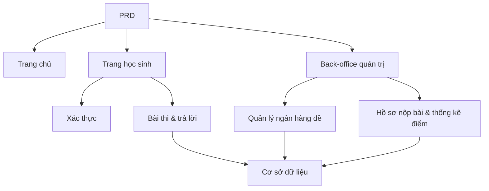

# Thực hành phát triển hệ thống quản lý và thi trực tuyến

## Tổng quan

Dự án thực chiến này yêu cầu bạn hoàn thành một hệ thống thi và quản lý trực tuyến dựa trên một PRD thực tế, xây dựng từ đầu. Điểm đặc biệt của dự án này là nó chứa nhiều vai trò (học sinh và quản trị viên), mỗi vai trò nhìn thấy các trang khác nhau và có thể thực hiện các thao tác khác nhau. Bạn sẽ sử dụng Express để xây dựng backend, triển khai toàn bộ chuỗi nghiệp vụ thi.

Đây là phần thực hành tổng hợp của Stage 2. Hệ thống phân quyền đa vai trò rất phổ biến trong thực tế công việc, sau khi nắm vững mô hình này, bạn có thể ứng phó với các kịch bản nghiệp vụ như giáo dục, SaaS, quản lý back-office, v.v.

## Kiến thức tiên quyết

Trước khi bắt đầu dự án này, bạn nên đã nắm được các nội dung sau:

- Thiết kế trang前端 và sử dụng thư viện component ([Thiết kế UI](../../frontend/ui-design/), [Thư viện component hiện đại](../../frontend/modern-component-library/))
- Thiết kế và phát triển API backend ([Viết code API](../../backend/ai-interface-code/))
- Cơ sở dữ liệu cơ bản và Supabase ([Từ cơ sở dữ liệu đến Supabase](../../backend/database-supabase/))
- Quy trình làm việc Git và triển khai ([Git và GitHub](../../backend/git-workflow/), [Triển khai ứng dụng Web](../../backend/zeabur-deployment/))

## Mục tiêu học tập

Sau khi hoàn thành bài thực hành này, bạn sẽ có thể:

1. Đọc và hiểu một PRD thực tế, từ đó trích xuất danh sách công việc phát triển
2. Thiết kế kiểm soát phân quyền và định tuyến trang cho hệ thống đa vai trò
3. Sử dụng Express để triển khai API backend hoàn chỉnh
4. Triển khai chuỗi nghiệp vụ thi, nộp bài, tự động chấm điểm
5. Hoàn thành liên hợp đầu cuối, bàn giao một nguyên mẫu hệ thống nghiệp vụ có thể demo

## Giới thiệu dự án

Sản phẩm bạn cần xây dựng là một hệ thống thi và quản lý trực tuyến, bao gồm ba hệ thống con:

| Hệ thống con | Trách nhiệm |
|--------|------|
| **Trang chủ** | Giới thiệu nền tảng, điểm đăng nhập |
| **Trang học sinh** | Danh sách bài thi, làm bài, nộp bài, xem điểm |
| **Back-office quản trị** | Quản lý ngân hàng đề, quản lý bài thi, hồ sơ nộp bài, thống kê điểm |

Backend sử dụng Express, cần hỗ trợ: xác thực đăng nhập, phân quyền vai trò, quản lý bài thi và ngân hàng đề, quy trình nộp bài và tự động chấm điểm, quản lý điểm và thống kê.

::: tip Đường dẫn PRD
Tài liệu yêu cầu của dự án này nằm trên GitHub: [Xem PRD](https://github.com/datawhalechina/easy-vibe/blob/main/docs/zh-cn/stage-2/assignments/exam-management-express/PRD.md)
:::

<div style="margin: 32px 0;">
  <ClientOnly>
    <StepBar :active="0" :items="[
      { title: 'Phân tích yêu cầu', description: 'Đọc PRD, xác định vai trò, trang, chuỗi bài thi và mô hình dữ liệu' },
      { title: 'Xây dựng khung', description: 'Dùng AI tạo khung trang học sinh và trang quản trị' },
      { title: 'Phát triển backend', description: 'Express kết nối đăng nhập, bài thi, nộp bài, chấm điểm' },
      { title: 'Liên hợp & triển khai', description: 'Chạy đầu cuối, triển khai và chuẩn bị demo' }
    ]" />
  </ClientOnly>
</div>

## Phần 1: Phân tích yêu cầu

### 1.1 Đọc PRD

Mở tài liệu PRD, tập trung trả lời các câu hỏi sau:

- Hệ thống bao gồm những vai trò nào? Mỗi vai trò có thể làm gì?
- Danh sách trang đã hoàn chỉnh chưa? Trang học sinh và trang quản trị lần lượt có những trang nào?
- Hỗ trợ những loại câu hỏi nào? Logic chấm điểm cho từng loại là gì?
- Quy trình hoàn chỉnh của bài thi là gì? (Phát hành → Bắt đầu → Trả lời → Nộp → Chấm điểm → Xem điểm)

::: warning
Nếu các câu hỏi trên chưa có câu trả lời rõ ràng, đừng bắt đầu viết code. Hiểu sai yêu cầu là nguyên nhân phổ biến nhất dẫn đến phải làm lại.
:::

### 1.2 Xác nhận kiến trúc hệ thống

Dựa trên PRD, hệ thống hóa kiến trúc tổng thể của hệ thống:



## Phần 2: Xây dựng khung dự án

### 2.1 Tạo trang frontend

Tham khảo prompt:

```text
Vui lòng dựa trên PRD hiện tại, giúp tôi tạo khung frontend của hệ thống thi và quản lý trực tuyến.

Yêu cầu công nghệ:
- Next.js App Router
- TypeScript
- Tailwind CSS
- shadcn/ui

Danh sách trang:
1. Trang chủ /
2. Trang đăng nhập /login
3. Trang danh sách bài thi học sinh /student/exams
4. Trang làm bài thi học sinh /student/exams/[id]
5. Trang điểm học sinh /student/history
6. Trang chủ back-office quản trị /admin
7. Trang quản lý bài thi /admin/exams
8. Trang quản lý ngân hàng đề /admin/questions
9. Trang hồ sơ nộp bài /admin/submissions

Yêu cầu:
- Trang học sinh nhấn mạnh sự rõ ràng, tập trung, dễ làm bài
- Trang quản trị sử dụng bố cục thanh bên + thanh trên
- Trước tiên sử dụng mock data, không kết nối API thực tế
- Chú ý khả năng sử dụng cơ bản trên máy tính để bàn và thiết bị di động
```

### 2.2 Hoàn thiện trang làm bài thi học sinh

Trang làm bài là trang cốt lõi của học sinh, tập trung hoàn thiện:

```text
Vui lòng tiếp tục hoàn thiện trang làm bài thi học sinh.

Đây là trang làm bài của hệ thống thi trực tuyến, cần bao gồm:
- Phần trên hiển thị tiêu đề bài thi, đếm ngược, số câu đã trả lời
- Phần giữa hiển thị nội dung câu hỏi và các lựa chọn
- Hỗ trợ ba loại câu hỏi: trắc nghiệm, đúng/sai, tự luận
- Bên trái hoặc trên có bảng trả lời, hiển thị từng câu đã trả lời hay chưa
- Hiện xác nhận trước khi nhấn nộp bài

Trước tiên sử dụng mock data để triển khai tương tác, không kết nối API thực tế.

Yêu cầu:
- Giao diện đơn giản, không giống trang bảng back-office
- Đếm ngược cần nổi bật nhưng không tạo áp lực quá mạnh
- Có trạng thái trống và trạng thái loading
```

### 2.3 Hoàn thiện back-office quản trị

Phiên bản đầu tiên của back-office quản trị tập trung vào ba khu vực cốt lõi:

- **Quản lý bài thi**: Tạo bài thi, thiết lập thời gian, trạng thái phát hành
- **Quản lý ngân hàng đề**: Thêm câu hỏi mới, chỉnh sửa câu hỏi, lọc theo loại câu hỏi
- **Hồ sơ nộp bài**: Xem bài nộp của học sinh, điểm số, thời gian

### 2.4 Xác minh cấu trúc trang

Kiểm tra từng mục:

- [ ] Điểm vào trang học sinh và trang quản trị đã tách biệt
- [ ] Trang đăng nhập, danh sách bài thi, trang làm bài, trang điểm đã hoàn chỉnh
- [ ] Trang quản lý ngân hàng đề, quản lý bài thi, hồ sơ nộp bài đã có thể truy cập
- [ ] Phong cách trang học sinh và trang quản trị có sự khác biệt rõ ràng

### Gặp khó khăn?

Nếu bạn gặp khó khăn trong giai đoạn xây dựng frontend, bạn có thể xem lại các chương sau:

- [Từ cơ sở dữ liệu đến Supabase](../../backend/database-supabase/)
- [Thiết kế và phát triển API backend ứng dụng](../../backend/ai-interface-code/)
- [Sử dụng thư viện component hiện đại để cập nhật giao diện](../../frontend/modern-component-library/)

## Phần 3: Phát triển Backend

### 3.1 Đăng nhập và kiểm soát phân quyền

```text
Vui lòng coi tôi là người mới bắt đầu, giúp tôi hoàn thành đăng nhập và kiểm soát phân quyền của hệ thống thi trực tuyến.

Backend sử dụng Express.

Mục tiêu:
1. Cả học sinh và quản trị viên đều có thể đăng nhập
2. Sau khi đăng nhập trả về vai trò người dùng
3. Học sinh chỉ có thể truy cập các API liên quan đến /student/*
4. Quản trị viên chỉ có thể truy cập các API liên quan đến /admin/*
5. Người dùng chưa đăng nhập khi truy cập trang được bảo vệ sẽ chuyển hướng đến /login

Yêu cầu triển khai:
- Đưa ra gợi ý cấu trúc thư mục rõ ràng
- Giải thích rõ middleware chịu trách nhiệm cho việc gì
- Không hard-code các biến môi trường liên quan
- Sau khi hoàn thành, giải thích cách xác minh phân quyền có hiệu lực hay không
```

### 3.2 API quản lý bài thi và ngân hàng đề

Khuyến nghị triển khai theo các module sau:

| Module | API khuyến nghị |
|------|----------|
| Quản lý bài thi | `GET /api/exams`, `POST /api/admin/exams`, `PATCH /api/admin/exams/:id` |
| Quản lý ngân hàng đề | `GET /api/admin/questions`, `POST /api/admin/questions` |
| Bắt đầu bài thi | `POST /api/submissions/start` |
| Nộp bài thi | `POST /api/submissions/:id/submit` |
| Hồ sơ điểm | `GET /api/student/history`, `GET /api/admin/submissions` |

Tham khảo prompt:

```text
Vui lòng giúp tôi thiết kế và triển khai Express API cho hệ thống thi trực tuyến.

Phạm vi chức năng:
- Quản trị viên tạo bài thi
- Quản trị viên duy trì ngân hàng đề
- Học sinh xem bài thi đã phát hành
- Học sinh bắt đầu bài thi và tạo submission
- Học sinh nộp câu trả lời và tự động chấm câu trắc nghiệm và đúng/sai
- Câu tự luận trước tiên đánh dấu là chờ phê duyệt
- Học sinh xem điểm lịch sử của mình
- Quản trị viên xem tất cả hồ sơ nộp bài

Yêu cầu:
- Tên API rõ ràng
- Trả về cấu trúc JSON thống nhất
- Code phân biệt các lớp controller, service, middleware, db
- Giải thích cách kiểm tra từng API
```

### 3.3 Logic chấm điểm

Logic chấm điểm là quy tắc nghiệp vụ cốt lõi của hệ thống thi:

- **Câu trắc nghiệm**: Câu trả lời của người dùng khớp với đáp án thì được điểm
- **Câu đúng/sai**: Cũng có thể tự động chấm
- **Câu tự luận**: Phiên bản đầu tiên chỉ lưu câu trả lời, điểm để trống, trạng thái `reviewed = false`

::: tip Mục điểm cộng
Nếu bạn muốn tăng khả năng AI, quản trị viên có thể nhập "chủ đề + độ khó" trong back-office, model sẽ tạo một loạt câu hỏi ứng viên, sau đó người sẽ phê duyệt và đưa vào ngân hàng đề. Nhưng đây là mục điểm cộng, không bắt buộc.
:::

## Phần 4: Liên hợp và Triển khai

### 4.1 Kiểm thử đầu cuối

Ít nhất xác minh các kịch bản sau:

- Học sinh đăng nhập → Xem danh sách bài thi → Bắt đầu làm bài → Nộp bài → Xem điểm
- Quản trị viên đăng nhập → Tạo bài thi → Thêm câu hỏi → Phát hành → Xem hồ sơ nộp bài

### 4.2 Triển khai

- Frontend triển khai lên Vercel / Zeabur
- Express API triển khai lên Zeabur / Railway / Render
- Cơ sở dữ liệu sử dụng Supabase Postgres hoặc PostgreSQL được quản lý

Kiểm tra trước khi triển khai:

- [ ] Biến môi trường đã đầy đủ chưa
- [ ] Địa chỉ API frontend và backend đã chính xác chưa
- [ ] Trạng thái đăng nhập có hoạt động bình thường trong môi trường production không
- [ ] Tài khoản quản trị viên có thể thực sự truy cập back-office không
- [ ] README có bao gồm hướng dẫn khởi động, triển khai, kiểm thử không

## Sản phẩm bàn giao

Sau khi hoàn thành dự án này, bạn cần nộp các nội dung sau:

- [ ] Liên kết demo trực tuyến có thể truy cập
- [ ] Liên kết kho mã nguồn (bao gồm README)
- [ ] Tài liệu PRD
- [ ] Ảnh chụp màn hình các trang cốt lõi (trang chủ, danh sách bài thi học sinh, trang làm bài, back-office quản trị)
- [ ] Video demo 60 giây (bao gồm quy trình học sinh làm bài và quy trình quản trị viên quản lý)

README tối thiểu bao gồm: giới thiệu dự án, mô tả trang cốt lõi, công nghệ sử dụng, bước khởi động cục bộ, danh sách biến môi trường.

## Tiêu chí chấm điểm

| Chiều | Yêu cầu cơ bản | Yêu cầu nâng cao |
|------|---------|---------|
| Độ hoàn thiện trang | Các trang chính của học sinh và quản trị viên đều có thể truy cập | Phong cách trang thống nhất, thiết bị di động cơ bản có thể sử dụng |
| Chuỗi nghiệp vụ | Học sinh có thể đăng nhập, tham gia thi, nộp bài và xem điểm | Quản trị viên có thể tạo và phát hành bài thi hoàn chỉnh |
| Tính chính xác dữ liệu | Sau khi nộp câu trả lời có thể ghi vào cơ sở dữ liệu, câu khách quan có thể tự động chấm điểm | Câu tự luận hỗ trợ phê duyệt thủ công hoặc hỗ trợ AI |
| Kiểm soát phân quyền | Ranh giới truy cập giữa học sinh và quản trị viên rõ ràng | API backend cũng có kiểm tra vai trò |
| Bàn giao kỹ thuật | Dự án có thể chạy, có thể triển khai, README rõ ràng | Có video demo và hướng dẫn kiểm thử |

## Kiểm tra trước khi nộp

<el-card shadow="hover" style="margin: 20px 0; border-radius: 12px;">
  <template #header>
    <div style="font-weight: bold; font-size: 16px;">Nhìn lại lần cuối trước khi nộp</div>
  </template>

  <ul style="list-style-type: none; padding-left: 0;">
    <li><label><input type="checkbox" disabled /> Trang chủ, trang đăng nhập, trang học sinh, trang quản trị đều đã hoàn thành</label></li>
    <li><label><input type="checkbox" disabled /> Học sinh có thể bắt đầu bài thi và nộp câu trả lời bình thường</label></li>
    <li><label><input type="checkbox" disabled /> Quản trị viên có thể tạo bài thi và xem hồ sơ nộp bài</label></li>
    <li><label><input type="checkbox" disabled /> Điểm câu khách quan có thể tự động tính toán và ghi vào cơ sở dữ liệu</label></li>
    <li><label><input type="checkbox" disabled /> Ranh giới phân quyền giữa học sinh và quản trị viên đã được xác minh</label></li>
    <li><label><input type="checkbox" disabled /> Dự án đã được triển khai hoặc có hướng dẫn chạy cục bộ hoàn chỉnh</label></li>
  </ul>
</el-card>

## Tài liệu tham khảo

- [Thiết kế UI](../../frontend/ui-design/)
- [Sử dụng thư viện component hiện đại để cập nhật giao diện](../../frontend/modern-component-library/)
- [Từ cơ sở dữ liệu đến Supabase](../../backend/database-supabase/)
- [Mô hình hỗ trợ viết code API và tài liệu API bằng mô hình lớn](../../backend/ai-interface-code/)
- [Quy trình làm việc Git và GitHub](../../backend/git-workflow/)
- [Cách triển khai ứng dụng Web](../../backend/zeabur-deployment/)
