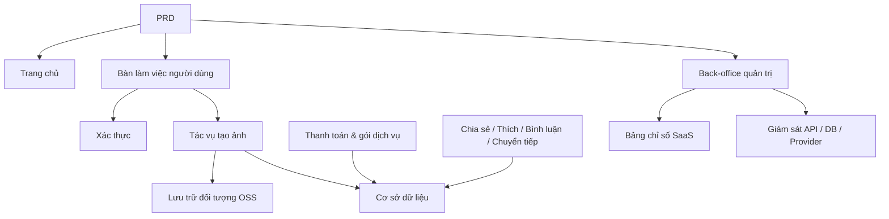

# Thực hành phát triển SaaS tạo ảnh AI hiện đại

## Tổng quan

Dự án thực chiến này yêu cầu bạn hoàn thành một sản phẩm SaaS tạo ảnh AI tham khảo trải nghiệm Midjourney dựa trên một PRD (tài liệu yêu cầu sản phẩm) thực tế, xây dựng từ đầu. Bạn sẽ trải nghiệm toàn bộ quá trình phân tích yêu cầu, phân tách dự án, phát triển lặp, liên hợp và triển khai.

Đây là phần thực hành tổng hợp của Stage 2. Trong các chương trước, bạn đã học riêng biệt các kỹ năng thiết kế trang frontend, phát triển API backend, thao tác cơ sở dữ liệu, tích hợp thanh toán, v.v. — dự án này yêu cầu bạn kết hợp tất cả lại với nhau, bàn giao một nguyên mẫu sản phẩm có thể chạy được.

## Kiến thức tiên quyết

Trước khi bắt đầu dự án này, bạn nên đã nắm được các nội dung sau:

- Thiết kế trang frontend và sử dụng thư viện component ([Thiết kế UI](../../frontend/ui-design/), [Thư viện component hiện đại](../../frontend/modern-component-library/))
- Thiết kế và phát triển API backend ([Viết code API](../../backend/ai-interface-code/))
- Cơ sở dữ liệu cơ bản và Supabase ([Từ cơ sở dữ liệu đến Supabase](../../backend/database-supabase/))
- Tích hợp thanh toán ([Hệ thống thanh toán Stripe](../../backend/stripe-payment/))
- Quy trình làm việc Git và triển khai ([Git và GitHub](../../backend/git-workflow/), [Triển khai ứng dụng Web](../../backend/zeabur-deployment/))

## Mục tiêu học tập

Sau khi hoàn thành bài thực hành này, bạn sẽ có thể:

1. Đọc và hiểu một PRD thực tế, từ đó trích xuất danh sách công việc phát triển
2. Phân tách module dựa trên PRD, lập kế hoạch triển khai từng bước
3. Sử dụng AI hỗ trợ hoàn thành xây dựng khung frontend và phát triển API backend
4. Xác minh và tối ưu hóa lặp từng module
5. Hoàn thành liên hợp đầu cuối, đưa dự án từ "chạy được" đến "có thể bàn giao"

## Giới thiệu dự án

Sản phẩm bạn cần xây dựng là một nền tảng SaaS tạo ảnh AI hiện đại, bao gồm ba hệ thống con:

| Hệ thống con | Trách nhiệm |
|--------|------|
| **Trang chủ** | Giới thiệu sản phẩm, bảng giá, FAQ, chuyển đổi đăng ký |
| **Bàn làm việc người dùng** | Nhập Prompt, tạo ảnh, thư viện ảnh, tín dụng, gói dịch vụ, tương tác cộng đồng |
| **Back-office quản trị** | Quản lý người dùng, quản lý tác vụ, quản lý thanh toán, kiểm duyệt nội dung, chỉ số SaaS, giám sát hệ thống |

Backend cần hỗ trợ các khả năng cốt lõi sau: xác thực người dùng, tác vụ tạo ảnh, lưu trữ đối tượng OSS, tín dụng và thanh toán gói dịch vụ, tương tác xã hội ảnh, giám sát dữ liệu vận hành.

::: tip Đường dẫn PRD
Tài liệu yêu cầu của dự án này nằm trên GitHub: [Xem PRD](https://github.com/datawhalechina/easy-vibe/blob/main/docs/zh-cn/stage-2/assignments/modern-landing-page/PRD.md)
:::

<div style="margin: 32px 0;">
  <ClientOnly>
    <StepBar :active="0" :items="[
      { title: 'Phân tích yêu cầu', description: 'Đọc PRD, trích xuất trang, module, mô hình dữ liệu và ranh giới' },
      { title: 'Xây dựng khung', description: 'Dùng AI tạo ba bộ khung frontend (www / app / admin)' },
      { title: 'Phát triển lặp', description: 'Bổ sung từng module: API, phân quyền, thanh toán, giám sát' },
      { title: 'Liên hợp & triển khai', description: 'Chạy đầu cuối, triển khai và chuẩn bị demo' }
    ]" />
  </ClientOnly>
</div>

## Phần 1: Phân tích yêu cầu

### 1.1 Đọc PRD

Mở tài liệu PRD, tập trung trả lời các câu hỏi sau:

- Hệ thống có mấy điểm vào? Mỗi điểm bao phủ những trang nào?
- Chức năng cốt lõi của mỗi trang là gì?
- Backend bao gồm những module và bảng cơ sở dữ liệu nào?
- Phạm vi MVP là gì? Phiên bản đầu tiên làm gì, không làm gì?

::: warning
Nếu các câu hỏi trên chưa có câu trả lời rõ ràng, đừng bắt đầu viết code. Hiểu sai yêu cầu là nguyên nhân phổ biến nhất dẫn đến phải làm lại.
:::

### 1.2 Xác nhận kiến trúc hệ thống

Dựa trên mô tả trong PRD, hệ thống hóa kiến trúc tổng thể của hệ thống:



Khuyến nghị bạn vẽ lại sơ đồ kiến trúc bằng lời của mình, xác nhận rằng sự hiểu biết của bạn về hệ thống là hoàn chỉnh.

## Phần 2: Xây dựng khung dự án

### 2.1 Tạo trang frontend

Sử dụng AI để tạo cấu trúc cơ bản và dữ liệu giả cho tất cả các trang. Mục tiêu của bước này là tạo ra kiến trúc thông tin và định tuyến, không cần kết nối API thực tế.

Tham khảo prompt:

```text
Vui lòng dựa trên PRD hiện tại, giúp tôi tạo khung frontend của SaaS tạo ảnh AI hiện đại.

Yêu cầu:
1. Chia thành ba điểm vào: www, app, admin
2. Trang chủ bao gồm: trang chủ, bảng giá, FAQ
3. app bao gồm: đăng nhập, đăng ký, bàn làm việc tạo ảnh, thư viện ảnh, gói dịch vụ, tín dụng, cộng đồng, chi tiết tác phẩm, trang cá nhân
4. admin bao gồm: trang chủ back-office, quản lý người dùng, quản lý tác vụ, quản lý nội dung, quản lý gói dịch vụ, đơn thanh toán, cấu hình vận hành, chỉ số SaaS, giám sát hệ thống
5. Trước tiên chỉ tạo cấu trúc trang và dữ liệu giả, không kết nối API thực tế
6. Phong cách tham khảo Midjourney, đơn giản, hiện đại, có cảm giác sản phẩm
```

### 2.2 Xác minh cấu trúc trang

Sau khi tạo khung, kiểm tra từng mục:

- [ ] Định tuyến của ba điểm vào có độc lập không (`/`, `/app`, `/admin`)
- [ ] Số lượng trang có khớp với PRD không
- [ ] Mỗi trang có thể truy cập và điều hướng bình thường không
- [ ] Dữ liệu giả có hiển thị trạng thái UI cơ bản không (danh sách, trạng thái trống, biểu mẫu, v.v.)

## Phần 3: Phát triển lặp

### 3.1 Triển khai theo module

Trên cơ sở khung, bổ sung chức năng theo thứ tự module sau:

1. **Xác thực**: Đăng ký, đăng nhập, phân biệt vai trò
2. **Cơ sở dữ liệu**: Tạo bảng dữ liệu, API đọc/ghi
3. **Nghiệp vụ cốt lõi**: Tác vụ tạo ảnh, lưu trữ kết quả
4. **Lưu trữ OSS**: Tải lên và truy cập ảnh
5. **Thanh toán**: Gói dịch vụ, tín dụng, tích hợp Stripe
6. **Tương tác xã hội**: Chia sẻ, thích, bình luận
7. **Quản lý back-office**: Quản lý người dùng, quản lý tác vụ, kiểm duyệt nội dung
8. **Giám sát dữ liệu**: Bảng chỉ số SaaS, giám sát hệ thống

Sau khi hoàn thành mỗi module, sử dụng bảng dưới đây để tự kiểm tra:

| Mục kiểm tra | Phương pháp xác minh |
|--------|----------|
| Tính nhất quán trang | Số lượng trang, điểm vào, chức năng có khớp với PRD không |
| Tính chính xác API | Tham số yêu cầu, cấu trúc trả về, xử lý trạng thái có hợp lý không |
| Cách ly phân quyền | Người dùng thông thường và quản trị viên có cách ly nhau không |
| Tính nhất quán dữ liệu | Cơ sở dữ liệu, OSS, thanh toán, tín dụng có khớp nhau không |
| Khả năng demo | Có thể demo hoàn chỉnh một chuỗi nghiệp vụ cho người khác không |

::: tip
Nếu phát hiện nội dung do AI tạo ra sai lệch so với PRD, đừng lật đổ toàn bộ trang, hãy để AI sửa trực tiếp module cụ thể.
:::

### 3.2 Vai trò và phân công

Trong quá trình lặp, bạn cần đóng đồng thời ba vai trò:

- **Quản lý sản phẩm**: Xác nhận chức năng của mỗi module có khớp với PRD không
- **Trưởng nhóm kỹ thuật**: Xác nhận phương án triển khai có hợp lý không
- **Kỹ sư kiểm thử**: Xác nhận chức năng có chạy được không

## Phần 4: Liên hợp và Triển khai

### 4.1 Kiểm thử đầu cuối

Trọng tâm của giai đoạn cuối không phải là bổ sung trang mới, mà là chạy qua toàn bộ chuỗi nghiệp vụ. Ít nhất xác minh các kịch bản sau:

- Đăng ký → Mua tín dụng → Tạo ảnh → Xem lịch sử → Chia sẻ tương tác
- Quản trị viên đăng nhập → Xem dữ liệu người dùng → Xem thống kê tác vụ → Xem giám sát hệ thống

### 4.2 Triển khai

Triển khai dự án lên môi trường mạng công cộng, đảm bảo:

- Cấu hình biến môi trường hoàn chỉnh
- Địa chỉ callback đăng nhập chính xác
- Địa chỉ callback thanh toán chính xác
- Trang không thiếu trạng thái loading, trạng thái trống, thông báo lỗi

Tham khảo hướng dẫn triển khai: [Quy trình làm việc Git và GitHub](../../backend/git-workflow/), [Cách triển khai ứng dụng Web](../../backend/zeabur-deployment/).

## Sản phẩm bàn giao

Sau khi hoàn thành dự án này, bạn cần nộp các nội dung sau:

- [ ] Liên kết demo trực tuyến có thể truy cập
- [ ] Liên kết kho mã nguồn (bao gồm README)
- [ ] Tài liệu PRD
- [ ] Ảnh chụp màn hình các trang cốt lõi (trang chủ website, bàn làm việc tạo ảnh, thư viện ảnh, trang gói dịch vụ, trang chủ back-office)
- [ ] Video demo 60 giây (bao gồm đăng ký → tạo ảnh → xem → quản lý back-office)

README tối thiểu bao gồm: giới thiệu dự án, mô tả trang cốt lõi, công nghệ sử dụng, bước khởi động cục bộ, danh sách biến môi trường.

## Tiêu chí chấm điểm

| Chiều | Yêu cầu cơ bản | Yêu cầu nâng cao |
|------|---------|---------|
| Căn chỉnh PRD | Trang, chức năng, cấu trúc dữ liệu cơ bản khớp với PRD | Có thể giải thích rõ ràng mỗi quyết định thiết kế tương ứng với PRD như thế nào |
| Chuỗi sản phẩm | Đăng ký → Mua tín dụng → Tạo ảnh → Xem lịch sử → Chia sẻ tương tác có thể chạy qua | Trạng thái thanh toán, số dư tín dụng, số lần tạo ảnh nhất quán về dữ liệu |
| Khả năng back-office | Người dùng, tác vụ, thanh toán, quản lý nội dung có thể xem | Bảng chỉ số SaaS và trang giám sát hệ thống hoàn chỉnh có thể sử dụng |
| Độ hoàn thiện kỹ thuật | Frontend, backend, cơ sở dữ liệu, OSS, chuỗi thanh toán đã kết nối | Có xử lý lỗi, trạng thái trống, trạng thái loading |
| Chất lượng bàn giao | Có thể triển khai, có thể chạy | README rõ ràng, cấu trúc video demo hoàn chỉnh |

## Tài liệu tham khảo

- [Thiết kế UI](../../frontend/ui-design/)
- [Tham khảo quy phạm thiết kế UI để thiết kế trang và nút](../../frontend/multi-product-ui/)
- [Dùng LLM và Skills làm cho giao diện đẹp hơn](../../frontend/llm-skills-beautiful/)
- [Từ nguyên mẫu thiết kế đến code dự án](../../frontend/design-to-code/)
- [Sử dụng thư viện component hiện đại để cập nhật giao diện](../../frontend/modern-component-library/)
- [Từ cơ sở dữ liệu đến Supabase](../../backend/database-supabase/)
- [Mô hình hỗ trợ viết code API và tài liệu API bằng mô hình lớn](../../backend/ai-interface-code/)
- [Quy trình làm việc Git và GitHub](../../backend/git-workflow/)
- [Cách triển khai ứng dụng Web](../../backend/zeabur-deployment/)
- [Cách tích hợp hệ thống thanh toán như Stripe](../../backend/stripe-payment/)
