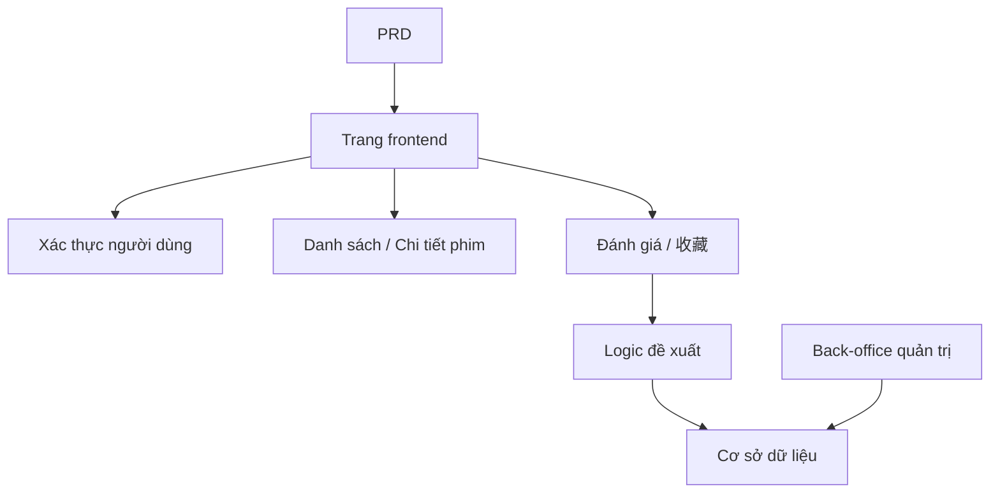

# Thực hành phát triển hệ thống đề xuất phim bằng Spring Boot

## Tổng quan

Dự án thực chiến này yêu cầu bạn hoàn thành một trang web phim có khả năng đề xuất dựa trên một PRD thực tế, sử dụng Spring Boot. Thách thức cốt lõi của dự án này là: nó không phải là thao tác CRUD đơn giản, mà cần bạn suy nghĩ "hành vi người dùng ảnh hưởng đến kết quả đề xuất như thế nào" và "đề xuất có thể giải thích như thế nào".

Đây là phần thực hành tổng hợp của Stage 2. Bạn sẽ lần đầu tiên tiếp xúc với mô hình phát triển sản phẩm kiểu "nội dung + hành vi + đề xuất", mô hình này rất phổ biến trong các kịch bản thương mại điện tử, nền tảng nội dung, Feed cá nhân hóa, v.v.

## Kiến thức tiên quyết

Trước khi bắt đầu dự án này, bạn nên đã nắm được các nội dung sau:

- Thiết kế trang frontend và sử dụng thư viện component ([Thiết kế UI](../../frontend/ui-design/), [Thư viện component hiện đại](../../frontend/modern-component-library/))
- Thiết kế và phát triển API backend ([Viết code API](../../backend/ai-interface-code/))
- Cơ sở dữ liệu cơ bản và Supabase ([Từ cơ sở dữ liệu đến Supabase](../../backend/database-supabase/))
- Quy trình làm việc Git và triển khai ([Git và GitHub](../../backend/git-workflow/), [Triển khai ứng dụng Web](../../backend/zeabur-deployment/))

## Mục tiêu học tập

Sau khi hoàn thành bài thực hành này, bạn sẽ có thể:

1. Đọc PRD và từ đó trích xuất danh sách công việc phát triển hệ thống đề xuất
2. Sử dụng Spring Boot để xây dựng dự án backend và triển khai RESTful API
3. Thiết kế chuỗi dữ liệu hoàn chỉnh "hành vi người dùng → đề xuất"
4. Triển khai logic đề xuất có thể giải thích
5. Hoàn thành liên hợp đầu cuối, bàn giao nguyên mẫu sản phẩm có thể demo

## Giới thiệu dự án

Sản phẩm bạn cần xây dựng là một trang web phim có khả năng đề xuất:

| Chức năng | Mô tả |
|------|------|
| **Duyệt và tìm kiếm** | Người dùng có thể duyệt và tìm kiếm phim |
| **Đánh giá và收藏** | Người dùng có thể đánh giá phim, thêm收藏 |
| **Đề xuất cá nhân hóa** | Hệ thống đưa ra kết quả đề xuất dựa trên hành vi người dùng |
| **Back-office quản trị** | Quản trị viên duy trì dữ liệu phim, xem hiệu quả đề xuất |

::: tip Đường dẫn PRD
Tài liệu yêu cầu của dự án này nằm trên GitHub: [Xem PRD](https://github.com/datawhalechina/easy-vibe/blob/main/docs/zh-cn/stage-2/assignments/movie-recommendation-springboot/PRD.md)
:::

<div style="margin: 32px 0;">
  <ClientOnly>
    <StepBar :active="0" :items="[
      { title: 'Phân tích yêu cầu', description: 'Đọc PRD, xác định chiến lược đề xuất, dữ liệu hành vi và phạm vi back-office' },
      { title: 'Xây dựng khung', description: 'Dùng AI tạo trang danh sách, trang chi tiết, trang đề xuất và trang back-office' },
      { title: 'Phát triển lặp', description: 'Bổ sung logic đề xuất, ghi hành vi và quản lý back-office' },
      { title: 'Liên hợp & triển khai', description: 'Chạy đầu cuối, triển khai và chuẩn bị demo' }
    ]" />
  </ClientOnly>
</div>

## Phần 1: Phân tích yêu cầu

### 1.1 Đọc PRD

Mở tài liệu PRD, tập trung trả lời các câu hỏi sau:

- Chiến lược đề xuất là gì? Phiên bản đầu tiên có sử dụng phiên bản có thể giải thích (như dựa trên độ tương tự đánh giá) không?
- Dữ liệu hành vi người dùng cần lưu những gì? (Đánh giá,收藏, bản ghi duyệt, v.v.)
- Quản trị viên cần xem những chỉ số hiệu quả đề xuất nào?
- Danh sách trang đã hoàn chỉnh chưa?

::: warning
Nếu các câu hỏi trên chưa có câu trả lời rõ ràng, đừng bắt đầu viết code. Hiểu sai yêu cầu là nguyên nhân phổ biến nhất dẫn đến phải làm lại.
:::

### 1.2 Xác nhận kiến trúc hệ thống



## Phần 2: Xây dựng khung dự án

### 2.1 Tạo trang frontend

Tham khảo prompt:

```text
Vui lòng dựa trên PRD hiện tại, giúp tôi tạo khung frontend của hệ thống đề xuất phim bằng Spring Boot.

Yêu cầu:
1. Trang bao gồm: trang chủ, danh sách phim, chi tiết phim, trang đề xuất, trang cá nhân, back-office quản trị
2. Trước tiên chỉ tạo cấu trúc trang và dữ liệu giả, không kết nối API thực tế
3. Phong cách phải giống sản phẩm nội dung thực tế, chứ không phải demo lớp học
```

### 2.2 Xác minh cấu trúc trang

Kiểm tra từng mục:

- [ ] Trang danh sách phim hỗ trợ tìm kiếm và lọc
- [ ] Trang chi tiết phim bao gồm nút đánh giá và收藏
- [ ] Trang đề xuất có thể hiển thị kết quả đề xuất và lý do đề xuất
- [ ] Back-office quản trị có thể hiển thị dữ liệu phim và hiệu quả đề xuất

## Phần 3: Phát triển lặp

### 3.1 Triển khai theo module

1. **Xây dựng dự án Spring Boot**: Cấu trúc dự án, cấu hình cơ sở dữ liệu, CRUD cơ bản
2. **Quản lý dữ liệu phim**: Danh sách phim, chi tiết, API tìm kiếm
3. **Hành vi người dùng**: API đánh giá,收藏, ghi dữ liệu hành vi
4. **Logic đề xuất**: Triển khai thuật toán đề xuất dựa trên hành vi người dùng
5. **Hiển thị đề xuất**: Hiển thị kết quả đề xuất, bao gồm lý do đề xuất
6. **Back-office quản trị**: Duy trì dữ liệu phim, xem hiệu quả đề xuất

### 3.2 Tự kiểm tra module

| Mục kiểm tra | Phương pháp xác minh |
|--------|----------|
| Chức năng cơ bản | Danh sách, chi tiết, đánh giá,收藏 có thành chuỗi hoàn chỉnh không |
| Liên kết đề xuất | Hành vi người dùng có ảnh hưởng đến kết quả đề xuất không |
| Tính có thể giải thích của đề xuất | Người dùng có thể hiểu tại sao được đề xuất những phim này không |
| Dữ liệu back-office | Quản trị viên có thể xem dữ liệu phim và hiệu quả đề xuất không |

## Phần 4: Liên hợp và Triển khai

### 4.1 Kiểm thử đầu cuối

Ít nhất xác minh các kịch bản sau:

- Duyệt phim → Đánh giá →收藏 → Xem trang đề xuất, xác nhận kết quả đề xuất thay đổi
- Quản trị viên đăng nhập → Thêm phim → Xem thống kê hiệu quả đề xuất

## Sản phẩm bàn giao

Sau khi hoàn thành dự án này, bạn cần nộp các nội dung sau:

- [ ] Liên kết demo trực tuyến có thể truy cập
- [ ] Liên kết kho mã nguồn (bao gồm README)
- [ ] Tài liệu PRD
- [ ] Ảnh chụp màn hình các trang cốt lõi (danh sách phim, chi tiết phim, trang đề xuất, back-office quản trị)
- [ ] Video demo 60 giây

## Tiêu chí chấm điểm

| Chiều | Yêu cầu cơ bản | Yêu cầu nâng cao |
|------|---------|---------|
| Căn chỉnh PRD | Trang, chức năng, cấu trúc dữ liệu cơ bản khớp với PRD | Có thể giải thích rõ ràng quyết định thiết kế |
| Chuỗi sản phẩm | Duyệt → Đánh giá →收藏 → Đề xuất có thể chạy qua | Hành vi đánh giá rõ ràng ảnh hưởng đến kết quả đề xuất |
| Chất lượng đề xuất | Kết quả đề xuất hợp lý, lý do đề xuất có thể giải thích | Hỗ trợ nhiều chiến lược đề xuất |
| Khả năng back-office | Dữ liệu phim và hiệu quả đề xuất có thể xem | Có chỉ số thống kê như độ chính xác đề xuất |
| Độ hoàn thiện kỹ thuật | Frontend, backend Spring Boot, chuỗi cơ sở dữ liệu đã kết nối | API đề xuất có bộ nhớ đệm hoặc tối ưu hiệu suất |

## Tài liệu tham khảo

- [Thiết kế UI](../../frontend/ui-design/)
- [Sử dụng thư viện component hiện đại để cập nhật giao diện](../../frontend/modern-component-library/)
- [Từ cơ sở dữ liệu đến Supabase](../../backend/database-supabase/)
- [Mô hình hỗ trợ viết code API và tài liệu API bằng mô hình lớn](../../backend/ai-interface-code/)
- [Quy trình làm việc Git và GitHub](../../backend/git-workflow/)
- [Cách triển khai ứng dụng Web](../../backend/zeabur-deployment/)
