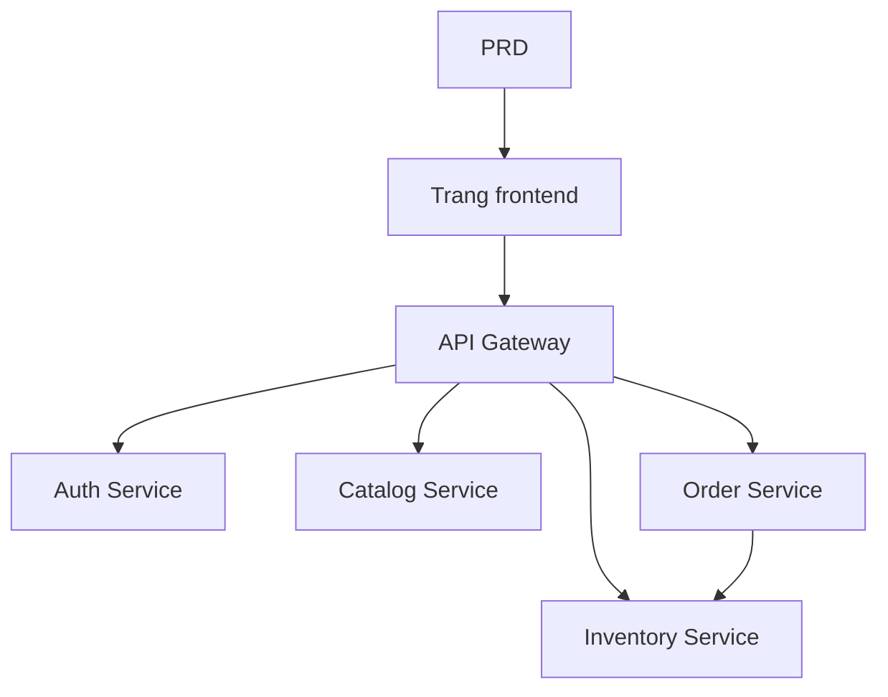

# Thực hành phát triển hệ thống microservices thương mại điện tử thực phẩm tươi sống

## Tổng quan

Dự án thực chiến này yêu cầu bạn hoàn thành một hệ thống microservices thương mại điện tử thực phẩm tươi sống dựa trên một PRD thực tế, xây dựng từ đầu. Khác với các dự án dịch vụ đơn lẻ trước đó, backend của dự án này được chia thành nhiều dịch vụ độc lập theo nghiệp vụ, thông qua API Gateway thống nhất对外. Bạn sẽ học cách thiết kế ranh giới dịch vụ, cách xử lý vấn đề nhất quán dữ liệu cross-service.

Đây là phần thực hành tổng hợp của Stage 2. Kiến trúc microservices rất phổ biến trong thực tế công việc, sau khi nắm vững tư duy cơ bản về phân tách dịch vụ và định tuyến gateway, bạn có thể ứng phó với thiết kế hệ thống backend phức tạp hơn.

## Kiến thức tiên quyết

Trước khi bắt đầu dự án này, bạn nên đã nắm được các nội dung sau:

- Thiết kế trang frontend và sử dụng thư viện component ([Thiết kế UI](../../frontend/ui-design/), [Thư viện component hiện đại](../../frontend/modern-component-library/))
- Thiết kế và phát triển API backend ([Viết code API](../../backend/ai-interface-code/))
- Cơ sở dữ liệu cơ bản và Supabase ([Từ cơ sở dữ liệu đến Supabase](../../backend/database-supabase/))
- Quy trình làm việc Git và triển khai ([Git và GitHub](../../backend/git-workflow/), [Triển khai ứng dụng Web](../../backend/zeabur-deployment/))

## Mục tiêu học tập

Sau khi hoàn thành bài thực hành này, bạn sẽ có thể:

1. Đọc PRD và trích xuất danh sách công việc phát triển hệ thống microservices
2. Phân tách ranh giới dịch vụ theo lĩnh vực nghiệp vụ (xác thực, sản phẩm, tồn kho, đơn hàng)
3. Thiết kế và triển khai định tuyến API Gateway
4. Xử lý các vấn đề cross-service như trừ tồn kho và nhất quán đơn hàng
5. Hoàn thành liên hợp đầu cuối, bàn giao nguyên mẫu microservices có thể demo

## Giới thiệu dự án

Sản phẩm bạn cần xây dựng là một hệ thống microservices thương mại điện tử thực phẩm tươi sống:

| Hệ thống con | Trách nhiệm |
|--------|------|
| **Trang người dùng** | Duyệt sản phẩm, đặt hàng, xem đơn hàng |
| **Trang quản trị** | Quản lý sản phẩm, quản lý tồn kho, quản lý đơn hàng |

Backend được phân tách theo nghiệp vụ thành các dịch vụ sau:

| Dịch vụ | Trách nhiệm |
|------|------|
| **API Gateway** | Điểm vào thống nhất, chuyển tiếp định tuyến, kiểm tra xác thực |
| **Auth Service** | Đăng ký người dùng, đăng nhập, cấp JWT |
| **Catalog Service** | Quản lý thông tin sản phẩm |
| **Inventory Service** | Quản lý số lượng tồn kho |
| **Order Service** | Tạo đơn hàng, quản lý trạng thái |

::: tip Đường dẫn PRD
Tài liệu yêu cầu của dự án này nằm trên GitHub: [Xem PRD](https://github.com/datawhalechina/easy-vibe/blob/main/docs/zh-cn/stage-2/assignments/simple-grocery-microservices/PRD.md)
:::

<div style="margin: 32px 0;">
  <ClientOnly>
    <StepBar :active="0" :items="[
      { title: 'Phân tích yêu cầu', description: 'Đọc PRD, xác định phân tách dịch vụ, trang và chuỗi giao dịch' },
      { title: 'Xây dựng khung', description: 'Tạo khung frontend, gateway và các dịch vụ' },
      { title: 'Phát triển lặp', description: 'Bổ sung API từng module, sửa nhất quán tồn kho và đơn hàng' },
      { title: 'Liên hợp & triển khai', description: 'Chạy đầu cuối, triển khai và chuẩn bị demo' }
    ]" />
  </ClientOnly>
</div>

## Phần 1: Phân tích yêu cầu

### 1.1 Đọc PRD

Mở tài liệu PRD, tập trung trả lời các câu hỏi sau:

- Dịch vụ được phân tách như thế nào? Ranh giới trách nhiệm của mỗi dịch vụ là gì?
- Frontend và trang quản trị lần lượt có những trang nào?
- Chiến lược trừ tồn kho sau khi đặt hàng là gì? Xử lý thành công / thất bại / timeout mỗi loại như thế nào?
- Phiên bản đầu tiên những khả năng phức tạp nào (như giao dịch phân tán, hàng đợi tin nhắn) tạm thời không làm?

::: warning
Nếu các câu hỏi trên chưa có câu trả lời rõ ràng, đừng bắt đầu viết code. Hiểu sai yêu cầu là nguyên nhân phổ biến nhất dẫn đến phải làm lại.
:::

### 1.2 Xác nhận kiến trúc hệ thống



## Phần 2: Xây dựng khung dự án

### 2.1 Tạo cấu trúc dự án

Tham khảo prompt:

```text
Vui lòng dựa trên PRD hiện tại, giúp tôi tạo cấu trúc dự án của hệ thống microservices thương mại điện tử thực phẩm tươi sống.

Yêu cầu:
1. Tạo khung frontend trang người dùng và trang quản trị
2. Tạo năm thư mục: api-gateway, auth-service, catalog-service, inventory-service, order-service
3. Mỗi dịch vụ trước tiên chỉ làm điểm vào có thể chạy tối thiểu
4. Trước tiên không kết nối cơ sở dữ liệu thực tế và thanh toán
```

### 2.2 Xác minh cấu trúc dự án

Kiểm tra từng mục:

- [ ] Cấu trúc thư mục của năm dịch vụ rõ ràng
- [ ] API Gateway có thể khởi động và chuyển tiếp yêu cầu
- [ ] API kiểm tra sức khỏe của mỗi dịch vụ có thể sử dụng
- [ ] Trang frontend trang người dùng và trang quản trị có thể truy cập

## Phần 3: Phát triển lặp

### 3.1 Triển khai theo module

1. **API Gateway**: Cấu hình định tuyến, middleware kiểm tra JWT
2. **Auth Service**: Đăng ký, đăng nhập, cấp JWT
3. **Catalog Service**: CRUD sản phẩm, truy vấn danh sách
4. **Inventory Service**: Truy vấn tồn kho, trừ tồn kho
5. **Order Service**: Tạo đơn hàng, chuyển trạng thái, liên kết tồn kho
6. **Trang quản trị**: Quản lý sản phẩm, quản lý tồn kho, quản lý đơn hàng

### 3.2 Tự kiểm tra module

| Mục kiểm tra | Phương pháp xác minh |
|--------|----------|
| Định tuyến gateway | API của mỗi dịch vụ có được chuyển tiếp chính xác qua gateway không |
| Cách ly phân quyền | API trang người dùng và trang quản trị có cách ly không |
| Nhất quán dữ liệu | Dữ liệu sản phẩm và tồn kho có đồng bộ không |
| Chuỗi giao dịch | Sau khi đặt hàng, trừ tồn kho, trạng thái đơn hàng có nhất quán không |
| Xử lý thất bại | Khi tồn kho không đủ hoặc timeout có cơ chế bù đắp không |

## Phần 4: Liên hợp và Triển khai

### 4.1 Kiểm thử đầu cuối

Ít nhất xác minh các kịch bản sau:

- Duyệt sản phẩm → Thêm vào giỏ hàng → Đặt hàng → Xem đơn hàng
- Quản trị viên → Thêm sản phẩm → Cập nhật tồn kho → Xem đơn hàng

## Sản phẩm bàn giao

Sau khi hoàn thành dự án này, bạn cần nộp các nội dung sau:

- [ ] Liên kết demo trực tuyến có thể truy cập
- [ ] Liên kết kho mã nguồn (bao gồm README)
- [ ] Tài liệu PRD
- [ ] Ảnh chụp màn hình các trang cốt lõi (danh sách sản phẩm, trang đặt hàng, trang đơn hàng, back-office quản trị)
- [ ] Video demo 60 giây

## Tiêu chí chấm điểm

| Chiều | Yêu cầu cơ bản | Yêu cầu nâng cao |
|------|---------|---------|
| Căn chỉnh PRD | Trang, chức năng, phân tách dịch vụ cơ bản khớp với PRD | Có thể giải thích rõ ràng lý do phân tách dịch vụ |
| Chuỗi sản phẩm | Duyệt → Đặt hàng → Trừ tồn kho → Xem đơn hàng có thể chạy qua | Timeout đơn hàng hoặc tồn kho không đủ có cơ chế bù đắp |
| Kiến trúc dịch vụ | Mỗi dịch vụ có thể khởi động độc lập, truy cập thống nhất qua gateway | Giao tiếp giữa dịch vụ có xử lý lỗi và thử lại |
| Khả năng back-office | Quản lý sản phẩm, tồn kho, đơn hàng có thể thao tác | Trang quản trị có thống kê dữ liệu |
| Độ hoàn thiện kỹ thuật | Frontend, gateway, dịch vụ, chuỗi cơ sở dữ liệu đã kết nối | Có Docker Compose hoặc điều phối tương tự |

## Tài liệu tham khảo

- [Thiết kế UI](../../frontend/ui-design/)
- [Sử dụng thư viện component hiện đại để cập nhật giao diện](../../frontend/modern-component-library/)
- [Từ cơ sở dữ liệu đến Supabase](../../backend/database-supabase/)
- [Mô hình hỗ trợ viết code API và tài liệu API bằng mô hình lớn](../../backend/ai-interface-code/)
- [Quy trình làm việc Git và GitHub](../../backend/git-workflow/)
- [Cách triển khai ứng dụng Web](../../backend/zeabur-deployment/)
