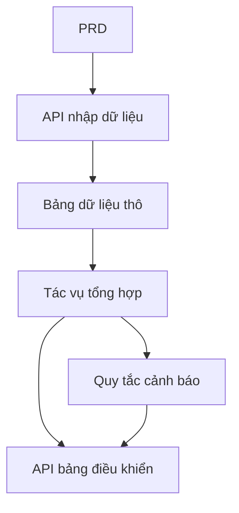

# Thực hành phát triển nền tảng phân tích dữ liệu giao thông bằng Go

## Tổng quan

Dự án thực chiến này yêu cầu bạn hoàn thành một nền tảng phân tích dữ liệu giao thông dựa trên một PRD thực tế, sử dụng Go. Hướng của dự án này khác với các hệ thống CRUD trước đó — bạn cần xây dựng một chuỗi dữ liệu hoàn chỉnh "nhập dữ liệu → tổng hợp → cảnh báo → trực quan hóa". Loại sản phẩm dữ liệu này rất phổ biến trong các kịch bản IoT, giám sát, phân tích vận hành, v.v.

Đây là phần thực hành tổng hợp của Stage 2, cũng là lần đầu tiên bạn tiếp xúc với ngôn ngữ Go. Đừng lo lắng, với nền tảng JavaScript / TypeScript trước đó, học Go không khó — trọng tâm là hiểu tư duy thiết kế chuỗi dữ liệu.

## Kiến thức tiên quyết

Trước khi bắt đầu dự án này, bạn nên đã nắm được các nội dung sau:

- Thiết kế trang frontend và sử dụng thư viện component ([Thiết kế UI](../../frontend/ui-design/), [Thư viện component hiện đại](../../frontend/modern-component-library/))
- Thiết kế và phát triển API backend ([Viết code API](../../backend/ai-interface-code/))
- Cơ sở dữ liệu cơ bản và Supabase ([Từ cơ sở dữ liệu đến Supabase](../../backend/database-supabase/))
- Quy trình làm việc Git và triển khai ([Git và GitHub](../../backend/git-workflow/), [Triển khai ứng dụng Web](../../backend/zeabur-deployment/))

## Mục tiêu học tập

Sau khi hoàn thành bài thực hành này, bạn sẽ có thể:

1. Đọc PRD và trích xuất danh sách công việc phát triển sản phẩm dữ liệu
2. Sử dụng Go (Gin hoặc Fiber) để xây dựng dịch vụ API backend
3. Thiết kế chuỗi hoàn chỉnh nhập dữ liệu, tổng hợp cửa sổ và cảnh báo
4. Giữ cho dữ liệu backend và bảng điều khiển frontend nhất quán
5. Hoàn thành liên hợp đầu cuối, bàn giao nguyên mẫu sản phẩm dữ liệu có thể demo

## Giới thiệu dự án

Sản phẩm bạn cần xây dựng là một nền tảng phân tích dữ liệu giao thông bằng Go:

| Module | Trách nhiệm |
|------|------|
| **Nhập dữ liệu** | Nhận sự kiện giao thông thô và lưu vào cơ sở dữ liệu |
| **Tổng hợp dữ liệu** | Tính toán xu hướng và chỉ số tắc nghẽn theo cửa sổ thời gian |
| **Cảnh báo** | Tạo bản ghi cảnh báo dựa trên quy tắc |
| **Hiển thị bảng điều khiển** | Hiển thị biểu đồ xu hướng, bảng xếp hạng và danh sách cảnh báo trên frontend |

::: tip Đường dẫn PRD
Tài liệu yêu cầu của dự án này nằm trên GitHub: [Xem PRD](https://github.com/datawhalechina/easy-vibe/blob/main/docs/zh-cn/stage-2/assignments/traffic-data-visualization-go/PRD.md)
:::

<div style="margin: 32px 0;">
  <ClientOnly>
    <StepBar :active="0" :items="[
      { title: 'Phân tích yêu cầu', description: 'Đọc PRD, xác định nguồn dữ liệu, định nghĩa chỉ số và quy tắc cảnh báo' },
      { title: 'Xây dựng khung', description: 'Dùng AI tạo dịch vụ Go API và khung bảng điều khiển frontend' },
      { title: 'Phát triển lặp', description: 'Bổ sung logic tổng hợp, quy tắc cảnh báo và API bảng điều khiển' },
      { title: 'Liên hợp & triển khai', description: 'Chạy đầu cuối, triển khai và chuẩn bị demo' }
    ]" />
  </ClientOnly>
</div>

## Phần 1: Phân tích yêu cầu

### 1.1 Đọc PRD

Mở tài liệu PRD, tập trung trả lời các câu hỏi sau:

- Nguồn dữ liệu là gì? Có những trường nào?
- Định nghĩa của các chỉ số cốt lõi là gì? (Ví dụ tiêu chuẩn cụ thể của "tắc nghẽn")
- Quy tắc cảnh báo là gì? Phiên bản đầu tiên có nên thu hẹp lại thành quy tắc đơn giản không?
- Bảng điều khiển bao gồm những trang và biểu đồ nào?

::: warning
Nếu các câu hỏi trên chưa có câu trả lời rõ ràng, đừng bắt đầu viết code. Hiểu sai yêu cầu là nguyên nhân phổ biến nhất dẫn đến phải làm lại.
:::

### 1.2 Xác nhận chuỗi dữ liệu



## Phần 2: Xây dựng khung dự án

### 2.1 Tạo dịch vụ Go API

Tham khảo prompt:

```text
Vui lòng dựa trên PRD hiện tại, giúp tôi tạo khung nền tảng phân tích dữ liệu giao thông bằng Go.

Yêu cầu:
1. Sử dụng Gin hoặc Fiber
2. Cung cấp API nhập dữ liệu
3. Cung cấp khung tác vụ tổng hợp
4. Cung cấp khung API dashboard và alerts
5. Trước tiên không làm phân tích phức tạp thực tế, chỉ làm cấu trúc có thể chạy
```

### 2.2 Xác minh cấu trúc dự án

Kiểm tra từng mục:

- [ ] Dịch vụ Go có thể khởi động bình thường
- [ ] API nhập dữ liệu có thể nhận và lưu trữ dữ liệu
- [ ] Khung tác vụ tổng hợp đã được xây dựng
- [ ] Trang bảng điều khiển frontend có thể hiển thị biểu đồ cơ bản

## Phần 3: Phát triển lặp

### 3.1 Triển khai theo module

1. **API nhập dữ liệu**: Nhận sự kiện giao thông thô, ghi vào cơ sở dữ liệu
2. **Tổng hợp dữ liệu**: Tổng hợp theo cửa sổ thời gian, tính toán xu hướng và chỉ số tắc nghẽn
3. **Quy tắc cảnh báo**: Tạo bản ghi cảnh báo dựa trên ngưỡng
4. **API bảng điều khiển**: Cung cấp dữ liệu xu hướng, dữ liệu xếp hạng, danh sách cảnh báo
5. **Bảng điều khiển frontend**: Trang biểu đồ xu hướng, bảng xếp hạng, danh sách cảnh báo

### 3.2 Tự kiểm tra module

| Mục kiểm tra | Phương pháp xác minh |
|--------|----------|
| Nhập dữ liệu | Dữ liệu thô có được lưu vào cơ sở dữ liệu chính xác không |
| Khẩu vị tổng hợp | Logic tính toán chỉ số xu hướng, xếp hạng có nhất quán không |
| Quy tắc cảnh báo | Điều kiện kích hoạt cảnh báo có khớp với kỳ vọng không |
| Tính nhất quán dữ liệu | Hiển thị bảng điều khiển và dữ liệu backend có khớp nhau không |
| Quy phạm API | Có cấu trúc trả về thống nhất và xử lý lỗi không |

## Phần 4: Liên hợp và Triển khai

### 4.1 Kiểm thử đầu cuối

Ít nhất xác minh các kịch bản sau:

- Nhập một loạt dữ liệu thử nghiệm → Thực thi tác vụ tổng hợp → Cập nhật hiển thị bảng điều khiển
- Kích hoạt điều kiện cảnh báo → Tạo bản ghi cảnh báo → Trang cảnh báo hiển thị

## Sản phẩm bàn giao

Sau khi hoàn thành dự án này, bạn cần nộp các nội dung sau:

- [ ] Liên kết demo trực tuyến có thể truy cập
- [ ] Liên kết kho mã nguồn (bao gồm README)
- [ ] Tài liệu PRD
- [ ] Ảnh chụp màn hình các trang cốt lõi (demo nhập dữ liệu, bảng điều khiển xu hướng, danh sách cảnh báo)
- [ ] Video demo 60 giây

## Tiêu chí chấm điểm

| Chiều | Yêu cầu cơ bản | Yêu cầu nâng cao |
|------|---------|---------|
| Căn chỉnh PRD | Chức năng và cấu trúc dữ liệu cơ bản khớp với PRD | Có thể giải thích rõ ràng khẩu vị chỉ số và logic tổng hợp |
| Chuỗi dữ liệu | Nhập → Tổng hợp → Cảnh báo → Bảng điều khiển có thể chạy qua | Tác vụ tổng hợp hỗ trợ cập nhật gia tăng |
| Khả năng phân tích | Ba module xu hướng, xếp hạng, cảnh báo có thể sử dụng | Chỉ số có thể cấu hình, quy tắc cảnh báo có thể tùy chỉnh |
| Hiển thị frontend | Bảng điều khiển có thể hiển thị biểu đồ cơ bản | Biểu đồ hỗ trợ lọc phạm vi thời gian |
| Độ hoàn thiện kỹ thuật | Chuỗi Go API, cơ sở dữ liệu, frontend đã kết nối | API có xử lý lỗi thống nhất và nhật ký |

## Tài liệu tham khảo

- [Thiết kế UI](../../frontend/ui-design/)
- [Sử dụng thư viện component hiện đại để cập nhật giao diện](../../frontend/modern-component-library/)
- [Từ cơ sở dữ liệu đến Supabase](../../backend/database-supabase/)
- [Mô hình hỗ trợ viết code API và tài liệu API bằng mô hình lớn](../../backend/ai-interface-code/)
- [Quy trình làm việc Git và GitHub](../../backend/git-workflow/)
- [Cách triển khai ứng dụng Web](../../backend/zeabur-deployment/)
