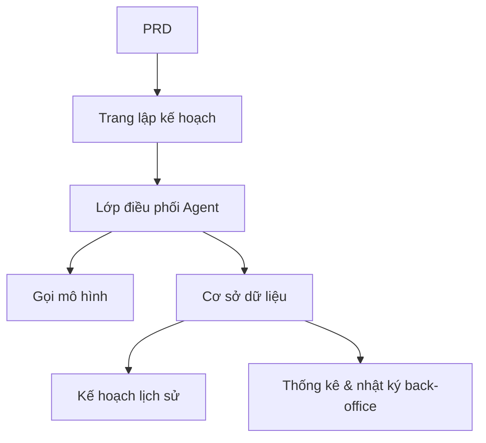

# Thực hành phát triển nền tảng Agent lập kế hoạch du lịch thông minh

## Tổng quan

Dự án thực chiến này yêu cầu bạn hoàn thành một nền tảng Agent lập kế hoạch du lịch thông minh dựa trên một PRD thực tế, xây dựng từ đầu. Bạn sẽ xây dựng một sản phẩm AI hoàn chỉnh có thể nhận đầu vào có cấu trúc, tạo lịch trình hàng ngày, hỗ trợ lưu trữ và tái sử dụng — không chỉ là chatbot, mà là một sản phẩm có khả năng quản lý tác vụ.

Đây là phần thực hành tổng hợp của Stage 2. Thách thức cốt lõi của dự án này là: làm thế nào để AI tạo ra kế hoạch lịch trình có cấu trúc và sử dụng được, chứ không phải một đoạn văn bản dài không thể thao tác.

## Kiến thức tiên quyết

Trước khi bắt đầu dự án này, bạn nên đã nắm được các nội dung sau:

- Thiết kế trang frontend và sử dụng thư viện component ([Thiết kế UI](../../frontend/ui-design/), [Thư viện component hiện đại](../../frontend/modern-component-library/))
- Thiết kế và phát triển API backend ([Viết code API](../../backend/ai-interface-code/))
- Cơ sở dữ liệu cơ bản và Supabase ([Từ cơ sở dữ liệu đến Supabase](../../backend/database-supabase/))
- Quy trình làm việc Git và triển khai ([Git và GitHub](../../backend/git-workflow/), [Triển khai ứng dụng Web](../../backend/zeabur-deployment/))

## Mục tiêu học tập

Sau khi hoàn thành bài thực hành này, bạn sẽ có thể:

1. Đọc PRD và từ đó trích xuất danh sách công việc phát triển nền tảng Agent
2. Thiết kế biểu mẫu đầu vào có cấu trúc và định dạng đầu ra có cấu trúc
3. Triển khai lớp điều phối Agent, xử lý đầu vào người dùng, gọi mô hình và lưu trữ kết quả
4. Xây dựng chuỗi nghiệp vụ "tạo → lưu → tái sử dụng"
5. Hoàn thành liên hợp đầu cuối, bàn giao nguyên mẫu sản phẩm AI có thể demo

## Giới thiệu dự án

Sản phẩm bạn cần xây dựng là một nền tảng Agent lập kế hoạch du lịch thông minh:

| Chức năng | Mô tả |
|------|------|
| **Lập kế hoạch lịch trình** | Người dùng nhập điểm xuất phát, điểm đến, ngày, ngân sách và sở thích, hệ thống tạo lịch trình hàng ngày |
| **Phân bổ ngân sách** | Kết quả lịch trình bao gồm phân bổ ngân sách và đề xuất |
| **Quản lý lịch sử** | Người dùng có thể lưu kế hoạch lịch sử, tạo lại, xuất |
| **Back-office quản trị** | Quản trị viên xem điểm đến phổ biến, tác vụ thất bại và phản hồi người dùng |

::: tip Đường dẫn PRD
Tài liệu yêu cầu của dự án này nằm trên GitHub: [Xem PRD](https://github.com/datawhalechina/easy-vibe/blob/main/docs/zh-cn/stage-2/assignments/travel-planning-agent-platform/PRD.md)
:::

<div style="margin: 32px 0;">
  <ClientOnly>
    <StepBar :active="0" :items="[
      { title: 'Phân tích yêu cầu', description: 'Đọc PRD, xác định trang, điều phối Agent, cấu trúc đầu vào/đầu ra' },
      { title: 'Xây dựng khung', description: 'Dùng AI tạo khung trang chủ, trang lập kế hoạch, trang lịch sử, trang back-office' },
      { title: 'Phát triển lặp', description: 'Bổ sung từng module: đầu ra có cấu trúc, trạng thái tác vụ, quản lý lịch sử' },
      { title: 'Liên hợp & triển khai', description: 'Chạy đầu cuối, triển khai và chuẩn bị demo' }
    ]" />
  </ClientOnly>
</div>

## Phần 1: Phân tích yêu cầu

### 1.1 Đọc PRD

Mở tài liệu PRD, tập trung trả lời các câu hỏi sau:

- Phiên bản đầu tiên có chỉ làm một điểm đến không?
- Đầu ra lịch trình có bắt buộc phải có cấu trúc không? Cấu trúc là gì?
- Khả năng xuất sâu đến đâu? (Liên kết chia sẻ / PDF / Hình ảnh)
- Phạm vi thống kê back-office và nhật ký tác vụ là gì?

::: warning
Nếu các câu hỏi trên chưa có câu trả lời rõ ràng, đừng bắt đầu viết code. Hiểu sai yêu cầu là nguyên nhân phổ biến nhất dẫn đến phải làm lại.
:::

### 1.2 Xác nhận kiến trúc hệ thống



## Phần 2: Xây dựng khung dự án

### 2.1 Tạo trang frontend

Tham khảo prompt:

```text
Vui lòng dựa trên PRD hiện tại, giúp tôi tạo khung frontend của nền tảng Agent lập kế hoạch du lịch thông minh.

Yêu cầu:
1. Trang bao gồm: trang chủ, trang lập kế hoạch, trang chi tiết lịch trình, trang lịch sử, trang quản lý
2. Trang lập kế hoạch bên trái là biểu mẫu, bên phải là xem trước kết quả
3. Trước tiên chỉ tạo cấu trúc trang và dữ liệu giả, không kết nối API thực tế
4. Phong cách phải giống sản phẩm AI hiện đại
```

### 2.2 Xác minh cấu trúc trang

Kiểm tra từng mục:

- [ ] Trường biểu mẫu trang lập kế hoạch có khớp với PRD không
- [ ] Khu vực xem trước kết quả có thể hiển thị dữ liệu lịch trình có cấu trúc
- [ ] Trang lịch sử có thể hiển thị nhiều kế hoạch
- [ ] Trang back-office quản trị có thể hiển thị dữ liệu thống kê

## Phần 3: Phát triển lặp

### 3.1 Triển khai theo module

1. **Xác thực**: Đăng ký, đăng nhập
2. **Biểu mẫu lập kế hoạch**: Đầu vào có cấu trúc (điểm xuất phát, điểm đến, ngày, ngân sách, sở thích)
3. **Điều phối Agent**: Nhận đầu vào → Gọi mô hình → Phân tích đầu ra có cấu trúc
4. **Hiển thị kết quả**: Lịch trình hiển thị theo ngày, phân bổ ngân sách, đề xuất
5. **Quản lý lịch sử**: Lưu kế hoạch, tạo lại, xuất
6. **Back-office quản trị**: Điểm đến phổ biến, tác vụ thất bại, phản hồi người dùng
7. **Trạng thái tác vụ**: Quản lý trạng thái đang tạo / thành công / thất bại và ghi lỗi

### 3.2 Tự kiểm tra module

| Mục kiểm tra | Phương pháp xác minh |
|--------|----------|
| Tính đầy đủ đầu vào | Trường biểu mẫu có khớp với PRD không |
| Tính cấu trúc đầu ra | Kết quả lịch trình có phải là dữ liệu có cấu trúc (chứ không phải một đoạn văn bản dài) không |
| Tính nhất quán dữ liệu | Dữ liệu trip, itinerary, logs có khớp nhau không |
| Xác minh chuỗi hoàn chỉnh | Có thể demo "nhập → tạo → lưu → tạo lại" không |

## Phần 4: Liên hợp và Triển khai

### 4.1 Kiểm thử đầu cuối

Ít nhất xác minh các kịch bản sau:

- Nhập tham số lịch trình → Tạo lịch trình hàng ngày → Xem phân bổ ngân sách → Lưu vào lịch sử
- Tạo lại lịch trình từ bản ghi lịch sử
- Quản trị viên xem thống kê tác vụ và nhật ký thất bại

## Sản phẩm bàn giao

Sau khi hoàn thành dự án này, bạn cần nộp các nội dung sau:

- [ ] Liên kết demo trực tuyến có thể truy cập
- [ ] Liên kết kho mã nguồn (bao gồm README)
- [ ] Tài liệu PRD
- [ ] Ảnh chụp màn hình các trang cốt lõi (trang lập kế hoạch, trang chi tiết lịch trình, trang lịch sử, back-office quản trị)
- [ ] Video demo 60 giây

## Tiêu chí chấm điểm

| Chiều | Yêu cầu cơ bản | Yêu cầu nâng cao |
|------|---------|---------|
| Căn chỉnh PRD | Trang, chức năng, cấu trúc dữ liệu cơ bản khớp với PRD | Có thể giải thích rõ ràng quyết định thiết kế |
| Chuỗi sản phẩm | Lập kế hoạch → Lưu → Lịch sử → Tạo lại có thể chạy qua | Hỗ trợ xuất và chia sẻ |
| Chất lượng đầu ra | Kết quả lịch trình có cấu trúc và dễ đọc | Phân bổ ngân sách hợp lý, đề xuất có tính định hướng |
| Khả năng back-office | Thống kê tác vụ và nhật ký thất bại có thể xem | Có phân tích điểm đến phổ biến |
| Độ hoàn thiện kỹ thuật | Frontend, backend, cơ sở dữ liệu, chuỗi gọi mô hình đã kết nối | Quản lý trạng thái tác vụ hoàn thiện, lỗi có thể truy vết |

## Tài liệu tham khảo

- [Thiết kế UI](../../frontend/ui-design/)
- [Sử dụng thư viện component hiện đại để cập nhật giao diện](../../frontend/modern-component-library/)
- [Từ cơ sở dữ liệu đến Supabase](../../backend/database-supabase/)
- [Mô hình hỗ trợ viết code API và tài liệu API bằng mô hình lớn](../../backend/ai-interface-code/)
- [Quy trình làm việc Git và GitHub](../../backend/git-workflow/)
- [Cách triển khai ứng dụng Web](../../backend/zeabur-deployment/)
