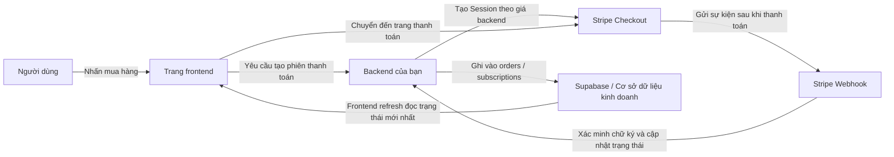
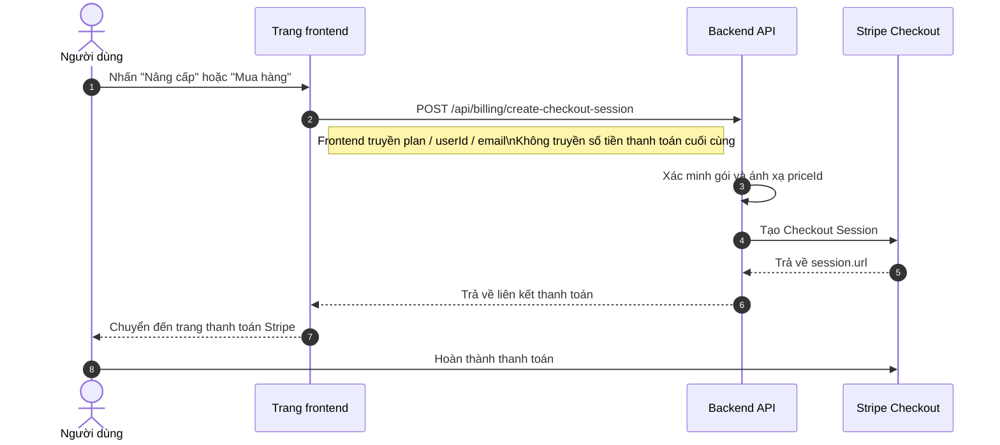
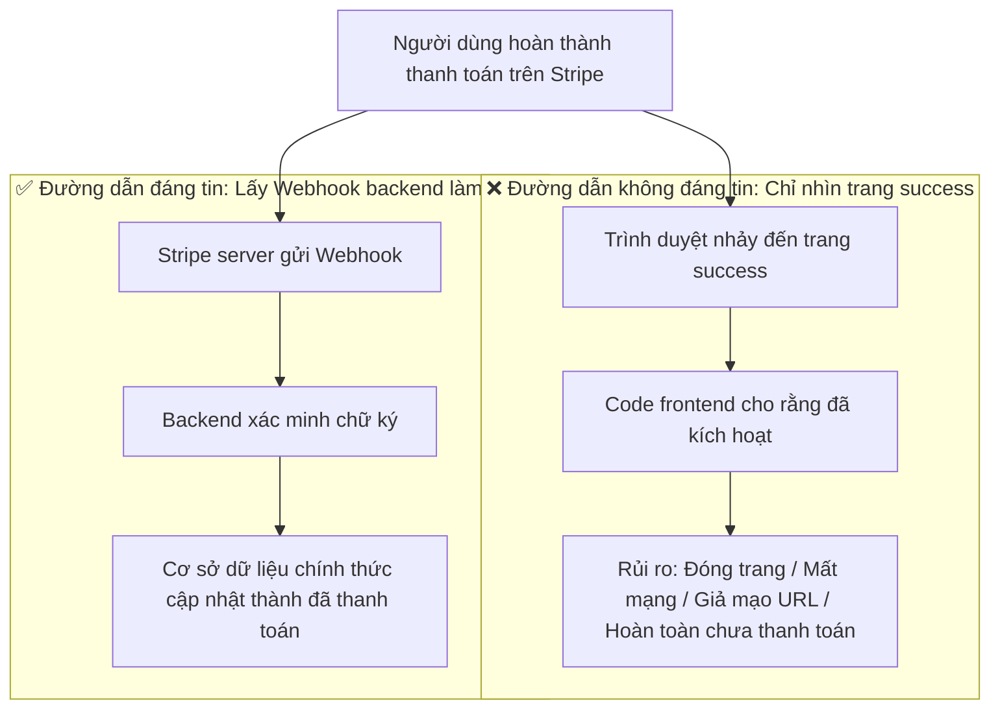
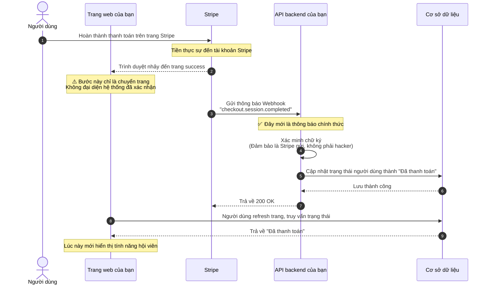
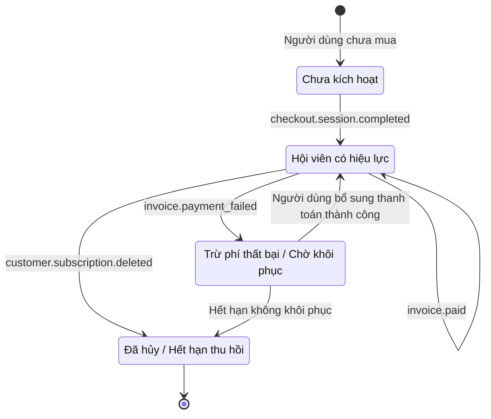
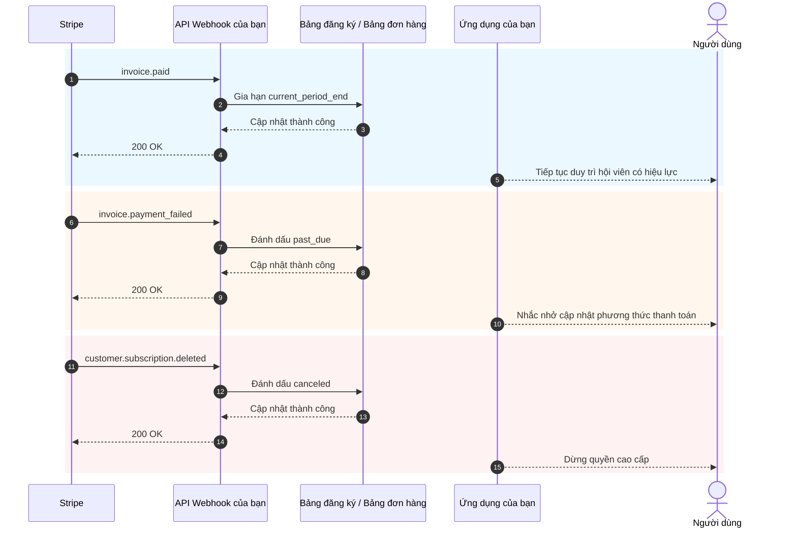

# Cách tích hợp hệ thống thanh toán như Stripe

Khi sản phẩm của bạn đã có trang giao diện, đăng nhập, cơ sở dữ liệu và backend cơ bản, vấn đề thực tế tiếp theo là: **làm sao để thu tiền**.

Nhiều người lần đầu tiếp xúc với thanh toán thường tập trung hết vào "làm sao để nhảy đến trang thanh toán". Nhưng thứ thực sự quyết định hệ thống có ổn định hay không, không phải là nút bấm, mà là toàn bộ chuỗi thanh toán: ai quyết định giá, ai xác nhận thanh toán thành công, ai cập nhật cơ sở dữ liệu, ai thu hồi quyền hạn.

Bài viết này giúp bạn chia thành hai phần:

- **Phần đầu** chỉ nói về tích hợp cơ bản thực dụng nhất, mục tiêu là giúp bạn nhanh chóng tích hợp Stripe vào dự án.
- **Phần sau** được gom chung vào phụ lục, bao gồm chi tiết Webhook, sự kiện đăng ký, khác biệt về phương án thanh toán giữa các quốc gia và khu vực.

> 💡 Khuyến nghị học xong các chương này trước khi tiếp tục
>
> - [Từ cơ sở dữ liệu đến Supabase](../database-supabase/)
> - [Mô hình hỗ trợ viết code API và tài liệu API](../ai-interface-code/)
> - [Cách triển khai ứng dụng Web](../zeabur-deployment/)

# Bạn sẽ học được

1. Hệ thống thanh toán khả thi tối thiểu trông như thế nào.
2. Cách nhanh nhất để tích hợp Stripe vào dự án của bạn.
3. Cách viết prompt để AI trực tiếp giúp bạn thêm hệ thống thanh toán.
4. Nếu không làm dự án Stripe ở nước ngoài, nên ưu tiên phương án thanh toán nào cho các khu vực khác.

---

# Phần 1: Cơ bản

## 1. Hãy nhớ 3 nguyên tắc

Nếu bạn chỉ nhớ ba điều, hãy nhớ ba điều sau:

1. **Giá cả phải do backend quyết định**, không được tin số tiền frontend gửi lên.
2. **Thứ thực sự kích hoạt quyền hạn là Webhook**, không phải trang `success`.
3. **Cơ sở dữ liệu của bạn phải lưu trạng thái thanh toán**, không được chỉ dựa vào bảng điều khiển Stripe.

Ba điều này là ranh giới cốt lõi của hệ thống thanh toán. Chỉ cần ranh giới không sai, sau này đổi sang Stripe, PayPal, Alipay, WeChat Pay, bản chất đều chỉ là "đổi giao diện, kiến trúc không đổi".

## 2. Nếu không xử lý ở backend mà để frontend kết nối trực tiếp Stripe thì sao?

Đây là ý tưởng tự nhiên nhất của nhiều người lần đầu làm thanh toán:

- Trên trang đã có nút "Mua hàng"
- Vậy tôi có thể để frontend tự kết nối Stripe
- Như vậy có phải không cần làm backend không

Nếu bạn chỉ làm một trang demo giả thì không sao. Nhưng nếu bạn thực sự muốn thu tiền, **cách này thường sẽ dẫn đến hậu quả xấu**.

Các vấn đề phổ biến nhất bao gồm:

1. **Giá cả dễ bị thay đổi**
   Request trong trình duyệt là do máy tính người dùng gửi đi. Người khác hoàn toàn có thể sửa nội dung request.
2. **Thông tin nhạy cảm dễ bị lộ**
   Các khóa bí mật, logic giá cả, logic kích hoạt hội viên quan trọng nhất, vốn dĩ không nên đặt ở frontend.
3. **Bạn không thể xác nhận đáng tin cậy "khoản tiền này có thực sự thành công không"**
   Người dùng nhảy đến trang thành công, không có nghĩa là cơ sở dữ liệu của bạn đã đồng bộ đúng.
4. **Trạng thái cơ sở dữ liệu sẽ bị loạn**
   Người dùng có thể nói "tôi rõ ràng đã thanh toán", nhưng trong hệ thống của bạn hoàn toàn không ghi nhận.

Vậy phân công an toàn hơn nên là:

- Frontend chịu trách nhiệm: hiển thị nút, khởi tạo mua hàng, chuyển trang
- Backend chịu trách nhiệm: quyết định giá, tạo phiên thanh toán, nhận Webhook, cập nhật cơ sở dữ liệu

::: info Đoạn này bạn có thể tóm gọn thành một câu
**Frontend có thể chịu trách nhiệm chuyển trang, backend phải chịu trách nhiệm định giá và xác nhận.**

Chỉ khi thực sự thu tiền, đừng đặt "quyền quyết định giá cuối cùng" và "logic kích hoạt sau thanh toán thành công" ở frontend.
:::

## 3. Khi nào nên dùng Stripe trước

Nếu bạn đang làm các kịch bản sau, Stripe thường là điểm khởi đầu thuận lợi nhất:

- SaaS hướng đến người dùng ở nước ngoài
- Sản phẩm hội viên theo dạng đăng ký
- Sản phẩm kỹ thuật số, template, gói credit AI
- Muốn nhanh chóng xác thực thương mại hóa, thay vì ngay từ đầu xử lý quá nhiều chi tiết thanh toán nội địa

Nếu người dùng chính của bạn ở Trung Quốc đại lục, thì thường sẽ không chọn Stripe làm lựa chọn đầu tiên, phần này tôi sẽ nói riêng trong phụ lục.

## 4. Chuỗi thanh toán khả thi tối thiểu

Hãy xem phiên bản tối thiểu. Chỉ cần chuỗi này chạy được, hệ thống thanh toán của bạn đã có bộ khung.



Dịch sang ngôn ngữ con người:

1. Người dùng nhấn nút.
2. Frontend hỏi backend lấy liên kết thanh toán.
3. Backend dùng khóa Stripe để tạo phiên thanh toán.
4. Người dùng đến trang Stripe để thanh toán.
5. Stripe thông báo cho bạn qua Webhook rằng "thanh toán thực sự thành công".
6. Backend của bạn cập nhật cơ sở dữ liệu.

## 5. Sơ đồ thời gian chuẩn khi khởi tạo thanh toán

Nếu bạn quen xem sơ đồ hệ thống chuẩn hơn, có thể xem trực tiếp sơ đồ thời gian này:



## 6. Bắt đầu nhanh

Nếu bạn muốn tích hợp nhanh nhất, chỉ cần làm theo 5 bước dưới đây.

### 6.1 Bước 1: Tạo sản phẩm và giá trong bảng điều khiển Stripe

Mục đích của bước này không phải "tự cấu hình vài thứ", mà là định nghĩa rõ trong Stripe **bạn đang bán cái gì, định thu tiền như thế nào**.

Trong mô hình của Stripe:

- **Product** đại diện cho "bạn đang bán cái gì", ví dụ `Hội viên Pro`
- **Price** đại diện cho "cái này bán bao nhiêu tiền, theo chu kỳ nào", ví dụ `trả tháng 9.9 USD`, `trả năm 99 USD`

Tại sao phải làm bước này trước? Vì khi backend của bạn tạo Checkout Session, không phải truyền trực tiếp một số tiền cho Stripe, mà phải truyền một `price_id` đã tồn tại. Stripe sẽ dựa trên `price_id` này để tạo trang thanh toán, số tiền, loại tiền tệ và chu kỳ đăng ký thực tế.

Nếu bạn bỏ qua bước này, "tạo liên kết thanh toán" thực ra không thể làm được.

::: info Tại sao phải dừng lại ở đây
Nhiều người mới bắt đầu thấy `Product`, `Price` hai từ này hơi bực, cảm thấy như đang học thuật ngữ nội bộ của Stripe.

Nhưng thực ra, bước này đang làm một việc rất đơn giản:
- Định nghĩa rõ "bán cái gì"
- Định nghĩa rõ "bán bao nhiêu tiền"
- Để backend sau này có thể dùng một `price_id` ổn định để tạo liên kết thanh toán

Chỉ cần hiểu được điều này, Checkout Session sau đó sẽ không thấy trừu tượng.
:::

Đối với một hệ thống đăng ký khả thi tối thiểu, bạn ít nhất cần tạo hai cấp:

- Một `Product`
- Một hoặc nhiều `Price`

Bạn có thể trực tiếp mở các trang sau:

- Trang đăng nhập Stripe Dashboard: [Dashboard Login](https://dashboard.stripe.com/login)
- Tài liệu quản lý sản phẩm và giá của Stripe: [Manage products and prices](https://docs.stripe.com/products-prices/manage-prices)
- Tài liệu bắt đầu nhanh Stripe Checkout: [Build a Stripe-hosted checkout page](https://docs.stripe.com/checkout/quickstart?lang=node)
- Trang sản phẩm Stripe Dashboard: [Product catalog](https://dashboard.stripe.com/test/products)

Khuyến nghị bạn nên thao tác trong **Test mode (chế độ thử nghiệm)** trước, đừng tạo trong môi trường chính thức ngay từ đầu.

Một cấu hình tối thiểu phổ biến nhất là:

- `Product`: `Pro Plan`
- `Price 1`: `pro_monthly`
- `Price 2`: `pro_yearly`

Khi thao tác trong bảng điều khiển, bạn có thể hiểu theo thứ tự sau:

1. Tạo một sản phẩm `Pro Plan` trước
2. Sau đó thêm hai mức giá vào sản phẩm này
3. Trả tháng và trả năm thực ra là hai cách tính phí của cùng một sản phẩm

Sau khi hoàn thành, bạn ít nhất cần ghi lại các thông tin sau:

- `price_id` của giá trả tháng
- `price_id` của giá trả năm
- Tên gói của bạn, ví dụ `pro_monthly`, `pro_yearly`

Nếu đây là lần đầu bạn vào bảng điều khiển Stripe, khuyến nghị bạn hiểu bước này như:

- `Product` quyết định trang thanh toán bán cái gì
- `Price` quyết định trang thanh toán thu bao nhiêu tiền
- Thứ backend thực sự cần dùng sau này, chủ yếu là `price_id`

::: info Giá trị thực sự cần ghi lại
Quan trọng nhất trong trang này không phải tên sản phẩm, mà là `price_id`.

Sau này dù là để AI giúp bạn tích hợp backend, hay tự kiểm tra vấn đề, thứ thường xuyên dùng nhất là:
- `STRIPE_PRICE_PRO_MONTHLY`
- `STRIPE_PRICE_PRO_YEARLY`
- Hai `price_id` tương ứng
:::

Nếu bạn muốn AI dẫn bạn cấu hình bảng điều khiển trước, có thể dùng prompt này:

```text
Tôi là người mới sử dụng Stripe lần đầu, bạn đừng sửa code trước, hãy dẫn tôi cấu hình thanh toán cơ bản nhất trong bảng điều khiển Stripe.

Vui lòng dựa trên tài liệu chính thức sau để hướng dẫn tôi từng bước:
- https://docs.stripe.com/products-prices/manage-prices
- https://docs.stripe.com/checkout/quickstart?lang=node

Tình huống của tôi:
- Tôi muốn làm một hệ thống hội viên thanh toán đơn giản nhất
- Chỉ có hai gói: trả tháng và trả năm
- Tôi chưa hiểu các từ Product, Price

Vui lòng:
1. Dùng ngôn ngữ đơn giản nhất giải thích Product và Price lần lượt là gì.
2. Hướng dẫn tôi thao tác theo thứ tự "mở trang nào -> nhấp vào đâu -> điền gì".
3. Nhắc tôi sau khi làm xong cần sao chép những nội dung nào từ bảng điều khiển để backend sử dụng.
4. Nếu tôi dễ nhầm, hãy nhắc tôi nên luôn thao tác trong chế độ thử nghiệm.
```

### 6.2 Bước 2: Chuẩn bị biến môi trường

Bạn thường cần chuẩn bị ít nhất các biến môi trường sau:

- `STRIPE_SECRET_KEY`
- `STRIPE_WEBHOOK_SECRET`
- `STRIPE_PRICE_PRO_MONTHLY`
- `STRIPE_PRICE_PRO_YEARLY`
- `APP_URL`
- `SUPABASE_URL`
- `SUPABASE_SERVICE_ROLE_KEY`

Bạn có thể trực tiếp mở các trang sau:

- Tài liệu Stripe API Keys: [API keys](https://docs.stripe.com/keys)
- Trang Stripe Dashboard API Keys: [API Keys](https://dashboard.stripe.com/test/apikeys)
- Tài liệu Stripe Webhooks: [Receive Stripe events in your webhook endpoint](https://docs.stripe.com/webhooks)
- Trang Stripe Dashboard Webhooks: [Workbench Webhooks](https://dashboard.stripe.com/test/workbench/webhooks)

> ⚠️ `STRIPE_SECRET_KEY` và `SUPABASE_SERVICE_ROLE_KEY` chỉ được đặt ở backend.

::: info Mục đích của bước biến môi trường
Bước này không phải để "điền đầy `.env`", mà là để đặt những thứ nhạy cảm nhất của hệ thống thanh toán vào backend bảo quản:

- Khóa backend của Stripe
- Khóa xác minh Webhook
- Ánh xạ giá của bạn

Hiểu đơn giản:
Frontend chỉ chịu trách nhiệm khởi tạo mua hàng, tất cả bí mật và logic định giá nên được giữ ở phía server.
:::

Bước này cũng có thể để AI giúp bạn sắp xếp:

```text
Vui lòng xem cách dự án hiện tại của tôi lưu biến môi trường, sau đó giúp tôi liệt kê các biến môi trường cần thiết cho Stripe.

Vui lòng tham khảo tài liệu:
- https://docs.stripe.com/keys
- https://docs.stripe.com/webhooks

Tình huống của tôi:
- Tôi là người mới bắt đầu
- Tôi không phân biệt được biến nào nên đặt ở frontend, biến nào nên đặt ở backend
- Tôi cũng không chắc dự án hiện tại nên sửa `.env`, `.env.local` hay file khác

Vui lòng:
1. Tìm xem biến môi trường trong dự án hiện tại thường được ghi ở đâu.
2. Liệt kê các biến tối thiểu cần thiết cho việc tích hợp Stripe.
3. Dùng ngôn ngữ đơn giản nhất giải thích mỗi biến dùng để làm gì.
4. Cho tôi biết mỗi biến nên sao chép từ trang Stripe nào.
5. Nếu dự án có file biến môi trường mẫu, hãy trực tiếp giúp tôi bổ sung tên biến.
```

### 6.3 Bước 3: Backend tạo Checkout Session

Bước này bạn không cần tự viết API, hãy để AI tham khảo tài liệu chính thức giúp bạn triển khai.

Trước hết đưa các tài liệu sau cho nó:

- Bắt đầu nhanh Stripe Checkout: [Build a Stripe-hosted checkout page](https://docs.stripe.com/checkout/quickstart?lang=node)
- Checkout Sessions API: [Create a Checkout Session](https://docs.stripe.com/api/checkout/sessions/create)
- Tài liệu đăng ký: [Subscriptions](https://docs.stripe.com/payments/subscriptions)

Sau đó dán trực tiếp prompt này:

```text
Vui lòng xem cách tổ chức code backend của dự án hiện tại, sau đó giúp tôi tích hợp thanh toán Stripe.

Vui lòng tham khảo tài liệu chính thức:
- https://docs.stripe.com/checkout/quickstart?lang=node
- https://docs.stripe.com/api/checkout/sessions/create
- https://docs.stripe.com/payments/subscriptions

Mục tiêu của tôi rất đơn giản:
- Sau khi người dùng nhấn nút mua hàng, có thể nhảy đến trang thanh toán của Stripe
- Gói chỉ có trả tháng và trả năm
- Đừng để tôi tự quyết định code nên đặt ở đâu, hãy xem dự án rồi giúp tôi đặt vào vị trí phù hợp

Vui lòng:
1. Tìm hiểu cấu trúc file đầu vào backend, file định tuyến, cách viết biến môi trường trong dự án.
2. Tham khảo tài liệu chính thức, giúp tôi tích hợp bước "tạo liên kết thanh toán Stripe".
3. Đừng để tôi tự truyền số tiền, giá cả sử dụng biến môi trường backend để quyết định.
4. Sau khi xong cho tôi biết bạn đã sửa những file nào.
5. Cuối cùng cho tôi biết tôi còn cần bổ sung cấu hình gì trong bảng điều khiển Stripe.
```

### 6.4 Bước 4: Frontend chuyển đến trang thanh toán

Mục tiêu của bước này rất đơn giản: để nút trên trang giá gọi API backend của bạn, sau đó chuyển đến Stripe Checkout.

Tài liệu tham khảo:

- Tài liệu tích hợp Stripe Checkout: [Build an integration with Checkout](https://docs.stripe.com/payments/checkout/build-integration)

Prompt cho AI:

```text
Giúp tôi kết nối nút "Mua hàng" trong dự án với Stripe.

Yêu cầu:
- Không sửa trang hiện tại, chỉ sửa logic sau khi nhấn nút
- Sau khi nhấn, gọi API backend để lấy liên kết thanh toán, sau đó chuyển đến Stripe
- Nếu có lỗi, hiển thị thông báo đơn giản cho người dùng (ví dụ "Thanh toán tạm không khả dụng, vui lòng thử lại sau")

Tài liệu tham khảo: https://docs.stripe.com/payments/checkout/build-integration
```

### 6.5 Bước 5: Webhook cập nhật trạng thái cơ sở dữ liệu

Đây là bước quan trọng nhất.

::: info Tại sao bước này quan trọng nhất
Nhiều người nghĩ "người dùng thanh toán xong và chuyển đến trang success" là xong.

Không.

Đối với hệ thống của bạn, điều thực sự quan trọng là:
**Stripe có chính thức gửi sự kiện đến Webhook của bạn, và backend của bạn có cập nhật trạng thái cơ sở dữ liệu thành công hay không.**
:::

Bạn cũng có thể để AI triển khai trực tiếp theo tài liệu Webhook chính thức của Stripe, đừng tự viết bằng tay.

Tài liệu tham khảo:

- Stripe Webhooks: [Receive Stripe events in your webhook endpoint](https://docs.stripe.com/webhooks)
- Stripe CLI: [Stripe CLI](https://docs.stripe.com/stripe-cli)
- Cách sử dụng Stripe CLI: [Use the Stripe CLI](https://docs.stripe.com/stripe-cli/use-cli)

Prompt cho AI:

```text
Vui lòng tiếp tục giúp tôi tích hợp bước "tự động kích hoạt sau khi thanh toán thành công" của Stripe.

Vui lòng tham khảo tài liệu chính thức:
- https://docs.stripe.com/webhooks
- https://docs.stripe.com/stripe-cli
- https://docs.stripe.com/stripe-cli/use-cli

Mục tiêu của tôi:
- Sau khi người dùng thanh toán xong, không chỉ chuyển đến trang thành công
- Mà thực sự thay đổi trạng thái hội viên trong cơ sở dữ liệu thành đã kích hoạt

Vui lòng:
1. Tìm xem code liên quan đến cơ sở dữ liệu và cách lưu trạng thái người dùng trong dự án hiện tại.
2. Giúp tôi thêm Stripe webhook.
3. Sau khi thanh toán thành công, thay đổi người dùng tương ứng thành active, hoặc cập nhật theo trường trạng thái hội viên đang dùng trong dự án.
4. Nếu dự án đã có bảng đăng ký, bảng đơn hàng, bảng người dùng, hãy ưu tiên sử dụng cấu trúc hiện có.
5. Sau khi xong cho tôi biết bạn đã sửa những file nào.
6. Kèm theo hướng dẫn cách kiểm tra cục bộ bước này có thực sự hiệu quả hay không.
```

## 7. Prompt để AI giúp bạn tích hợp nhanh

Nếu bạn đang dùng các công cụ như Codex, Claude Code, Trae, Cursor, có thể dán trực tiếp prompt dưới đây cho nó, để nó tích hợp thanh toán trong dự án của bạn.

```text
Vui lòng giúp tôi tích hợp thanh toán Stripe vào dự án hiện tại, tôi muốn làm một tính năng hội viên thanh toán đơn giản nhất có thể chạy được.

Yêu cầu của tôi:
1. Tôi là người mới bắt đầu, vui lòng tự xem dự án trước, sau đó quyết định nên sửa code ở đâu.
2. Đừng để tôi tự đánh giá cấu trúc thư mục, cấu trúc định tuyến, cấu trúc cơ sở dữ liệu.
3. Tôi chỉ muốn làm phiên bản đơn giản nhất: trả tháng và trả năm hai gói.
4. Sau khi người dùng nhấn mua hàng, có thể nhảy đến trang thanh toán Stripe.
5. Sau khi thanh toán thành công, trạng thái hội viên trong cơ sở dữ liệu có thể chuyển thành đã kích hoạt.
6. Đừng thêm quá nhiều tính năng phức tạp ngay từ đầu, như mã giảm giá, nâng cấp/hạ cấp, hóa đơn phức tạp.

Yêu cầu đầu ra:
1. Đưa cho tôi một kế hoạch thay đổi trước.
2. Sau đó trực tiếp sửa code.
3. Cuối cùng hướng dẫn tôi cách kiểm tra cục bộ từng bước.
4. Nếu có bước nào cần tôi thao tác thêm trong bảng điều khiển Stripe, hãy gửi trực tiếp liên kết và điểm chính.
```

Nếu bạn muốn AI phù hợp hơn với dự án của mình, có thể bổ sung ở đầu:

- Framework frontend của bạn
- Cấu trúc thư mục backend của bạn
- Tên bảng cơ sở dữ liệu của bạn
- Hệ thống người dùng hiện tại của bạn là Supabase Auth hay tự xây dựng Auth

## 7.1 Phối hợp kiểm tra cục bộ cũng nên giao cho AI

Nếu bạn muốn để AI giúp bạn kết nối toàn bộ quá trình phối hợp kiểm tra cục bộ, có thể dùng đoạn sau:

```text
Vui lòng tiếp tục giúp tôi chạy thật thanh toán Stripe, tôi muốn làm theo từng bước, không muốn tự đoán.

Vui lòng tham khảo tài liệu chính thức:
- https://docs.stripe.com/webhooks
- https://docs.stripe.com/stripe-cli
- https://docs.stripe.com/stripe-cli/use-cli

Mục tiêu của tôi:
1. Cho tôi biết trước nên mở những trang Stripe nào.
2. Cho tôi biết cách lấy STRIPE_WEBHOOK_SECRET.
3. Cho tôi biết cách sử dụng stripe login và stripe listen.
4. Cho tôi biết cách xác minh checkout.session.completed đã gửi thành công đến webhook cục bộ.
5. Nếu dự án hiện tại cần khởi động frontend và backend trước, hãy hướng dẫn lệnh cụ thể.
6. Đừng chỉ nói lý thuyết, hãy xuất theo các bước thao tác thực tế.
7. Nếu tôi làm sai ở bước nào, hãy cho tôi biết lỗi phổ biến nhất sẽ trông như thế nào.
```

## 8. 4 điều dễ sai nhất

1. **Coi trang `success` là thanh toán thành công**
   Thứ thực sự quyết định trạng thái là Webhook, không phải chuyển trang frontend.
2. **Để frontend truyền số tiền**
   Điều này sẽ gây ra rủi ro sửa giá nghiêm trọng.
3. **Route Webhook bị `express.json()` xử lý trước**
   Stripe xác minh chữ ký cần body request gốc.
4. **Không xử lý lũy đẳng**
   Webhook có thể thử lại, nếu mỗi lần bạn đều lặp lại việc thêm hội viên hoặc credit, sẽ gây ra sự cố.

## 9. Lời khuyên chọn phương án trong một câu

Nếu bây giờ bạn chỉ muốn chạy được thu tiền trước:

| Người dùng chính của bạn | Phương án nên thử trước |
| :--- | :--- |
| SaaS ở nước ngoài / người dùng quốc tế | Stripe |
| Người dùng Trung Quốc đại lục | Alipay / WeChat Pay |
| Đội ngũ Hong Kong hoặc xuyên biên giới | Stripe + ví địa phương / phương án tập hợp FPS |

Chi tiết cụ thể, tôi sẽ gom vào phụ lục.

::: info Tư duy chọn phương án đơn giản nhất
Đừng ngay từ đầu đã nghĩ "tôi muốn tích hợp tất cả phương thức thanh toán toàn cầu cùng lúc".

Thứ tự thực tế hơn thường là:
- Chọn một chuỗi thanh toán chính theo khu vực của người dùng chính
- Chạy được thanh toán khả thi tối thiểu trước
- Sau đó bổ sung phương thức thanh toán thứ hai, thứ ba dựa trên nguồn người dùng thực tế
:::

## 10. Tóm tắt

Đến đây, bạn đã nắm được chuỗi thanh toán cơ bản nhưng quan trọng nhất:

1. Frontend khởi tạo mua hàng.
2. Backend tạo Checkout Session.
3. Người dùng thanh toán trên trang Stripe.
4. Stripe thông báo cho backend qua Webhook.
5. Backend cập nhật cơ sở dữ liệu.
6. Frontend refresh hiển thị trạng thái hội viên hoặc đơn hàng mới.

Nếu bạn chỉ muốn nhanh chóng tích hợp thanh toán vào dự án, nội dung phía trước đã đủ dùng. Phụ lục bên dưới bạn có thể quay lại xem khi thực sự gặp vấn đề.

---

# Phụ lục

## Phụ lục A: Các đối tượng phổ biến nhất trong Stripe

Lần đầu đọc tài liệu Stripe, dễ bị rối nhất bởi các tên đối tượng. Thực ra bạn chỉ cần hiểu trước các đối tượng sau:

| Đối tượng | Tác dụng | Bạn có thể hiểu nó là gì |
| :--- | :--- | :--- |
| `Product` | Mô tả bán cái gì | Sản phẩm hoặc gói hội viên |
| `Price` | Mô tả bán bao nhiêu tiền, chu kỳ tính phí như thế nào | Trả tháng, trả năm, mua đứt |
| `Checkout Session` | Quy trình thanh toán được Stripe lưu trữ | Trang thanh toán |
| `Subscription` | Quan hệ đăng ký chu kỳ | Hội viên tự động gia hạn |
| `Customer` | Người dùng thanh toán | Hồ sơ khách hàng trong Stripe |
| `Webhook` | Thông báo bất đồng bộ | Stripe cho bạn biết "khoản tiền này thế nào" |

## Phụ lục B: Tại sao trang `success` không bằng thanh toán thành công

Nhiều người nghĩ "người dùng thanh toán xong, nhảy đến trang success" là thanh toán thành công. Đây là lỗi dễ mắc phải nhất.

### Nói về một kịch bản thực tế

Giả sử bạn làm một trang web hội viên:
1. Người dùng nhấn "Mua hội viên"
2. Chuyển đến trang thanh toán Stripe
3. Người dùng nhập thẻ tín dụng, nhấn thanh toán
4. Trang nhảy đến `success.html` của bạn
5. Bạn viết code ở trang success: "Đã đến trang này, kích hoạt hội viên cho người dùng"

**Vấn đề ở đâu?**

Người dùng có thể hoàn toàn chưa thanh toán, hoặc thanh toán được một nửa rồi đóng trang, cũng có thể truy cập trực tiếp `success.html`.

### Hai đường dẫn hoàn toàn khác nhau



**Điểm khác biệt chính:**

| | Chuyển trang success | Thông báo Webhook |
| :--- | :--- | :--- |
| Ai khởi tạo | Trình duyệt của người dùng | Server của Stripe |
| Có thể giả mạo không | Có thể, chỉ cần truy cập URL trực tiếp | Không thể, có xác minh chữ ký |
| Chắc chắn đại diện thanh toán thành công không | Không chắc chắn | Chắc chắn |
| Hệ thống của bạn biết bằng cách nào | Code frontend đoán | Stripe thông báo chính thức |

### Quy trình hoàn chỉnh nên như thế nào



### Điểm nghẽn của mỗi bước

**Bước 1: Người dùng thanh toán trên Stripe**

Đây là thời điểm duy nhất xác định "tiền thực sự đã được thanh toán":
- Người dùng nhập thông tin thẻ tín dụng, nhấn xác nhận
- Ngân hàng trừ tiền từ thẻ người dùng
- Stripe xác nhận đã nhận được khoản tiền này

**Bước 2: Trình duyệt nhảy đến trang success (vấn đề lớn nhất)**

Bước này hoàn toàn không đáng tin, vì:
- Người dùng có thể trực tiếp nhập `yoursite.com/success` trong trình duyệt, chưa thanh toán cũng có thể truy cập
- Người dùng thanh toán được một nửa đóng trang, nhưng trước đó đã sao chép liên kết success, sau đó mở trực tiếp
- Vấn đề mạng dẫn đến chuyển trang thất bại, nhưng tiền đã trừ (người dùng đã thanh toán nhưng không thấy trang thành công)
- Người dùng nhấn nút quay lại, lại thanh toán một lần nữa, nhưng cả hai lần đều nhảy đến cùng một trang success

**Bước 3: Stripe gửi Webhook**

Đây là Stripe chủ động thông báo cho server của bạn "khoản tiền này đã đến tài khoản":
- Chỉ server của Stripe mới có thể khởi tạo request này
- Request có chứa chữ ký, backend của bạn có thể xác minh có phải thực sự do Stripe gửi không
- Ngay cả khi trang success không mở, người dùng mất mạng, Webhook vẫn sẽ được gửi

**Bước 4: Backend xác minh chữ ký**

Tại sao phải xác minh? Để ngăn hacker giả mạo thông báo.

Giả sử không có xác minh, hacker có thể trực tiếp gửi một thông báo giả cho server của bạn: "Người dùng A đã thanh toán 1000 nhân dân tệ". Hệ thống của bạn sẽ kích hoạt hội viên cho hacker.

Quá trình xác minh:
- Stripe dùng khóa bí mật đã thống nhất với bạn để tạo chữ ký cho nội dung thông báo
- Backend của bạn dùng cùng khóa đó để xác minh chữ ký có khớp không
- Khớp = 100% là Stripe gửi, không khớp = trực tiếp từ chối

**Bước 5: Cập nhật cơ sở dữ liệu**

Chỉ sau khi xác minh thành công, mới cập nhật cơ sở dữ liệu:
- Thay đổi trạng thái người dùng từ "Chờ thanh toán" thành "Đã thanh toán"
- Ghi lại số đơn hàng, số tiền, thời gian thanh toán
- Kích hoạt quyền hội viên tương ứng

**Bước 6: Frontend truy vấn trạng thái**

Trang success không nên tự kết luận "đến trang này là thành công". Cách làm đúng:
- Khi trang tải, gửi request đến backend: "Người dùng này đã thanh toán chưa?"
- Backend truy vấn cơ sở dữ liệu, trả về trạng thái thực tế
- Dựa trên kết quả trả về hiển thị "Kích hoạt thành công" hoặc "Đang chờ xác nhận"

### Một cách làm sai phổ biến

```javascript
// Sai: Kích hoạt trực tiếp trên trang success
// success.html
if (window.location.pathname === '/success') {
  // Nguy hiểm! Bất kỳ ai cũng có thể truy cập /success
  activateMembership();
}
```

```javascript
// Đúng: Mỗi lần refresh đều truy vấn backend
// success.html
async function checkStatus() {
  const response = await fetch('/api/user/status');
  const data = await response.json();
  
  if (data.paymentStatus === 'paid') {
    showMemberFeatures();
  } else {
    showPendingMessage();
  }
}
```

### Tóm tắt trong một câu

**Trang success chỉ là "chuyển trang trình duyệt thành công", Webhook mới là "Stripe chính thức xác nhận đã nhận tiền".**

Hệ thống của bạn phải lấy Webhook làm chuẩn, không được tin chuyển trang frontend.

## Phụ lục C: Các sự kiện đáng theo dõi nhất của hệ thống đăng ký

| Sự kiện | Ý nghĩa | Bạn thường cần làm gì |
| :--- | :--- | :--- |
| `checkout.session.completed` | Kích hoạt lần đầu thành công | Tạo bản ghi đăng ký cục bộ |
| `invoice.paid` | Gia hạn tự động thành công | Gia hạn thời hạn |
| `invoice.payment_failed` | Trừ phí tự động thất bại | Đánh dấu trạng thái rủi ro và nhắc nhở người dùng |
| `customer.subscription.deleted` | Hủy đăng ký | Thu hồi quyền hoặc đánh dấu hết hạn |

### Sơ đồ trạng thái đăng ký



### Sơ đồ thời gian gia hạn / thất bại / hủy



## Phụ lục D: Cách chọn phương án thanh toán khác

### 1. Trung Quốc đại lục

Nếu người dùng chính ở đại lục, lựa chọn hàng đầu vẫn là **[Alipay](https://open.alipay.com/)** và **[WeChat Pay](https://pay.wechatpay.cn/)**.

**Mô hình kinh doanh:**

Cả hai đều là mô hình "cổng thanh toán". Bạn cần:
- Nộp hồ sơ merchant (giấy phép kinh doanh, tài khoản doanh nghiệp)
- Tiền người dùng thanh toán trực tiếp đến tài khoản merchant của bạn
- Bạn tự chịu trách nhiệm về thuế, hoàn tiền, đối soát

**Mô hình kỹ thuật:**

Cả hai đều là mô hình "backend đặt hàng + frontend gọi + backend thông báo", tư duy giống hệt Stripe.

**Quy trình tích hợp Alipay:**
1. Tạo ứng dụng trên nền tảng mở Alipay
2. Cấu hình khóa công khai/riêng và địa chỉ callback
3. Backend gọi API đặt hàng thống nhất, tạo liên kết thanh toán hoặc mã QR
4. Người dùng quét mã hoặc chuyển trang thanh toán
5. Alipay thông báo bất đồng bộ cho backend của bạn, cập nhật trạng thái đơn hàng

**Quy trình tích hợp WeChat Pay:**
- Thanh toán JSAPI: Phù hợp cho tài khoản chính thức, mini program, người dùng thanh toán trực tiếp trong WeChat
- Thanh toán Native: PC tạo mã QR, người dùng quét mã thanh toán
- Thanh toán H5: Trình duyệt điện thoại gọi WeChat App thanh toán

Quy trình: Backend đặt hàng → Lấy `prepay_id` hoặc `code_url` → Frontend gọi thanh toán → Backend nhận thông báo xác nhận thành công

**Liên kết tham khảo:**
- Nền tảng mở Alipay: https://open.alipay.com/
- Tài liệu merchant WeChat Pay: https://pay.wechatpay.cn/doc/v3/merchant/

### 2. Hong Kong

Thị trường Hong Kong khá pha trộn, tổ hợp phổ biến:

- Thẻ ngân hàng: Visa / Mastercard
- FPS (Chuyển tiền nhanh): Chuyển khoản tức thời nội địa Hong Kong
- AlipayHK / WeChat Pay HK: Phiên bản Hong Kong của Alipay và WeChat

**Tổ hợp khuyến nghị:**
- Dùng **[Stripe](https://stripe.com/hk)** để bao phủ thẻ quốc tế và đăng ký
- Dùng **[Airwallex](https://www.airwallex.com/)** hoặc **[Adyen](https://www.adyen.com/)** để bổ sung ví địa phương và FPS

### 3. Nước ngoài / SaaS quốc tế

#### [Stripe](https://stripe.com/)

**Mô hình kinh doanh:** Cổng thanh toán

- Bạn cần tự nộp hồ sơ merchant (ở một số quốc gia Stripe có thể giúp bạn xử lý)
- Tiền người dùng thanh toán đến tài khoản Stripe của bạn, sau đó thanh toán vào tài khoản ngân hàng của bạn
- Bạn tự chịu trách nhiệm khai báo thuế

**Mô hình kỹ thuật:**

- Trải nghiệm API tốt nhất, tài liệu rõ ràng
- Hỗ trợ Checkout (trang lưu trữ), Elements (form tùy chỉnh), Payment Links (không cần code)
- Webhook thông báo trạng thái thanh toán
- Hỗ trợ đăng ký, hóa đơn, đa loại tiền tệ

**Phù hợp cho:** SaaS ở nước ngoài, nhà phát triển độc lập, đội ngũ cần tùy chỉnh linh hoạt

**Liên kết tham khảo:** https://docs.stripe.com/

#### [PayPal](https://www.paypal.com/)

**Mô hình kinh doanh:** Cổng thanh toán

- Tiền người dùng thanh toán đến tài khoản PayPal của bạn, sau đó rút về ngân hàng
- Bạn tự chịu trách nhiệm về thuế

**Mô hình kỹ thuật:**

- Thanh toán một lần: Frontend đặt nút, backend tạo/xác nhận đơn hàng
- Đăng ký: Tạo Product và Plan trước, sau đó dùng SDK gọi
- Cũng cần backend và Webhook, đừng chỉ nhìn callback frontend

**Phù hợp cho:** Kinh doanh ở nước ngoài cần bổ sung kênh, người dùng quen dùng PayPal thanh toán

**Liên kết tham khảo:** https://developer.paypal.com/docs/

#### [Paddle](https://www.paddle.com/)

**Mô hình kinh doanh:** Merchant of Record (MoR)

- Paddle là "merchant ghi nhận", pháp lý Paddle thu tiền từ người dùng
- Paddle giúp bạn xử lý thuế toàn cầu, VAT, hoàn tiền, tuân thủ
- Tiền người dùng thanh toán đến Paddle, Paddle trừ phí thuế và phí dịch vụ rồi thanh toán cho bạn
- Bạn không cần đăng ký công ty ở mỗi quốc gia hoặc xử lý thuế

**Mô hình kỹ thuật:**

- Paddle.js: Nhúng trang thanh toán lưu trữ vào frontend
- Backend API: Tạo transaction, giao cho checkout xử lý
- Webhook đồng bộ trạng thái đăng ký

**Phù hợp cho:** Đội ngũ SaaS không muốn xử lý thuế toàn cầu, đặc biệt là B2B SaaS

**Liên kết tham khảo:** https://developer.paddle.com/

#### [Lemon Squeezy](https://www.lemonsqueezy.com/)

**Mô hình kinh doanh:** Merchant of Record (MoR)

- Tương tự Paddle, Lemon Squeezy là "merchant ghi nhận"
- Giúp bạn xử lý thuế toàn cầu, VAT, tuân thủ
- Năm 2024 được Stripe mua lại, nhưng vẫn hoạt động độc lập

**Mô hình kỹ thuật:**

- Hosted Checkout: Đơn giản nhất, trực tiếp tạo liên kết thanh toán
- Checkout Overlay: Lớp nổi nhúng vào trang của bạn
- Backend API: Tạo checkout, kiểm soát linh hoạt

**Phù hợp cho:** Nhà phát triển độc lập, sản phẩm kỹ thuật số, giấy phép phần mềm

**Liên kết tham khảo:** https://docs.lemonsqueezy.com/

### 4. Phương án doanh nghiệp

#### [Airwallex](https://www.airwallex.com/)

**Mô hình kinh doanh:** Cổng thanh toán + Tài khoản toàn cầu

- Cung cấp tài khoản thu tiền toàn cầu (tương tự tài khoản ngân hàng ảo)
- Hỗ trợ thu tiền đa loại tiền tệ, đổi ngoại tệ, thanh toán
- Bạn tự chịu trách nhiệm về thuế

**Mô hình kỹ thuật:**

- Payment Links: Gần như không cần code, tạo liên kết thanh toán
- Hosted Payment Page: Trang lưu trữ
- Drop-in / Embedded / Native API: Tích hợp sâu, tùy chỉnh cao
- Hỗ trợ Alipay HK, FPS, WeChat Pay và các phương thức thanh toán nội địa khác

**Phù hợp cho:** Đội ngũ Hong Kong, kinh doanh xuyên biên giới, công ty cần tài khoản đa loại tiền tệ

**Liên kết tham khảo:** https://www.airwallex.com/docs/

#### [Adyen](https://www.adyen.com/)

**Mô hình kinh doanh:** Cổng thanh toán

- Nền tảng thanh toán cấp doanh nghiệp, volume giao dịch hàng năm hàng nghìn tỷ euro
- Hỗ trợ đầy đủ các kênh online, offline, mobile
- Bạn tự chịu trách nhiệm về thuế

**Mô hình kỹ thuật:**

- Pay by Link: Đơn giản nhất, tạo liên kết thanh toán
- Drop-in / Components: Tích hợp online tiêu chuẩn
- Backend có thể kích hoạt Alipay, Alipay HK, PayMe và các phương thức thanh toán nội địa khác

**Phù hợp cho:** Doanh nghiệp lớn, công ty cần thanh toán đa kênh

**Liên kết tham khảo:** https://docs.adyen.com/

### 5. So sánh phương án

| Phương án | Mô hình kinh doanh | Xử lý thuế | Phù hợp cho |
| :--- | :--- | :--- | :--- |
| Stripe | Cổng thanh toán | Tự xử lý | SaaS ở nước ngoài, nhà phát triển |
| PayPal | Cổng thanh toán | Tự xử lý | Kênh bổ sung ở nước ngoài |
| Paddle | MoR | Paddle xử lý hộ | B2B SaaS, không muốn quản thuế |
| Lemon Squeezy | MoR | LS xử lý hộ | Nhà phát triển độc lập, sản phẩm kỹ thuật số |
| Adyen | Cổng thanh toán | Tự xử lý | Doanh nghiệp lớn |
| Airwallex | Cổng thanh toán + Tài khoản | Tự xử lý | Kinh doanh xuyên biên giới, đội ngũ Hong Kong |
| Alipay/WeChat Pay | Cổng thanh toán | Tự xử lý | Người dùng đại lục |

### 6. Chọn phương án theo khu vực

| Thị trường của bạn | Phương án khuyến nghị |
| :--- | :--- |
| Trung Quốc đại lục | Alipay / WeChat Pay |
| Hong Kong | Stripe + Airwallex / Adyen |
| SaaS ở nước ngoài | Stripe (tự quản thuế) hoặc Paddle (MoR quản hộ) |
| Sản phẩm kỹ thuật số ở nước ngoài | Stripe / Lemon Squeezy / Paddle |
| Đa khu vực cấp doanh nghiệp | Tổ hợp Adyen / Airwallex / Stripe |
