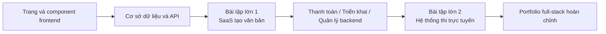

# Phát triển Full-Stack

Chào mừng đến với giai đoạn **Phát triển Full-Stack**! Ở đây bạn sẽ đi sâu vào phát triển full-stack, thành thạo component hóa frontend, thiết kế cơ sở dữ liệu, phát triển API backend và triển khai ứng dụng.

## Bạn sẽ học được gì

### Phát triển Frontend

Thành thạo phát triển frontend hiện đại, học cách sử dụng thư viện component và công cụ thiết kế:

<NavGrid>
  <NavCard
    href="/vi-vn/stage-2/frontend/lovart-assets/"
    title="Bắt đầu với Lovart, xây dựng Agent sản xuất tài nguyên của riêng bạn"
    description="Bắt đầu từ con số không, sử dụng Nanobanana và Lovart để tạo hàng loạt tài nguyên thiết kế chất lượng cao và xây dựng một Agent vẽ ảnh có khả năng nhận diện ý định"
  />
  <NavCard
    href="/vi-vn/stage-2/frontend/figma-mastergo/"
    title="Giới thiệu Figma và MasterGo"
    description="Thành thạo các thao tác cơ bản của công cụ thiết kế UI chuyên nghiệp, quy trình làm việc từ thiết kế đến code"
  />
  <NavCard
    href="/vi-vn/stage-2/frontend/ui-design/"
    title="Xây dựng ứng dụng hiện đại đầu tiên - Thiết kế UI"
    description="Học cơ bản về thiết kế UI cho ứng dụng hiện đại"
  />
  <NavCard
    href="/vi-vn/stage-2/frontend/multi-product-ui/"
    title="Thiết kế trang và nút bấm theo quy chuẩn UI"
    description="Học các quy chuẩn thiết kế UI phổ biến, thiết kế phân cấp trang và nút bấm rõ ràng hơn"
  />
  <NavCard
    href="/vi-vn/stage-2/frontend/llm-skills-beautiful/"
    title="Làm cho giao diện đẹp hơn bằng LLM và Skills"
    description="Thực hành với prompt và plugin, để AI tạo ra giao diện đẹp và độc đáo"
  />
  <NavCard
    href="/vi-vn/stage-2/frontend/hogwarts-portraits/"
    title="Cùng làm Chân dung Hogwarts"
    description="Dự án thực hành: Kết hợp hình ảnh do AI tạo, xây dựng ứng dụng Chân dung Hogwarts tương tác"
  />
  <NavCard
    href="/vi-vn/stage-2/frontend/design-to-code/"
    title="Từ nguyên mẫu thiết kế đến code dự án"
    description="Học cách chuyển đổi nguyên mẫu từ công cụ thiết kế thành code frontend có thể chạy trên trình duyệt"
  />
  <NavCard
    href="/vi-vn/stage-2/frontend/modern-component-library/"
    title="Cập nhật giao diện với thư viện component hiện đại"
    description="Học sử dụng thư viện component để nhanh chóng xây dựng giao diện chuyên nghiệp"
  />
</NavGrid>

### Phát triển Backend

Học thiết kế API, quản lý cơ sở dữ liệu và chiến lược triển khai ứng dụng:

<NavGrid>
  <NavCard
    href="/vi-vn/stage-2/backend/git-workflow/"
    title="Học sử dụng Git và Github"
    description="Thành thạo các thao tác cốt lõi và quy trình làm việc cộng tác của hệ thống quản lý phiên bản Git"
  />
  <NavCard
    href="/vi-vn/stage-2/backend/database-supabase/"
    title="Từ cơ sở dữ liệu đến Supabase"
    description="Thành thạo cơ bản về cơ sở dữ liệu quan hệ và học cách sử dụng Supabase, nền tảng BaaS hiện đại"
  />
  <NavCard
    href="/vi-vn/stage-2/backend/ai-interface-code/"
    title="Thiết kế và phát triển API backend ứng dụng"
    description="Sử dụng AI hỗ trợ tạo code API backend và tài liệu API chuẩn, nâng cao hiệu suất phát triển"
  />
  <NavCard
    href="/vi-vn/stage-2/backend/zeabur-deployment/"
    title="Xuất bản nguyên mẫu sản phẩm của bạn"
    description="Học cách sử dụng Zeabur để nhanh chóng triển khai ứng dụng full-stack lên đám mây"
  />
  <NavCard
    href="/vi-vn/stage-2/backend/modern-cli/"
    title="Từ IDE đến công cụ lập trình AI CLI"
    description="Khám phá các công cụ CLI hiện đại, nâng cao trải nghiệm phát triển trong môi trường dòng lệnh"
  />
  <NavCard
    href="/vi-vn/stage-2/backend/stripe-payment/"
    title="Cách tích hợp hệ thống thanh toán Stripe"
    description="Thực hành: Tích hợp chức năng thanh toán Stripe vào ứng dụng của bạn, hiện thực hóa thương mại hóa"
  />
</NavGrid>

### Bài tập lớn

Các chương trước là học "linh kiện", bài tập lớn mới là học "cách lắp linh kiện thành một sản phẩm có thể chạy, demo và đưa lên mạng".

Bạn nên làm theo thứ tự **Bài tập lớn 1 -> Bài tập lớn 2**:

- **Bài tập lớn 1** đưa bạn chạy qua đường dẫn chính phổ biến nhất của SaaS hiện đại: đăng nhập, tạo, cơ sở dữ liệu, thanh toán, trang quản lý.
- **Bài tập lớn 2** đưa bạn vào kịch bản giống hệ thống doanh nghiệp hơn: quyền vai trò, ngân hàng đề, kỳ thi, lịch sử nộp bài, trang quản lý.

Nếu bạn chưa biết nên làm cái nào trước, có thể tham khảo bảng so sánh dưới đây:

| Dự án | Bạn sẽ thực hành kỹ năng gì | Phù hợp nhất với ai | Sản phẩm bàn giao cuối cùng |
|------|------|------|------|
| Bài tập lớn 1: Trang web tạo văn bản | Cấu trúc trang SaaS, đăng nhập người dùng, tạo bằng AI, thanh toán Stripe, quản lý backend | Người lần đầu làm trang web thương mại hóa hoàn chỉnh | Một nguyên mẫu SaaS có thể đăng ký, tạo, thanh toán và quản lý |
| Bài tập lớn 2: Hệ thống thi và quản lý trực tuyến | Quyền vai trò, mô hình ngân hàng đề, quy trình thi, lịch sử nộp bài, chấm điểm và thống kê | Người muốn làm hoàn chỉnh một "hệ thống doanh nghiệp" | Một nền tảng thi có phía học sinh và phía quản lý |

Dù làm bài nào, bài tập lớn đều nên chuẩn bị ít nhất 3 sản phẩm bàn giao:

- Một kho lưu trữ dự án có thể chạy
- Một liên kết demo có thể truy cập
- Một README và một video demo

<NavGrid>
  <NavCard
    href="/vi-vn/stage-2/assignments/copywriting-platform-supabase/"
    title="Bài tập lớn 1: Ứng dụng full-stack SaaS đầu tiên - Trang web tạo văn bản"
    description="Xây dựng từ con số không một bàn làm việc văn bản marketing AI, bao gồm đăng nhập, tạo, thanh toán, trang quản lý backend"
  />
  <NavCard
    href="/vi-vn/stage-2/assignments/exam-management-express/"
    title="Bài tập lớn 2: Hệ thống thi và quản lý trực tuyến"
    description="Xây dựng hệ thống thi trực tuyến, hỗ trợ tạo đề tự động, làm bài, quản lý backend"
  />
</NavGrid>

Nếu bạn đã hoàn thành hai dự án chính ở trên, hoặc muốn làm portfolio theo hướng kỹ thuật của riêng mình, có thể tiếp tục chọn một đề tài từ các đề tài mở rộng dưới đây:

<NavGrid>
  <NavCard
    href="/vi-vn/stage-2/assignments/modern-landing-page/"
    title="Bài tập mở rộng: Kỹ thuật landing page Web hiện đại"
    description="Thực hành diễn đạt giá trị, đường dẫn chuyển đổi, thiết kế CTA và cơ sở theo dõi cơ bản, làm một trang thực sự có thể tiếp nhận lưu lượng"
  />
  <NavCard
    href="/vi-vn/stage-2/assignments/custom-dify-agent-platform/"
    title="Bài tập mở rộng: Nền tảng编排 Agent thông minh kiểu Dify"
    description="Hiện thực hóa quản lý agent, hội thoại, nhật ký và kiểm soát quyền, làm một nền tảng AI tối giản có thể sử dụng"
  />
  <NavCard
    href="/vi-vn/stage-2/assignments/travel-planning-agent-platform/"
    title="Bài tập mở rộng: Nền tảng编排 Agent lập kế hoạch du lịch thông minh"
    description="Xoay quanh đầu vào có cấu trúc,编排 Agent và quản lý kế hoạch lịch sử, làm một sản phẩm lập kế hoạch du lịch AI có thể thực thi"
  />
  <NavCard
    href="/vi-vn/stage-2/assignments/movie-recommendation-springboot/"
    title="Bài tập mở rộng: Hệ thống đề xuất phim Spring Boot"
    description="Kết hợp Spring Boot, đánh giá收藏 và đề xuất có thể giải thích, hoàn thành một nguyên mẫu hệ thống đề xuất hoàn chỉnh"
  />
  <NavCard
    href="/vi-vn/stage-2/assignments/simple-grocery-microservices/"
    title="Bài tập mở rộng: Hệ thống microservices thương mại điện tử thực phẩm tươi"
    description="Thực hành tách service, chuyển tiếp gateway, phối hợp tồn kho và đơn hàng, trải nghiệm tư duy kỹ thuật từ đơn thể đến microservices"
  />
  <NavCard
    href="/vi-vn/stage-2/assignments/traffic-data-visualization-go/"
    title="Bài tập mở rộng: Nền tảng phân tích và trực quan hóa dữ liệu giao thông Go"
    description="Từ tiếp nhận dữ liệu, tổng hợp cửa sổ đến dashboard xu hướng và cảnh báo, làm một nguyên mẫu sản phẩm dữ liệu hoàn chỉnh"
  />
</NavGrid>

### Mở rộng khả năng AI

<NavGrid>
  <NavCard
    href="/vi-vn/stage-2/ai-capabilities/dify-knowledge-base/"
    title="Giới thiệu Dify và tích hợp cơ sở kiến thức"
    description="Học cách sử dụng Dify để xây dựng ứng dụng AI và tích hợp cơ sở kiến thức riêng tư"
  />
</NavGrid>

## Dành cho ai

- Nhà phát triển có nền tảng lập trình, muốn học phát triển full-stack một cách có hệ thống
- Người học muốn chuyển đổi từ quản lý sản phẩm sang kỹ sư full-stack
- Nhà phát triển từ cơ bản đến trung cấp muốn thành thạo công cụ và quy trình phát triển hiện đại
- Doanh nhân muốn phát triển độc lập sản phẩm hoàn chỉnh

## Điều kiện tiên quyết

- Hoàn thành giai đoạn "Người mới và nguyên mẫu sản phẩm", hoặc có kiến thức cơ bản tương đương
- Hiểu các khái niệm cơ bản về HTML/CSS/JavaScript
- Có kiến thức sơ bộ về các công cụ lập trình AI

Sẵn sàng đi sâu vào phát triển full-stack chưa? Nhấp vào điều hướng bên trái để bắt đầu học!
