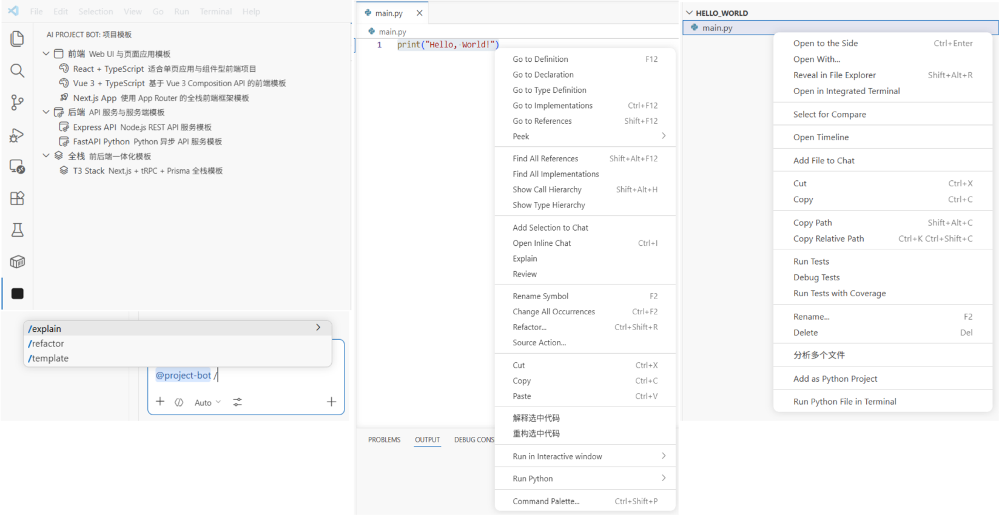
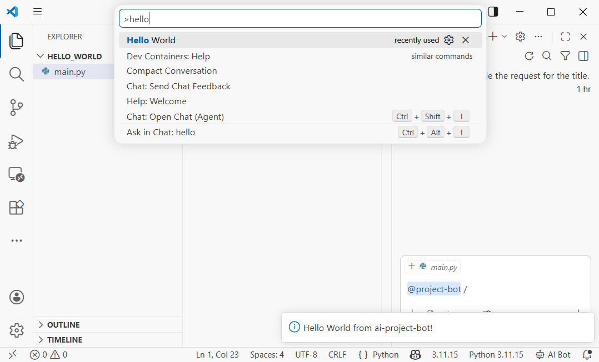
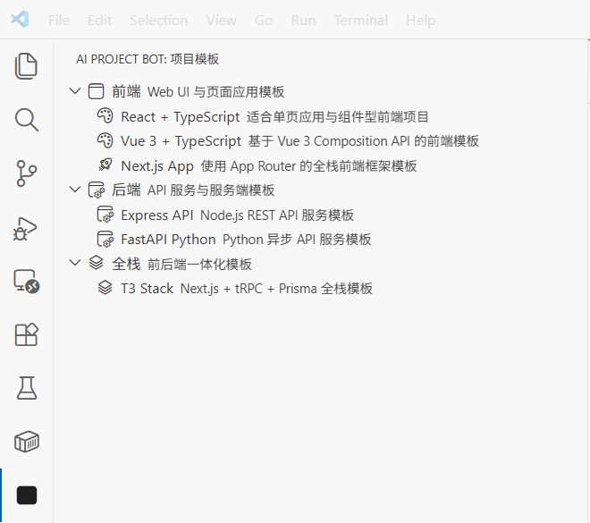
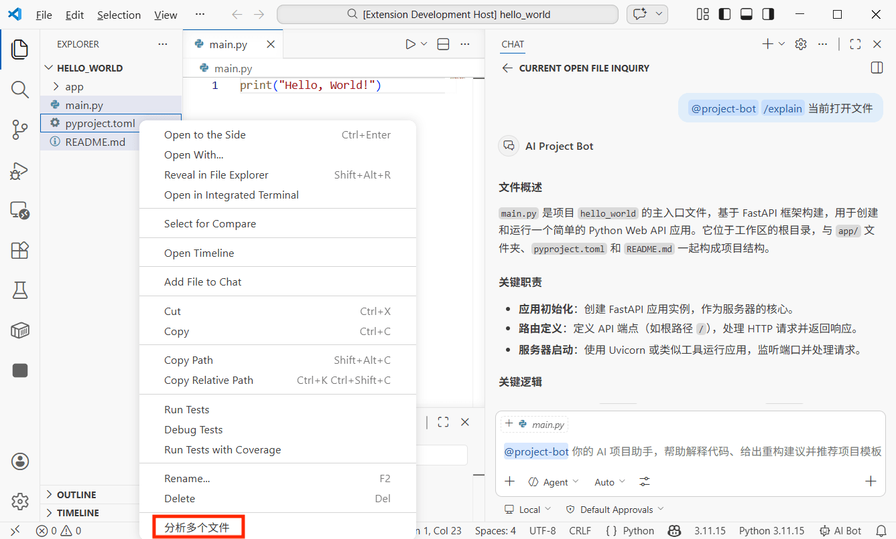
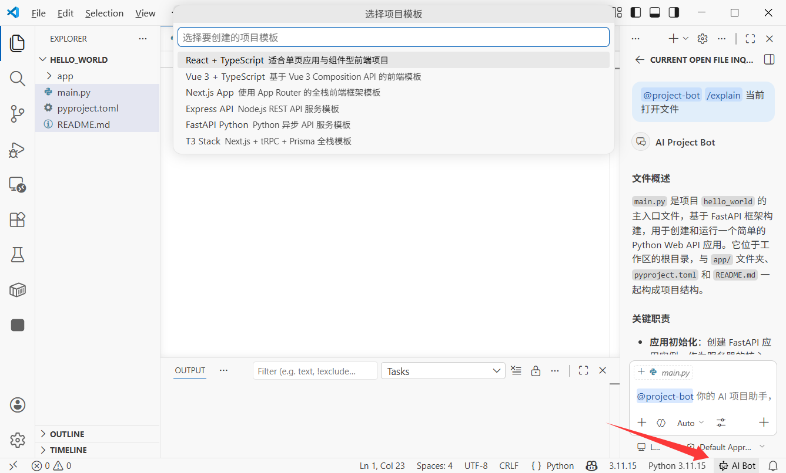

# Cách Xây Dựng Tiện Ích Mở Rộng VS Code: Tạo Trợ Lý Dự Án AI Của Bạn

# Chương 1: Phát triển tiện ích mở rộng VS Code là gì

Trong hướng dẫn này, chúng ta sẽ hoàn thành một vòng lặp đầy đủ: xây dựng tiện ích mở rộng VS Code từ đầu đóng vai trò là trợ lý dự án AI của bạn, với tính năng tạo mẫu dự án một chạm, trò chuyện AI trên các tệp hoặc đoạn mã đã chọn, phân tích hỏi đáp đa tệp và phím tắt tùy chỉnh. Bạn sẽ hoàn thành phát triển, gỡ lỗi và tìm hiểu cách xuất bản lên VS Code Marketplace.

Để thực hiện hướng dẫn này, bạn cần ít nhất có:

- Môi trường Node.js (phiên bản 18.0+)
- Trình soạn thảo VS Code (phiên bản 1.90+)
- Trợ lý viết mã AI của bạn (Cursor / Trae / Claude Code)
- (Tùy chọn) Đăng ký GitHub Copilot (để sử dụng Language Model API)

> **Vibe Coding từ đầu đến cuối**: chúng ta sẽ sử dụng trợ lý viết mã AI để tạo phần lớn mã. Bạn chỉ cần hiểu các khái niệm cốt lõi và kiến trúc, sau đó mô tả yêu cầu bằng ngôn ngữ tự nhiên.

## 1.1 Tiện ích mở rộng VS Code có thể làm gì?

Bạn đã sử dụng các tiện ích mở rộng VS Code mỗi ngày. Prettier định dạng mã của bạn, GitLens hiển thị lịch sử Git và GitHub Copilot giúp bạn viết mã. Các tiện ích mở rộng này về cơ bản là các chương trình được viết bằng TypeScript/JavaScript mở rộng trình soạn thảo thông qua các API của VS Code.

Tiện ích mở rộng VS Code có thể làm được nhiều hơn nhiều người tưởng tượng:

* **Thêm các thành phần giao diện mới**: bảng thanh bên, thông tin thanh trạng thái, trang Webview tùy chỉnh
* **Xử lý tệp và mã**: đọc, sửa đổi và tạo tệp; phân tích cấu trúc mã
* **Tích hợp dịch vụ bên ngoài**: gọi API, kết nối cơ sở dữ liệu, tích hợp CI/CD
* **Mở rộng khả năng trình soạn thảo**: hỗ trợ ngôn ngữ tùy chỉnh, tự động hoàn thành mã, chẩn đoán
* **Thêm khả năng AI**: tạo trợ lý AI với Chat Participant API, gọi mô hình với Language Model API

<!--  -->


## 1.2 Kiến trúc cốt lõi của tiện ích mở rộng VS Code

Tiện ích mở rộng VS Code chạy trong một quy trình **Extension Host** biệt lập, tách biệt với quy trình chính của trình soạn thảo. Điều này có nghĩa là ngay cả khi tiện ích mở rộng bị lỗi, trình soạn thảo vẫn không bị ảnh hưởng.

Một tiện ích mở rộng điển hình có các thành phần cốt lõi sau:

* **package.json (tệp kê khai)**: "thẻ căn cước" của tiện ích mở rộng, khai báo tên, tệp đầu vào, các điểm đóng góp (`commands`, `menus`, `keybindings`, v.v.)
* **extension.ts (tệp đầu vào)**: "bộ não" của tiện ích mở rộng, xuất `activate()` và `deactivate()`
* **Điểm đóng góp**: những gì tiện ích mở rộng của bạn đóng góp cho VS Code trong package.json (lệnh, mục menu, phím tắt, khung nhìn, v.v.)
* **VS Code API**: bộ API TypeScript được sử dụng để vận hành các khả năng của trình soạn thảo

```text
Trình soạn thảo VS Code
    │
    ├── Extension Host (quy trình tiện ích mở rộng)
    │   ├── Tiện ích mở rộng của bạn
    │   │   ├── package.json  -> khai báo "tôi có thể làm gì"
    │   │   ├── extension.ts  -> triển khai "cách làm"
    │   │   └── các module khác -> mã tính năng cụ thể
    │   ├── Tiện ích mở rộng khác A
    │   └── Tiện ích mở rộng khác B
    │
    └── Quy trình chính trình soạn thảo (kết xuất giao diện)
```

<!--  -->


## 1.3 Chúng ta đang xây dựng tiện ích mở rộng gì?

Chúng ta sẽ xây dựng một tiện ích mở rộng VS Code có tên **"AI Project Bot"**, một trợ lý dự án AI với các tính năng sau:

| Tính năng | Mô tả |
|------|------|
| Mẫu dự án | Danh sách mẫu trong thanh bên, tạo khung dự án một chạm |
| Trò chuyện AI | Người tham gia `@project-bot` trong VS Code Chat để hỏi đáp về dự án |
| Trò chuyện tệp/đoạn mã | Nhấp chuột phải vào mã hoặc tệp đã chọn và gửi đến AI để phân tích/giải thích/tái cấu trúc |
| Hỏi đáp đa tệp | Chọn nhiều tệp trong trình khám phá và yêu cầu AI phân tích mối quan hệ và logic |
| Phím tắt | Phím tắt tùy chỉnh để kích hoạt nhanh các hành động phổ biến |

<!--  -->


## 1.4 Lộ trình hướng dẫn

Chúng ta sẽ hoàn thành quy trình theo các bước sau:

1. **Tạo dự án tiện ích mở rộng** (3 phút): tạo khung dự án và hiểu các tệp cốt lõi
2. **Triển khai mẫu dự án** (5 phút): sử dụng TreeView để hiển thị mẫu trong thanh bên và tạo dự án
3. **Triển khai người tham gia trò chuyện AI** (5 phút): tạo `@project-bot` qua Chat Participant API
4. **Triển khai trò chuyện tệp/đoạn mã và hỏi đáp đa tệp** (5 phút): menu nhấp chuột phải + phân tích chọn nhiều
5. **Thêm phím tắt và tối ưu trải nghiệm** (3 phút): phím tắt và gợi ý thanh trạng thái
6. **Xuất bản lên marketplace** (tùy chọn): đóng gói và gửi

# Chương 2: Tạo Dự Án Tiện Ích Mở Rộng (3 Phút)

## 2.1 Tạo dự án với công cụ scaffold

VS Code chính thức cung cấp công cụ scaffold Yeoman. Yêu cầu AI chạy:

```text
Vui lòng giúp tôi cài đặt công cụ scaffold tiện ích mở rộng VS Code và tạo một dự án:
1. Cài đặt Yeoman và generator-code: npm install -g yo generator-code
2. Chạy yo code và chọn:
   - Loại: New Extension (TypeScript)
   - Tên: ai-project-bot
   - Định danh: ai-project-bot
   - Mô tả: Trợ lý dự án AI - tạo mẫu, trò chuyện thông minh, hỏi đáp đa tệp
   - Trình quản lý gói: npm
3. Vào thư mục dự án và cài đặt các phụ thuộc
```

Cấu trúc đã tạo:

```text
ai-project-bot/
├── .vscode/
│   ├── launch.json          # Cấu hình gỡ lỗi (F5 bắt đầu gỡ lỗi)
│   └── tasks.json           # Tác vụ xây dựng
├── src/
│   └── extension.ts         # Tệp đầu vào tiện ích mở rộng
├── package.json             # Tệp kê khai tiện ích mở rộng (tệp quan trọng nhất)
├── tsconfig.json            # Cấu hình TypeScript
└── vsc-extension-quickstart.md  # Hướng dẫn nhanh (có thể xóa)
```

## 2.2 Hiểu về package.json: "Thẻ căn cước" của tiện ích mở rộng

`package.json` là tệp cốt lõi của tiện ích mở rộng VS Code. Bên cạnh các trường npm thông thường, nó có `contributes` để khai báo mọi thứ tiện ích mở rộng đóng góp cho VS Code:

```json
{
  "name": "ai-project-bot",
  "displayName": "AI Project Bot",
  "description": "Trợ lý dự án AI - tạo mẫu, trò chuyện thông minh, hỏi đáp đa tệp",
  "version": "0.0.1",
  "engines": { "vscode": "^1.90.0" },
  "activationEvents": [],
  "main": "./out/extension.js",
  "contributes": {
    "commands": [],
    "menus": {},
    "keybindings": [],
    "viewsContainers": {},
    "views": {},
    "chatParticipants": []
  }
}
```

**Các trường quan trọng:**

| Trường | Mục đích |
|------|------|
| `engines.vscode` | Phiên bản VS Code tối thiểu được hỗ trợ |
| `activationEvents` | Khi nào tiện ích mở rộng được kích hoạt (trống có nghĩa là kích hoạt theo yêu cầu) |
| `main` | Đường dẫn đến tệp đầu vào đã biên dịch |
| `contributes` | Tất cả các tính năng đã đóng góp (lệnh, menu, phím tắt, khung nhìn, v.v.) |

<!--  -->


## 2.3 Hiểu về extension.ts: "Bộ não" của tiện ích mở rộng

Mở `src/extension.ts` và bạn sẽ thấy hai hàm cốt lõi:

```typescript
import * as vscode from 'vscode'

// Được gọi khi tiện ích mở rộng được kích hoạt (lần đầu thực thi lệnh, mở tệp cụ thể, v.v.)
export function activate(context: vscode.ExtensionContext) {
  console.log('AI Project Bot đã được kích hoạt!')

  // Đăng ký lệnh, khung nhìn, người tham gia trò chuyện, v.v.
  const disposable = vscode.commands.registerCommand(
    'ai-project-bot.helloWorld',
    () => {
      vscode.window.showInformationMessage('Xin chào từ AI Project Bot!')
    }
  )

  context.subscriptions.push(disposable)
}

// Được gọi khi tiện ích mở rộng bị vô hiệu hóa (ví dụ khi VS Code đóng)
export function deactivate() {}
```

**Các khái niệm cốt lõi:**

* `activate(context)`: khởi tạo tiện ích mở rộng, đăng ký tất cả khả năng tại đây
* `context.subscriptions`: danh sách tự động dọn dẹp; VS Code loại bỏ các mục đã đăng ký khi vô hiệu hóa
* `vscode.commands.registerCommand`: đăng ký lệnh có thể gọi từ bảng lệnh (`Ctrl+Shift+P`)

## 2.4 Bắt đầu gỡ lỗi

Nhấn **F5**, VS Code sẽ mở một cửa sổ **Extension Development Host** mới. Đây là một phiên bản VS Code hoàn toàn mới với tiện ích mở rộng của bạn được tải.

Trong cửa sổ mới, nhấn **Ctrl+Shift+P**, gõ "Hello World" và bạn sẽ thấy một thông báo hiện lên. Điều này có nghĩa là tiện ích mở rộng của bạn đang chạy.

<!--  -->


> **Mẹo gỡ lỗi**: sau khi thay đổi mã, trong Extension Development Host nhấn **Ctrl+Shift+P** -> **Developer: Reload Window** để tải lại tiện ích mở rộng nhanh chóng.

# Chương 3: Triển Khai Mẫu Dự Án (5 Phút)

## 3.1 Thiết kế hệ thống mẫu

Chúng ta muốn thêm bảng "Mẫu Dự Án" trong thanh bên VS Code nơi người dùng có thể duyệt mẫu và tạo khung dự án chỉ bằng một cú nhấp. Việc này sử dụng **TreeView API** của VS Code.

Yêu cầu AI triển khai:

```text
Vui lòng giúp tôi triển khai mẫu dự án trong ai-project-bot:

1. Thêm điểm đóng góp trong package.json:
   - Thêm một mục viewsContainers.activitybar mới với id "project-bot", tiêu đề "AI Project Bot"
   - Thêm một khung nhìn dưới đó với id "projectTemplates", tên "Project Templates"
   - Thêm lệnh "ai-project-bot.createFromTemplate", tiêu đề "Create Project from Template"

2. Tạo src/templates/templateProvider.ts:
   - Triển khai TreeDataProvider với các danh mục và mẫu:
     - Frontend: React + TypeScript, Vue 3 + TypeScript, Next.js App
     - Backend: Express API, FastAPI Python
     - Full-stack: T3 Stack (Next.js + tRPC + Prisma)
   - Mỗi mục mẫu hiển thị tên, mô tả và biểu tượng

3. Tạo src/templates/scaffolder.ts:
   - Triển khai hàm createProjectFromTemplate
   - Cho phép người dùng chọn thư mục đích
   - Tạo cấu trúc dự án theo loại mẫu
```

## 3.2 Khai báo khung nhìn trong package.json

Đầu tiên, thêm đóng góp khung nhìn thanh bên trong `package.json`:

```json
{
  "contributes": {
    "viewsContainers": {
      "activitybar": [
        {
          "id": "project-bot",
          "title": "AI Project Bot",
          "icon": "resources/bot-icon.svg"
        }
      ]
    },
    "views": {
      "project-bot": [
        {
          "id": "projectTemplates",
          "name": "Project Templates"
        }
      ]
    },
    "commands": [
      {
        "command": "ai-project-bot.createFromTemplate",
        "title": "Create Project from Template",
        "icon": "$(add)"
      }
    ],
    "menus": {
      "view/title": [
        {
          "command": "ai-project-bot.createFromTemplate",
          "when": "view == projectTemplates",
          "group": "navigation"
        }
      ]
    }
  }
}
```

Cấu hình này làm ba việc:

1. Thêm một mục biểu tượng "AI Project Bot" trong thanh hoạt động
2. Tạo một khung nhìn "Project Templates" dưới mục đó
3. Thêm nút "+" trong thanh tiêu đề khung nhìn để tạo dự án

<!--  -->


## 3.3 Triển khai TreeDataProvider

TreeDataProvider là giao diện VS Code sử dụng để điền dữ liệu cây. Chúng ta cần `getTreeItem` (thông tin hiển thị cho một nút) và `getChildren` (danh sách nút con).

Mã cốt lõi:

```typescript
// src/templates/templateProvider.ts
import * as vscode from 'vscode'

interface Template {
  name: string
  description: string
  category: string
  command: string // lệnh để tạo dự án, ví dụ "npx create-react-app"
}

const TEMPLATES: Template[] = [
  { name: 'React + TypeScript', description: 'Dự án React xây dựng với Vite', category: 'Frontend', command: 'npm create vite@latest {{name}} -- --template react-ts' },
  { name: 'Vue 3 + TypeScript', description: 'Dự án Vue 3 xây dựng với Vite', category: 'Frontend', command: 'npm create vite@latest {{name}} -- --template vue-ts' },
  { name: 'Next.js App', description: 'Dự án full-stack Next.js App Router', category: 'Frontend', command: 'npx create-next-app@latest {{name}} --typescript --app' },
  { name: 'Express API', description: 'REST API Express + TypeScript', category: 'Backend', command: 'npx create-express-api {{name}}' },
  { name: 'FastAPI Python', description: 'Dự án backend Python FastAPI', category: 'Backend', command: 'pip install fastapi uvicorn' },
]

// Nút cây: danh mục hoặc mẫu
class TemplateItem extends vscode.TreeItem {
  constructor(
    public readonly label: string,
    public readonly collapsibleState: vscode.TreeItemCollapsibleState,
    public readonly template?: Template
  ) {
    super(label, collapsibleState)
    if (template) {
      this.description = template.description
      this.tooltip = `${template.name}\n${template.description}\nCommand: ${template.command}`
      this.contextValue = 'template'
      this.command = {
        command: 'ai-project-bot.createFromTemplate',
        title: 'Create Project',
        arguments: [template]
      }
    }
  }
}

export class TemplateProvider implements vscode.TreeDataProvider<TemplateItem> {
  getTreeItem(element: TemplateItem): vscode.TreeItem {
    return element
  }

  getChildren(element?: TemplateItem): TemplateItem[] {
    if (!element) {
      // Gốc: trả về danh sách danh mục
      const categories = [...new Set(TEMPLATES.map(t => t.category))]
      return categories.map(
        cat => new TemplateItem(cat, vscode.TreeItemCollapsibleState.Expanded)
      )
    }
    // Con: mẫu trong danh mục
    return TEMPLATES
      .filter(t => t.category === element.label)
      .map(t => new TemplateItem(t.name, vscode.TreeItemCollapsibleState.None, t))
  }
}
```

## 3.4 Đăng ký khung nhìn và lệnh tạo

Đăng ký TreeView và lệnh tạo dự án trong `extension.ts`:

```typescript
// src/extension.ts
import { TemplateProvider } from './templates/templateProvider'

export function activate(context: vscode.ExtensionContext) {
  // Đăng ký khung nhìn mẫu
  const templateProvider = new TemplateProvider()
  vscode.window.registerTreeDataProvider('projectTemplates', templateProvider)

  // Đăng ký lệnh tạo dự án
  const createCmd = vscode.commands.registerCommand(
    'ai-project-bot.createFromTemplate',
    async (template) => {
      if (!template) {
        // Nếu không có mẫu được truyền (gọi từ bảng lệnh), cho người dùng chọn
        const pick = await vscode.window.showQuickPick(
          TEMPLATES.map(t => ({ label: t.name, description: t.description, template: t })),
          { placeHolder: 'Chọn mẫu dự án' }
        )
        if (!pick) return
        template = pick.template
      }

      // Hỏi tên dự án
      const name = await vscode.window.showInputBox({
        prompt: 'Nhập tên dự án',
        placeHolder: 'my-awesome-project'
      })
      if (!name) return

      // Hỏi thư mục đích
      const folder = await vscode.window.showOpenDialog({
        canSelectFolders: true,
        openLabel: 'Chọn thư mục đích'
      })
      if (!folder) return

      // Thực thi lệnh tạo
      const terminal = vscode.window.createTerminal('AI Project Bot')
      terminal.show()
      const cmd = template.command.replace('{{name}}', name)
      terminal.sendText(`cd "${folder[0].fsPath}" && ${cmd}`)

      vscode.window.showInformationMessage(`Đang tạo dự án ${template.name}: ${name}`)
    }
  )

  context.subscriptions.push(createCmd)
}
```

Bây giờ nhấn F5 để gỡ lỗi. Bạn sẽ thấy AI Project Bot trong thanh hoạt động. Mở rộng danh sách mẫu và nhấp vào bất kỳ mẫu nào để tạo dự án.

<!--  -->


# Chương 4: Triển Khai Người Tham Gia Trò Chuyện AI (5 Phút)

## 4.1 Chat Participant API là gì?

Bắt đầu từ VS Code 1.90, các tiện ích mở rộng có thể tạo trợ lý AI riêng trong bảng Chat bằng **Chat Participant API**. Nếu người dùng nhập `@project-bot giúp tôi phân tích kiến trúc dự án này`, tiện ích mở rộng của bạn nhận tin nhắn và trả về phản hồi do mô hình tạo.

Các khái niệm cốt lõi:

* **Participant**: danh tính trợ lý của bạn trong bảng Chat, được gọi bằng `@name`
* **Slash Commands**: các lệnh nhanh được hỗ trợ bởi participant, ví dụ `/explain`, `/refactor`
* **Language Model API**: gọi các mô hình tích hợp trong VS Code (ví dụ Copilot GPT-4o)
* **Stream**: xuất phản hồi dần dần thông qua `stream.markdown()`

## 4.2 Khai báo Chat Participant trong package.json

Thêm vào `contributes`:

```json
{
  "contributes": {
    "chatParticipants": [
      {
        "id": "ai-project-bot.projectBot",
        "name": "project-bot",
        "fullName": "AI Project Bot",
        "description": "Trợ lý dự án AI của bạn để phân tích mã, giải thích kiến trúc và tạo giải pháp",
        "isSticky": true
      }
    ]
  }
}
```

`isSticky: true` có nghĩa là khi đã chọn, các tin nhắn tiếp theo sẽ gửi đến participant này mặc định, không cần gõ `@project-bot` mỗi lần.

## 4.3 Triển khai trình xử lý Chat Participant

Yêu cầu AI viết logic cốt lõi:

```text
Vui lòng giúp tôi tạo src/chat/chatParticipant.ts và triển khai Chat Participant:
1. Đăng ký participant "ai-project-bot.projectBot"
2. Hỗ trợ ba slash commands:
   - /explain: giải thích mã đã chọn hoặc tệp hiện tại
   - /refactor: cung cấp gợi ý tái cấu trúc
   - /template: gợi ý mẫu ngăn xếp công nghệ phù hợp
3. Sử dụng Language Model API với mô hình tích hợp VS Code
4. Trả về phản hồi ở chế độ streaming (stream.markdown)
```

Mã cốt lõi:

```typescript
// src/chat/chatParticipant.ts
import * as vscode from 'vscode'

export function registerChatParticipant(context: vscode.ExtensionContext) {
  const participant = vscode.chat.createChatParticipant(
    'ai-project-bot.projectBot',
    async (request, chatContext, stream, token) => {
      // Chọn mô hình khả dụng
      const models = await vscode.lm.selectChatModels({ family: 'gpt-4o' })
      const model = models[0]

      if (!model) {
        stream.markdown('Không có mô hình ngôn ngữ khả dụng. Vui lòng đảm bảo GitHub Copilot đã được cài đặt.')
        return
      }

      // Xây dựng system prompt theo slash command
      let systemPrompt = 'Bạn là một trợ lý phát triển dự án chuyên nghiệp.'

      if (request.command === 'explain') {
        systemPrompt = 'Bạn là chuyên gia giải thích mã. Vui lòng giải thích mã của người dùng bằng tiếng Việt ngắn gọn, bao gồm mục đích, luồng logic và các quyết định thiết kế quan trọng.'
      } else if (request.command === 'refactor') {
        systemPrompt = 'Bạn là chuyên gia tái cấu trúc mã. Phân tích mã của người dùng và cung cấp gợi ý tái cấu trúc cụ thể kèm ví dụ mã được cải thiện.'
      } else if (request.command === 'template') {
        systemPrompt = 'Bạn là chuyên gia lựa chọn ngăn xếp công nghệ. Gợi ý ngăn xếp công nghệ và mẫu dự án phù hợp dựa trên yêu cầu của người dùng.'
      }

      // Xây dựng tin nhắn
      const messages = [
        vscode.LanguageModelChatMessage.User(systemPrompt),
        vscode.LanguageModelChatMessage.User(request.prompt)
      ]

      // Xuất streaming
      const response = await model.sendRequest(messages, {}, token)
      for await (const chunk of response.stream) {
        stream.markdown(chunk)
      }

      return { metadata: { command: request.command || '' } }
    }
  )

  // Đăng ký slash commands
  participant.slashCommandProvider = {
    provideSlashCommands: () => [
      { name: 'explain', description: 'Giải thích chức năng và logic của mã' },
      { name: 'refactor', description: 'Cung cấp gợi ý tái cấu trúc và cải thiện' },
      { name: 'template', description: 'Gợi ý mẫu dự án và ngăn xếp công nghệ phù hợp' }
    ]
  }

  // Đăng ký gợi ý theo dõi
  participant.followupProvider = {
    provideFollowups: (result) => {
      if (result.metadata?.command === 'explain') {
        return [
          { prompt: 'Bạn có thể vẽ sơ đồ luồng không?', label: 'Tạo sơ đồ luồng' },
          { prompt: 'Có lỗi tiềm ẩn nào ở đây không?', label: 'Kiểm tra vấn đề tiềm ẩn' }
        ]
      }
      return []
    }
  }

  context.subscriptions.push(participant)
}
```

Gọi đăng ký trong `extension.ts`:

```typescript
import { registerChatParticipant } from './chat/chatParticipant'

export function activate(context: vscode.ExtensionContext) {
  // ... mã đăng ký mẫu trước đó ...
  registerChatParticipant(context)
}
```

Bây giờ nhập `@project-bot /explain đoạn mã này làm gì?` trong bảng Chat và tiện ích mở rộng của bạn sẽ gọi mô hình và tạo giải thích.

<!--  -->


# Chương 5: Trò Chuyện Tệp/Đoạn Mã và Hỏi Đáp Đa Tệp (5 Phút)

## 5.1 Menu nhấp chuột phải: Gửi mã đã chọn đến AI

Chúng ta muốn người dùng chọn mã trong trình soạn thảo và gửi đến AI từ menu ngữ cảnh. Việc này sử dụng điểm đóng góp **Context Menu** của VS Code.

Thêm vào `package.json`:

```json
{
  "contributes": {
    "commands": [
      {
        "command": "ai-project-bot.explainSelection",
        "title": "AI: Giải thích mã đã chọn"
      },
      {
        "command": "ai-project-bot.refactorSelection",
        "title": "AI: Tái cấu trúc mã đã chọn"
      }
    ],
    "menus": {
      "editor/context": [
        {
          "command": "ai-project-bot.explainSelection",
          "when": "editorHasSelection",
          "group": "ai-project-bot@1"
        },
        {
          "command": "ai-project-bot.refactorSelection",
          "when": "editorHasSelection",
          "group": "ai-project-bot@2"
        }
      ]
    }
  }
}
```

**Ghi chú cấu hình quan trọng:**

* `when: "editorHasSelection"`: hiển thị menu chỉ khi có văn bản được chọn
* `group: "ai-project-bot@1"`: nhóm và thứ tự menu (`@1`, `@2`)

## 5.2 Triển khai phân tích mã đã chọn

```typescript
// src/commands/selectionCommands.ts
import * as vscode from 'vscode'

export function registerSelectionCommands(context: vscode.ExtensionContext) {
  // Giải thích mã đã chọn
  const explainCmd = vscode.commands.registerCommand(
    'ai-project-bot.explainSelection',
    async () => {
      const editor = vscode.window.activeTextEditor
      if (!editor) return

      const selection = editor.selection
      const selectedText = editor.document.getText(selection)
      const fileName = editor.document.fileName.split('/').pop()
      const startLine = selection.start.line + 1
      const endLine = selection.end.line + 1

      // Xây dựng prompt với ngữ cảnh
      const prompt = [
        `Vui lòng giải thích đoạn mã sau (từ ${fileName}, dòng ${startLine}-${endLine}):`,
        '```',
        selectedText,
        '```',
        'Vui lòng giải thích: 1) đoạn mã này làm gì 2) logic cốt lõi 3) cải thiện có thể'
      ].join('\n')

      // Gọi Language Model API
      const models = await vscode.lm.selectChatModels({ family: 'gpt-4o' })
      if (!models.length) {
        vscode.window.showErrorMessage('Không có mô hình ngôn ngữ khả dụng')
        return
      }

      // Hiển thị kết quả trong bảng xuất
      const outputChannel = vscode.window.createOutputChannel('AI Project Bot')
      outputChannel.show()
      outputChannel.appendLine(`\n--- Giải thích mã (${fileName}:${startLine}-${endLine}) ---\n`)

      const messages = [
        vscode.LanguageModelChatMessage.User(prompt)
      ]
      const response = await models[0].sendRequest(messages, {})
      for await (const chunk of response.stream) {
        outputChannel.append(chunk)
      }
    }
  )

  context.subscriptions.push(explainCmd)
}
```

<!--  -->


## 5.3 Hỏi đáp đa tệp: Phân tích hàng loạt mối quan hệ tệp

Đây là một trong những tính năng mạnh mẽ nhất: chọn nhiều tệp trong trình khám phá và để AI phân tích mối quan hệ và logic chỉ bằng một cú nhấp.

Thêm menu ngữ cảnh trình khám phá trong `package.json`:

```json
{
  "contributes": {
    "commands": [
      {
        "command": "ai-project-bot.analyzeFiles",
        "title": "AI: Phân tích mối quan hệ các tệp đã chọn"
      }
    ],
    "menus": {
      "explorer/context": [
        {
          "command": "ai-project-bot.analyzeFiles",
          "when": "explorerResourceIsFile",
          "group": "ai-project-bot"
        }
      ]
    }
  }
}
```

Triển khai lệnh phân tích đa tệp:

```typescript
// src/commands/multiFileAnalysis.ts
import * as vscode from 'vscode'

export function registerMultiFileCommands(context: vscode.ExtensionContext) {
  const analyzeCmd = vscode.commands.registerCommand(
    'ai-project-bot.analyzeFiles',
    async (clickedFile: vscode.Uri, selectedFiles: vscode.Uri[]) => {
      // selectedFiles chứa tất cả tệp đã chọn
      const files = selectedFiles || [clickedFile]

      if (files.length < 2) {
        vscode.window.showWarningMessage('Vui lòng chọn ít nhất 2 tệp để phân tích')
        return
      }

      // Đọc tất cả tệp đã chọn
      const fileContents: string[] = []
      for (const file of files) {
        const content = await vscode.workspace.fs.readFile(file)
        const fileName = vscode.workspace.asRelativePath(file)
        fileContents.push(
          `--- ${fileName} ---\n${Buffer.from(content).toString('utf8')}`
        )
      }

      const prompt = [
        `Vui lòng phân tích mối quan hệ giữa ${files.length} tệp sau:`,
        '',
        ...fileContents,
        '',
        'Vui lòng giải thích:',
        '1. Trách nhiệm của từng tệp',
        '2. Mối quan hệ phụ thuộc/gọi giữa chúng',
        '3. Luồng dữ liệu (nếu có)',
        '4. Gợi ý kiến trúc hoặc vấn đề tiềm ẩn'
      ].join('\n')

      // Gọi mô hình và hiển thị kết quả
      const models = await vscode.lm.selectChatModels({ family: 'gpt-4o' })
      if (!models.length) {
        vscode.window.showErrorMessage('Không có mô hình ngôn ngữ khả dụng')
        return
      }

      const outputChannel = vscode.window.createOutputChannel('AI Project Bot')
      outputChannel.show()
      outputChannel.appendLine(`\n--- Phân tích đa tệp (${files.length} tệp) ---\n`)

      const messages = [
        vscode.LanguageModelChatMessage.User(prompt)
      ]
      const response = await models[0].sendRequest(messages, {})
      for await (const chunk of response.stream) {
        outputChannel.append(chunk)
      }
    }
  )

  context.subscriptions.push(analyzeCmd)
}
```

Cách sử dụng: trong trình khám phá, giữ `Ctrl` (`Cmd` trên Mac) để chọn nhiều tệp, nhấp chuột phải và chọn "AI: Phân tích mối quan hệ các tệp đã chọn." AI sẽ đọc tất cả tệp đã chọn và trả về phân tích.

<!--  -->


# Chương 6: Phím Tắt và Tối Ưu Trải Nghiệm (3 Phút)

## 6.1 Phím tắt tùy chỉnh

Phím tắt là chìa khóa để tăng hiệu quả. Thêm vào `package.json`:

```json
{
  "contributes": {
    "keybindings": [
      {
        "command": "ai-project-bot.explainSelection",
        "key": "ctrl+shift+e",
        "mac": "cmd+shift+e",
        "when": "editorTextFocus && editorHasSelection"
      },
      {
        "command": "ai-project-bot.refactorSelection",
        "key": "ctrl+shift+r",
        "mac": "cmd+shift+r",
        "when": "editorTextFocus && editorHasSelection"
      },
      {
        "command": "ai-project-bot.createFromTemplate",
        "key": "ctrl+shift+n",
        "mac": "cmd+shift+n",
        "when": ""
      }
    ]
  }
}
```

**Điều kiện `when`:**

| Điều kiện | Ý nghĩa |
|------|------|
| `editorTextFocus` | Con trỏ đang ở trình soạn thảo |
| `editorHasSelection` | Có văn bản được chọn |
| `explorerViewletVisible` | Bảng trình khám phá đang hiển thị |
| `!editorReadonly` | Tệp không ở chế độ chỉ đọc |

Nhiều điều kiện kết nối bằng `&&` có nghĩa là tất cả phải được thỏa mãn.

## 6.2 Gợi ý thanh trạng thái

Thêm một mục thanh trạng thái nhanh để người dùng luôn biết tiện ích mở rộng đang chạy:

```typescript
// src/statusBar.ts
import * as vscode from 'vscode'

export function createStatusBarItem(context: vscode.ExtensionContext) {
  const statusBar = vscode.window.createStatusBarItem(
    vscode.StatusBarAlignment.Right,
    100
  )
  statusBar.text = '$(hubot) AI Bot'
  statusBar.tooltip = 'Nhấp để mở AI Project Bot'
  statusBar.command = 'ai-project-bot.createFromTemplate'
  statusBar.show()

  context.subscriptions.push(statusBar)
}
```

`$(hubot)` là cú pháp biểu tượng tích hợp của VS Code. Bạn có thể tìm tất cả biểu tượng trong [thư viện Codicon](https://microsoft.github.io/vscode-codicons/dist/codicon.html).

<!--  -->


# Chương 7: Xuất Bản Lên Marketplace (Tùy Chọn)

## 7.1 Chuẩn bị xuất bản

Tiện ích mở rộng VS Code được đóng gói và xuất bản bằng **vsce**:

```text
Vui lòng giúp tôi cài đặt vsce: npm install -g @vscode/vsce
```

Trước khi xuất bản, hãy chuẩn bị:

1. **Tài khoản Azure DevOps**: đăng ký và tạo tổ chức tại [dev.azure.com](https://dev.azure.com/)
2. **Personal Access Token (PAT)**: tạo trong Azure DevOps với quyền **Marketplace -> Manage**
3. **Publisher ID**: tạo danh tính nhà xuất bản trong [VS Code Marketplace](https://marketplace.visualstudio.com/manage)

## 7.2 Cải thiện metadata package.json

Thêm metadata trước khi xuất bản:

```json
{
  "publisher": "your-publisher-id",
  "repository": {
    "type": "git",
    "url": "https://github.com/yourname/ai-project-bot"
  },
  "categories": ["AI", "Other"],
  "keywords": ["ai", "project", "template", "chat"],
  "icon": "resources/icon.png",
  "galleryBanner": {
    "color": "#1e1e2e",
    "theme": "dark"
  }
}
```

Bạn cũng cần một `README.md` cho mô tả marketplace và một `CHANGELOG.md` cho lịch sử phiên bản.

## 7.3 Đóng gói và xuất bản

```bash
# Đóng gói thành .vsix (tệp cài đặt thủ công)
vsce package

# Xuất bản lên marketplace
vsce publish
```

Sau khi đóng gói, bạn nhận được `ai-project-bot-0.0.1.vsix`. Bạn có thể gửi tệp này cho bạn bè và họ có thể cài đặt qua "Install from VSIX" trong VS Code.

Để xuất bản lên marketplace chính thức, chạy `vsce publish`; tiện ích mở rộng thường xuất hiện trong vài phút.

<!--  -->

> **Mẹo**: bản phát hành đầu tiên có thể cần xem xét. Đảm bảo README rõ ràng và ảnh chụp màn hình đầy đủ để đẩy nhanh quá trình phê duyệt.

# Chương 8: Ghi Chú Cuối Cùng

Chúc mừng! Bạn đã xây dựng một tiện ích mở rộng VS Code đầy đủ chức năng từ đầu. Tóm tắt:

1. Đã tạo dự án tiện ích mở rộng với công cụ scaffold Yeoman và hiểu vai trò của `package.json` và `extension.ts`
2. Đã triển khai danh sách mẫu dự án thanh bên với TreeView API và tạo dự án một chạm
3. Đã tạo trợ lý AI `@project-bot` với Chat Participant API, bao gồm slash commands và phản hồi streaming
4. Đã triển khai phân tích chọn mã nhấp chuột phải
5. Đã triển khai phân tích mối quan hệ đa tệp
6. Đã thêm phím tắt tùy chỉnh và gợi ý thanh trạng thái

Không gian tưởng tượng của phát triển tiện ích mở rộng VS Code là rất lớn. Công nghệ đằng sau các tiện ích mở rộng hữu ích bạn sử dụng mỗi ngày chính là những gì bạn vừa học.

**Hướng phát triển nâng cao:**

* **Bảng Webview tùy chỉnh**: xây dựng giao diện hoàn toàn tùy chỉnh với HTML/CSS/JS, ví dụ biểu đồ kiến trúc trực quan và giao diện xem xét mã tương tác
* **Language Model Tools**: đăng ký các công cụ tùy chỉnh có thể gọi bởi AI, ví dụ truy vấn cơ sở dữ liệu hoặc thực thi yêu cầu API
* **Diagnostics và CodeLens**: hiển thị gợi ý AI, mẹo hiệu suất và cảnh báo bảo mật trực tiếp trong mã
* **Hỗ trợ ngôn ngữ tùy chỉnh**: cung cấp tô sáng cú pháp, tự động hoàn thành và chẩn đoán cho DSL hoặc định dạng cấu hình cụ thể
* **Tích hợp phát triển từ xa**: làm cho tiện ích mở rộng hoạt động trong SSH, container và WSL

***Trình soạn thảo của bạn, quy tắc của bạn.***

# Tài liệu tham khảo

* [Tài liệu API Tiện ích mở rộng VS Code](https://code.visualstudio.com/api)
* [Hướng dẫn Chat Participant API](https://code.visualstudio.com/api/extension-guides/chat)
* [Hướng dẫn Language Model API](https://code.visualstudio.com/api/extension-guides/language-model)
* [Hướng dẫn TreeView API](https://code.visualstudio.com/api/extension-guides/tree-view)
* [Hướng dẫn Webview API](https://code.visualstudio.com/api/extension-guides/webview)
* [Hướng dẫn Xuất bản Tiện ích mở rộng VS Code](https://code.visualstudio.com/api/working-with-extensions/publishing-extension)
* [Thư viện Biểu tượng Codicon](https://microsoft.github.io/vscode-codicons/dist/codicon.html)
