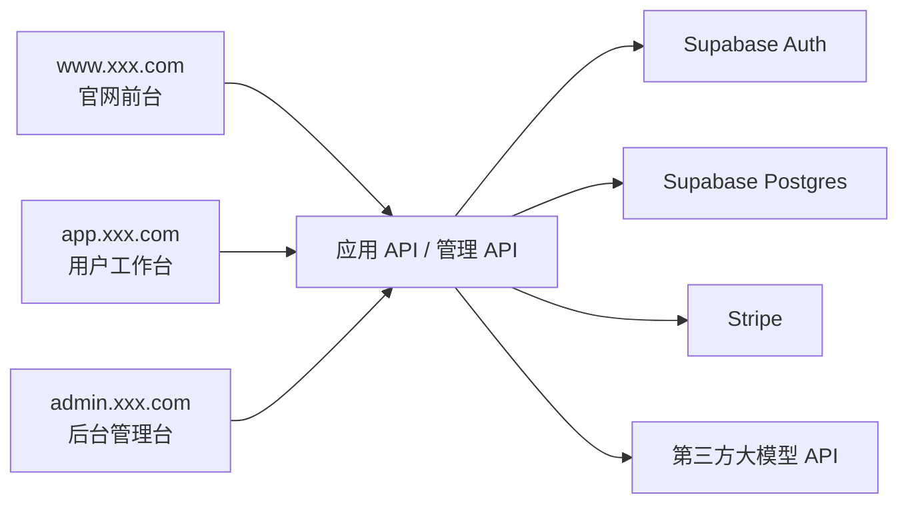
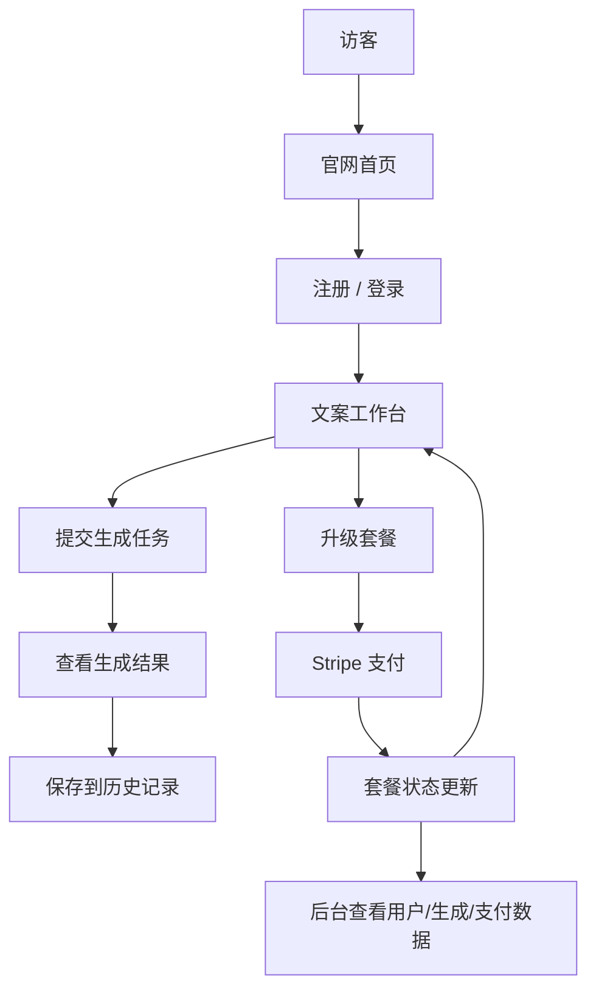

# PRD：AI 营销文案 SaaS 平台

状态：Draft v0.1  
目标：先明确产品边界、页面结构、数据模型与支付闭环，再进入开发。

## 1. 项目定位

这是一个面向独立开发者、小团队和内容运营者的 AI 营销文案 SaaS。它不是单次调用模型的 Demo，而是一套带登录、生成、历史、套餐、后台管理的完整产品。

一句话定义：
做一个支持注册登录、文案生成、历史管理、套餐付费和后台运营的 AI 营销文案工作台。

系统总览：



## 1.1 技术选型建议

- 前端框架：`Next.js App Router`
- 用户鉴权：`Supabase Auth`
- 数据库：`Supabase Postgres`
- 支付：`Stripe`
- AI 能力：统一后端适配层对接第三方大模型 API

站点入口约定：

- 官网前台：`www.xxx.com`
- 用户工作台：`app.xxx.com`
- 后台管理台：`admin.xxx.com`

## 1.2 竞品参考（官方）

- [Jasper](https://www.jasper.ai/)
- [Copy.ai](https://www.copy.ai/)

## 1.3 产品借鉴点

本项目的产品设计建议参考这些真实产品的做法：

- 借鉴 `Jasper` 的官网表达方式：强调营销团队场景、价值主张、平台能力和 CTA 转化
- 借鉴 `Jasper` 的工作台思路：让“生成”不是一个孤立按钮，而是一个带上下文和多种产出类型的工作空间
- 借鉴 `Copy.ai` 的产品形态：把不同输出场景拆成清晰工作流，而不是把所有功能堆在一个输入框里
- 因此本项目的首页、工作台、套餐页和后台运营页，都应该更像一个真实营销 SaaS，而不是单页工具

## 1.4 竞品页面拆解

建议重点参考的竞品页面结构：

- `Jasper` 官网首页
  - 重点看：Hero、品牌价值表达、工作流/Agent 介绍、演示 CTA、企业化信任背书
- `Jasper` 的 Agent / Workflow 类页面
  - 重点看：不是单纯展示一个文本框，而是强调“场景 -> 输入上下文 -> 输出结果”的完整工作流
- `Copy.ai` 的 Workflow / GTM 类页面
  - 重点看：不同营销任务如何拆成不同工作区和模板入口

因此本项目建议页面设计不是“一个输入框 + 一个结果框”，而是：

- 首页负责转化
- 工作台负责结构化输入与输出管理
- 历史页负责内容复用
- 套餐页负责商业化
- 后台负责运营视角

## 2. 目标用户与核心目标

目标用户：

- 想快速生成营销文案的独立开发者
- 需要批量产出广告、落地页、社媒文案的小团队
- 管理套餐、用户和生成记录的管理员

核心目标：

- 用户能在 5 分钟内注册并完成第一次文案生成
- 用户能查看历史生成结果并二次编辑
- 产品能完成从生成到支付升级的基本闭环

## 3. MVP 范围

第一版必须包含：

- 官网首页
- 注册/登录
- 文案生成工作台
- 历史记录页
- 套餐页
- 支付/订阅能力
- 后台查看用户、生成记录和支付数据

第一版不做：

- 团队协作
- 多语言翻译链路
- 复杂工作流编排
- 模板市场

## 4. 角色与权限

| 角色 | 权限 |
|------|------|
| 游客 | 浏览官网、注册登录 |
| 注册用户 | 生成文案、查看历史、管理套餐 |
| 管理员 | 查看用户、生成数据、支付和运营数据 |

## 5. 页面架构

当前 PRD 定义为 `3 套入口，10 个大页面`：

- 官网前台 `1` 个大页面
- 用户工作台 `5` 个大页面
- 后台管理台 `4` 个大页面

### 官网前台

#### 1. 官网首页 `www:/`

核心功能：

- Hero 与 CTA
- 场景介绍
- 输出示例
- 套餐预览
- FAQ

### 用户工作台

#### 2. 登录页 `app:/login`

核心功能：

- 邮箱密码登录
- 第三方登录
- 跳转注册

#### 3. 注册页 `app:/register`

核心功能：

- 新用户注册
- 同意条款
- 注册完成跳转工作台

#### 4. 生成工作台 `app:/generate`

核心功能：

- 输入产品信息、受众、渠道、卖点
- 选择输出类型和语气
- 发起生成
- 查看生成结果
- 保存和再次编辑

#### 5. 历史记录页 `app:/history`

核心功能：

- 查看历史文案
- 按时间/类型筛选
- 再次打开、复制、删除

#### 6. 套餐页 `app:/billing`

核心功能：

- 查看 Free / Pro / Team 套餐
- 月付/年付切换
- 发起支付
- 查看当前套餐权益

### 后台管理台

#### 7. 后台首页 `admin:/`

核心功能：

- 用户总数
- 生成次数
- 付费收入
- 转化概览

#### 8. 用户管理 `admin:/users`

核心功能：

- 查看用户列表
- 查看套餐状态
- 查看最近活跃
- 封禁/恢复

#### 9. 生成记录 `admin:/generations`

核心功能：

- 查看生成内容与次数
- 查看失败记录
- 查看高频模板和渠道分布

#### 10. 支付与订阅 `admin:/billing`

核心功能：

- 查看支付订单
- 查看订阅状态
- 查看退款与失败订单

## 5.1 关键用户链路



关键状态流：

- 游客 -> 注册用户
- 免费用户 -> 付费用户
- 生成中 -> 生成成功 / 生成失败
- 订单处理中 -> 支付成功 / 支付失败

## 6. 后端实现

后端模块：

- `auth`
- `generation`
- `history`
- `billing`
- `analytics`
- `admin`

建议数据表：

```sql
profiles (
  id uuid primary key,
  email text,
  role text,
  plan text,
  created_at timestamptz
)

generation_records (
  id uuid primary key,
  user_id uuid,
  input_payload jsonb,
  output_payload jsonb,
  channel text,
  tone text,
  status text,
  created_at timestamptz
)

billing_records (
  id uuid primary key,
  user_id uuid,
  plan_code text,
  billing_cycle text,
  amount_cents int,
  status text,
  created_at timestamptz
)
```

## 6.1 后台指标与监控

后台建议至少查看这些指标：

- 新增注册用户数
- 日活跃生成用户数
- 文案生成总次数
- 生成成功率 / 失败率
- 套餐转化率
- 付费收入与退款率
- 高峰时段生成请求量

基础监控建议：

- 模型调用成功率
- 接口平均耗时
- 支付回调成功率
- 数据库连接与慢查询
- 关键任务错误日志

## 7. 功能清单

必须完成：

- 官网价值展示
- 注册/登录
- 结构化文案输入
- 文案生成结果展示
- 历史记录管理
- 套餐与支付
- 后台用户与生成数据查看

可选增强：

- 文案模板库
- 不同语气/渠道预设
- 结果二次编辑
- 复制和导出
- 团队共享工作区

## 8. 接口草案

| 方法 | 路径 | 说明 |
|------|------|------|
| `POST` | `/api/auth/register` | 注册 |
| `POST` | `/api/auth/login` | 登录 |
| `POST` | `/api/generations` | 创建文案生成任务 |
| `GET` | `/api/generations/:id` | 获取生成结果 |
| `GET` | `/api/history` | 获取历史记录 |
| `DELETE` | `/api/history/:id` | 删除历史记录 |
| `GET` | `/api/billing/plans` | 获取套餐 |
| `POST` | `/api/billing/checkout` | 创建支付会话 |
| `GET` | `/api/admin/overview` | 获取后台总览 |
| `GET` | `/api/admin/users` | 获取用户列表 |
| `GET` | `/api/admin/generations` | 获取生成记录列表 |

## 9. 非功能要求

- 生成过程要有清晰加载和失败反馈
- 用户历史记录只能自己可见
- 支付状态和套餐状态要一致
- 后台能按日查看生成量和付费数据
- 首页和工作台都需要移动端可用

## 10. 开发顺序建议

1. 搭官网和登录注册页
2. 实现生成工作台
3. 接入鉴权和数据库
4. 接入模型生成接口
5. 实现历史记录
6. 接入支付与套餐
7. 实现后台运营页

## 11. 待确认项

- 是否默认只做单次生成，不做批量生成
- 支付是先做月付，还是月付和年付都做
- 是否需要在第一版加入模板库
