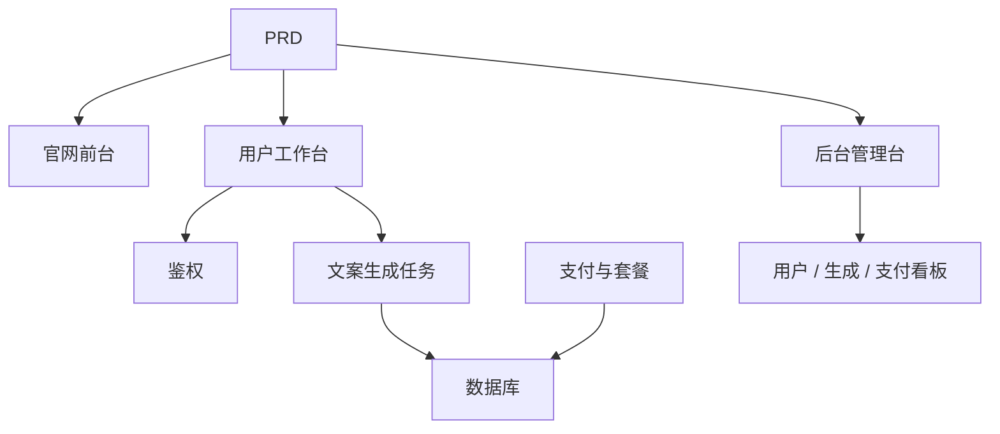

# AI 营销文案 SaaS 开发实战

这个项目不再只是“写一个生成按钮”，而是围绕一份真实 PRD，把一个 AI 营销文案 SaaS 从想法推进到可上线产品。

你会同时看到三件事：

- 项目要做成什么
- 如何基于 PRD 拆解并推进开发
- 最后应该交付出什么样的效果

::: tip PRD 入口
本项目的需求文档在 GitHub： [查看 PRD](https://github.com/datawhalechina/easy-vibe/blob/main/docs/zh-cn/stage-2/assignments/copywriting-platform-supabase/PRD.md)
:::

<div style="margin: 32px 0;">
  <ClientOnly>
    <StepBar :active="0" :items="[
      { title: '看 PRD', description: '先明确页面、功能、鉴权、数据库、支付与后台范围' },
      { title: '生成骨架', description: '让 AI 先产出官网、工作台、后台三套界面骨架' },
      { title: '监工迭代', description: '逐页验收、补接口、修权限、补支付与数据链路' },
      { title: '交付上线', description: '完成可演示、可运行、可继续开发的 SaaS 原型' }
    ]" />
  </ClientOnly>
</div>

## 这个项目到底在做什么？

这是一个面向独立开发者和内容团队的 AI 营销文案 SaaS：

- 官网前台：负责产品介绍、定价、FAQ、注册转化
- 用户工作台：负责输入产品信息、生成文案、查看历史、升级套餐
- 后台管理台：负责用户、生成记录、支付数据和运营概览

后端需要接住这些关键能力：

- 用户鉴权
- 文案生成任务
- 历史记录持久化
- Stripe 支付
- 后台用户和生成数据管理

## 开发过程怎么走？

### 1. 先看 PRD，不要上来就写代码

先确认：

- 有几个入口：`www / app / admin`
- 页面清单是否完整
- 后端模块和数据表是否合理
- 套餐、支付和后台范围是否收住

如果 PRD 没拍板，就先不要写代码。

### 2. 先让 AI 生成“骨架版”

第一轮目标不是做完整闭环，而是先生成：

- 官网首页
- 登录注册
- 文案生成工作台
- 历史记录页
- 套餐页
- 后台首页与管理页骨架

这一步要先把页面结构、路由和信息架构搭出来。

### 3. 再进入“监工模式”

你需要重点盯这几件事：

- 页面结构是不是和 PRD 一致
- 登录态和匿名态有没有分清
- 生成结果有没有稳定落库
- 支付之后套餐状态有没有更新
- 后台是不是能看到真实用户、生成和支付数据

可以把 AI 当执行者，但你自己要做项目经理和验收人。

### 4. 最后做联调和上线



只要这条链路能跑通，这个项目就不是单点 Demo，而是一个完整 SaaS 原型。

## 怎么让 AI 帮你生成？

推荐按模块逐步下指令，而不是一句“帮我做完”。

```text
请基于当前 PRD，帮我生成一个 AI 营销文案 SaaS 的前端骨架。

要求：
1. 分成三个入口：www、app、admin
2. 官网包括：首页、定价、FAQ
3. app 包括：登录、注册、生成工作台、历史记录、套餐页
4. admin 包括：后台首页、用户管理、生成记录、支付订单
5. 先只生成页面结构和假数据，不接真实接口
6. 风格要像现代 SaaS，不像课堂 demo
```

然后再一块一块补：

- 鉴权
- 生成接口
- 数据库
- 支付
- 后台管理

## 怎么“监工”才有效？

每做完一个模块，至少检查这 5 件事：

| 检查项 | 要看什么 |
|------|------|
| 页面是否对 | 页面数量、入口、功能是否符合 PRD |
| 接口是否对 | 输入参数、返回结构、状态处理是否合理 |
| 权限是否对 | 游客、用户、管理员是否隔离 |
| 数据是否对 | 生成、历史、支付和套餐状态是否一致 |
| 演示是否对 | 是否真的能完整跑通注册、生成、升级这条链路 |

## 最后的预期效果

做完后，你应该拿到这些交付物：

- 一套可运行的 AI 文案 SaaS 项目
- 一份同级 PRD 文档
- 三套入口：`www / app / admin`
- 基础鉴权、生成、历史、支付、后台管理
- 一份 README
- 一个可以演示的线上版本或本地完整运行方案

## 验收标准

| 维度 | 最低达标 |
|------|------|
| PRD 对齐 | 页面、功能、数据结构基本符合 PRD |
| 产品闭环 | 注册、生成、历史、支付升级可以跑通 |
| 后台能力 | 用户、生成、支付数据可以查看 |
| 工程完整度 | 前端、后端、数据库、支付链路已接通 |
| 展示能力 | 可以清楚演示“从 PRD 到成品”的过程 |

::: tip 🚀 完成后你会得到什么？
你得到的不只是一个生成页面，而是一套完整的 AI SaaS 开发过程样例。后面再做别的产品型项目，也可以继续沿用这套“先 PRD、再生成、再监工、再联调上线”的方法。
:::

第一版页面完成后，继续补充：

```text
请继续完善 /dashboard 页面。

这是一个 AI 营销文案工作台。

左侧表单字段：
- 产品名
- 一句话介绍
- 目标用户
- 3 个卖点
- 投放渠道（官网、朋友圈、小红书、抖音、邮件）

右侧结果区域预留：
- 主标题
- 副标题
- CTA
- 3 版短文案
- 长文案

先用 mock 数据跑通交互。

要求：
- 点击"生成文案"后有 loading 状态
- 结果区域设计空状态
- 响应式布局，宽屏窄屏都能正常显示
```

### 遇到阻碍？

回头看看这几篇：

- [构建第一个现代应用程序 - UI 设计](../../frontend/2.2-ui-design/)
- [参考 UI 设计规范设计页面和按钮](../../frontend/2.3-multi-product-ui/)
- [用 LLM 和 Skills 让界面变好看](../../frontend/2.4-llm-skills-beautiful/)
- [从设计原型到项目代码](../../frontend/2.6-design-to-code/)
- [使用现代组件库更新你的界面](../../frontend/2.7-modern-component-library/)

<div style="margin: 32px 0;">
  <ClientOnly>
    <StepBar :active="2" :items="[
      { title: '定主题', description: '先把网站的页面和功能定下来' },
      { title: '搭前台', description: '首页、登录、工作台先做出来' },
      { title: '接后端', description: '数据库、生成、支付接起来' },
      { title: '做后台与交付', description: '管理台、部署、演示材料补齐' }
    ]" />
  </ClientOnly>
</div>

## 3. 接后端：把数据库、生成、支付串起来

这一步才算真正的"全栈"。

### 第三步：接入 Supabase 登录

```text
请把我当成 0 基础，一步一步带我完成 Supabase 登录接入。

需要你帮我完成：
1. 项目接入 Supabase
2. 实现注册、登录、退出功能
3. 登录成功后跳转到 /dashboard
4. 未登录用户访问 /dashboard、/billing、/admin 时自动跳转 /login
5. 创建 profiles 表
6. 用户注册成功后自动在 profiles 表创建记录
7. profiles 表包含 email、role、plan 字段

实现要求：
- 每步都说明在修改哪些文件
- 密钥不要硬编码
- 需要在 Supabase 后台手动操作的地方请明确标注
- 完成后说明如何验证注册和登录
```

### 第四步：接入生成接口和数据库

```text
请把我当成 0 基础，帮我完成网站的核心功能：生成营销文案并保存。

目标效果：
1. 用户在 /dashboard 填写表单，点击"生成文案"
2. 后端接收：产品名、介绍、目标用户、卖点、投放渠道
3. 后端调用模型生成结果
4. 页面展示生成结果
5. 输入和输出都保存到数据库
6. 用户下次进入可查看历史记录

需要你完成：
- 创建生成接口 /api/generate
- 创建 generations 表
- 设计输入和输出字段
- Dashboard 页面读取当前用户的历史记录

用户体验：
- 按钮 loading 状态
- 生成失败时的错误提示
- 无历史记录时的空状态

完成后请说明：
- 前端页面文件位置
- 后端接口文件位置
- 数据写入数据库的逻辑位置
- 如何测试完整生成链路
```

### 第五步：接入 Stripe 付费

```text
请把我当成 0 基础，帮我给 LaunchKit 加上最简可用的 Stripe 付费。

不需要复杂系统，先跑通最基本的付费链路。

需要你完成：
1. /billing 页面展示 free 和 pro 两个套餐
2. 用户点击升级后跳转 Stripe Checkout
3. 支付成功后返回网站
4. 支付结果保存到 subscriptions 表
5. 同步更新 profile.plan 字段
6. free 用户每日限 3 次生成，pro 用户不限

实现原则：
- 先跑通主流程，暂不考虑复杂边界
- 需要在 Stripe 后台配置的地方请写清楚
- 完成后说明如何测试完整支付流程
```

### 第六步：搭建管理后台

```text
请把我当成 0 基础，帮我做一个简洁可用的管理后台。

仅限管理员访问。

需要你完成：
1. 仅 role = admin 的用户可访问 /admin
2. 后台包含 3 个 Tab：
   - 用户列表
   - 生成记录
   - 订阅状态
3. 用户列表显示：email、plan、创建时间
4. 生成记录显示：用户、产品名、渠道、创建时间
5. 订阅状态显示：用户、套餐、支付状态

要求：
- 界面简洁清晰
- 使用现有组件库的表格、Tab、Badge
- 完成后说明如何将账号设为 admin
```

### 遇到阻碍？

回头看看这几篇：

- [从数据库到 Supabase](../../backend/2.2-database-supabase/)
- [大模型辅助编写接口代码与接口文档](../../backend/2.3-ai-interface-code/)
- [如何集成 Stripe 等收费系统](../../backend/2.7-stripe-payment/)

<div style="margin: 32px 0;">
  <ClientOnly>
    <StepBar :active="3" :items="[
      { title: '定主题', description: '先把网站的页面和功能定下来' },
      { title: '搭前台', description: '首页、登录、工作台先做出来' },
      { title: '接后端', description: '数据库、生成、支付接起来' },
      { title: '做后台与交付', description: '管理台、部署、演示材料补齐' }
    ]" />
  </ClientOnly>
</div>

## 4. 做后台与交付：真正上线

网站基本成型，最后三件事：

### 4.1 部署

代码推送到 GitHub，部署到公网。

参考：

- [Git 和 GitHub 工作流](../../backend/2.4-git-workflow/)
- [如何部署 Web 应用](../../backend/2.5-zeabur-deployment/)

### 第七步：部署前检查

```text
请把我当成 0 基础，帮我检查项目是否具备部署条件。

检查重点：
- 环境变量是否完整
- 登录回调地址是否正确
- Stripe 支付回调地址是否正确
- 页面是否缺少 loading、空状态、错误提示
- README 是否包含启动说明和部署说明

需要你：
1. 按优先级列出待修复事项
2. 标注哪些必须先修
3. 说明修复后的部署步骤
```

### 4.2 README

至少包含：
- 项目简介
- 核心页面说明
- 技术栈
- 本地启动步骤
- 环境变量清单

### 4.3 演示材料

至少准备：
- 首页截图
- Dashboard 生成截图
- Billing 页面截图
- Admin 后台截图
- 60 秒左右演示视频

## 验收标准

如果你想判断这个作业到底算不算“完成”，不要只看页面有没有写完，而要看下面这几个维度是不是都达标：

| 维度 | 最低达标 | 加分项 |
|------|------|------|
| 产品完整度 | 首页、登录、Dashboard、Billing、Admin 都能访问 | 首页文案和视觉风格明显像真实 SaaS |
| 业务闭环 | 用户可以注册、登录、生成并查看历史 | 免费 / Pro 权限差异清晰可见 |
| 数据正确性 | 生成结果和支付状态都会写入数据库 | 有明确的错误提示、空状态和 Loading |
| 权限与安全 | 未登录不能访问受保护页面，普通用户不能进 Admin | 有基本的输入校验和服务端鉴权 |
| 工程交付 | 项目可本地启动，也可部署到公网 | README 清楚，演示视频结构完整 |

如果你现在还觉得任务太大，就记住一个标准：**优先保证“能跑通”，再去追求“做漂亮”。**

## 5. 最终成果

按这篇指南做完，你拿到的不是"练习页"，而是一个**最小但完整的 SaaS 产品**：

- ✅ 现代组件库前端
- ✅ Supabase 数据库与登录
- ✅ 真实 AI 生成功能
- ✅ Stripe 支付系统
- ✅ 管理员后台
- ✅ 可部署上线

这完全够资格作为**第一个全栈作品**。

## 6. 提交前最后检查

<el-card shadow="hover" style="margin: 20px 0; border-radius: 12px;">
  <template #header>
    <div style="font-weight: bold; font-size: 16px;">提交前最后看一眼</div>
  </template>

  <ul style="list-style-type: none; padding-left: 0;">
    <li><label><input type="checkbox" disabled /> 首页、登录页、Dashboard、Billing、Admin 均已完成</label></li>
    <li><label><input type="checkbox" disabled /> 用户可以注册、登录、退出</label></li>
    <li><label><input type="checkbox" disabled /> 生成结果真实写入数据库</label></li>
    <li><label><input type="checkbox" disabled /> 支付主流程已跑通</label></li>
    <li><label><input type="checkbox" disabled /> 管理员可查看用户、生成记录和支付状态</label></li>
    <li><label><input type="checkbox" disabled /> 项目已部署到公网</label></li>
  </ul>
</el-card>

::: tip 🚀 下一篇
完成这个网站后，继续阅读 [使用现代组件库更新你的界面](../../frontend/2.7-modern-component-library/)，把产品界面的完成度再提升一层。
:::
