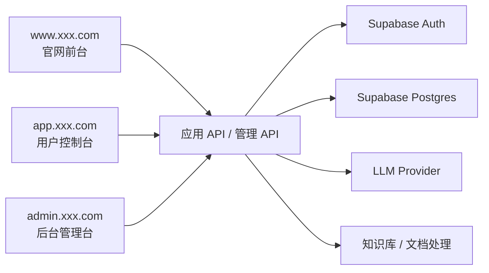
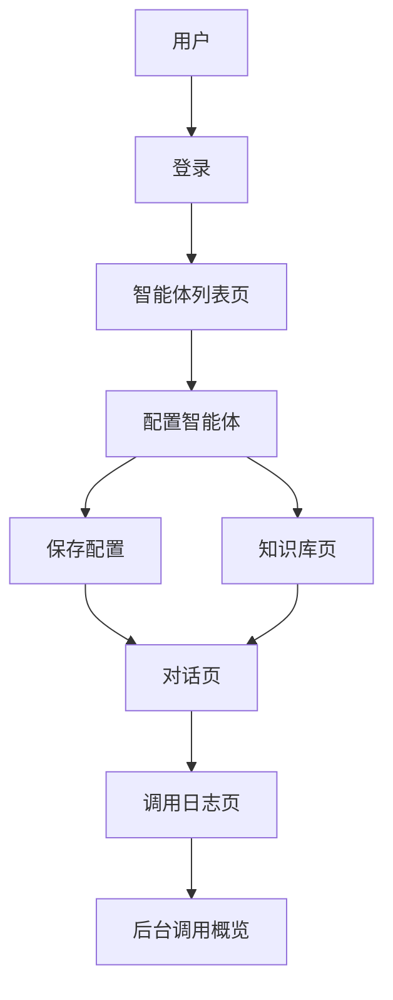

# PRD：类 Dify 智能体编排平台

状态：Draft v0.1  
目标：先把平台的 MVP 产品定义和实现边界写清楚，待 review 后再开发。

## 1. 项目定位

这是一个模仿 Dify 核心体验的精简版智能体平台，重点不是复刻全部能力，而是跑通下面这条主链路：

- 创建智能体
- 配置 Prompt 与模型参数
- 发起对话
- 查看调用日志
- 可选接入知识库

一句话定义：
做一个类 Dify 的最小可用智能体编排平台。

系统总览：



## 1.0 技术选型建议

- 前端框架：`Next.js App Router`
- 用户鉴权：`Supabase Auth`
- 数据库：`Supabase Postgres`
- 文件存储：`Supabase Storage`
- 模型层：统一后端适配层对接第三方 LLM

站点入口约定：

- 官网前台：`www.xxx.com`
- 用户控制台：`app.xxx.com`
- 后台管理台：`admin.xxx.com`

## 1.1 竞品参考（官方）

- [Dify](https://dify.ai/)
- [Dify Docs](https://docs.dify.ai/)

## 1.2 产品借鉴点

本项目的产品设计建议参考 Dify 的真实产品形态：

- 智能体管理、知识库、对话、日志应该是清晰分区，而不是混在一个页面里
- 配置页应该突出 Prompt、模型、参数和发布状态，而不是只给一个表单
- 对话页应该强调“当前正在使用哪个 agent”和“当前会话属于哪个 agent”
- 日志页应该能快速定位失败调用、耗时、token 消耗和错误原因
- 整体设计应更像 AI 平台控制台，而不是普通聊天网站

## 1.3 竞品页面拆解

建议重点参考的竞品页面结构：

- `Dify` 控制台首页
  - 重点看：应用列表、创建入口、最近活动、平台感导航
- `Dify` 应用配置页
  - 重点看：Prompt、模型、参数、发布状态的组织方式
- `Dify` 知识库页
  - 重点看：文档上传、状态、处理结果的管理方式
- `Dify` 调试 / 预览页
  - 重点看：左侧配置、右侧运行结果的双栏思路

因此本项目的页面建议应更像平台控制台：

- 智能体列表页像应用市场/应用管理
- 配置页像控制台配置中心
- 对话页像调试与预览台
- 日志页像开发者运维页

## 2. 目标用户与核心目标

目标用户：

- 想快速配置并测试多个智能体的开发者
- 想搭建内部知识助手的学生或独立开发者
- 需要查看模型调用记录的管理员

核心目标：

- 用户 5 分钟内创建第一个智能体
- 用户能在同一个平台里完成配置与对话
- 平台可以追踪每次调用的输入、输出、耗时与状态

## 3. MVP 范围

第一版必须包含：

- 注册/登录
- 智能体 CRUD
- 对话页
- 会话历史
- 调用日志页
- 可选知识库：仅支持文本文件上传与基础检索

第一版不做：

- 复杂工作流节点编排 UI
- 多租户企业权限体系
- 工具调用沙箱
- 支付与计费
- 多模型路由策略

## 4. 角色与权限

| 角色 | 权限 |
|------|------|
| 普通用户 | 管理自己的智能体、发起对话、看自己的日志 |
| 管理员 | 查看全平台用户和调用概览 |

## 5. 前端实现

## 5.1 页面架构总览

当前 PRD 定义为 `3 套入口，10 个大页面`：

- 官网前台 `1` 个大页面
- 用户控制台 `7` 个大页面
- 后台管理台 `2` 个大页面

### A. 官网前台 `www.xxx.com`

#### 1. 官网首页 `www:/`

核心功能：

- 产品介绍
- 能力说明
- 使用场景
- 注册/登录 CTA

### B. 用户控制台 `app.xxx.com`

#### 2. 登录页 `app:/login`

核心功能：

- 登录
- 注册入口
- 第三方登录

#### 3. 智能体列表页 `app:/agents`

核心功能：

- 查看所有智能体
- 新建智能体
- 编辑入口
- 状态筛选

#### 4. 智能体配置页 `app:/agents/:id`

核心功能：

- 配置名称和描述
- 配置 Prompt、模型、参数
- 启停和发布状态

#### 5. 对话页 `app:/chat`

核心功能：

- 选择智能体
- 新建会话
- 聊天消息展示
- 问答发送与结果展示

#### 6. 会话详情页 `app:/chat/:id`

核心功能：

- 查看完整消息历史
- 重命名会话
- 继续提问

#### 7. 知识库页 `app:/knowledge`

核心功能：

- 上传文档
- 查看处理状态
- 关联到智能体

#### 8. 日志页 `app:/logs`

核心功能：

- 查看调用日志
- 按状态/模型筛选
- 查看错误详情

### C. 后台管理台 `admin.xxx.com`

#### 9. 后台首页 `admin:/`

核心功能：

- 用户数
- 调用次数
- 失败率
- 平台资源概览

#### 10. 用户与调用概览页 `admin:/usage`

核心功能：

- 查看用户使用情况
- 查看模型调用消耗
- 查看异常用户和高成本调用

## 5.2 关键用户链路



关键状态流：

- 智能体：草稿 -> 已配置 -> 可用 / 停用
- 会话：新建 -> 进行中 -> 归档
- 文档：上传中 -> 处理中 -> 可检索 / 失败
- 调用：成功 / 错误 / 超时

推荐技术栈：

- Next.js App Router
- TypeScript
- Tailwind CSS
- shadcn/ui

建议页面：

| 页面 | 路径 | 说明 |
|------|------|------|
| 登录页 | `/login` | 登录与注册 |
| 智能体列表 | `/agents` | 查看和管理智能体 |
| 智能体配置页 | `/agents/:id` | 编辑名称、Prompt、模型、温度等 |
| 对话页 | `/chat` | 左侧会话列表，右侧消息区 |
| 知识库页 | `/knowledge` | 上传资料、查看文档状态 |
| 日志页 | `/logs` | 查看模型调用日志 |
| 管理后台 | `/admin` | 用户数、调用数、失败数概览 |

前端核心组件：

- 智能体卡片列表
- Agent 配置表单
- 对话消息列表
- Prompt 调试面板
- 日志筛选表格
- 文件上传组件

## 6. 后端实现

推荐技术栈：

- Node.js + NestJS 或 Express
- PostgreSQL / Supabase
- OpenAI 兼容接口

后端模块：

- `auth`
- `agents`
- `chat`
- `knowledge`
- `logs`
- `admin`

建议数据表：

```sql
profiles (
  id uuid primary key,
  email text,
  role text,
  created_at timestamptz
)

agents (
  id uuid primary key,
  user_id uuid,
  name text,
  description text,
  system_prompt text,
  model text,
  temperature numeric,
  status text,
  created_at timestamptz
)

chat_sessions (
  id uuid primary key,
  user_id uuid,
  agent_id uuid,
  title text,
  created_at timestamptz
)

chat_messages (
  id uuid primary key,
  session_id uuid,
  role text,
  content text,
  token_usage int,
  created_at timestamptz
)

knowledge_documents (
  id uuid primary key,
  user_id uuid,
  agent_id uuid,
  filename text,
  status text,
  chunk_count int,
  created_at timestamptz
)

run_logs (
  id uuid primary key,
  user_id uuid,
  agent_id uuid,
  session_id uuid,
  model text,
  latency_ms int,
  prompt_tokens int,
  completion_tokens int,
  status text,
  error_message text,
  created_at timestamptz
)
```

## 6.1 后台指标与监控

后台建议至少查看这些指标：

- 智能体总数
- 活跃用户数
- 日调用次数
- 平均响应耗时
- 模型调用失败率
- 知识库文档处理成功率
- 高消耗用户与高成本智能体

基础监控建议：

- `/api/chat` 平均耗时与错误率
- 模型供应商调用成功率
- 知识库文档处理队列状态
- 数据库连接和日志写入健康状态

## 7. 功能清单

必须完成：

- 用户鉴权
- 创建/编辑/删除智能体
- 选择智能体发起会话
- 会话消息持久化
- 调用日志记录

第二优先级：

- 文档上传
- 基础检索增强
- 平台概览统计

## 8. 接口草案

| 方法 | 路径 | 说明 |
|------|------|------|
| `POST` | `/api/auth/register` | 注册 |
| `POST` | `/api/auth/login` | 登录 |
| `GET` | `/api/agents` | 获取当前用户的智能体列表 |
| `POST` | `/api/agents` | 创建智能体 |
| `PATCH` | `/api/agents/:id` | 更新智能体配置 |
| `DELETE` | `/api/agents/:id` | 删除智能体 |
| `POST` | `/api/chat/sessions` | 创建新会话 |
| `POST` | `/api/chat/sessions/:id/messages` | 向某个会话发送消息 |
| `GET` | `/api/chat/sessions/:id/messages` | 获取会话消息 |
| `POST` | `/api/knowledge/documents` | 上传知识库文档 |
| `GET` | `/api/logs` | 获取调用日志 |
| `GET` | `/api/admin/overview` | 平台总览 |

`POST /api/chat/sessions/:id/messages` 请求示例：

```json
{
  "agentId": "agent_123",
  "message": "帮我总结一下这个功能的定位"
}
```

## 9. 关键业务规则

- 用户只能访问自己的智能体和会话
- 删除智能体前需要检查是否有活跃会话
- 日志中必须记录失败原因
- 知识库文档处理失败要可见

## 10. 非功能要求

- 用户只能访问自己的智能体、文档和会话
- 调用日志需要可追踪、可筛选
- 文档处理状态要有明确反馈
- 对话页在移动端至少可查看
- 智能体配置修改后要有变更提示

## 11. 开发顺序建议

1. 登录与基础鉴权
2. 智能体 CRUD
3. 对话页和会话存储
4. 日志记录
5. 文档上传与基础检索
6. 管理后台概览

## 12. 待确认项

- 第一版是否必须带知识库
- 模型供应商先只接 1 家还是预留多家
- 平台是否需要 Workspace 概念
- 日志是否保留完整 prompt 快照
