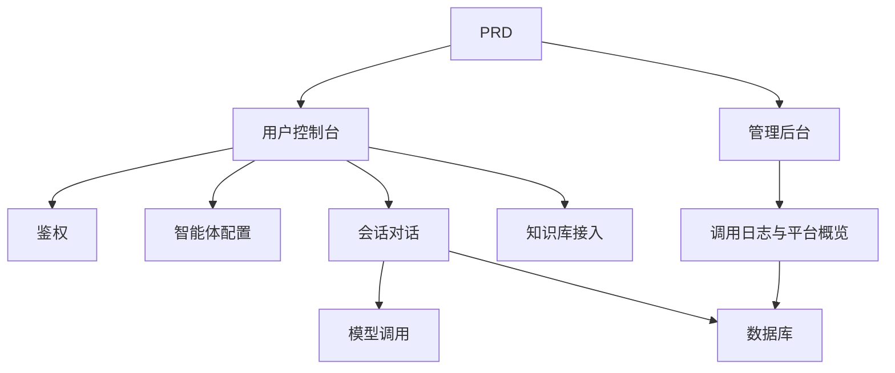

# 类 Dify 智能体平台开发实战

这个项目不是“再配一个聊天页”，而是围绕一份真实 PRD，把一个类 Dify 智能体平台从想法推进到可上线产品。

你会同时看到三件事：

- 项目要做成什么
- 如何基于 PRD 拆解并推进开发
- 最后应该交付出什么样的效果

::: tip PRD 入口
本项目的需求文档在 GitHub： [查看 PRD](https://github.com/datawhalechina/easy-vibe/blob/main/docs/zh-cn/stage-2/assignments/custom-dify-agent-platform/PRD.md)
:::

<div style="margin: 32px 0;">
  <ClientOnly>
    <StepBar :active="0" :items="[
      { title: '看 PRD', description: '先明确页面、能力边界、鉴权、数据库和日志范围' },
      { title: '生成骨架', description: '让 AI 先产出官网、控制台、后台三套界面骨架' },
      { title: '监工迭代', description: '逐页验收、补接口、修权限、补知识库和日志链路' },
      { title: '交付上线', description: '完成可演示、可运行、可继续开发的平台原型' }
    ]" />
  </ClientOnly>
</div>

## 这个项目到底在做什么？

这是一个模仿 Dify 核心体验的智能体平台：

- 用户控制台：创建智能体、配置 Prompt、发起对话、查看日志
- 平台后端：管理智能体、会话、消息、知识库和模型调用
- 管理后台：查看用户和平台资源使用情况

## 开发过程怎么走？

### 1. 先看 PRD，不要上来就写代码

先确认：

- 智能体、会话、日志、知识库哪些要进 MVP
- 页面和路由清单是否拍板
- 模型调用和日志记录边界是否清楚
- 多租户和复杂工作流是不是先不做

### 2. 先让 AI 生成“骨架版”

第一轮先生成：

- 登录页
- 智能体列表页
- 智能体配置页
- 对话页
- 日志页
- 知识库页
- 管理后台首页

### 3. 再进入“监工模式”

你要重点盯这几件事：

- 智能体是不是能被正确创建和编辑
- 对话是不是使用了正确的 agent 配置
- 会话和消息有没有稳定落库
- 日志是不是记录了耗时、token、错误
- 知识库和模型调用有没有串权限

### 4. 最后做联调和上线



## 怎么让 AI 帮你生成？

```text
请基于当前 PRD，帮我生成一个类 Dify 智能体平台的前端骨架。

要求：
1. 用户侧包括：登录、智能体列表、智能体配置、对话页、日志页、知识库页
2. 后台侧包括：后台首页、用户概览、资源使用概览
3. 先只生成页面结构和假数据，不接真实接口
4. 风格要像现代 AI 平台
```

## 怎么“监工”才有效？

| 检查项 | 要看什么 |
|------|------|
| 页面是否对 | 页面数量、功能是否符合 PRD |
| 接口是否对 | agents、chat、logs、knowledge 是否闭环 |
| 权限是否对 | 用户是否只能管理自己的 agent 和会话 |
| 数据是否对 | messages、logs、documents 是否一致 |
| 演示是否对 | 是否能演示“创建 agent -> 对话 -> 查看日志”完整链路 |

## 最后的预期效果

- 一套可运行的类 Dify 平台
- 一份同级 PRD 文档
- 用户侧控制台 + 管理后台
- 智能体、对话、日志、知识库基础能力
- README 和演示方案

## 验收标准

| 维度 | 最低达标 |
|------|------|
| PRD 对齐 | 页面、功能、数据结构基本符合 PRD |
| 产品闭环 | 创建 agent、发起对话、查看日志可以跑通 |
| 后台能力 | 用户与平台使用概览可查看 |
| 工程完整度 | 前端、后端、数据库、模型调用链路已接通 |
| 展示能力 | 可以清楚演示“从 PRD 到成品”的过程 |

::: tip 🚀 完成后你会得到什么？
你得到的不只是一个聊天页，而是一套 AI 平台型产品的开发样例。后面做知识助手、企业 Agent、AI 控制台时，都可以继续复用这套方法。
:::
4. 调用 LLM 前拼接系统提示词和最近 10 条上下文
5. 返回 assistant 内容并写入消息表
6. 无论成功失败都写一条 llm_logs

请给出：
- 路由层代码
- service 层代码
- 错误处理策略
- 如何本地测试
```

### 第四步：可选接入知识库（加分项）

你可以给每个智能体增加一个“知识库开关”：

- 开启后先检索知识片段，再和用户问题一起发送给模型
- 关闭后按普通对话模式响应

第一版不必追求复杂 RAG，只要有“检索结果可见、调用链路可解释”即可。

## 4. 上线与交付：把平台做成可演示产品

### 部署前检查

- 所有核心接口都做了登录校验
- 智能体归属权限检查通过
- 会话记录、日志记录真实落库
- 模型 Key 使用环境变量，不硬编码
- 错误提示可在前端看到，不只打控制台

### 交付物

- 可访问演示链接
- 源码仓库链接
- 智能体管理页截图
- 对话页截图
- 日志页截图
- 60 秒演示视频（创建智能体 -> 对话 -> 查看日志）
- README（架构、运行、环境变量、接口说明）

## 验收标准

| 维度 | 最低达标 | 加分项 |
|------|------|------|
| 平台完整度 | `agents/chat/logs` 三页可用 | 有清晰导航与统一设计语言 |
| 业务闭环 | 可创建智能体并真实对话 | 支持多智能体切换与历史会话 |
| 数据与追踪 | 消息与调用日志可查询 | 有 token/耗时统计看板 |
| 权限安全 | 仅登录用户可访问核心接口 | 资源归属校验完善 |
| 工程交付 | 可部署、可演示、README 清晰 | 接入知识库并可解释检索结果 |

## 提交前最后检查

<el-card shadow="hover" style="margin: 20px 0; border-radius: 12px;">
  <template #header>
    <div style="font-weight: bold; font-size: 16px;">提交前最后看一眼</div>
  </template>

  <ul style="list-style-type: none; padding-left: 0;">
    <li><label><input type="checkbox" disabled /> 登录后可访问智能体管理、对话、日志页面</label></li>
    <li><label><input type="checkbox" disabled /> 至少可以创建 1 个智能体并成功对话</label></li>
    <li><label><input type="checkbox" disabled /> 每轮问答都能在数据库查到记录</label></li>
    <li><label><input type="checkbox" disabled /> 调用失败时前端可见错误信息且日志已记录</label></li>
    <li><label><input type="checkbox" disabled /> 项目已部署，README 和演示视频齐全</label></li>
  </ul>
</el-card>

::: tip 🚀 完成后你会得到什么？
你将获得一个真正有平台感的 AI 项目，而不只是单点功能 Demo。这会显著提升你在“AI 产品工程化”方向的说服力。
:::
