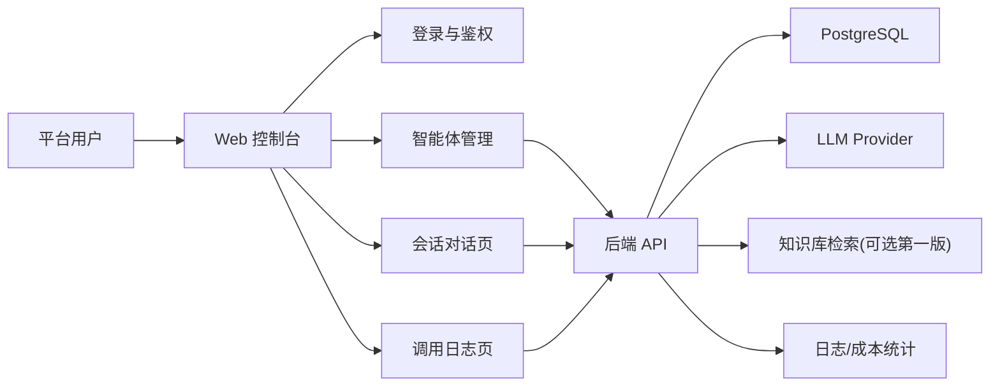
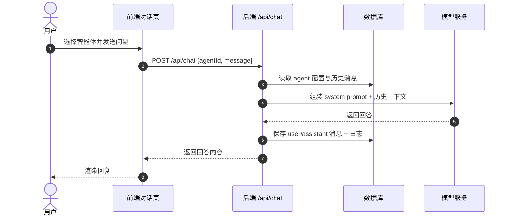

# 自制 Dify 智能体平台

如果你已经会用 Dify，下一步最值得挑战的不是“再配一个工作流”，而是自己做一个“类 Dify 平台”。

这个大作业会带你完成一个简化但完整的智能体平台：支持创建智能体、配置 Prompt、接知识库、发起对话、查看日志和调用统计。

::: tip 🎯 这次做什么？
打造一个 **最小可用的智能体平台（Mini Dify）**。平台至少包含：智能体管理、会话问答、知识库接入（可选第一版简化）、调用记录与基础权限控制。目标是让用户能“创建一个智能体并真实对话”。
:::

<div style="margin: 32px 0;">
  <ClientOnly>
    <StepBar :active="0" :items="[
      { title: '定能力边界', description: '先明确第一版做什么，不做什么' },
      { title: '搭平台骨架', description: '完成前后端结构、鉴权与数据库设计' },
      { title: '接智能体链路', description: '跑通创建智能体到对话返回的主流程' },
      { title: '上线交付', description: '补日志、文档、部署与演示材料' }
    ]" />
  </ClientOnly>
</div>

## 为什么这个题目值得做？

因为它几乎覆盖了 AI 应用工程化的核心能力：

- 从“调用一个模型”升级到“管理多个智能体”
- 从“单页 Demo”升级到“有后台、有数据、有权限的平台”
- 从“能回答”升级到“可配置、可追踪、可维护”

如果你未来想做 Agent 产品、企业知识助手或 AI SaaS，这个项目会是非常有含金量的一次训练。

## 先看全景：平台核心模块



核心目标只有一个：用户能在后台创建智能体，然后在对话页选择该智能体并得到可追踪的回答。

## 1. 定能力边界：第一版先收住

### MVP 范围（建议）

- 用户注册/登录
- 智能体 CRUD（创建、编辑、启停、删除）
- 每个智能体可配置：名称、系统提示词、模型、温度
- 对话页可选择智能体进行聊天
- 记录每轮会话和调用日志

### 第一版暂不做

- 多租户复杂权限
- 复杂工作流编排器
- 工具调用沙箱
- 向量数据库高级检索策略
- 计费系统与支付闭环

### 角色与页面规划

| 角色 | 页面 | 核心动作 |
|------|------|------|
| 普通用户 | `/agents` | 创建/编辑自己的智能体 |
| 普通用户 | `/chat` | 选择智能体并发起对话 |
| 普通用户 | `/logs` | 查看调用记录和错误信息 |
| 管理员（可选） | `/admin/users` | 查看用户与资源使用情况 |

### 数据模型建议

```sql
profiles (
  id uuid primary key,
  email text,
  role text,                 -- user / admin
  created_at timestamptz
)

agents (
  id uuid primary key,
  user_id uuid,
  name text,
  system_prompt text,
  model text,
  temperature numeric,
  status text,               -- active / inactive
  created_at timestamptz
)

conversations (
  id uuid primary key,
  user_id uuid,
  agent_id uuid,
  title text,
  created_at timestamptz
)

messages (
  id uuid primary key,
  conversation_id uuid,
  role text,                 -- user / assistant
  content text,
  token_usage int,
  created_at timestamptz
)

llm_logs (
  id uuid primary key,
  user_id uuid,
  agent_id uuid,
  model text,
  latency_ms int,
  prompt_tokens int,
  completion_tokens int,
  status text,               -- success / error
  error_message text,
  created_at timestamptz
)
```

## 2. 搭平台骨架：前后端先跑起来

### 推荐技术栈

- **Next.js App Router**（前端 + 部分 BFF）
- **TypeScript**
- **Tailwind CSS + shadcn/ui**
- **Node.js + Express/NestJS**（如你想分离后端）
- **PostgreSQL / Supabase**
- **OpenAI / 兼容 OpenAI 协议模型接口**

### 第一步：让 AI IDE 先搭骨架

```text
请帮我创建一个 Mini Dify 平台骨架（Next.js + TypeScript + Tailwind）。

页面要求：
1. /login 登录页
2. /agents 智能体管理页（列表 + 新建弹窗）
3. /chat 对话页（左侧会话列表 + 右侧聊天区）
4. /logs 调用日志页（表格 + 状态筛选）

后端要求：
- 提供 /api/agents、/api/chat、/api/logs 的基础接口
- 所有接口只允许登录用户访问

先用 mock 数据跑通页面交互，再补真实数据库。
```

### 第二步：补鉴权与数据库

你可以继续让 AI IDE 分步骤落地：

```text
请把我当成 0 基础，带我完成 Mini Dify 的鉴权和数据库接入。

目标：
1. 用户可以注册、登录、退出
2. 登录后才能访问 /agents、/chat、/logs
3. 创建 agents 表并实现新增/查询
4. 只有 agent 所有者可编辑自己的 agent

要求：
- 说明每步修改了哪些文件
- 明确需要在数据库后台操作的 SQL
- 完成后给我一份验证清单
```

## 3. 接智能体主链路：从“创建”到“回答”

### 智能体调用时序图



### 第三步：实现聊天接口（最小版本）

第一版聊天接口建议做到：

- 接收 `agentId` 和用户输入
- 根据 `agentId` 加载对应系统提示词
- 调用模型并返回结果
- 将问答落库到 `messages`
- 将耗时/状态写入 `llm_logs`

提示词示例：

```text
请帮我实现 /api/chat 接口。

业务规则：
1. 必须校验用户是否已登录
2. 必须校验 agent 属于当前用户
3. 请求体包含 agentId 和 message
4. 调用 LLM 前拼接系统提示词和最近 10 条上下文
5. 返回 assistant 内容并写入消息表
6. 无论成功失败都写一条 llm_logs

请给出：
- 路由层代码
- service 层代码
- 错误处理策略
- 如何本地测试
```

### 第四步：可选接入知识库（加分项）

你可以给每个智能体增加一个“知识库开关”：

- 开启后先检索知识片段，再和用户问题一起发送给模型
- 关闭后按普通对话模式响应

第一版不必追求复杂 RAG，只要有“检索结果可见、调用链路可解释”即可。

## 4. 上线与交付：把平台做成可演示产品

### 部署前检查

- 所有核心接口都做了登录校验
- 智能体归属权限检查通过
- 会话记录、日志记录真实落库
- 模型 Key 使用环境变量，不硬编码
- 错误提示可在前端看到，不只打控制台

### 交付物

- 可访问演示链接
- 源码仓库链接
- 智能体管理页截图
- 对话页截图
- 日志页截图
- 60 秒演示视频（创建智能体 -> 对话 -> 查看日志）
- README（架构、运行、环境变量、接口说明）

## 验收标准

| 维度 | 最低达标 | 加分项 |
|------|------|------|
| 平台完整度 | `agents/chat/logs` 三页可用 | 有清晰导航与统一设计语言 |
| 业务闭环 | 可创建智能体并真实对话 | 支持多智能体切换与历史会话 |
| 数据与追踪 | 消息与调用日志可查询 | 有 token/耗时统计看板 |
| 权限安全 | 仅登录用户可访问核心接口 | 资源归属校验完善 |
| 工程交付 | 可部署、可演示、README 清晰 | 接入知识库并可解释检索结果 |

## 提交前最后检查

<el-card shadow="hover" style="margin: 20px 0; border-radius: 12px;">
  <template #header>
    <div style="font-weight: bold; font-size: 16px;">提交前最后看一眼</div>
  </template>

  <ul style="list-style-type: none; padding-left: 0;">
    <li><label><input type="checkbox" disabled /> 登录后可访问智能体管理、对话、日志页面</label></li>
    <li><label><input type="checkbox" disabled /> 至少可以创建 1 个智能体并成功对话</label></li>
    <li><label><input type="checkbox" disabled /> 每轮问答都能在数据库查到记录</label></li>
    <li><label><input type="checkbox" disabled /> 调用失败时前端可见错误信息且日志已记录</label></li>
    <li><label><input type="checkbox" disabled /> 项目已部署，README 和演示视频齐全</label></li>
  </ul>
</el-card>

::: tip 🚀 完成后你会得到什么？
你将获得一个真正有平台感的 AI 项目，而不只是单点功能 Demo。这会显著提升你在“AI 产品工程化”方向的说服力。
:::
