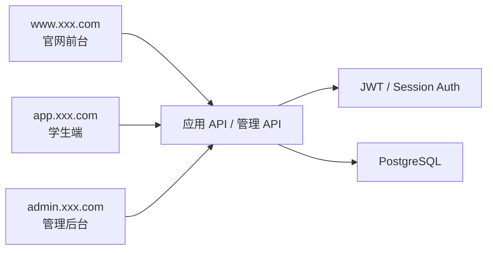
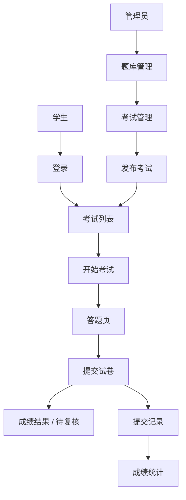

# PRD：在线考试与管理系统

状态：Draft v0.1  
目标：先明确角色、考试链路、后台管理和核心数据模型，再进入开发。

## 1. 项目定位

这是一个典型的多角色业务系统。它不只是答题页面，而是一整套包含学生端、管理端、题库、考试、提交记录和成绩处理的产品。

一句话定义：
做一个支持学生答题、管理员出卷、题库维护、成绩统计和后台管理的在线考试系统。

系统总览：



## 1.1 技术选型建议

- 前端框架：`Next.js` 或 `React + Vite`
- 后端框架：`Node.js + Express`
- 数据库：`PostgreSQL`
- 鉴权：`JWT + Role-based Access Control`

站点入口约定：

- 官网前台：`www.xxx.com`
- 学生端：`app.xxx.com`
- 管理后台：`admin.xxx.com`

## 1.2 竞品参考（官方）

- [Canvas by Instructure](https://www.instructure.com/canvas)
- [Moodle LMS](https://moodle.com/products/lms/)

## 1.3 产品借鉴点

本项目的产品设计建议参考这些真实教学产品：

- 借鉴 `Canvas` 的信息分层：学生端和管理端职责清晰，不把所有功能放在同一个视图
- 借鉴 `Moodle` 的题库与考试管理思路：题目、考试、提交、成绩应是独立模块
- 学生侧页面应强调“考试状态、剩余时间、提交反馈”
- 管理端页面应强调“题库维护、考试发布、提交记录、统计面板”
- 设计上应更像真实 LMS/考试平台，而不是单一答题表单

## 1.4 竞品页面拆解

建议重点参考的竞品页面结构：

- `Canvas` 的课程/作业/测验组织方式
  - 重点看：学生如何看到待完成事项、任务状态和结果反馈
- `Moodle` 的题库与测验页
  - 重点看：题目、测验、提交记录这些模块如何拆开
- `Moodle` 的后台管理体验
  - 重点看：题库管理、测验配置、成绩查看如何层次化呈现

因此本项目建议页面遵循：

- 学生端强调“流程感”
- 管理端强调“配置感”
- 成绩页强调“结果感”
- 后台首页强调“概览感”

## 2. 目标用户与核心目标

目标用户：

- 参加考试和查看成绩的学生
- 维护考试、题目、成绩和统计的管理员

核心目标：

- 学生能顺利完成考试流程
- 管理员能完成题库、考试和提交记录管理
- 系统能稳定保存提交结果和成绩统计

## 3. MVP 范围

第一版必须包含：

- 登录
- 学生考试列表
- 学生答题页
- 提交结果与历史成绩
- 管理后台
- 题库管理
- 考试管理
- 提交记录与成绩查看

第一版不做：

- 随机组卷
- 复杂防作弊
- 多校区多租户
- 监考视频

## 4. 角色与权限

| 角色 | 权限 |
|------|------|
| 学生 | 查看考试、开始答题、提交试卷、查看成绩 |
| 管理员 | 管理题库、考试、提交记录和成绩统计 |

## 5. 页面架构

当前 PRD 定义为 `3 套入口，10 个大页面`：

- 官网前台 `1` 个大页面
- 学生端 `4` 个大页面
- 管理后台 `5` 个大页面

### 官网前台

#### 1. 官网首页 `www:/`

核心功能：

- 平台介绍
- 登录入口
- 考试说明

### 学生端

#### 2. 登录页 `app:/login`

核心功能：

- 账号密码登录
- 找回密码入口

#### 3. 考试列表页 `app:/student/exams`

核心功能：

- 查看可参加考试
- 查看考试状态与时间
- 进入考试

#### 4. 答题页 `app:/student/exams/:id`

核心功能：

- 展示题目
- 作答
- 倒计时
- 提交试卷

#### 5. 历史成绩页 `app:/student/history`

核心功能：

- 查看历史考试
- 查看成绩与状态
- 查看待复核情况

### 管理后台

#### 6. 后台首页 `admin:/`

核心功能：

- 考试总数
- 学生提交数
- 待批改数
- 成绩概览

#### 7. 题库管理 `admin:/questions`

核心功能：

- 新增题目
- 编辑题目
- 分类筛选
- 批量导入

#### 8. 考试管理 `admin:/exams`

核心功能：

- 创建考试
- 绑定题目
- 设置开始时间和时长
- 发布/关闭考试

#### 9. 提交记录 `admin:/submissions`

核心功能：

- 查看学生提交
- 查看答案详情
- 人工复核

#### 10. 成绩统计 `admin:/scores`

核心功能：

- 查看考试平均分
- 查看通过率
- 查看题目错误率

## 5.1 关键用户链路



关键状态流：

- 考试：草稿 -> 已发布 -> 已关闭
- 提交：进行中 -> 已提交 -> 已评阅 / 待复核
- 学生成绩：未出分 -> 已出分

## 6. 后端实现

后端模块：

- `auth`
- `exams`
- `questions`
- `submissions`
- `scores`
- `admin`

建议数据表：

```sql
profiles (
  id uuid primary key,
  email text,
  role text,
  created_at timestamptz
)

exams (
  id uuid primary key,
  title text,
  description text,
  duration_minutes int,
  status text,
  created_at timestamptz
)

questions (
  id uuid primary key,
  type text,
  stem text,
  options jsonb,
  correct_answer text,
  score int,
  created_at timestamptz
)

submissions (
  id uuid primary key,
  exam_id uuid,
  student_id uuid,
  status text,
  total_score numeric,
  submitted_at timestamptz
)
```

## 6.1 后台指标与监控

后台建议至少查看这些指标：

- 已发布考试数
- 已参加人数
- 提交率
- 平均分 / 通过率
- 待复核题目数
- 题目错误率 Top10

基础监控建议：

- 登录成功率
- 提交流程错误率
- 自动判分耗时
- 数据库写入失败率

## 7. 功能清单

必须完成：

- 登录与角色鉴权
- 学生考试列表
- 学生答题与提交
- 历史成绩查看
- 题库管理
- 考试管理
- 提交记录查看
- 成绩统计查看

可选增强：

- 随机组卷
- 批量导题
- 班级维度统计
- 成绩导出

## 8. 接口草案

| 方法 | 路径 | 说明 |
|------|------|------|
| `POST` | `/api/auth/login` | 登录 |
| `GET` | `/api/exams` | 获取学生可见考试列表 |
| `GET` | `/api/exams/:id` | 获取考试详情 |
| `POST` | `/api/submissions/start` | 开始考试 |
| `POST` | `/api/submissions/:id/submit` | 提交试卷 |
| `GET` | `/api/student/history` | 获取历史成绩 |
| `GET` | `/api/admin/questions` | 获取题库 |
| `POST` | `/api/admin/questions` | 新增题目 |
| `GET` | `/api/admin/exams` | 获取考试列表 |
| `POST` | `/api/admin/exams` | 创建考试 |
| `GET` | `/api/admin/submissions` | 获取提交记录 |
| `GET` | `/api/admin/scores` | 获取成绩统计 |

## 9. 非功能要求

- 学生端和管理员端权限必须严格隔离
- 交卷后成绩和答题记录需稳定落库
- 自动判分与人工复核状态要清晰
- 后台统计口径要保持一致
- 答题页在倒计时和断网提示上要有明确反馈

## 10. 开发顺序建议

1. 登录与角色鉴权
2. 学生端考试列表和答题页
3. 提交与成绩链路
4. 管理后台题库和考试管理
5. 提交记录和统计页

## 11. 待确认项

- 第一版是否只支持单选/判断/简答
- 简答题是否只做人工复核
- 是否要限制考试只能提交一次
