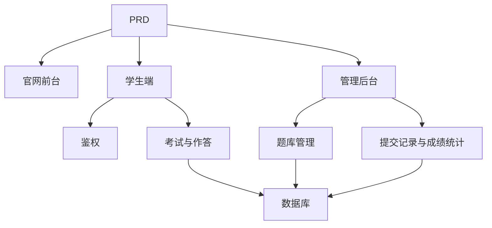

# 在线考试与管理系统开发实战

这个项目不是单纯的答题页面，而是围绕一份真实 PRD，把一个多角色业务系统从想法推进到可上线产品。

你会同时看到三件事：

- 项目要做成什么
- 如何基于 PRD 拆解并推进开发
- 最后应该交付出什么样的效果

::: tip PRD 入口
本项目的需求文档在 GitHub： [查看 PRD](https://github.com/datawhalechina/easy-vibe/blob/main/docs/zh-cn/stage-2/assignments/exam-management-express/PRD.md)
:::

<div style="margin: 32px 0;">
  <ClientOnly>
    <StepBar :active="0" :items="[
      { title: '看 PRD', description: '先明确角色、页面、考试链路、题库和成绩范围' },
      { title: '生成骨架', description: '让 AI 先产出官网、学生端、管理后台三套界面骨架' },
      { title: '监工迭代', description: '逐页验收、补接口、修权限、打通考试与成绩链路' },
      { title: '交付上线', description: '完成可演示、可运行、可继续开发的系统原型' }
    ]" />
  </ClientOnly>
</div>

## 这个项目到底在做什么？

这是一个典型的在线考试与管理系统：

- 官网前台：负责平台介绍和登录入口
- 学生端：负责考试列表、答题、提交和成绩查看
- 管理后台：负责题库、考试、提交记录和成绩统计

后端需要接住这些关键能力：

- 登录鉴权
- 角色权限
- 考试和题库管理
- 提交流程与自动判分
- 成绩和统计管理

## 开发过程怎么走？

### 1. 先看 PRD，不要上来就写代码

先确认：

- 角色是不是只收敛到 `student / admin`
- 页面清单是否完整
- 题型、提交流程和批改范围是否拍板
- 接口与数据表是否合理

如果 PRD 没拍板，就先不要写代码。

### 2. 先让 AI 生成“骨架版”

第一轮先生成：

- 登录页
- 学生考试列表
- 学生答题页
- 学生成绩页
- 后台首页
- 题库管理页
- 考试管理页
- 提交记录页
- 成绩统计页

先把页面结构、导航和信息架构搭出来。

### 3. 再进入“监工模式”

你要重点盯这几件事：

- 学生和管理员入口有没有分清
- 登录后权限是不是隔离
- 开始考试、作答、提交链路是不是闭环
- 自动判分和人工复核边界是不是清楚
- 管理端能不能看到真实提交记录和成绩统计

### 4. 最后做联调和上线



只要这条链路能跑通，这个项目就不是课堂作业，而是一套完整的业务系统原型。

## 怎么让 AI 帮你生成？

推荐按模块逐步下指令，而不是一句“帮我做完”。

```text
请基于当前 PRD，帮我生成一个在线考试与管理系统的前端骨架。

要求：
1. 分成三个入口：www、app、admin
2. 官网包括：首页、登录入口
3. 学生端包括：登录、考试列表、答题页、历史成绩
4. 后台包括：后台首页、题库管理、考试管理、提交记录、成绩统计
5. 先只生成页面结构和假数据，不接真实接口
6. 风格要像真实业务系统，不像课堂 demo
```

然后再一块一块补：

- 登录鉴权
- 考试接口
- 提交与判分
- 题库管理
- 成绩统计

## 怎么“监工”才有效？

每做完一个模块，至少检查这 5 件事：

| 检查项 | 要看什么 |
|------|------|
| 页面是否对 | 页面数量、入口、功能是否符合 PRD |
| 接口是否对 | 请求参数、返回结构、状态处理是否合理 |
| 权限是否对 | 学生和管理员权限是否隔离 |
| 数据是否对 | 题目、提交、成绩、统计是否一致 |
| 演示是否对 | 是否真的能演示完整考试闭环 |

## 最后的预期效果

做完后，你应该拿到这些交付物：

- 一套可运行的在线考试系统项目
- 一份同级 PRD 文档
- 三套入口：`www / app / admin`
- 登录、题库、考试、提交、成绩、后台管理
- 一份 README
- 一个可以演示的线上版本或本地完整运行方案

## 验收标准

| 维度 | 最低达标 |
|------|------|
| PRD 对齐 | 页面、功能、数据结构基本符合 PRD |
| 产品闭环 | 登录、考试、提交、成绩查看可以跑通 |
| 后台能力 | 题库、考试、提交、成绩统计可以查看 |
| 工程完整度 | 前端、后端、数据库、判分链路已接通 |
| 展示能力 | 可以清楚演示“从 PRD 到成品”的过程 |

::: tip 🚀 完成后你会得到什么？
你得到的不只是几个业务页面，而是一套完整的多角色系统开发样例。后面做教培、后台管理、内容平台项目时，都可以继续复用这套方法。
:::

技术栈要求：
- Next.js App Router
- TypeScript
- Tailwind CSS
- shadcn/ui

页面清单：
1. 首页 /
2. 登录页 /login
3. 学生考试列表页 /student/exams
4. 学生答题页 /student/exams/[id]
5. 学生成绩页 /student/history
6. 管理后台首页 /admin
7. 考试管理页 /admin/exams
8. 题库管理页 /admin/questions
9. 提交记录页 /admin/submissions

要求：
- 学生端页面强调清晰、专注、易答题
- 管理端页面使用侧边栏 + 顶部栏布局
- 先使用 mock 数据，不接真实接口
- 注意桌面端和移动端的基本可用性
```

### 第二步：完善学生答题页

答题页是学生端最重要的一页，至少要包含这些内容：

- 考试标题、剩余时间、进度提示
- 当前题目内容与选项
- 上一题 / 下一题导航
- 已作答状态提示
- 提交确认弹窗

你可以继续给 AI IDE 这样的提示：

```text
请继续完善学生答题页。

这是一个在线考试系统的答题页面，需要包含：
- 顶部显示考试标题、倒计时、已答题数量
- 中间显示题干和选项
- 支持单选、判断、简答三种题型
- 左侧或顶部有答题卡，显示每道题是否已作答
- 点击提交前弹出确认框

先用 mock 数据实现交互，不接真实接口。

要求：
- 界面简洁，不要像后台表格页
- 倒计时要醒目，但不要制造过强压迫感
- 有空状态和 loading 状态
```

### 第三步：完善管理员后台

管理员后台不是越复杂越好，第一版先做三个核心区域：

- **考试管理**：创建考试、设置时长、发布状态
- **题库管理**：新增题目、编辑题目、按题型筛选
- **提交记录**：查看学生提交、分数、时间

如果你卡住了，可以回头看这些章节：

- [从数据库到 Supabase](../../backend/2.2-database-supabase/)
- [应用后端接口设计与开发](../../backend/2.3-ai-interface-code/)
- [使用现代组件库更新你的界面](../../frontend/2.7-modern-component-library/)

<div style="margin: 32px 0;">
  <ClientOnly>
    <StepBar :active="2" :items="[
      { title: '定角色与范围', description: '先把参与者、页面和数据模型定下来' },
      { title: '搭前台', description: '学生端和管理端页面骨架先跑起来' },
      { title: '写接口', description: '用 Express 接通登录、考试、提交、批改' },
      { title: '上线交付', description: '部署、README、演示材料全部补齐' }
    ]" />
  </ClientOnly>
</div>

## 3. 写接口：让 Express 真正接管业务逻辑

这一步，项目才真正进入“系统开发”状态。

### 第四步：完成登录与权限控制

```text
请把我当成 0 基础，帮我完成在线考试系统的登录与权限控制。

后端使用 Express。

目标：
1. 学生和管理员都可以登录
2. 登录后返回用户角色
3. 学生只能访问 /student/* 相关接口
4. 管理员只能访问 /admin/* 相关接口
5. 未登录用户访问受保护页面时跳转 /login

实现要求：
- 给出清晰的目录结构建议
- 明确说明中间件负责什么
- 涉及环境变量的地方不要硬编码
- 完成后说明如何验证权限是否生效
```

### 第五步：完成考试与题库管理接口

建议先做这几组接口：

| 模块 | 推荐接口 |
|------|------|
| 考试管理 | `GET /api/exams`、`POST /api/admin/exams`、`PATCH /api/admin/exams/:id` |
| 题库管理 | `GET /api/admin/questions`、`POST /api/admin/questions` |
| 开始考试 | `POST /api/submissions/start` |
| 提交试卷 | `POST /api/submissions/:id/submit` |
| 成绩记录 | `GET /api/student/history`、`GET /api/admin/submissions` |

如果你想让 AI IDE 一步步带你完成，可以直接这样说：

```text
请帮我为在线考试系统设计并实现 Express API。

功能范围：
- 管理员创建考试
- 管理员维护题库
- 学生查看已发布考试
- 学生开始考试并创建 submission
- 学生提交答案后自动判分单选题和判断题
- 简答题先标记为待复核
- 学生查看自己的历史成绩
- 管理员查看所有提交记录

要求：
- 接口命名清晰
- 返回统一 JSON 结构
- 代码中区分 controller、service、middleware、db 层
- 说明每个接口如何测试
```

### 第六步：实现判分逻辑

这一部分很适合练后端思维。

- 单选题：用户答案与标准答案一致则得分
- 判断题：同样可以自动判分
- 简答题：第一版可以先只保存答案，分数为空，状态为 `reviewed = false`

如果你想再加一点 AI 能力，也可以让管理员在后台输入“主题 + 难度”，由模型先生成一批候选题，再人工审核后入库。但这属于加分项，不是必须项。

## 4. 上线与交付：把项目从“做完”变成“可展示”

### 部署建议

- 前端部署到 Vercel / Zeabur
- Express API 部署到 Zeabur / Railway / Render
- 数据库用 Supabase Postgres 或托管 PostgreSQL

部署前至少检查这些内容：

- 环境变量是否齐全
- 前后端 API 地址是否正确
- 登录态是否在生产环境正常工作
- 管理员账号是否能真实访问后台
- README 是否包含启动、部署、测试说明

### 你至少要准备的交付物

- 首页截图
- 学生考试列表截图
- 学生答题页截图
- 管理后台截图
- 60 秒左右演示视频
- 一份写清楚环境变量和启动方式的 README

## 验收标准

| 维度 | 最低达标 | 加分项 |
|------|------|------|
| 页面完整度 | 学生端和管理端主要页面都可访问 | 页面风格统一，状态清晰，移动端也基本可用 |
| 业务闭环 | 学生可登录、参加考试、提交并查看成绩 | 管理员可完整创建并发布考试 |
| 数据正确性 | 提交答案后能写入数据库，客观题能自动判分 | 简答题支持人工复核或 AI 辅助建议 |
| 权限控制 | 学生与管理员访问边界清晰 | 服务端接口也有角色校验，不只做前端隐藏 |
| 工程交付 | 项目可运行、可部署、README 清晰 | 有演示视频和测试说明 |

## 提交前最后检查

<el-card shadow="hover" style="margin: 20px 0; border-radius: 12px;">
  <template #header>
    <div style="font-weight: bold; font-size: 16px;">提交前最后看一眼</div>
  </template>

  <ul style="list-style-type: none; padding-left: 0;">
    <li><label><input type="checkbox" disabled /> 首页、登录页、学生端、管理端页面均已完成</label></li>
    <li><label><input type="checkbox" disabled /> 学生可以正常开始考试并提交答案</label></li>
    <li><label><input type="checkbox" disabled /> 管理员可以创建考试并查看提交记录</label></li>
    <li><label><input type="checkbox" disabled /> 客观题分数能够自动计算并写入数据库</label></li>
    <li><label><input type="checkbox" disabled /> 学生与管理员权限边界已验证</label></li>
    <li><label><input type="checkbox" disabled /> 项目已部署或具备完整本地运行说明</label></li>
  </ul>
</el-card>

::: tip 🚀 完成后你会得到什么？
如果你把这个项目真正做完，你收获的就不只是“又写了几个页面”，而是第一次完整处理了一个多角色业务系统。

这会让你在后续做教培、SaaS、后台管理、内容平台类项目时，明显更有底气。
:::
