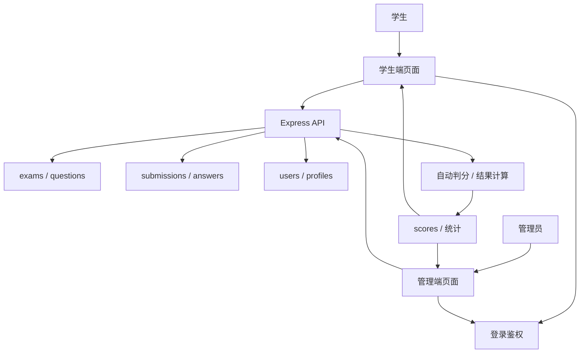
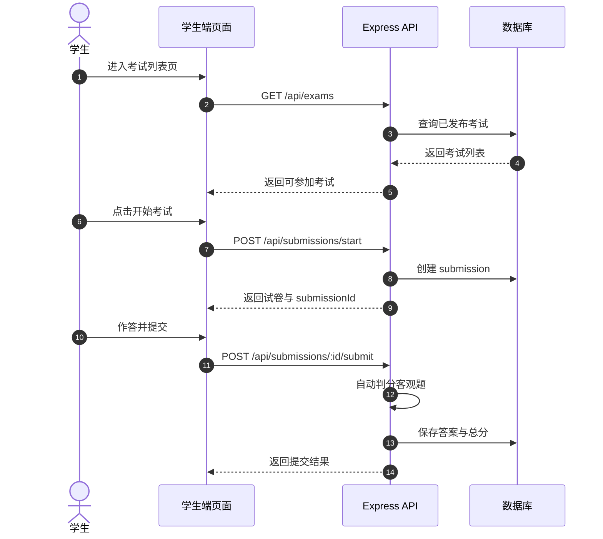

# 大作业 2：在线考试与管理系统

做完第一个 SaaS 项目后，下一步不只是“再做一个网站”，而是要进入更接近真实业务系统的场景。

在线考试系统就是一个很典型的练手题：

- 前台不再只有一个工作台，而是有 **学生端完整考试流程**
- 后台不再只是看数据，而是要有 **题库管理、考试管理、成绩管理**
- 权限不再只是“登录/未登录”，而是要处理 **学生 / 管理员** 两种角色
- 数据也不再是一张结果表，而是会涉及 **考试、题目、答卷、成绩、用户** 多种实体

::: tip 🎯 这次做什么？
打造一个 **在线考试与管理系统**。学生登录后可查看考试列表、开始答题、提交试卷、查看历史成绩；管理员可以创建考试、维护题库、查看提交记录，并根据题目规则完成自动判分或人工复核。
:::

<div style="margin: 32px 0;">
  <ClientOnly>
    <StepBar :active="0" :items="[
      { title: '定角色与范围', description: '先把参与者、页面和数据模型定下来' },
      { title: '搭前台', description: '学生端和管理端页面骨架先跑起来' },
      { title: '写接口', description: '用 Express 接通登录、考试、提交、批改' },
      { title: '上线交付', description: '部署、README、演示材料全部补齐' }
    ]" />
  </ClientOnly>
</div>

## 为什么这个题目值得做？

因为它特别适合练“业务系统思维”。

你会发现，考试系统不是把几个页面摆在一起就结束了，它必须处理很多真实约束：

- 学生只能看到自己该看的考试和成绩
- 管理员要能发布考试、维护题目、查看提交情况
- 一场考试通常会有开始时间、结束时间、作答时长、是否允许重复提交等规则
- 题目可能有单选、多选、判断、简答，不同题型的判分方式也不一样

这些问题会逼着你第一次认真面对：

- **角色权限**
- **数据建模**
- **接口设计**
- **提交流程与状态流转**

这正是从“会写页面”到“会做系统”的关键一步。

## 先看全景：这个系统到底由哪些部分组成？



你最终要交付的，不是一套静态页面，而是一套能让两类角色都跑通核心业务的系统。

## 1. 定角色与范围：先把“做什么”说清楚

### 角色设计

这次只保留两种角色，先把范围收住：

| 角色 | 核心动作 |
|------|------|
| 学生 | 登录、查看考试列表、开始答题、提交试卷、查看历史成绩 |
| 管理员 | 登录、创建考试、维护题库、查看提交记录、查看成绩统计 |

### 核心页面规划

按下面这些页面来做，已经足够覆盖主要能力：

| 页面 | 路径 | 说明 |
|------|------|------|
| 首页 | `/` | 说明平台用途，提供登录入口 |
| 登录页 | `/login` | 学生和管理员共用登录入口 |
| 学生考试列表 | `/student/exams` | 展示可参加的考试和状态 |
| 学生答题页 | `/student/exams/:id` | 显示题目、倒计时、提交按钮 |
| 学生成绩页 | `/student/history` | 查看历史考试记录和分数 |
| 管理后台首页 | `/admin` | 后台概览与导航 |
| 考试管理 | `/admin/exams` | 创建、发布、下线考试 |
| 题库管理 | `/admin/questions` | 新增和编辑题目 |
| 提交记录 | `/admin/submissions` | 查看学生提交和判分结果 |

### 建议先做的业务边界

为了确保你能完成，第一版建议只做这些：

- 题型先支持 **单选、判断、简答** 三种
- 自动判分先覆盖 **单选、判断**
- 简答题先做 **人工复核**，或者展示“待批改”
- 每场考试先只允许 **提交一次**
- 不做复杂防作弊，不做随机组卷，不做监考录像

### 数据模型

推荐至少有下面这几张表：

```sql
profiles (
  id uuid primary key,
  email text,
  role text,              -- student / admin
  created_at timestamptz
)

exams (
  id uuid primary key,
  title text,
  description text,
  duration_minutes int,
  status text,            -- draft / published / closed
  created_by uuid,
  created_at timestamptz
)

questions (
  id uuid primary key,
  type text,              -- single / judge / short
  stem text,
  options jsonb,
  correct_answer text,
  score int,
  created_at timestamptz
)

exam_questions (
  id uuid primary key,
  exam_id uuid,
  question_id uuid,
  sort_order int
)

submissions (
  id uuid primary key,
  exam_id uuid,
  student_id uuid,
  status text,            -- in_progress / submitted / reviewed
  total_score numeric,
  submitted_at timestamptz
)

submission_answers (
  id uuid primary key,
  submission_id uuid,
  question_id uuid,
  answer_text text,
  is_correct boolean,
  score numeric
)
```

### 关键时序图

学生参加考试时，系统的主链路大致长这样：



到这一步，你应该已经能看清这个作业的真正重点了：不是“页面多”，而是“状态和数据流更多”。

<div style="margin: 32px 0;">
  <ClientOnly>
    <StepBar :active="1" :items="[
      { title: '定角色与范围', description: '先把参与者、页面和数据模型定下来' },
      { title: '搭前台', description: '学生端和管理端页面骨架先跑起来' },
      { title: '写接口', description: '用 Express 接通登录、考试、提交、批改' },
      { title: '上线交付', description: '部署、README、演示材料全部补齐' }
    ]" />
  </ClientOnly>
</div>

## 2. 搭前台：先让学生端和管理端“看得见、点得动”

这一步先不要急着把所有后端写完，先把页面骨架搭出来。

### 推荐技术栈

- **Next.js / React**：负责前端页面
- **TypeScript**：保证类型清晰
- **Tailwind CSS + shadcn/ui**：快速搭建专业界面
- **Express**：编写 REST API
- **PostgreSQL / Supabase Postgres**：存业务数据

### 第一步：让 AI IDE 先帮你起出页面骨架

```text
请帮我创建一个在线考试与管理系统的前端页面骨架。

技术栈要求：
- Next.js App Router
- TypeScript
- Tailwind CSS
- shadcn/ui

页面清单：
1. 首页 /
2. 登录页 /login
3. 学生考试列表页 /student/exams
4. 学生答题页 /student/exams/[id]
5. 学生成绩页 /student/history
6. 管理后台首页 /admin
7. 考试管理页 /admin/exams
8. 题库管理页 /admin/questions
9. 提交记录页 /admin/submissions

要求：
- 学生端页面强调清晰、专注、易答题
- 管理端页面使用侧边栏 + 顶部栏布局
- 先使用 mock 数据，不接真实接口
- 注意桌面端和移动端的基本可用性
```

### 第二步：完善学生答题页

答题页是学生端最重要的一页，至少要包含这些内容：

- 考试标题、剩余时间、进度提示
- 当前题目内容与选项
- 上一题 / 下一题导航
- 已作答状态提示
- 提交确认弹窗

你可以继续给 AI IDE 这样的提示：

```text
请继续完善学生答题页。

这是一个在线考试系统的答题页面，需要包含：
- 顶部显示考试标题、倒计时、已答题数量
- 中间显示题干和选项
- 支持单选、判断、简答三种题型
- 左侧或顶部有答题卡，显示每道题是否已作答
- 点击提交前弹出确认框

先用 mock 数据实现交互，不接真实接口。

要求：
- 界面简洁，不要像后台表格页
- 倒计时要醒目，但不要制造过强压迫感
- 有空状态和 loading 状态
```

### 第三步：完善管理员后台

管理员后台不是越复杂越好，第一版先做三个核心区域：

- **考试管理**：创建考试、设置时长、发布状态
- **题库管理**：新增题目、编辑题目、按题型筛选
- **提交记录**：查看学生提交、分数、时间

如果你卡住了，可以回头看这些章节：

- [从数据库到 Supabase](../../backend/2.2-database-supabase/)
- [应用后端接口设计与开发](../../backend/2.3-ai-interface-code/)
- [使用现代组件库更新你的界面](../../frontend/2.7-modern-component-library/)

<div style="margin: 32px 0;">
  <ClientOnly>
    <StepBar :active="2" :items="[
      { title: '定角色与范围', description: '先把参与者、页面和数据模型定下来' },
      { title: '搭前台', description: '学生端和管理端页面骨架先跑起来' },
      { title: '写接口', description: '用 Express 接通登录、考试、提交、批改' },
      { title: '上线交付', description: '部署、README、演示材料全部补齐' }
    ]" />
  </ClientOnly>
</div>

## 3. 写接口：让 Express 真正接管业务逻辑

这一步，项目才真正进入“系统开发”状态。

### 第四步：完成登录与权限控制

```text
请把我当成 0 基础，帮我完成在线考试系统的登录与权限控制。

后端使用 Express。

目标：
1. 学生和管理员都可以登录
2. 登录后返回用户角色
3. 学生只能访问 /student/* 相关接口
4. 管理员只能访问 /admin/* 相关接口
5. 未登录用户访问受保护页面时跳转 /login

实现要求：
- 给出清晰的目录结构建议
- 明确说明中间件负责什么
- 涉及环境变量的地方不要硬编码
- 完成后说明如何验证权限是否生效
```

### 第五步：完成考试与题库管理接口

建议先做这几组接口：

| 模块 | 推荐接口 |
|------|------|
| 考试管理 | `GET /api/exams`、`POST /api/admin/exams`、`PATCH /api/admin/exams/:id` |
| 题库管理 | `GET /api/admin/questions`、`POST /api/admin/questions` |
| 开始考试 | `POST /api/submissions/start` |
| 提交试卷 | `POST /api/submissions/:id/submit` |
| 成绩记录 | `GET /api/student/history`、`GET /api/admin/submissions` |

如果你想让 AI IDE 一步步带你完成，可以直接这样说：

```text
请帮我为在线考试系统设计并实现 Express API。

功能范围：
- 管理员创建考试
- 管理员维护题库
- 学生查看已发布考试
- 学生开始考试并创建 submission
- 学生提交答案后自动判分单选题和判断题
- 简答题先标记为待复核
- 学生查看自己的历史成绩
- 管理员查看所有提交记录

要求：
- 接口命名清晰
- 返回统一 JSON 结构
- 代码中区分 controller、service、middleware、db 层
- 说明每个接口如何测试
```

### 第六步：实现判分逻辑

这一部分很适合练后端思维。

- 单选题：用户答案与标准答案一致则得分
- 判断题：同样可以自动判分
- 简答题：第一版可以先只保存答案，分数为空，状态为 `reviewed = false`

如果你想再加一点 AI 能力，也可以让管理员在后台输入“主题 + 难度”，由模型先生成一批候选题，再人工审核后入库。但这属于加分项，不是必须项。

## 4. 上线与交付：把项目从“做完”变成“可展示”

### 部署建议

- 前端部署到 Vercel / Zeabur
- Express API 部署到 Zeabur / Railway / Render
- 数据库用 Supabase Postgres 或托管 PostgreSQL

部署前至少检查这些内容：

- 环境变量是否齐全
- 前后端 API 地址是否正确
- 登录态是否在生产环境正常工作
- 管理员账号是否能真实访问后台
- README 是否包含启动、部署、测试说明

### 你至少要准备的交付物

- 首页截图
- 学生考试列表截图
- 学生答题页截图
- 管理后台截图
- 60 秒左右演示视频
- 一份写清楚环境变量和启动方式的 README

## 验收标准

| 维度 | 最低达标 | 加分项 |
|------|------|------|
| 页面完整度 | 学生端和管理端主要页面都可访问 | 页面风格统一，状态清晰，移动端也基本可用 |
| 业务闭环 | 学生可登录、参加考试、提交并查看成绩 | 管理员可完整创建并发布考试 |
| 数据正确性 | 提交答案后能写入数据库，客观题能自动判分 | 简答题支持人工复核或 AI 辅助建议 |
| 权限控制 | 学生与管理员访问边界清晰 | 服务端接口也有角色校验，不只做前端隐藏 |
| 工程交付 | 项目可运行、可部署、README 清晰 | 有演示视频和测试说明 |

## 提交前最后检查

<el-card shadow="hover" style="margin: 20px 0; border-radius: 12px;">
  <template #header>
    <div style="font-weight: bold; font-size: 16px;">提交前最后看一眼</div>
  </template>

  <ul style="list-style-type: none; padding-left: 0;">
    <li><label><input type="checkbox" disabled /> 首页、登录页、学生端、管理端页面均已完成</label></li>
    <li><label><input type="checkbox" disabled /> 学生可以正常开始考试并提交答案</label></li>
    <li><label><input type="checkbox" disabled /> 管理员可以创建考试并查看提交记录</label></li>
    <li><label><input type="checkbox" disabled /> 客观题分数能够自动计算并写入数据库</label></li>
    <li><label><input type="checkbox" disabled /> 学生与管理员权限边界已验证</label></li>
    <li><label><input type="checkbox" disabled /> 项目已部署或具备完整本地运行说明</label></li>
  </ul>
</el-card>

::: tip 🚀 完成后你会得到什么？
如果你把这个项目真正做完，你收获的就不只是“又写了几个页面”，而是第一次完整处理了一个多角色业务系统。

这会让你在后续做教培、SaaS、后台管理、内容平台类项目时，明显更有底气。
:::
