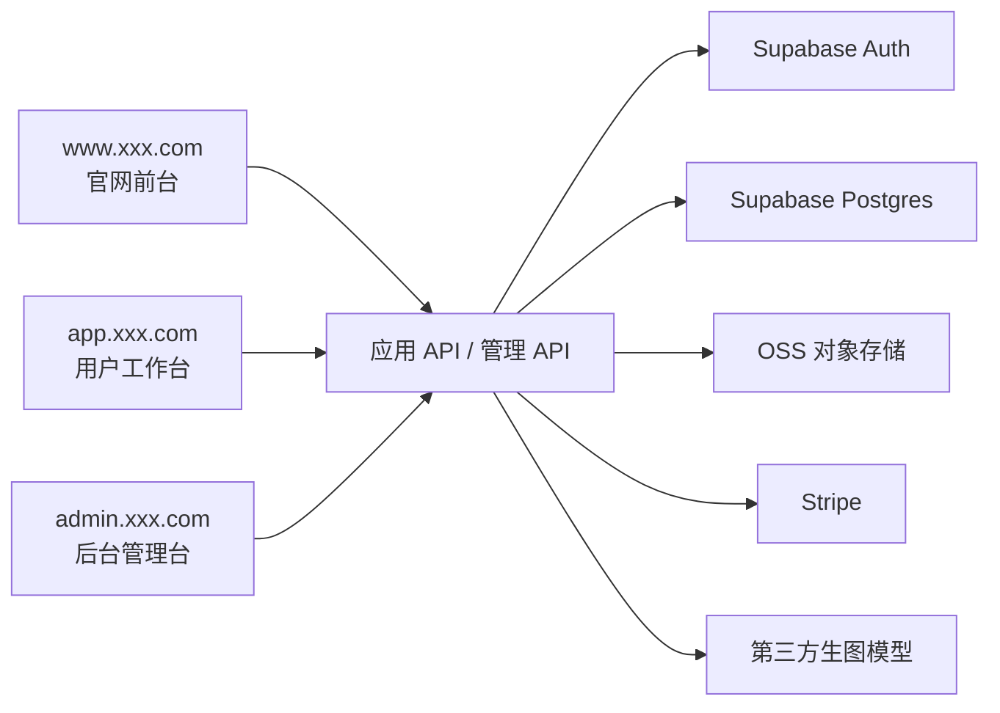
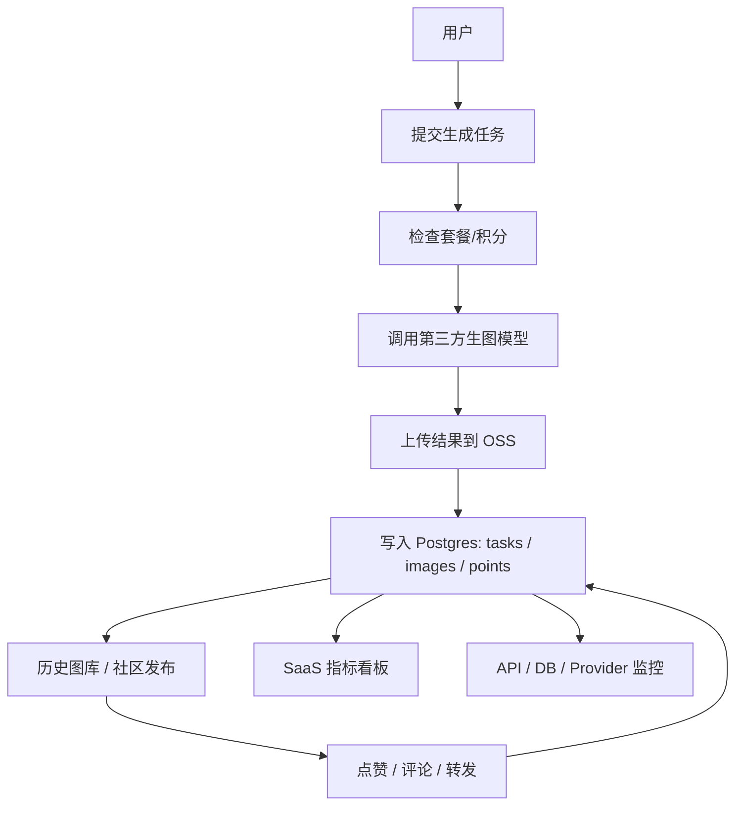

# PRD：现代 AI 生图 SaaS 平台

状态：Draft v0.2  
目标：先完成可 review 的产品与实现方案，不进入开发。

## 1. 项目定位

这是一个现代化 AI 生图 SaaS 网站，产品体验参考 Midjourney、Leonardo、Playground 这类平台，但后端不训练自己的模型，而是对接第三方图像生成模型服务。

第一版要做的不是“一个展示页”，而是一套最小可用的产品闭环：

- 官网落地页
- 用户注册登录
- Prompt 输入与图片生成
- 图片历史记录与结果管理
- 套餐/额度体系
- 积分体系
- 图片分享与公开展示
- 点赞、评论、转发等互动能力
- 管理后台

一句话定义：
做一个面向普通创作者和独立开发者的现代 AI 生图 SaaS 平台，前端提供官网、生成工作台和分享社区，后端对接第三方生图模型，支持注册登录、按套餐购买积分、图片分享与互动。

站点入口约定：

- 官网前台：`www.xxx.com`
- 用户工作台：`app.xxx.com`
- 后台管理台：`admin.xxx.com`

## 1.1 技术选型建议

当前默认技术方案：

- 前端框架：`Next.js App Router`
- 用户鉴权：`Supabase Auth`
- 数据库：`Supabase Postgres`
- 文件存储：`Supabase Storage`
- 支付：`Stripe`
- 图像生成模型：通过统一后端适配层对接第三方模型 API

默认原因：

- `Supabase Auth + Supabase Postgres` 适合第一版 SaaS 快速落地
- 用户系统、数据库、对象存储可以一起解决
- 对 `app.xxx.com` 和 `admin.xxx.com` 两套前端都友好
- 后续如果要拆独立服务，也保留扩展空间

默认鉴权设计：

- 普通用户支持邮箱密码登录和第三方登录
- 管理员使用同一套登录系统，但在用户表中标记 `role=admin`
- 后台管理台必须校验管理员权限
- 用户前台与后台管理台接口分开鉴权

默认数据库设计：

- 主业务库使用 `PostgreSQL`
- 用户、任务、支付、积分、社区内容、监控日志先放一套主库
- 分析型查询先基于主库聚合，后续如数据量变大再拆分析库

系统总览：



## 2. 目标用户与核心目标

目标用户：

- 想快速生成营销图、封面图、海报图的普通用户
- 需要批量试 Prompt 的设计师或内容创作者
- 喜欢浏览他人作品并进行互动的社区用户
- 管理用户、任务和额度消耗的管理员

核心目标：

- 用户可以在 3 分钟内完成注册并生成第一张图
- 用户能清晰看到每次生成结果、积分消耗和历史记录
- 用户可以把满意作品分享出来并获得互动反馈
- 平台能支持积分购买、积分消耗、失败重试、内容互动和后台管理

建议北极星指标：

- 新用户首图生成成功率
- 日活跃生成用户数
- 人均生成次数
- 生成任务成功率
- 付费转化率
- 分享图片数
- 点赞/评论互动率
- 日活跃积分用户数

## 3. MVP 范围

第一版必须包含：

- 官网首页
- 注册/登录
- 生图工作台
- 图片历史页
- 套餐/积分页
- 积分页
- 支付/订阅能力
- 图片公开分享页
- 点赞、评论、转发
- 图片生成接口
- 生成任务状态查询
- 后台查看用户、生成任务、积分使用和内容互动情况

第一版不做：

- 自训练模型
- 多模型工作流编排
- 图片编辑器
- 团队协作
- 多语言

## 4. 角色与权限

| 角色 | 权限 |
|------|------|
| 游客 | 浏览官网、查看产品介绍、注册登录 |
| 注册用户 | 创建生成任务、查看历史图片、管理自己的积分和结果、查看积分明细、分享作品、点赞评论转发 |
| 管理员 | 查看用户、任务状态、失败日志、套餐与积分消耗情况，管理积分规则、公开内容与互动数据 |

## 5. 前端实现

推荐技术栈：

- Next.js App Router
- TypeScript
- Tailwind CSS
- shadcn/ui

前端形态说明：

- 官网前台和用户工作台都属于“前端产品”
- 后台管理系统本质上也是前端页面，只是面向内部运营和管理员使用
- 因此本项目会有两套前端界面：
  - 面向用户的产品前台
  - 面向运营/管理员的后台管理台
- 同时后台管理台需要配套独立的管理员接口与权限校验

入口建议：

| 站点类型 | 建议入口 | 说明 |
|------|------|------|
| 官网前台 | `www.xxx.com` | 产品介绍、定价、FAQ、注册入口 |
| 用户工作台 | `app.xxx.com` | 登录后生成图片、看图库、看积分、发动态 |
| 后台管理台 | `admin.xxx.com` | 管理用户、套餐、任务、内容、风控 |

## 5.1 页面架构总览

当前 PRD 定义为 `3 套入口，19 个大页面`：

- 官网前台 `1` 个大页面
- 用户工作台 `9` 个大页面
- 后台管理台 `9` 个大页面

### A. 官网前台 `www.xxx.com`

#### 1. 官网首页 `www:/`

核心功能：

- Hero 区与主 CTA
- 产品能力介绍
- 作品展示
- 套餐预览
- FAQ
- 注册/登录/进入工作台入口

### B. 用户工作台 `app.xxx.com`

#### 2. 登录页 `app:/login`

核心功能：

- 邮箱/密码登录
- 第三方登录入口
- 找回密码入口
- 跳转注册页

#### 3. 注册页 `app:/register`

核心功能：

- 新用户注册
- 同意协议与隐私政策
- 第三方登录注册
- 注册成功后进入工作台

#### 4. 生成工作台 `app:/generate`

核心功能：

- 输入 Prompt 与 Negative Prompt
- 选择模型、比例、数量、质量参数
- 提交生图任务
- 查看生成中/成功/失败状态
- 对结果进行再次生成、收藏、发布

#### 5. 历史图库 `app:/gallery`

核心功能：

- 查看个人历史生成记录
- 按时间/模型/状态筛选
- 删除图片
- 收藏图片
- 从历史记录再次进入详情或复用 Prompt

#### 6. 套餐页 `app:/billing`

核心功能：

- 查看 Basic / Standard / Pro / Mega 套餐
- 月付/年付切换
- 查看每档套餐包含的积分和权益
- 发起购买套餐
- 购买额外积分包
- FAQ 与账号关联说明

#### 7. 积分页 `app:/points`

核心功能：

- 查看当前积分余额
- 查看积分获取记录
- 查看积分消耗记录
- 每日签到
- 积分兑换权益或生成次数

#### 8. 社区广场 `app:/explore`

核心功能：

- 浏览公开作品流
- 按热门/最新排序
- 点赞作品
- 评论作品
- 转发作品
- 进入作品详情页

#### 9. 作品详情页 `app:/posts/:id`

核心功能：

- 查看单个作品大图
- 查看作者信息与发布时间
- 查看完整 Prompt 与参数
- 查看点赞、评论、转发数据
- 复制 Prompt / 再次生成 / 点赞 / 评论 / 转发

#### 10. 个人中心 `app:/settings`

核心功能：

- 查看个人资料
- 绑定/关联账号
- 查看当前套餐
- 查看登录方式与安全设置
- 管理公开分享偏好

### C. 后台管理台 `admin.xxx.com`

#### 11. 后台首页 `admin:/`

核心功能：

- 用户总数
- 生成任务总量
- 支付收入概览
- 内容分享与互动概览
- 异常任务提醒

#### 12. 用户管理 `admin:/users`

核心功能：

- 查看用户列表
- 搜索和筛选用户
- 查看用户套餐、积分、活跃情况
- 封禁/解封账号
- 手动调整积分

#### 13. 任务管理 `admin:/tasks`

核心功能：

- 查看全部生成任务
- 按状态筛选成功/失败/处理中任务
- 查看失败原因
- 手动重试或标记异常任务

#### 14. 内容管理 `admin:/posts`

核心功能：

- 查看公开作品列表
- 审核作品是否可展示
- 下架违规内容
- 查看评论与互动记录
- 审核或删除评论

#### 15. 套餐管理 `admin:/plans`

核心功能：

- 配置套餐价格
- 配置月付/年付优惠
- 配置套餐积分数
- 配置积分包 top-up
- 配置并发和高级权益

#### 16. 支付订单 `admin:/billing`

核心功能：

- 查看支付订单列表
- 查看订阅状态
- 查看退款/失败订单
- 搜索异常支付记录

#### 17. 运营配置 `admin:/operations`

核心功能：

- 配置签到积分规则
- 配置分享/互动奖励规则
- 配置活动公告
- 配置风控和审核开关

#### 18. SaaS 指标看板 `admin:/analytics`

核心功能：

- 查看新增用户、DAU、WAU、MAU
- 查看注册转化率、付费转化率
- 查看次日/7日/30日留存
- 查看套餐分布和订阅续费情况
- 查看积分发放、积分消耗、积分结余情况
- 查看社区分享数、点赞率、评论率、转发率

#### 19. 系统监控页 `admin:/observability`

核心功能：

- 查看 API 调用量、成功率、错误率、平均耗时
- 查看第三方生图模型调用情况
- 查看数据库连接状态、慢查询和失败率
- 查看支付接口回调状态
- 查看任务队列积压和重试情况
- 查看系统告警与异常日志

建议页面明细：

| 页面 | 路径 | 说明 |
|------|------|------|
| 官网首页 | `www:/` | Hero、作品展示、功能介绍、价格方案、FAQ、CTA |
| 登录页 | `app:/login` | 登录表单 |
| 注册页 | `app:/register` | 注册表单 |
| 生成工作台 | `app:/generate` | Prompt、参数设置、任务提交、结果查看 |
| 历史图库 | `app:/gallery` | 查看历史图片、筛选、删除、收藏 |
| 套餐页 | `app:/billing` | 展示套餐档位、月付/年付、积分权益 |
| 积分页 | `app:/points` | 查看积分余额、获取记录、兑换规则 |
| 社区广场 | `app:/explore` | 浏览公开作品、点赞、评论、转发 |
| 作品详情页 | `app:/posts/:id` | 查看单张公开作品的详情与互动信息 |
| 个人中心 | `app:/settings` | 用户资料、积分、绑定信息 |
| 后台首页 | `admin:/` | 后台概览看板 |
| 用户管理 | `admin:/users` | 查看用户、封禁、积分与套餐状态 |
| 任务管理 | `admin:/tasks` | 查看生图任务、失败任务、重试情况 |
| 内容管理 | `admin:/posts` | 审核公开作品、评论、转发数据 |
| 套餐管理 | `admin:/plans` | 配置套餐、积分包、价格与权益 |
| 支付订单 | `admin:/billing` | 查看支付记录、退款状态、异常订单 |
| 运营配置 | `admin:/operations` | 配置签到规则、积分规则、公告与活动 |
| SaaS 指标看板 | `admin:/analytics` | 查看留存、转化、积分、订阅与社区活跃指标 |
| 系统监控页 | `admin:/observability` | 查看 API、模型调用、数据库、支付、队列状态 |

前端核心组件：

- Hero 区与 CTA
- Prompt 输入面板
- 模型参数配置区
- 图片结果卡片
- 任务状态轮询组件
- 图库列表/瀑布流
- 套餐卡片组件
- 月付/年付切换组件
- 积分概览卡片
- 积分明细列表
- FAQ 折叠区
- 公开作品卡片
- 评论列表与评论输入框
- 点赞/转发操作栏
- 套餐价格卡片
- 空态、加载、失败重试组件
- 管理后台表格、筛选器、统计卡片、审核面板
- 监控图表、趋势图、健康状态卡片、告警列表

前端状态与数据流：

- 游客从首页进入注册或登录
- 登录后进入 `/generate`
- 用户输入 Prompt 和参数后提交生成任务
- 前端轮询或订阅任务状态
- 成功后展示图片并写入历史记录
- 用户完成签到、生成、分享、互动后可获得积分
- 用户可将图片发布到公开广场
- 其他用户可点赞、评论、转发该作品
- 套餐页展示剩余积分、套餐差异与升级入口
- 积分页展示积分来源、消费记录和兑换入口
- 管理员从独立后台入口进入运营看板和管理模块
- 管理员可在后台查看业务指标和系统健康状态

## 6. 后端实现

推荐技术栈：

- Next.js Route Handlers 或 Node.js/Express
- PostgreSQL / Supabase
- 对接第三方图像生成模型 API

后端模块：

- `auth`：注册、登录、鉴权
- `generation`：创建生图任务、查询任务状态、失败重试
- `images`：图片历史、删除、收藏、详情
- `points`：积分购买、累计、扣减、任务奖励、兑换记录
- `billing`：套餐、支付记录、升级状态
- `social`：公开发布、点赞、评论、转发
- `analytics`：留存、转化、订阅、积分、社区活跃统计
- `observability`：API 调用、模型调用、数据库状态、告警日志
- `admin`：后台查看用户、任务、错误日志、审核内容、运营配置

核心数据流：



建议数据表：

```sql
profiles (
  id uuid primary key,
  email text,
  role text,
  plan text,
  points int,
  created_at timestamptz
)

generation_tasks (
  id uuid primary key,
  user_id uuid,
  prompt text,
  negative_prompt text,
  model text,
  aspect_ratio text,
  image_count int,
  status text,
  error_message text,
  provider_task_id text,
  points_cost int,
  created_at timestamptz
)

generated_images (
  id uuid primary key,
  task_id uuid,
  user_id uuid,
  image_url text,
  width int,
  height int,
  is_favorite boolean,
  created_at timestamptz
)

billing_records (
  id uuid primary key,
  user_id uuid,
  plan_code text,
  billing_cycle text,
  type text,
  amount_cents int,
  points_delta int,
  status text,
  created_at timestamptz
)

point_records (
  id uuid primary key,
  user_id uuid,
  type text,
  points_delta int,
  source text,
  created_at timestamptz
)

api_call_logs (
  id uuid primary key,
  route text,
  method text,
  user_id uuid,
  status_code int,
  duration_ms int,
  request_id text,
  created_at timestamptz
)

provider_call_logs (
  id uuid primary key,
  provider_name text,
  task_id uuid,
  status text,
  duration_ms int,
  error_message text,
  created_at timestamptz
)

system_health_checks (
  id uuid primary key,
  service_name text,
  check_type text,
  status text,
  detail jsonb,
  created_at timestamptz
)

subscription_plans (
  id uuid primary key,
  code text,
  name text,
  monthly_price_cents int,
  yearly_price_cents int,
  monthly_points int,
  concurrent_image_jobs int,
  concurrent_video_jobs int,
  supports_hd_video boolean,
  supports_stealth boolean,
  created_at timestamptz
)

shared_posts (
  id uuid primary key,
  image_id uuid,
  user_id uuid,
  caption text,
  visibility text,
  repost_from_post_id uuid,
  created_at timestamptz
)

post_likes (
  id uuid primary key,
  post_id uuid,
  user_id uuid,
  created_at timestamptz
)

post_comments (
  id uuid primary key,
  post_id uuid,
  user_id uuid,
  content text,
  created_at timestamptz
)
```

## 7. 功能清单

必须完成：

- 官网价值展示
- 注册/登录
- Prompt 输入与参数选择
- 图片生成任务提交
- 图片结果展示
- 历史记录查看
- 套餐/积分展示
- 积分展示与明细
- 支付/订阅
- 图片公开分享
- 点赞、评论、转发
- 后台独立入口
- 管理员查看任务、用户、支付和社区内容
- 管理员审核公开内容与评论
- 管理员配置积分规则与套餐规则
- 后台查看 SaaS 留存、转化、积分与订阅指标
- 后台查看 API 调用、模型调用和数据库健康状态

可选增强：

- 图片收藏
- 再次生成同款
- Prompt 模板
- 水印与下载规格选择
- 任务失败自动重试
- 评论通知
- 个人主页与作品墙
- 积分兑换生成次数或高级功能

## 8.1 套餐设计草案

套餐逻辑：

- 用户购买的是 `积分型订阅套餐`
- 月付和年付两种计费方式
- 年付默认比月付优惠 `20%`
- 套餐按月发放积分
- 生成图片、生成视频、高清能力、并发能力由套餐共同决定

建议档位：

| 套餐 | 月付 | 年付折后 | 每月积分 | 图片并发 | 视频并发 | 其他权益 |
|------|------|------|------|------|------|------|
| Basic | `$10` | `$8` | 2000 | 3 | 1 | 基础生图、可补充购买积分 |
| Standard | `$30` | `$24` | 8000 | 3 | 3 | 支持高清视频、无限慢速图像生成 |
| Pro | `$60` | `$48` | 18000 | 12 | 6 | 隐身生成、更多并发 |
| Mega | `$120` | `$96` | 40000 | 12 | 12 | 更高上限、适合高频创作用户 |

补充说明：

- 套餐价格和积分数值是第一版草案，后续可调整
- 不同模型与分辨率对应不同积分消耗
- 视频生成会比图片生成消耗更多积分
- 支持额外购买积分包作为 top-up

建议 FAQ 内容：

- 我买了套餐但没生效怎么办？
- 月付和年付有什么差别？
- 积分用完了怎么办？
- 积分会不会过期？
- 账号能不能绑定多个登录方式？
- 哪些内容支持公开分享？

## 9. 接口草案

| 方法 | 路径 | 说明 |
|------|------|------|
| `POST` | `/api/auth/register` | 用户注册 |
| `POST` | `/api/auth/login` | 用户登录 |
| `POST` | `/api/auth/link-account` | 关联不同登录账号 |
| `GET` | `/api/me` | 获取当前用户资料与积分 |
| `GET` | `/api/points` | 获取积分余额和明细 |
| `POST` | `/api/points/check-in` | 每日签到获取积分 |
| `POST` | `/api/points/redeem` | 积分兑换权益或生成次数 |
| `POST` | `/api/generations` | 创建生图任务 |
| `GET` | `/api/generations/:id` | 获取任务状态和结果 |
| `GET` | `/api/gallery` | 获取当前用户历史图片 |
| `DELETE` | `/api/gallery/:id` | 删除某张图片 |
| `PATCH` | `/api/gallery/:id/favorite` | 收藏/取消收藏图片 |
| `GET` | `/api/billing/plans` | 获取套餐列表 |
| `POST` | `/api/billing/checkout` | 创建支付订单或订阅会话 |
| `POST` | `/api/billing/top-up` | 购买额外积分包 |
| `GET` | `/api/billing/records` | 获取消费与充值记录 |
| `POST` | `/api/posts` | 将一张图片发布为公开作品 |
| `GET` | `/api/posts` | 获取公开作品流 |
| `GET` | `/api/posts/:id` | 获取作品详情 |
| `POST` | `/api/posts/:id/likes` | 点赞作品 |
| `DELETE` | `/api/posts/:id/likes` | 取消点赞 |
| `POST` | `/api/posts/:id/comments` | 评论作品 |
| `POST` | `/api/posts/:id/repost` | 转发作品 |
| `GET` | `/api/admin/overview` | 获取后台总览 |
| `GET` | `/api/admin/users` | 获取用户列表与账户状态 |
| `GET` | `/api/admin/tasks` | 获取生成任务列表 |
| `GET` | `/api/admin/posts` | 获取公开作品与互动列表 |
| `GET` | `/api/admin/analytics/overview` | 获取新增、活跃、付费转化等核心 SaaS 指标 |
| `GET` | `/api/admin/analytics/retention` | 获取次日/7日/30日留存数据 |
| `GET` | `/api/admin/analytics/points` | 获取积分发放、消耗、结余数据 |
| `GET` | `/api/admin/analytics/subscriptions` | 获取订阅与套餐分布数据 |
| `PATCH` | `/api/admin/posts/:id/moderate` | 审核或下架公开作品 |
| `PATCH` | `/api/admin/comments/:id/moderate` | 审核或删除评论 |
| `GET` | `/api/admin/billing` | 获取支付订单与订阅记录 |
| `GET` | `/api/admin/plans` | 获取套餐与积分包配置 |
| `PATCH` | `/api/admin/plans/:id` | 更新套餐配置 |
| `GET` | `/api/admin/point-rules` | 获取积分规则 |
| `PATCH` | `/api/admin/point-rules` | 更新积分规则 |
| `GET` | `/api/admin/observability/apis` | 获取 API 调用量、错误率、耗时等监控数据 |
| `GET` | `/api/admin/observability/providers` | 获取第三方模型调用情况 |
| `GET` | `/api/admin/observability/database` | 获取数据库连接、慢查询、失败率 |
| `GET` | `/api/admin/observability/health` | 获取系统健康检查结果 |

`POST /api/generations` 请求示例：

```json
{
  "prompt": "a cinematic futuristic city at sunset, ultra detailed",
  "negativePrompt": "blurry, low quality",
  "model": "flux-dev",
  "aspectRatio": "1:1",
  "imageCount": 4
}
```

## 10. 非功能要求

- 生成过程有明确状态反馈
- 失败任务能提示原因
- 移动端至少可查看和浏览历史结果
- 首页具备现代 SaaS 视觉质量
- 用户只能访问自己的图片和任务
- 积分扣减逻辑要稳定可追踪
- 积分发放与扣减逻辑要可审计
- 公开内容需要有最小审核或风控预留能力
- 互动接口需要防刷和限流预留
- 管理后台关键指标需支持日/周/月维度查看
- API 日志、数据库状态、第三方模型调用结果需可追踪

## 11. 开发顺序建议

1. 搭官网首页与登录注册页
2. 实现用户鉴权
3. 实现生成工作台 UI
4. 接入生图任务接口
5. 实现历史图库
6. 实现支付、套餐、积分与 FAQ 页
7. 实现分享、点赞、评论、转发
8. 实现独立后台入口与后台任务、用户、积分、支付、内容管理页
9. 实现 SaaS 指标看板与系统监控页

## 12. 待确认项

- 第三方模型服务优先接哪一家
- 图片是否允许公开分享
- 后台是否必须使用独立二级域名，还是允许先用独立路由入口
- 积分获取规则是签到 + 分享 + 互动，还是还要包含邀请奖励
- 积分是否只用于生成消耗，还是还要兑换会员权益
- 年付优惠是否固定为 `20%`
- 是否需要单独的积分包 top-up
- 鉴权是否接受默认方案：`Supabase Auth`
- 数据库是否接受默认方案：`Supabase Postgres`
- 留存与系统监控是否先做基础后台报表，后续再接专业监控平台
- 评论是否允许二级回复
- 转发是站内转发，还是还要带外链分享
- 第一版是否需要人工审核公开作品
