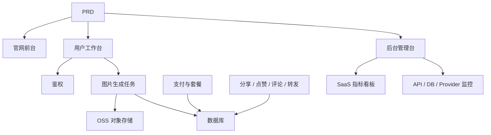

# 现代 AI 生图 SaaS 开发实战

这个项目不再只是“做一个页面”，而是围绕一份真实 PRD，把一个 AI 生图 SaaS 从想法推进到可上线产品。

你会同时看到三件事：

- 项目要做成什么
- 如何基于 PRD 拆解并推进开发
- 最后应该交付出什么样的效果

::: tip PRD 入口
本项目的需求文档在 GitHub： [查看 PRD](https://github.com/datawhalechina/easy-vibe/blob/main/docs/zh-cn/stage-2/assignments/modern-landing-page/PRD.md)
:::

<div style="margin: 32px 0;">
  <ClientOnly>
    <StepBar :active="0" :items="[
      { title: '看 PRD', description: '先明确页面、功能、鉴权、数据库、支付与监控范围' },
      { title: '生成骨架', description: '让 AI 先产出前台、工作台、后台三套界面骨架' },
      { title: '监工迭代', description: '逐页验收、补接口、修权限、补监控与数据链路' },
      { title: '交付上线', description: '完成可演示、可运行、可继续开发的 SaaS 原型' }
    ]" />
  </ClientOnly>
</div>

## 这个项目到底在做什么？

这是一个参考 Midjourney 产品体验的现代 AI 生图 SaaS：

- 官网前台：负责产品介绍、定价、FAQ、注册转化
- 用户工作台：负责 Prompt 输入、图片生成、图库、积分、套餐、社区互动
- 后台管理台：负责用户、任务、支付、积分、内容审核、SaaS 指标和系统监控

同时，后端需要接住这些关键能力：

- 用户鉴权
- 图片生成任务
- OSS 对象存储
- 积分与套餐支付
- 图片分享、点赞、评论、转发
- 留存、转化、API 调用、数据库状态监控

## 开发过程怎么走？

### 1. 先看 PRD，不要上来就写代码

先把这几个问题看清楚：

- 有几个入口：`www / app / admin`
- 有几个大页面
- 每个页面的核心功能是什么
- 后端模块和数据库表有哪些
- 第一版哪些做，哪些不做

如果 PRD 没拍板，就不要开始开发。

### 2. 先让 AI 生成“骨架版”

第一轮不是要它一次性写完，而是先生成：

- 官网首页
- 登录注册
- 生图工作台
- 历史图库
- 套餐/积分页
- 社区广场
- 后台首页与管理页骨架

这一步的目标是：把信息架构、路由、页面分工先搭出来。

### 3. 再进入“监工模式”

真正难的不是生成第一版，而是持续监工。

你要盯的重点包括：

- 页面结构是不是和 PRD 一致
- 前台、工作台、后台入口有没有分清
- 鉴权是不是做对了
- 普通用户和管理员权限有没有串
- 积分、支付、生成任务的状态流是不是闭环
- OSS 上传、数据库写入、任务状态更新是不是一致
- 后台有没有 SaaS 指标和系统监控

可以把 AI 当成执行者，但你自己要做“产品经理 + 技术负责人 + QA”。

### 4. 最后做联调和上线

最后一轮不是补页面，而是把完整链路跑通：



只要这条链路能跑通，这个项目就不是“Demo 页面”，而是一个完整产品原型。

## 怎么让 AI 帮你生成？

推荐按模块逐步下指令，而不是一句“帮我做完”。

例如先让它生成三套前端骨架：

```text
请基于当前 PRD，帮我生成一个现代 AI 生图 SaaS 的前端骨架。

要求：
1. 分成三个入口：www、app、admin
2. 官网包括：首页、定价、FAQ
3. app 包括：登录、注册、生成工作台、图库、套餐、积分、社区、作品详情、个人中心
4. admin 包括：后台首页、用户管理、任务管理、内容管理、套餐管理、支付订单、运营配置、SaaS 指标、系统监控
5. 先只生成页面结构和假数据，不接真实接口
6. 风格参考 Midjourney，简洁、现代、带产品感
```

然后再一块一块补：

- 鉴权
- 数据库
- OSS 上传
- 支付
- 积分系统
- 社区互动
- 后台统计和监控

## 怎么“监工”才有效？

每做完一个模块，至少检查这 5 件事：

| 检查项 | 要看什么 |
|------|------|
| 页面是否对 | 页面数量、入口、功能是否符合 PRD |
| 接口是否对 | 请求参数、返回结构、状态处理是否合理 |
| 权限是否对 | 普通用户和管理员是否隔离 |
| 数据是否对 | 数据库、OSS、支付、积分是否一致 |
| 演示是否对 | 是否真的能给别人完整演示一条链路 |

如果发现 AI 写偏了，不要整页推翻，直接让它改具体模块。

## 最后的预期效果

做完后，你应该拿到这些交付物：

- 一套可运行的 AI 生图 SaaS 项目
- 一份同级 PRD 文档
- 三套入口：`www / app / admin`
- 基础鉴权、支付、积分、OSS、社区互动、后台管理
- SaaS 指标看板和系统监控页
- 一份 README
- 一个可以演示的线上版本或本地完整运行方案

## 验收标准

| 维度 | 最低达标 |
|------|------|
| PRD 对齐 | 页面、功能、数据结构基本符合 PRD |
| 产品闭环 | 注册、购买积分、生成图片、查看历史、分享互动可以跑通 |
| 后台能力 | 用户、任务、支付、内容、积分、监控可以查看 |
| 工程完整度 | 前端、后端、数据库、OSS、支付链路都已接通 |
| 展示能力 | 可以清楚演示“从 PRD 到成品”的完整过程 |

::: tip 🚀 做完这个项目，你会得到什么？
你得到的不只是一个页面，也不只是一个小功能，而是一套完整的 AI SaaS 产品开发过程样例。后面再做别的项目，你可以继续沿用这套“先 PRD、再生成、再监工、再联调上线”的方法。
:::
