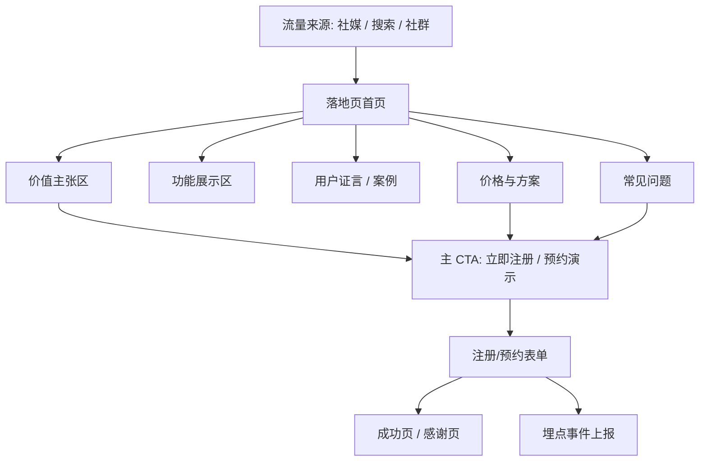
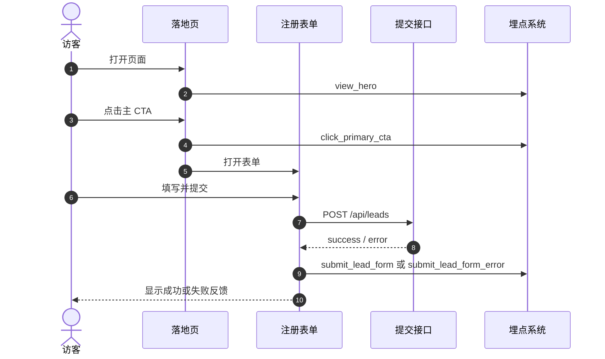

# 现代网页落地页

很多同学会写功能页，但一到“让用户第一次看到就愿意注册”的落地页就卡住了。

这份大作业就是专门练这件事：你要做一个真正能承接流量、讲清价值、引导转化的现代落地页，而不是“看起来像作业”的静态展示页。

::: tip 🎯 这次做什么？
打造一个 **可上线的现代产品落地页**。页面需要包含价值主张、核心功能展示、用户证言、价格方案、FAQ、明确 CTA（注册/预约演示）以及基础数据埋点，最终可以用于真实投放或作品集展示。
:::

<div style="margin: 32px 0;">
  <ClientOnly>
    <StepBar :active="0" :items="[
      { title: '定定位', description: '先锁定目标用户、价值主张与转化目标' },
      { title: '搭结构', description: '搭出页面区块、导航和响应式骨架' },
      { title: '做转化', description: '补齐文案、视觉、CTA 与埋点' },
      { title: '上线交付', description: '性能优化、部署与演示材料整理' }
    ]" />
  </ClientOnly>
</div>

## 为什么这个题目值得做？

因为落地页不是“前端练习题”，而是产品和增长的交叉点。

- 你会练到结构化表达：30 秒内让用户知道你是谁、你解决什么问题
- 你会练到工程能力：组件化、响应式、性能优化、SEO 基础
- 你会练到转化意识：CTA 设计、表单路径、埋点事件、A/B 迭代

做完这个项目，你不仅能做“页面”，还能做“会转化的页面”。

## 先看全景：一张图看懂这个作业



这张图表达的核心是：你的目标不是把每个模块都写出来，而是让用户自然走到 CTA 并完成动作。

## 1. 定定位：先把“做给谁看”讲清楚

### 建议你先写出这 4 句话

1. 我们的产品是什么？
2. 目标用户是谁？
3. 用户最痛的一个问题是什么？
4. 用户看完页面后希望他做什么动作？

### 项目边界（MVP）

第一版请严格控制范围：

- 只做 **单页落地页**，不要先做完整后台
- CTA 先聚焦 **一个主动作**（注册或预约演示二选一）
- 只做 **一个核心受众**，不要同时覆盖所有人群
- 先做静态内容 + 基础交互，不做复杂动画大片
- 埋点只做关键 3~5 个事件，不做全链路数据平台

### 页面模块规划

| 模块 | 目标 | 最低要求 |
|------|------|------|
| Hero 区 | 5 秒内传达价值 | 标题、副标题、主 CTA、视觉主图 |
| 功能区 | 解释“怎么解决” | 3~6 个核心能力卡片 |
| 信任区 | 提升可信度 | 用户证言、Logo、案例之一 |
| 价格区 | 降低决策成本 | 至少两档方案，强调推荐方案 |
| FAQ | 处理犹豫 | 4~8 个高频问题 |
| Footer | 完整闭环 | 联系方式、隐私/条款入口 |

## 2. 搭结构：先做骨架，再做精修

### 推荐技术栈

- **Next.js App Router** 或 **Vite + React**
- **TypeScript**
- **Tailwind CSS**
- **shadcn/ui**（可选）
- **Vercel Analytics / 自定义埋点**

### 第一步：生成可运行的页面骨架

你可以先让 AI IDE 生成第一版结构：

```text
请帮我创建一个现代 SaaS 落地页（Next.js + TypeScript + Tailwind）。

页面区块：
1. 顶部导航（logo、锚点、登录、注册）
2. Hero 区（主标题、副标题、CTA）
3. 功能介绍区（6 张卡片）
4. 用户证言区
5. 价格区（Free/Pro/Team）
6. FAQ 区（手风琴）
7. 页脚

要求：
- 风格现代、简洁，不要像课堂作业
- 先实现响应式布局
- 所有 CTA 有 hover/active 状态
- 预留事件埋点函数
```

### 第二步：补齐文案与信息层级

很多页面做不出转化，根因是信息顺序错了。你可以继续给 AI IDE：

```text
请优化我的落地页文案结构，目标是提高注册转化率。

背景：
- 目标用户：独立开发者和小团队
- 核心价值：用 AI 自动生成营销内容
- 主转化动作：点击“免费开始”

请输出：
1. Hero 标题 5 个备选
2. 副标题 5 个备选
3. CTA 按钮文案 5 个备选
4. 每个功能卡片的一句话价值描述
5. FAQ 建议问题列表
```

### 第三步：加关键交互与状态

至少补齐这几项：

- CTA 点击 loading 状态
- 表单提交成功/失败反馈
- 页面锚点平滑滚动
- 移动端菜单展开/收起
- 表单字段基础校验

## 3. 做转化：从“好看”走向“有效”

### 最小埋点方案

建议先只做以下事件：

| 事件名 | 触发时机 | 目的 |
|------|------|------|
| `view_hero` | 首屏展示 | 统计曝光 |
| `click_primary_cta` | 点击主 CTA | 统计主转化意图 |
| `view_pricing` | 价格区进入视口 | 评估价格区关注度 |
| `submit_lead_form` | 提交表单 | 统计核心转化 |
| `submit_lead_form_error` | 提交失败 | 发现转化阻塞点 |

### 转化路径时序图



## 4. 上线交付：从“能跑”到“能展示”

### 部署前检查

- Lighthouse 移动端性能建议 75+（第一版即可）
- 图片已压缩并使用现代格式
- 标题、描述、OG 基础信息已配置
- 所有 CTA 都有真实目标行为
- 关键事件埋点可在控制台看到

### 交付物

- 线上链接（Vercel/Netlify 等）
- 项目仓库地址
- 主要页面截图（桌面端 + 移动端）
- 60 秒演示视频（讲清目标用户与转化路径）
- README（启动方式、技术栈、埋点说明）

## 验收标准

| 维度 | 最低达标 | 加分项 |
|------|------|------|
| 页面完整度 | Hero/功能/价格/FAQ/页脚完整 | 信息密度与视觉层级优秀 |
| 转化设计 | 有明确主 CTA 和提交流程 | CTA 文案与位置经过对比优化 |
| 工程质量 | 响应式正常、交互状态完整 | 组件拆分清晰、复用性高 |
| 数据意识 | 关键事件埋点可用 | 有初步转化漏斗分析 |
| 交付能力 | 可访问链接 + README + 演示视频 | Lighthouse、SEO、无障碍基础优化 |

## 提交前最后检查

<el-card shadow="hover" style="margin: 20px 0; border-radius: 12px;">
  <template #header>
    <div style="font-weight: bold; font-size: 16px;">提交前最后看一眼</div>
  </template>

  <ul style="list-style-type: none; padding-left: 0;">
    <li><label><input type="checkbox" disabled /> 页面核心区块已全部完成并可访问</label></li>
    <li><label><input type="checkbox" disabled /> 主 CTA 路径可真实触发提交动作</label></li>
    <li><label><input type="checkbox" disabled /> 桌面端和移动端布局都可正常使用</label></li>
    <li><label><input type="checkbox" disabled /> 至少 3 个关键埋点事件已验证</label></li>
    <li><label><input type="checkbox" disabled /> 项目已部署并准备演示材料</label></li>
  </ul>
</el-card>

::: tip 🚀 完成后你会得到什么？
这会是你作品集中最“有商业味道”的页面之一。它证明你不只会做界面，还能围绕目标用户和转化结果来做产品页面。
:::
