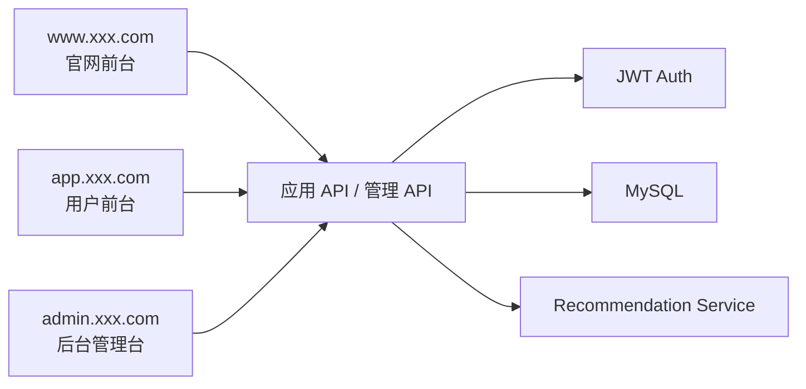
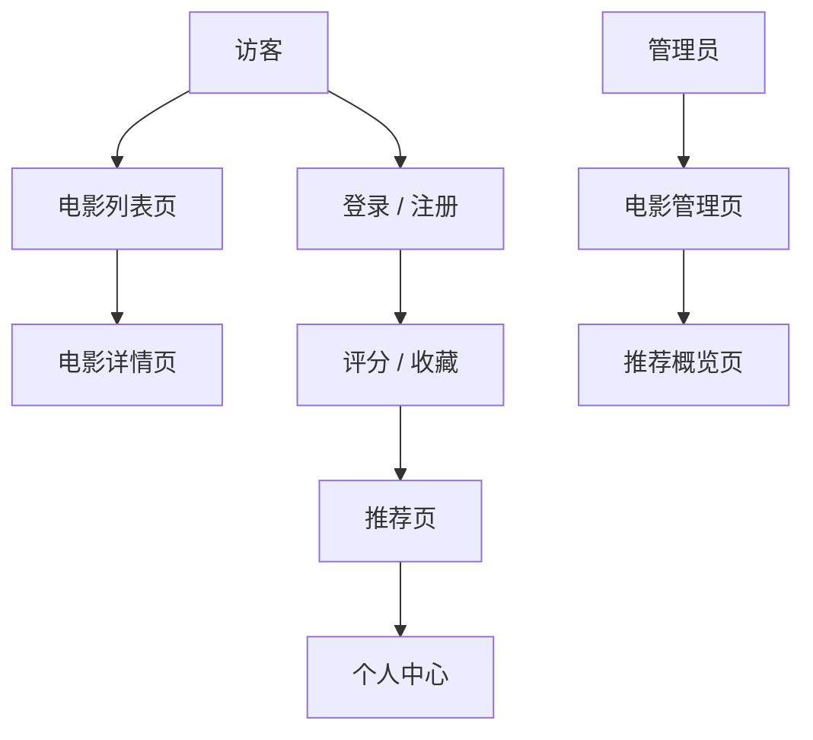

# PRD：Spring Boot 电影推荐系统

状态：Draft v0.1  
目标：明确推荐系统项目的最小可用边界和前后端分工。

## 1. 项目定位

这是一个“带推荐能力的电影站点”，不是纯展示页面。它需要把用户行为沉淀下来，并给出可解释推荐。

一句话定义：
做一个包含电影浏览、评分收藏、推荐结果与后台管理的电影推荐系统。

系统总览：



## 1.0 技术选型建议

- 前端框架：`React` 或 `Vue`
- 后端框架：`Spring Boot 3`
- 数据库：`MySQL`
- 鉴权：`JWT`
- 缓存：`Redis`（可选）

站点入口约定：

- 官网前台：`www.xxx.com`
- 用户前台：`app.xxx.com`
- 后台管理台：`admin.xxx.com`

## 1.1 竞品参考（官方）

- [Letterboxd](https://letterboxd.com/)
- [IMDb](https://www.imdb.com/)

## 1.2 产品借鉴点

本项目的产品设计建议参考真实电影产品的做法：

- 借鉴 `Letterboxd` 的社区化电影浏览体验：电影卡片、评分、收藏、个人记录要自然串起来
- 借鉴 `IMDb` 的详情页信息组织：海报、简介、标签、评分、演员和关联内容分层展示
- 推荐页不能只是一个列表，应当同时展示推荐理由
- 个人中心要强调“我的评分 / 我的收藏 / 我的推荐偏好”
- 后台管理应像内容后台，而不是简单 CRUD 页面

## 1.3 竞品页面拆解

建议重点参考的竞品页面结构：

- `Letterboxd` 首页与个人页
  - 重点看：电影浏览、评分记录、收藏和个人偏好的组织方式
- `IMDb` 电影详情页
  - 重点看：海报、简介、标签、评分、演员与相关内容的层次
- `IMDb` 排行榜和推荐内容区域
  - 重点看：卡片式展示和浏览路径设计

因此本项目建议：

- 列表页更像内容浏览页
- 详情页更像内容详情页
- 推荐页更像“为你推荐”
- 后台页更像内容运营后台

## 2. 目标用户与核心目标

目标用户：

- 浏览和筛选电影的普通用户
- 愿意通过评分与收藏改善推荐结果的注册用户
- 维护影片信息和推荐质量的管理员

核心目标：

- 用户可以完成浏览、评分、收藏闭环
- 系统可给出 TopN 推荐结果
- 推荐结果要有基础可解释性

## 3. MVP 范围

第一版必须包含：

- 注册/登录
- 电影列表和详情
- 搜索、分类、分页
- 用户评分
- 收藏电影
- 推荐页
- 管理后台维护电影数据

第一版不做：

- 复杂协同过滤算法
- 视频播放
- 评论社区
- 多维画像系统
- 实时推荐流计算

## 4. 角色与权限

| 角色 | 权限 |
|------|------|
| 游客 | 浏览电影列表与详情 |
| 注册用户 | 评分、收藏、查看推荐 |
| 管理员 | 管理电影数据、查看推荐概览 |

## 5. 前端实现

## 5.1 页面架构总览

当前 PRD 定义为 `3 套入口，9 个大页面`：

- 官网前台 `1` 个大页面
- 用户前台 `5` 个大页面
- 后台管理台 `3` 个大页面

### A. 官网前台 `www.xxx.com`

#### 1. 官网首页 `www:/`

核心功能：

- 产品介绍
- 热门电影
- 注册入口

### B. 用户前台 `app.xxx.com`

#### 2. 登录页 `app:/login`

核心功能：

- 登录
- 注册入口

#### 3. 电影列表页 `app:/movies`

核心功能：

- 浏览电影
- 搜索和筛选
- 分页

#### 4. 电影详情页 `app:/movies/:id`

核心功能：

- 查看海报和简介
- 评分
- 收藏
- 查看标签和推荐理由

#### 5. 推荐页 `app:/recommendations`

核心功能：

- 查看个性化推荐
- 查看推荐理由

#### 6. 个人中心 `app:/me`

核心功能：

- 查看评分历史
- 查看收藏
- 查看个人偏好

### C. 后台管理台 `admin.xxx.com`

#### 7. 后台首页 `admin:/`

核心功能：

- 电影总数
- 用户行为概览
- 推荐效果概览

#### 8. 电影管理页 `admin:/movies`

核心功能：

- 新增电影
- 编辑电影
- 管理标签

#### 9. 推荐概览页 `admin:/recommendations`

核心功能：

- 查看推荐结果
- 查看热门标签
- 查看用户行为统计

## 5.2 关键用户链路



关键状态流：

- 用户：游客 -> 注册用户
- 电影交互：未评分 -> 已评分
- 推荐：冷启动 -> 有偏好推荐

推荐技术栈：

- React 或 Vue
- TypeScript
- Ant Design / shadcn/ui

建议页面：

| 页面 | 路径 | 说明 |
|------|------|------|
| 首页 | `/` | 热门电影、推荐入口 |
| 电影列表页 | `/movies` | 搜索、筛选、分页 |
| 电影详情页 | `/movies/:id` | 简介、标签、评分、收藏 |
| 推荐页 | `/recommendations` | 个性化推荐列表 |
| 个人中心 | `/me` | 评分与收藏记录 |
| 管理后台 | `/admin/movies` | 电影维护 |

前端关键组件：

- 电影卡片
- 搜索筛选栏
- 评分组件
- 收藏按钮
- 推荐理由展示卡片
- 后台表格和编辑弹窗

## 6. 后端实现

推荐技术栈：

- Java 17
- Spring Boot 3
- Spring Web
- Spring Data JPA
- MySQL 8
- JWT 鉴权

后端模块：

- `auth`
- `movies`
- `ratings`
- `favorites`
- `recommendations`
- `admin`

建议数据表：

```sql
users (
  id bigint primary key auto_increment,
  email varchar(120),
  password_hash varchar(255),
  role varchar(20),
  created_at datetime
)

movies (
  id bigint primary key auto_increment,
  title varchar(200),
  summary text,
  release_year int,
  poster_url varchar(500),
  created_at datetime
)

movie_tags (
  id bigint primary key auto_increment,
  movie_id bigint,
  tag varchar(50)
)

ratings (
  id bigint primary key auto_increment,
  user_id bigint,
  movie_id bigint,
  score int,
  created_at datetime
)

favorites (
  id bigint primary key auto_increment,
  user_id bigint,
  movie_id bigint,
  created_at datetime
)

recommendation_logs (
  id bigint primary key auto_increment,
  user_id bigint,
  strategy varchar(50),
  result_count int,
  created_at datetime
)
```

## 6.1 后台指标与监控

后台建议至少查看这些指标：

- 电影总数
- 日评分数
- 收藏率
- 推荐点击率
- 热门标签分布
- 冷启动用户占比

基础监控建议：

- 推荐接口响应耗时
- 评分写入成功率
- 数据库慢查询
- 缓存命中率（如果用了 Redis）

## 7. 推荐策略

第一版推荐策略建议：

- 基于标签偏好
- 结合用户评分权重
- 冷启动时叠加热门电影
- 过滤已评分/已收藏电影

推荐结果应展示：

- 推荐分值
- 推荐理由
- 对应标签

## 8. 接口草案

| 方法 | 路径 | 说明 |
|------|------|------|
| `POST` | `/api/auth/register` | 注册 |
| `POST` | `/api/auth/login` | 登录 |
| `GET` | `/api/movies` | 电影列表，支持搜索与分页 |
| `GET` | `/api/movies/:id` | 电影详情 |
| `POST` | `/api/movies/:id/ratings` | 提交评分 |
| `POST` | `/api/movies/:id/favorite` | 收藏电影 |
| `DELETE` | `/api/movies/:id/favorite` | 取消收藏 |
| `GET` | `/api/recommendations` | 获取推荐结果 |
| `GET` | `/api/me/profile` | 获取用户资料和行为摘要 |
| `POST` | `/api/admin/movies` | 新增电影 |
| `PATCH` | `/api/admin/movies/:id` | 编辑电影 |

`GET /api/recommendations` 返回示例：

```json
{
  "items": [
    {
      "movieId": 12,
      "title": "Interstellar",
      "score": 0.91,
      "reason": "你近期给高分的科幻与冒险标签影片较多"
    }
  ]
}
```

## 9. 关键业务规则

- 每个用户对同一电影只保留一条评分
- 收藏与评分都能影响推荐
- 管理员接口必须单独鉴权
- 推荐结果至少返回 10 条或当前可用最大值

## 10. 非功能要求

- 推荐结果应可解释
- 列表与详情页加载要可接受
- 管理员接口与普通用户接口权限严格分离
- 推荐缓存和行为数据允许后续扩展

## 11. 开发顺序建议

1. 登录与用户体系
2. 电影列表与详情
3. 评分与收藏
4. 推荐接口
5. 后台管理页

## 12. 待确认项

- 前端选 React 还是 Vue
- 推荐解释文案是后端拼接还是前端渲染
- 是否需要影片导入脚本
- 后台是否要包含标签管理
