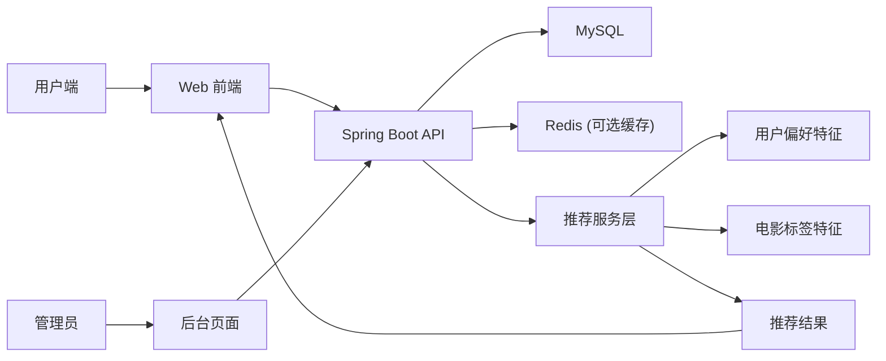
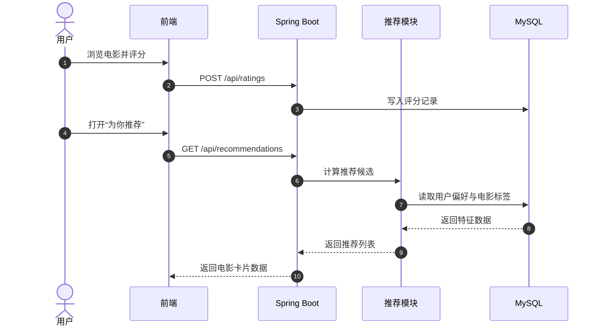
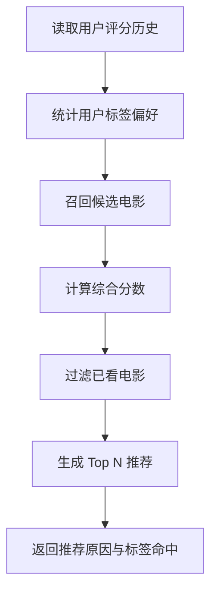

# 电影推荐网 (Spring Boot)

推荐系统是最典型的“看起来简单，做起来很像真实业务系统”的题目。

这次大作业你会从“电影列表网站”升级到“可登录、可评分、可推荐、可管理”的完整产品原型。

::: tip 🎯 这次做什么？
打造一个 **电影推荐网站（Spring Boot）**。用户登录后可浏览电影、搜索筛选、评分收藏，并获得个性化推荐；管理员可维护电影数据、查看用户行为统计与推荐效果。
:::

<div style="margin: 32px 0;">
  <ClientOnly>
    <StepBar :active="0" :items="[
      { title: '定边界', description: '先锁定推荐策略和第一版业务范围' },
      { title: '搭基础', description: '先做用户、电影、评分这些核心页面' },
      { title: '做推荐', description: '接通 Spring Boot 接口与推荐逻辑' },
      { title: '上线交付', description: '补齐后台、部署和演示材料' }
    ]" />
  </ClientOnly>
</div>

## 为什么这个题目适合 Stage 2？

因为它能一次性把你带过 5 个关键能力：

- **后端工程化**：Controller / Service / Repository 分层
- **数据建模**：用户、电影、标签、评分、推荐结果
- **业务逻辑**：搜索筛选、评分行为、收藏与历史
- **推荐算法入门**：规则推荐或协同过滤
- **管理能力**：后台维护数据与查看指标

做完后你不仅能讲“我写了个网站”，还能讲清楚“推荐是怎么跑起来的”。

## 先看系统全景





## 1. 定边界：别一上来就做“工业级推荐系统”

### 角色设计

| 角色 | 核心动作 |
|------|------|
| 普通用户 | 注册登录、浏览电影、搜索筛选、评分收藏、查看推荐 |
| 管理员 | 电影信息管理、标签管理、用户行为统计、推荐结果抽查 |

### 核心页面规划

| 页面 | 路径 | 说明 |
|------|------|------|
| 首页 | `/` | 热门电影与推荐入口 |
| 登录/注册 | `/login` `/register` | 用户认证 |
| 电影列表 | `/movies` | 搜索、筛选、分页 |
| 电影详情 | `/movies/:id` | 简介、标签、评分、评论 |
| 推荐页 | `/recommendations` | 个性化推荐结果 |
| 收藏页 | `/favorites` | 收藏电影管理 |
| 管理后台 | `/admin` | 电影与标签维护、统计看板 |

### 第一版推荐策略（建议）

第一版只做一套简单但稳定的推荐规则：

- 基于用户历史评分的 **标签偏好加权**
- 再叠加热门度分数（避免冷启动全空）
- 去掉用户已看/已评分电影

先把可解释、可跑通的推荐做出来，比复杂算法更重要。

## 2. 搭基础：先完成“非推荐功能闭环”

### 推荐技术栈

- 后端：Spring Boot 3 + Spring Web + Spring Data JPA
- 数据库：MySQL 8
- 缓存：Redis（可选）
- 前端：Vue/React 任一（可由 AI IDE 生成）
- 鉴权：JWT

### 数据模型建议

```sql
users (
  id bigint primary key auto_increment,
  email varchar(120),
  password_hash varchar(255),
  role varchar(20), -- user / admin
  created_at datetime
)

movies (
  id bigint primary key auto_increment,
  title varchar(200),
  summary text,
  release_year int,
  poster_url varchar(500),
  created_at datetime
)

movie_tags (
  id bigint primary key auto_increment,
  movie_id bigint,
  tag varchar(50)
)

ratings (
  id bigint primary key auto_increment,
  user_id bigint,
  movie_id bigint,
  score int, -- 1~5
  created_at datetime
)

favorites (
  id bigint primary key auto_increment,
  user_id bigint,
  movie_id bigint,
  created_at datetime
)
```

### 第一步：用 AI IDE 生成 Spring Boot 骨架

```text
请帮我搭建一个 Spring Boot 电影推荐网站后端骨架。

要求：
- Java 17 + Spring Boot 3
- 分层结构：controller / service / repository / model / dto
- MySQL + JPA
- JWT 登录鉴权

接口优先实现：
1. 用户注册登录
2. 电影列表查询（分页+关键词）
3. 电影详情
4. 用户评分
5. 收藏与取消收藏

请先给出目录结构和关键类清单，再逐步生成代码。
```

### 第二步：补齐前端基础页面

```text
请帮我生成一个电影推荐网站前端页面骨架。

页面包括：
- 首页
- 电影列表页（筛选+分页）
- 电影详情页（评分+收藏）
- 推荐页
- 个人中心
- 管理后台

要求：
- 组件化开发
- 有 loading、空态、错误提示
- 先接 mock 接口，再切换真实 API
```

<div style="margin: 32px 0;">
  <ClientOnly>
    <StepBar :active="1" :items="[
      { title: '定边界', description: '先锁定推荐策略和第一版业务范围' },
      { title: '搭基础', description: '先做用户、电影、评分这些核心页面' },
      { title: '做推荐', description: '接通 Spring Boot 接口与推荐逻辑' },
      { title: '上线交付', description: '补齐后台、部署和演示材料' }
    ]" />
  </ClientOnly>
</div>

## 3. 做推荐：先做“可解释推荐”，再做“更聪明推荐”

### 推荐模块拆分建议

| 模块 | 职责 |
|------|------|
| CandidateService | 召回候选电影（未看、同标签、热门） |
| RankingService | 按偏好分数排序并截断 TopN |
| ExplainService | 生成“为什么推荐这部电影”文案 |
| RecommendationController | 对外提供推荐接口 |

### 推荐流程图



### 第三步：让 AI IDE 帮你实现推荐接口

```text
请帮我实现 Spring Boot 推荐接口 GET /api/recommendations。

业务规则：
1. 根据用户最近评分记录统计偏好标签权重
2. 从同标签电影中召回候选
3. 结合全站热门度做加权
4. 去掉用户已经评分过的电影
5. 返回前 12 条推荐，并附带推荐理由

要求：
- Service 层拆分清晰
- SQL 或 JPA 查询可读
- 返回结构包含 movieId、title、score、reason
- 给出最小可跑通的单元测试示例
```

### 第四步：补管理员统计页

第一版至少展示这些指标：

- 总用户数
- 总电影数
- 最近 7 天评分次数
- 推荐接口成功率与平均耗时

这样你可以快速发现系统是否健康，而不是“看起来能用但实际经常失败”。

## 4. 上线与交付

### 交付物

- Spring Boot 后端仓库（含数据库初始化脚本）
- 前端项目仓库（或单仓 monorepo）
- 可访问演示地址
- README（本地启动、环境变量、部署方式）
- 60 秒演示视频

### 验收标准

| 维度 | 最低达标 | 加分项 |
|------|------|------|
| 基础功能 | 注册登录、电影浏览、评分收藏都可用 | 评论、观看历史等拓展功能 |
| 推荐质量 | 推荐列表可生成且有理由 | 支持冷启动策略与个性化解释 |
| 工程质量 | 接口分层清晰，错误可追踪 | 有单测与缓存优化 |
| 管理能力 | 管理员可维护电影和标签 | 有统计看板和告警阈值 |
| 交付能力 | 可部署、文档完整、可复现 | CI/CD 或自动化脚本 |

## 提交前最后检查

<el-card shadow="hover" style="margin: 20px 0; border-radius: 12px;">
  <template #header>
    <div style="font-weight: bold; font-size: 16px;">提交前最后看一眼</div>
  </template>

  <ul style="list-style-type: none; padding-left: 0;">
    <li><label><input type="checkbox" disabled /> 用户可注册登录并浏览电影</label></li>
    <li><label><input type="checkbox" disabled /> 评分与收藏数据已写入数据库</label></li>
    <li><label><input type="checkbox" disabled /> 推荐页能返回个性化结果</label></li>
    <li><label><input type="checkbox" disabled /> 推荐结果包含“推荐理由”字段</label></li>
    <li><label><input type="checkbox" disabled /> 管理后台可维护电影与标签</label></li>
    <li><label><input type="checkbox" disabled /> 项目可部署且 README 可复现</label></li>
  </ul>
</el-card>
