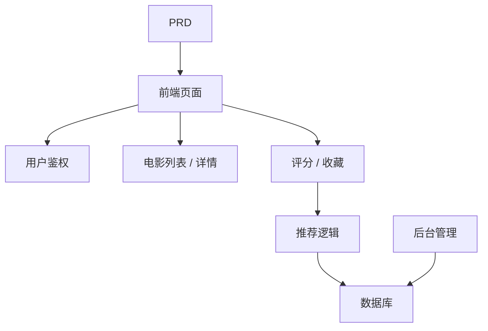

# Spring Boot 电影推荐系统开发实战

这个项目不是“做一个电影列表页”，而是围绕一份真实 PRD，把一个带推荐能力的内容产品从想法推进到可上线原型。

你会同时看到三件事：

- 项目要做成什么
- 如何基于 PRD 拆解并推进开发
- 最后应该交付出什么样的效果

::: tip PRD 入口
本项目的需求文档在 GitHub： [查看 PRD](https://github.com/datawhalechina/easy-vibe/blob/main/docs/zh-cn/stage-2/assignments/movie-recommendation-springboot/PRD.md)
:::

<div style="margin: 32px 0;">
  <ClientOnly>
    <StepBar :active="0" :items="[
      { title: '看 PRD', description: '先明确页面、评分收藏、推荐逻辑和后台范围' },
      { title: '生成骨架', description: '让 AI 先产出列表页、详情页、推荐页和后台页骨架' },
      { title: '监工迭代', description: '逐页验收、补接口、修推荐逻辑和数据链路' },
      { title: '交付上线', description: '完成可演示、可运行、可继续开发的推荐系统原型' }
    ]" />
  </ClientOnly>
</div>

## 这个项目到底在做什么？

这是一个带推荐能力的电影网站：

- 用户可以浏览、搜索、评分、收藏电影
- 系统根据用户行为给出推荐结果
- 管理员可以维护电影数据和查看推荐效果

## 开发过程怎么走？

### 1. 先看 PRD，不要上来就写代码

先确认：

- 推荐策略是不是先用可解释版本
- 页面和后台范围是否拍板
- 用户行为数据要存哪些
- 管理员要看哪些推荐效果指标

### 2. 先让 AI 生成“骨架版”

第一轮先生成：

- 首页
- 电影列表页
- 电影详情页
- 推荐页
- 个人中心
- 管理后台

### 3. 再进入“监工模式”

你要重点盯这几件事：

- 列表、详情、评分、收藏是不是闭环
- 推荐结果是不是和行为数据联动
- 推荐理由是不是可解释
- 后台电影数据和用户行为是不是能查看

### 4. 最后做联调和上线



## 怎么让 AI 帮你生成？

```text
请基于当前 PRD，帮我生成一个 Spring Boot 电影推荐系统的前端骨架。

要求：
1. 页面包括：首页、电影列表、电影详情、推荐页、个人中心、后台管理
2. 先只生成页面结构和假数据，不接真实接口
3. 风格要像真实内容产品，而不是课堂 demo
```

## 怎么“监工”才有效？

| 检查项 | 要看什么 |
|------|------|
| 页面是否对 | 页面数量、功能是否符合 PRD |
| 接口是否对 | movies、ratings、favorites、recommendations 是否闭环 |
| 数据是否对 | 用户行为是否影响推荐结果 |
| 推荐是否对 | 推荐理由是否清晰、结果是否可解释 |
| 演示是否对 | 是否能演示“浏览 -> 评分 -> 推荐变化” |

## 最后的预期效果

- 一套可运行的电影推荐系统
- 一份同级 PRD 文档
- 浏览、评分、收藏、推荐、后台管理
- Spring Boot 后端与推荐逻辑
- README 和演示方案

## 验收标准

| 维度 | 最低达标 |
|------|------|
| PRD 对齐 | 页面、功能、数据结构基本符合 PRD |
| 产品闭环 | 浏览、评分、收藏、推荐可以跑通 |
| 后台能力 | 电影数据和推荐效果可查看 |
| 工程完整度 | 前端、后端、数据库、推荐接口已接通 |
| 展示能力 | 可以清楚演示“从 PRD 到成品”的过程 |

::: tip 🚀 完成后你会得到什么？
你得到的不只是一个电影站，而是一套“内容 + 行为 + 推荐”型产品的开发样例。
:::
