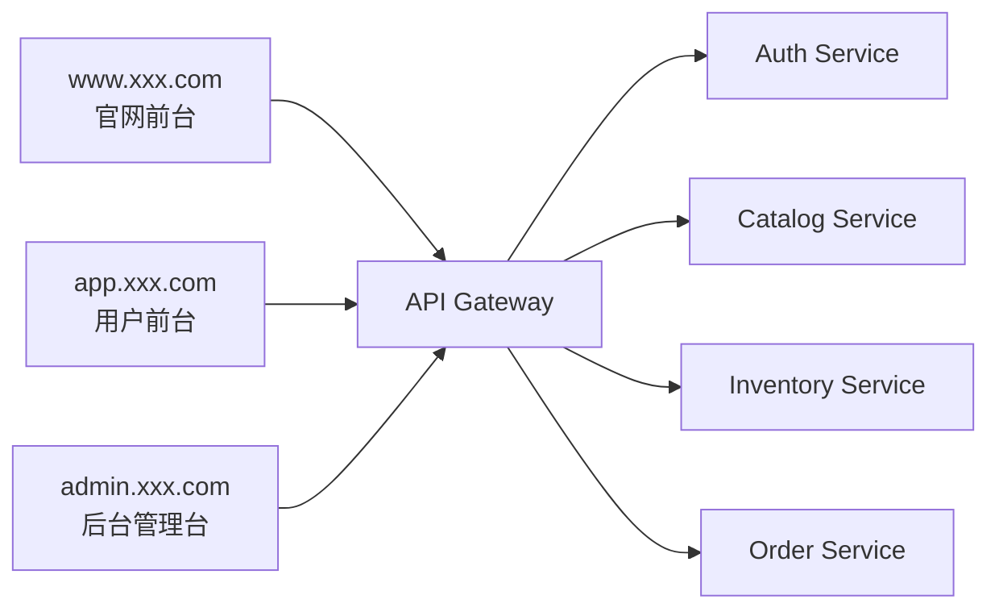
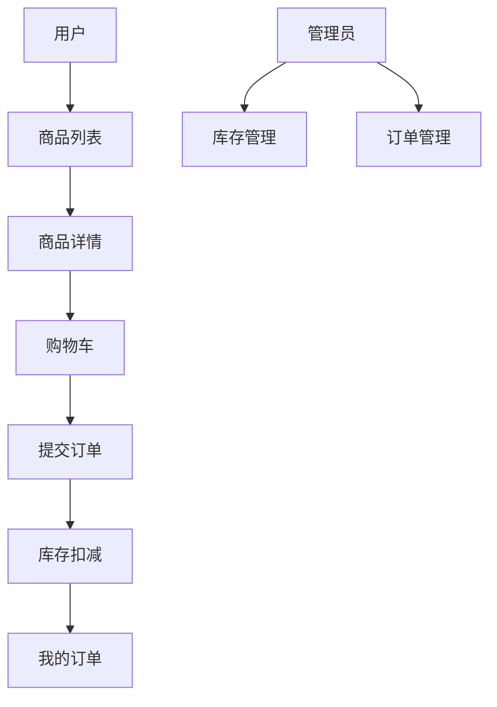

# PRD：生鲜电商微服务系统

状态：Draft v0.1  
目标：先明确服务拆分、数据边界和交易主链路，再进入开发。

## 1. 项目定位

这是一个用来练微服务拆分和服务协作的电商系统。重点不是做复杂运营功能，而是跑通：

- 商品浏览
- 下单
- 扣库存
- 查订单
- 管理端调库存

一句话定义：
做一个由网关、鉴权、商品、库存、订单协作完成交易闭环的生鲜电商微服务系统。

系统总览：



## 1.0 技术选型建议

- 前端框架：`Next.js`
- 网关：`Node.js + Express/Fastify`
- 服务层：`Node.js + Express/Fastify`
- 数据库：`PostgreSQL`
- 鉴权：`JWT`
- 编排：`Docker Compose`

站点入口约定：

- 官网前台：`www.xxx.com`
- 用户前台：`app.xxx.com`
- 后台管理台：`admin.xxx.com`

## 1.1 竞品参考（官方）

- [Instacart](https://www.instacart.com/)

## 1.2 产品借鉴点

本项目的产品设计建议参考真实生鲜电商产品：

- 借鉴 `Instacart` 的用户购物路径：从商品浏览到购物车、订单查看都应足够直接
- 商品页和购物车页应强调价格、库存状态和操作反馈
- 管理端页面应更像运营后台，突出商品、库存、订单状态管理
- 前台页面不需要做得很复杂，但一定要把“下单链路”做顺
- 微服务拆分服务于业务边界，前端体验要尽量像统一产品，而不是几个接口拼起来

## 1.3 竞品页面拆解

建议重点参考的竞品页面结构：

- `Instacart` 首页与商品分类页
  - 重点看：分类、商品卡片、购物入口的清晰程度
- `Instacart` 购物车与结算体验
  - 重点看：从商品到下单的路径是否顺畅
- 电商后台常见商品/订单管理思路
  - 重点看：列表、状态筛选、库存调整这些基础运营动作

因此本项目建议：

- 用户端更强调“快速下单”
- 管理端更强调“状态管理”
- 微服务架构隐藏在后台，前台体验仍应统一

## 2. 目标用户与核心目标

目标用户：

- 浏览商品并下单的普通用户
- 调整商品与库存的管理员

核心目标：

- 用户下单链路完整可追踪
- 库存与订单状态一致
- 每个服务边界清晰，可独立维护

## 3. MVP 范围

第一版必须包含：

- API Gateway
- Auth 服务
- Catalog 服务
- Inventory 服务
- Order 服务
- 用户端商品列表/详情/下单
- 管理端商品与库存管理

第一版不做：

- 真实支付
- 优惠券和促销
- 秒杀
- 消息队列集群
- 分布式事务框架

## 4. 角色与权限

| 角色 | 权限 |
|------|------|
| 普通用户 | 浏览商品、下单、查看自己的订单 |
| 管理员 | 商品上下架、库存调整、查看订单 |

## 5. 前端实现

## 5.1 页面架构总览

当前 PRD 定义为 `3 套入口，9 个大页面`：

- 官网前台 `1` 个大页面
- 用户前台 `4` 个大页面
- 后台管理台 `4` 个大页面

### A. 官网前台 `www.xxx.com`

#### 1. 官网首页 `www:/`

核心功能：

- 品类入口
- 活动区
- 登录入口

### B. 用户前台 `app.xxx.com`

#### 2. 商品列表页 `app:/products`

核心功能：

- 浏览分类
- 查看商品卡片
- 加入购物车

#### 3. 商品详情页 `app:/products/:id`

核心功能：

- 查看商品详情
- 查看库存状态
- 加入购物车

#### 4. 购物车页 `app:/cart`

核心功能：

- 查看购物车
- 修改数量
- 提交订单

#### 5. 订单页 `app:/orders`

核心功能：

- 查看我的订单
- 查看订单状态

### C. 后台管理台 `admin.xxx.com`

#### 6. 后台首页 `admin:/`

核心功能：

- 商品数
- 库存预警
- 订单概览

#### 7. 商品管理页 `admin:/products`

核心功能：

- 上下架商品
- 编辑价格与分类

#### 8. 库存管理页 `admin:/inventory`

核心功能：

- 查看库存
- 调整库存

#### 9. 订单管理页 `admin:/orders`

核心功能：

- 查看订单
- 筛选状态

## 5.2 关键用户链路



关键状态流：

- 订单：待创建 -> 已创建 -> 已完成 / 已取消
- 库存：可用 -> 预扣 -> 确认扣减 / 回滚

推荐技术栈：

- Next.js
- TypeScript
- Tailwind CSS

建议页面：

| 页面 | 路径 | 说明 |
|------|------|------|
| 首页 | `/` | 商品列表与分类 |
| 商品详情 | `/products/:id` | 商品信息与加入购物车 |
| 购物车 | `/cart` | 确认下单 |
| 我的订单 | `/orders` | 查看订单历史 |
| 管理后台商品页 | `/admin/products` | 商品维护 |
| 管理后台库存页 | `/admin/inventory` | 库存调整 |
| 管理后台订单页 | `/admin/orders` | 订单列表与状态 |

前端关键组件：

- 商品卡片
- 购物车抽屉/页面
- 订单状态标签
- 管理后台表格
- 库存调整弹窗

## 6. 后端实现

推荐技术栈：

- Node.js + Express/Fastify
- PostgreSQL
- Docker Compose

服务拆分：

| 服务 | 职责 |
|------|------|
| `api-gateway` | 统一路由、鉴权、聚合返回 |
| `auth-service` | 注册、登录、JWT 校验 |
| `catalog-service` | 商品信息、分类、上下架 |
| `inventory-service` | 库存查询、预扣、回滚 |
| `order-service` | 订单创建、状态流转、查询 |

建议数据模型：

```sql
users (
  id uuid primary key,
  email text,
  password_hash text,
  role text,
  created_at timestamptz
)

products (
  id uuid primary key,
  name text,
  category text,
  price_cents int,
  status text,
  created_at timestamptz
)

inventory_items (
  id uuid primary key,
  product_id uuid,
  available_quantity int,
  reserved_quantity int,
  updated_at timestamptz
)

orders (
  id uuid primary key,
  user_id uuid,
  total_amount_cents int,
  status text,
  created_at timestamptz
)

order_items (
  id uuid primary key,
  order_id uuid,
  product_id uuid,
  quantity int,
  price_cents int
)
```

## 6.1 后台指标与监控

后台建议至少查看这些指标：

- 下单成功率
- 库存回滚次数
- 热销商品排行
- 订单状态分布
- 库存预警数

基础监控建议：

- 网关错误率
- 鉴权服务成功率
- 库存服务超时率
- 订单创建失败率

## 7. 下单主链路

主流程：

1. 用户提交订单
2. Gateway 完成鉴权
3. Order 服务校验商品
4. Inventory 服务预扣库存
5. Order 服务创建订单
6. 成功则确认库存，失败则补偿回滚

关键规则：

- 库存不足直接失败
- 同一个订单只允许一次成功创建
- 所有状态变化要可追踪

## 8. 接口草案

外部接口统一走 Gateway：

| 方法 | 路径 | 说明 |
|------|------|------|
| `POST` | `/api/auth/register` | 注册 |
| `POST` | `/api/auth/login` | 登录 |
| `GET` | `/api/catalog/products` | 商品列表 |
| `GET` | `/api/catalog/products/:id` | 商品详情 |
| `POST` | `/api/orders` | 创建订单 |
| `GET` | `/api/orders/my` | 当前用户订单列表 |
| `GET` | `/api/orders/:id` | 订单详情 |
| `PATCH` | `/api/inventory/:productId` | 管理员调整库存 |
| `POST` | `/api/admin/products` | 管理员新增商品 |
| `PATCH` | `/api/admin/products/:id` | 管理员编辑商品 |

`POST /api/orders` 请求示例：

```json
{
  "items": [
    { "productId": "p1", "quantity": 2 },
    { "productId": "p2", "quantity": 1 }
  ]
}
```

## 9. 非功能要求

- 本地一键启动
- 服务之间日志可追踪
- 接口返回结构统一
- 关键链路有错误处理和补偿逻辑

## 10. 开发顺序建议

1. Monorepo/Workspaces 与 Gateway
2. Auth 服务
3. Catalog 与 Inventory
4. Order 下单闭环
5. 前端用户端与管理端
6. Docker Compose 与文档

## 11. 待确认项

- 前端是否做购物车持久化
- 服务间通信先用 HTTP 还是预留消息机制
- 商品与库存是否拆独立数据库
- 管理端是否允许直接修改订单状态
