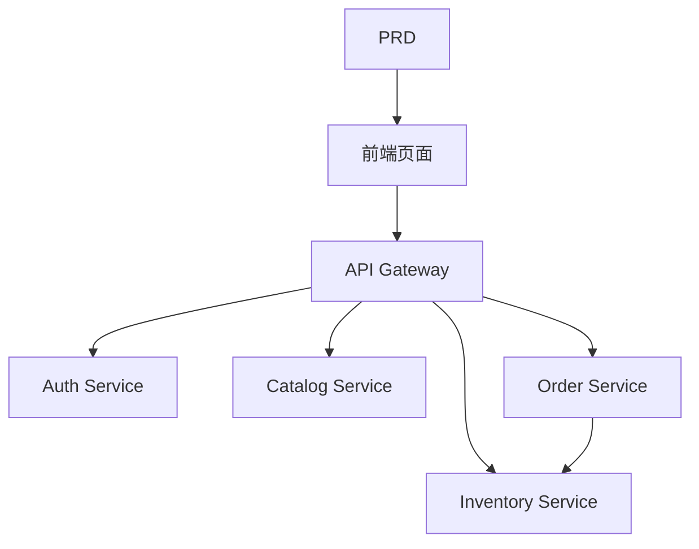

# 生鲜电商微服务系统开发实战

这个项目不是“做一个买菜网站”，而是围绕一份真实 PRD，把一个微服务电商系统从想法推进到可运行原型。

你会同时看到三件事：

- 项目要做成什么
- 如何基于 PRD 拆解并推进开发
- 最后应该交付出什么样的效果

::: tip PRD 入口
本项目的需求文档在 GitHub： [查看 PRD](https://github.com/datawhalechina/easy-vibe/blob/main/docs/zh-cn/stage-2/assignments/simple-grocery-microservices/PRD.md)
:::

<div style="margin: 32px 0;">
  <ClientOnly>
    <StepBar :active="0" :items="[
      { title: '看 PRD', description: '先明确服务拆分、页面、交易链路和补偿策略' },
      { title: '生成骨架', description: '让 AI 先产出前端、网关和服务骨架' },
      { title: '监工迭代', description: '逐模块验收、补接口、修库存与订单一致性' },
      { title: '交付上线', description: '完成可演示、可运行、可继续开发的微服务原型' }
    ]" />
  </ClientOnly>
</div>

## 这个项目到底在做什么？

这是一个生鲜电商微服务系统：

- 用户端负责浏览商品、下单、查看订单
- 管理端负责商品、库存和订单管理
- 后端按业务拆成网关、鉴权、商品、库存、订单服务

## 开发过程怎么走？

### 1. 先看 PRD，不要上来就写代码

先确认：

- 服务拆分是否拍板
- 前台和管理端页面是否清楚
- 下单、库存扣减和补偿策略是否明确
- 第一版哪些复杂能力先不做

### 2. 先让 AI 生成“骨架版”

第一轮先生成：

- 用户端首页、商品页、购物车、订单页
- 管理端商品、库存、订单管理页
- API Gateway
- auth、catalog、inventory、order 四个服务骨架

### 3. 再进入“监工模式”

你要重点盯这几件事：

- 网关路由是否正确
- JWT 和角色权限是否正确
- 商品和库存数据是否一致
- 下单后库存和订单状态是否闭环
- 失败补偿是否真的能回滚

### 4. 最后做联调和上线



## 怎么让 AI 帮你生成？

```text
请基于当前 PRD，帮我生成一个生鲜电商微服务系统的项目骨架。

要求：
1. 生成前端用户端和管理端骨架
2. 生成 api-gateway、auth-service、catalog-service、inventory-service、order-service 五个目录
3. 每个服务先只做最小可运行入口
4. 先不接真实数据库和支付
```

## 怎么“监工”才有效？

| 检查项 | 要看什么 |
|------|------|
| 页面是否对 | 页面数量、入口、功能是否符合 PRD |
| 接口是否对 | catalog、inventory、orders 是否闭环 |
| 权限是否对 | 用户与管理员权限是否隔离 |
| 数据是否对 | 商品、库存、订单状态是否一致 |
| 演示是否对 | 是否能演示“浏览 -> 下单 -> 查单 -> 管理库存” |

## 最后的预期效果

- 一套可运行的生鲜电商微服务系统
- 一份同级 PRD 文档
- 用户端、管理端、网关和 4 个核心服务
- JWT 鉴权、库存扣减、订单管理
- README 和演示方案

## 验收标准

| 维度 | 最低达标 |
|------|------|
| PRD 对齐 | 页面、功能、数据结构基本符合 PRD |
| 产品闭环 | 浏览、下单、库存、查单可以跑通 |
| 后台能力 | 商品、库存、订单管理可以查看 |
| 工程完整度 | 前端、网关、服务、数据库链路已接通 |
| 展示能力 | 可以清楚演示“从 PRD 到成品”的过程 |

::: tip 🚀 完成后你会得到什么？
你得到的不只是一个电商练习题，而是一套微服务项目的开发样例。后面再做复杂后端系统时，这会非常有用。
:::
