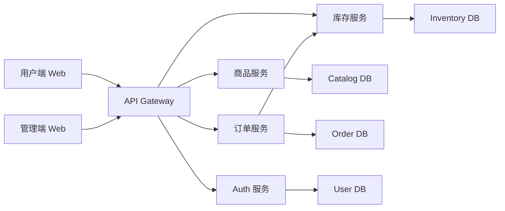
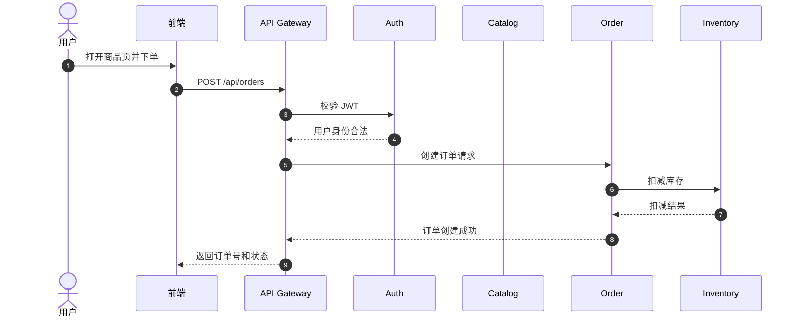
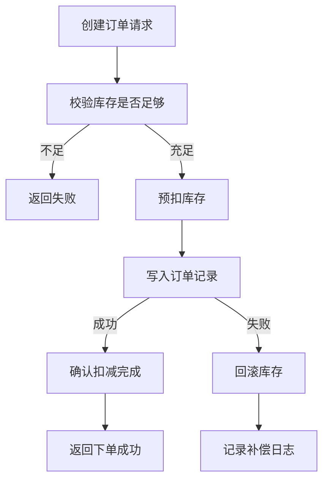

# 简单买菜微服务网站

做完单体应用后，很多同学会进入一个新困惑：功能越来越多，代码还能写，但项目越来越难维护。

这个大作业的目标，就是让你在一个可控规模里，体验一次“从单体到微服务”的完整过程。

::: tip 🎯 这次做什么？
打造一个 **简单买菜微服务网站**。用户可以浏览商品、下单、查看订单；管理员可以管理商品与库存。后端拆成多个服务，通过 API 网关统一对外提供接口。
:::

<div style="margin: 32px 0;">
  <ClientOnly>
    <StepBar :active="0" :items="[
      { title: '定边界', description: '先明确服务拆分和业务范围' },
      { title: '搭基础', description: '网关、鉴权、数据库连接先跑通' },
      { title: '接业务', description: '商品、订单、库存链路打通' },
      { title: '交付上线', description: '部署、文档、演示材料补齐' }
    ]" />
  </ClientOnly>
</div>

## 为什么这个项目值得做？

这个题目看起来是“买菜网站”，本质上练的是三个能力：

- **拆服务**：学会按业务边界拆分，而不是按技术层硬拆
- **控复杂度**：在多服务协作下保持清晰的接口和数据流
- **做稳定链路**：让“下单 -> 扣库存 -> 查订单”能够稳定可追踪

这会直接影响你后续做电商、SaaS 后台、内容平台等多模块项目的上限。

## 先看全景：系统由哪些模块组成？



这张图的核心意思是：前端不用直接找多个服务，只和网关交互。复杂性由网关和服务间协作承担。

## 1. 定边界：先把范围控制住

### 建议服务拆分

第一版只保留 4 个核心服务：

| 服务 | 职责 |
|------|------|
| `auth-service` | 登录、注册、令牌校验、角色识别 |
| `catalog-service` | 商品列表、商品详情、分类查询 |
| `inventory-service` | 库存查询、库存扣减、库存回滚 |
| `order-service` | 创建订单、查询订单、订单状态管理 |

### 建议角色与页面

| 角色 | 页面 | 关键动作 |
|------|------|------|
| 用户 | 首页、商品页、购物车、订单页 | 浏览商品、下单、看订单 |
| 管理员 | 商品管理、库存管理、订单管理 | 上下架商品、调库存、查看异常订单 |

### 范围控制（一定要先做“能交付”的版本）

- 只做最小支付模拟，不接真实支付网关
- 不做复杂促销（满减、优惠券、拼团）
- 不做推荐算法，商品排序先按上架时间或销量
- 不做分布式事务框架，先用“本地事务 + 失败补偿”思路
- 不做消息中间件集群，第一版可同步调用

## 2. 架构与时序

### 请求路由链路



### 失败补偿思路（避免“扣了库存却没订单”）



## 3. 推荐技术栈

- **前端**：Next.js + TypeScript + Tailwind CSS + shadcn/ui
- **服务端**：Node.js + Express / Fastify
- **网关**：Express Gateway 或自建 BFF 网关
- **数据库**：PostgreSQL（每个服务独立库或独立 schema）
- **缓存（可选）**：Redis（热商品列表、会话短缓存）
- **部署**：Docker Compose（本地）+ Zeabur / Railway（云端）

## 4. 分步实现路径（可直接照做）

<div style="margin: 32px 0;">
  <ClientOnly>
    <StepBar :active="1" :items="[
      { title: '定边界', description: '先明确服务拆分和业务范围' },
      { title: '搭基础', description: '网关、鉴权、数据库连接先跑通' },
      { title: '接业务', description: '商品、订单、库存链路打通' },
      { title: '交付上线', description: '部署、文档、演示材料补齐' }
    ]" />
  </ClientOnly>
</div>

### 第一步：起项目骨架与网关

```text
请帮我搭建一个买菜微服务项目骨架。

要求：
1. 创建 api-gateway、auth-service、catalog-service、inventory-service、order-service 五个服务目录
2. 每个服务都包含最小可运行的 Express 入口
3. gateway 支持把 /api/catalog/* 转发到 catalog-service，把 /api/orders/* 转发到 order-service
4. 使用 TypeScript
5. 给出本地启动脚本（可用 pnpm workspace 或 npm workspaces）
```

### 第二步：先做鉴权，再做业务接口

先完成：

- 用户注册 / 登录
- JWT 发放和校验中间件
- 网关统一鉴权（白名单接口可放行）

```text
请帮我实现 auth-service 的最小鉴权链路。

目标：
1. POST /register
2. POST /login
3. 输出 access token
4. gateway 中间件可以验证 token 并把 userId、role 注入请求上下文
5. 提供一个受保护示例接口用于测试
```

### 第三步：商品与库存服务

优先做这几个接口：

- `GET /api/catalog/products`
- `GET /api/catalog/products/:id`
- `PATCH /api/inventory/:productId`（管理员）

### 第四步：订单服务打通主链路

优先做下单和查单：

- `POST /api/orders`
- `GET /api/orders/:id`
- `GET /api/orders/my`

下单流程必须至少包含：

1. 鉴权通过
2. 校验商品和库存
3. 创建订单
4. 扣减库存
5. 失败时回滚或补偿

### 第五步：管理端最小闭环

管理员界面先做三块就够：

- 商品列表 + 上下架按钮
- 库存调整表单
- 订单列表（含状态筛选）

### 第六步：部署与文档

至少完成：

- 一份项目结构图
- 一份服务启动说明
- 一份关键接口说明
- 一份本地联调步骤

## 5. 交付物要求

你至少要提交这些内容：

- 可运行项目代码（网关 + 4 个服务 + 前端）
- 演示地址或本地可复现说明
- README（含架构图、启动方式、接口概览）
- 60 秒到 120 秒演示视频
- 关键页面截图（用户下单、管理员改库存、订单详情）

## 6. 验收标准

| 维度 | 最低达标 | 加分项 |
|------|------|------|
| 架构清晰度 | 服务边界明确，网关可用 | 有统一错误码和服务间追踪日志 |
| 业务闭环 | 浏览商品 -> 下单 -> 查单跑通 | 有库存不足、下单失败等异常处理 |
| 权限控制 | 用户与管理员权限隔离 | 服务端接口也有角色校验，不只前端隐藏 |
| 工程质量 | 项目可启动、接口可调试 | 有 Docker Compose、一键启动脚本 |
| 交付完整度 | README、截图、演示视频齐全 | 有性能优化或缓存策略说明 |

## 7. 提交前最后检查

<el-card shadow="hover" style="margin: 20px 0; border-radius: 12px;">
  <template #header>
    <div style="font-weight: bold; font-size: 16px;">提交前最后看一眼</div>
  </template>

  <ul style="list-style-type: none; padding-left: 0;">
    <li><label><input type="checkbox" disabled /> 网关已接入鉴权并能正确转发请求</label></li>
    <li><label><input type="checkbox" disabled /> 商品、库存、订单三个核心服务已打通</label></li>
    <li><label><input type="checkbox" disabled /> 下单失败时有清晰错误提示和补偿处理</label></li>
    <li><label><input type="checkbox" disabled /> 用户端和管理端都可完成核心操作</label></li>
    <li><label><input type="checkbox" disabled /> README、架构图、演示视频已准备完整</label></li>
    <li><label><input type="checkbox" disabled /> 项目已部署或有完整本地复现步骤</label></li>
  </ul>
</el-card>

::: tip
这个作业最重要的不是“服务越多越好”，而是你能不能把边界、协作和失败处理讲清楚并做扎实。
:::
