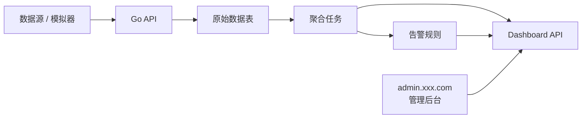
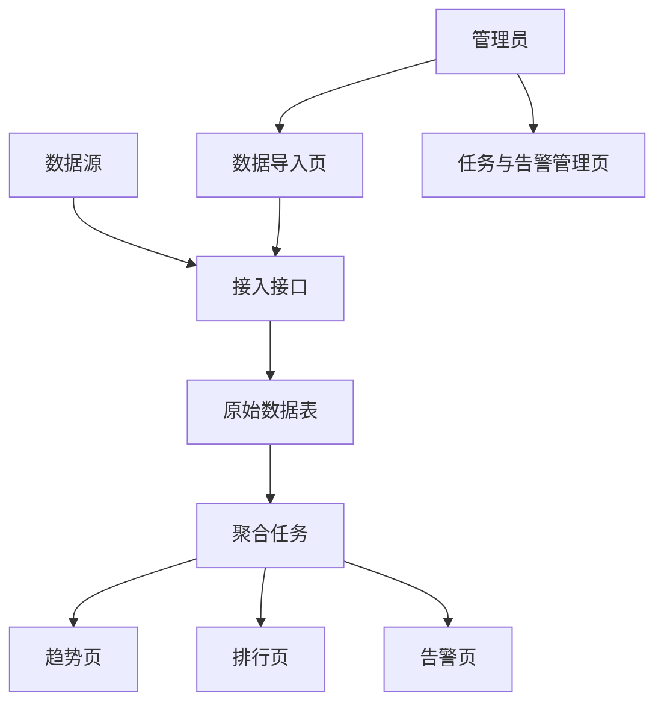

# PRD：Go 交通数据分析与可视化平台

状态：Draft v0.1  
目标：先明确数据产品的口径、模块和接口，再进入实现。

## 1. 项目定位

这是一个“数据接入 + 聚合分析 + 看板展示”的完整型项目。重点是把原始交通数据转换成可读的分析结果和告警。

一句话定义：
做一个支持事件接入、窗口聚合、异常检测和大屏展示的 Go 数据分析平台。

系统总览：



## 1.0 技术选型建议

- 后端框架：`Go + Gin/Fiber`
- 数据库：`PostgreSQL`
- 聚合任务：`robfig/cron`
- 前端：`React / Next.js`
- 图表：`ECharts` 或 `AntV`

站点入口约定：

- 分析看板：`app.xxx.com`
- 后台管理台：`admin.xxx.com`

## 1.1 竞品参考（官方）

- [TomTom Traffic Index](https://www.tomtom.com/traffic-index/)

## 1.2 产品借鉴点

本项目的产品设计建议参考真实交通分析产品：

- 借鉴 `TomTom Traffic Index` 的指标表达方式：趋势、拥堵程度、城市/路口排行应直观可读
- 看板首页应优先展示关键指标和异常信息，而不是堆很多图
- 趋势页、排行页、告警页要有清晰的分工
- 管理端应强调数据导入、任务状态和告警处理，而不是只看静态图表
- 整体设计要更像数据产品和运营看板，而不是普通后台列表

## 1.3 竞品页面拆解

建议重点参考的竞品页面结构：

- `TomTom Traffic Index` 的总览页
  - 重点看：如何用少量关键指标快速建立全局认知
- `TomTom Traffic Index` 的趋势和排名表达
  - 重点看：图表和排行如何帮助用户快速理解问题
- 数据产品常见监控页
  - 重点看：告警、数据状态和任务状态如何分区展示

因此本项目建议：

- 总览页强调关键指标
- 趋势页强调时间变化
- 告警页强调异常定位
- 管理端强调数据导入和任务健康状态

## 2. 目标用户与核心目标

目标用户：

- 关注交通趋势和拥堵状态的分析人员
- 查看异常告警与处理结果的管理员

核心目标：

- 原始数据可稳定接入
- 聚合指标可查询
- 告警可见、可处理
- 可视化页面可支撑汇报和演示

## 3. MVP 范围

第一版必须包含：

- 数据接入接口
- 原始数据落库
- 定时聚合任务
- 异常检测规则
- 趋势图、Top 路口、告警面板
- 管理端数据导入或模拟数据入口

第一版不做：

- Kafka/Flink 级流处理
- 复杂 GIS 地图引擎
- 机器学习预测模型
- 多租户平台权限

## 4. 角色与权限

| 角色 | 权限 |
|------|------|
| 分析用户 | 查看看板、趋势、排行榜 |
| 管理员 | 导入数据、处理告警、查看任务状态 |

## 5. 前端实现

## 5.1 页面架构总览

当前 PRD 定义为 `2 套入口，6 个大页面`：

- 用户看板 `4` 个大页面
- 后台管理台 `2` 个大页面

### A. 分析看板 `app.xxx.com`

#### 1. 总览页 `app:/dashboard`

核心功能：

- 总车流
- 当前告警数
- 最拥堵路口

#### 2. 趋势页 `app:/dashboard/trend`

核心功能：

- 车流趋势图
- 时间范围切换

#### 3. 路口排行页 `app:/dashboard/intersections`

核心功能：

- 拥堵排行
- 关键路口指标

#### 4. 告警页 `app:/alerts`

核心功能：

- 查看告警
- 筛选级别
- 标记处理状态

### B. 后台管理台 `admin.xxx.com`

#### 5. 数据导入页 `admin:/imports`

核心功能：

- 导入 CSV
- 查看导入任务状态

#### 6. 任务与告警管理页 `admin:/operations`

核心功能：

- 查看聚合任务状态
- 查看告警处理记录

## 5.2 关键用户链路



关键状态流：

- 数据事件：接收成功 / 校验失败
- 聚合任务：待执行 -> 执行中 -> 成功 / 失败
- 告警：新建 -> 已确认 -> 已处理

推荐技术栈：

- React / Next.js
- ECharts / AntV
- TypeScript

建议页面：

| 页面 | 路径 | 说明 |
|------|------|------|
| 总览看板 | `/dashboard` | 今日流量、拥堵指数、告警数 |
| 趋势页 | `/dashboard/trend` | 分时趋势图 |
| 路口分析页 | `/dashboard/intersections` | Top 路口排行 |
| 告警页 | `/alerts` | 告警列表与处理状态 |
| 数据管理页 | `/admin/imports` | 导入数据、查看任务日志 |

前端关键组件：

- 指标卡片
- 折线图/柱状图
- 排行榜表格
- 告警列表
- 时间范围筛选器

## 6. 后端实现

推荐技术栈：

- Go
- Gin 或 Fiber
- PostgreSQL
- robfig/cron

后端模块：

- `ingest`
- `aggregation`
- `alerts`
- `dashboard`
- `imports`
- `admin`

建议数据表：

```sql
raw_traffic_events (
  id bigserial primary key,
  intersection_id text,
  event_time timestamptz,
  vehicle_count int,
  avg_speed numeric,
  source text,
  created_at timestamptz
)

traffic_agg_1m (
  id bigserial primary key,
  intersection_id text,
  window_start timestamptz,
  total_vehicles int,
  avg_speed numeric,
  congestion_index numeric
)

traffic_agg_5m (
  id bigserial primary key,
  intersection_id text,
  window_start timestamptz,
  total_vehicles int,
  avg_speed numeric,
  congestion_index numeric
)

alerts (
  id bigserial primary key,
  intersection_id text,
  level text,
  rule_code text,
  status text,
  message text,
  created_at timestamptz,
  resolved_at timestamptz
)

import_jobs (
  id bigserial primary key,
  filename text,
  status text,
  total_rows int,
  success_rows int,
  failed_rows int,
  created_at timestamptz
)
```

## 6.1 后台指标与监控

后台建议至少查看这些指标：

- 接入事件总数
- 聚合任务成功率
- 告警总数与处理率
- 热点路口排行
- 导入任务成功率

基础监控建议：

- 接入接口错误率
- 聚合任务耗时
- 数据库写入失败率
- 看板查询接口耗时

## 7. 指标与规则

第一版指标：

- 每分钟车流量
- 每 5 分钟聚合车流量
- 平均车速
- 拥堵指数
- Top10 拥堵路口

第一版告警规则：

- 当前流量高于近 5 分钟均值阈值
- 当前速度连续低于阈值

## 8. 接口草案

| 方法 | 路径 | 说明 |
|------|------|------|
| `POST` | `/api/traffic/events` | 写入单条交通事件 |
| `POST` | `/api/traffic/import` | 上传 CSV 或批量导入 |
| `GET` | `/api/dashboard/overview` | 获取概览卡片数据 |
| `GET` | `/api/dashboard/trend` | 获取趋势图数据 |
| `GET` | `/api/dashboard/intersections/top` | 获取拥堵路口排行 |
| `GET` | `/api/alerts` | 获取告警列表 |
| `PATCH` | `/api/alerts/:id/resolve` | 处理告警 |
| `GET` | `/api/admin/import-jobs` | 获取导入任务状态 |

`POST /api/traffic/events` 请求示例：

```json
{
  "intersectionId": "A-101",
  "timestamp": "2026-04-01T08:30:00+08:00",
  "vehicleCount": 42,
  "avgSpeed": 18.6,
  "source": "simulator"
}
```

## 9. 非功能要求

- 聚合任务可重复执行且结果稳定
- API 返回结构统一
- 导入失败要能定位原因
- 看板查询响应时间可接受

## 10. 开发顺序建议

1. Go API 骨架与数据表
2. 事件接入接口
3. 聚合任务
4. 告警规则
5. Dashboard 查询接口
6. 前端图表页

## 11. 待确认项

- 是否提供 CSV 导入作为主要演示入口
- 是否需要地图视图
- 告警阈值是否写死还是后台可配
- 前端图表库选 ECharts 还是 AntV
