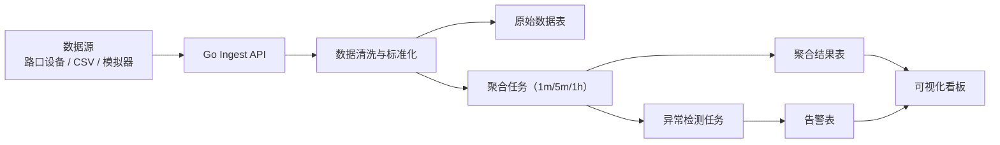
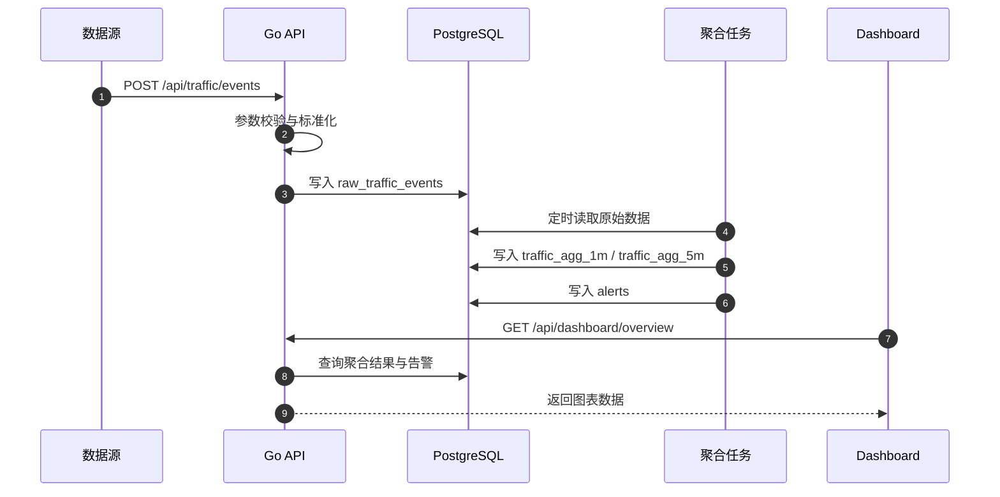
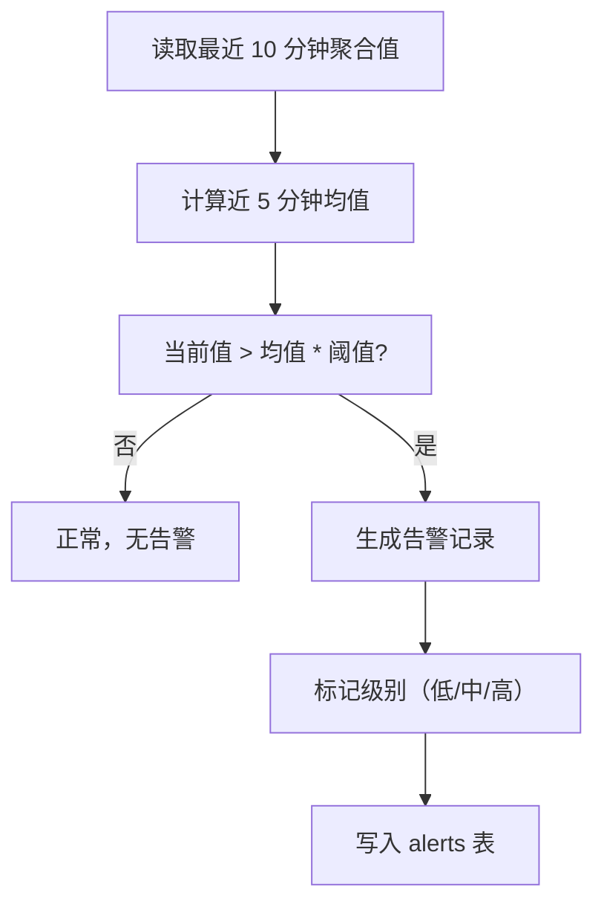

# 交通大数据可视化分析 (Go项目)

很多同学学 Go 时会卡在一个问题：会写接口，但不知道怎么把“数据处理能力”和“业务展示能力”组合成一个完整项目。

这个大作业就是为了解这个问题。你会做一个可运行的交通数据平台，从数据接入、清洗、聚合，到可视化展示和告警，一条链路走完。

::: tip 🎯 这次做什么？
打造一个 **交通大数据可视化分析平台（Go 后端）**。系统可以接收交通流量数据，完成时间窗口聚合与异常检测，并在可视化页面展示趋势、拥堵热力、路口排名和告警记录。
:::

<div style="margin: 32px 0;">
  <ClientOnly>
    <StepBar :active="0" :items="[
      { title: '定场景', description: '先明确数据来源、指标口径和展示目标' },
      { title: '搭管道', description: '接入、清洗、存储、聚合链路先跑通' },
      { title: '做分析', description: '完成趋势图、热力图和异常告警' },
      { title: '交付上线', description: '部署、文档、演示材料补齐' }
    ]" />
  </ClientOnly>
</div>

## 为什么这个项目值得做？

这个题目同时练了三种在真实项目里非常关键的能力：

- **工程能力**：Go 接口设计、并发处理、任务调度
- **数据能力**：时间序列聚合、指标建模、异常检测
- **产品能力**：把分析结果变成可读、可操作的可视化页面

做完后，你不只是“写了个后端”，而是能说清一个数据产品如何从输入走到决策。

## 1. 项目全景与范围控制

### 系统模块图



### 建议分析维度

第一版只聚焦这些核心指标：

- 时间窗口车流量（每分钟 / 每 5 分钟 / 每小时）
- 路口拥堵指数（可用速度反比或排队长度估算）
- TOP 拥堵路口排名
- 异常突增告警（同比前 5 分钟或滑动均值）

### 范围控制（防止项目失控）

- 第一版不做实时流处理平台（如 Kafka/Flink 集群）
- 第一版不做复杂地图引擎，热力可先用网格或散点替代
- 第一版不做机器学习预测，先用规则阈值异常检测
- 第一版不做多租户权限系统，只保留普通用户 + 管理员

## 2. 数据链路与时序

### 数据从接入到看板的主流程



### 异常检测逻辑（简版）



## 3. 推荐技术栈

- **后端**：Go + Gin / Fiber
- **数据处理**：Go `cron` / `robfig/cron`（定时聚合）
- **数据库**：PostgreSQL（可选 TimescaleDB）
- **缓存（可选）**：Redis（热点看板数据）
- **前端**：React / Next.js + ECharts / AntV
- **部署**：Docker Compose + Zeabur / Railway / 自托管

## 4. 分步实现路径

<div style="margin: 32px 0;">
  <ClientOnly>
    <StepBar :active="1" :items="[
      { title: '定场景', description: '先明确数据来源、指标口径和展示目标' },
      { title: '搭管道', description: '接入、清洗、存储、聚合链路先跑通' },
      { title: '做分析', description: '完成趋势图、热力图和异常告警' },
      { title: '交付上线', description: '部署、文档、演示材料补齐' }
    ]" />
  </ClientOnly>
</div>

### 第一步：搭 Go 项目骨架和数据模型

```text
请帮我创建一个 Go 交通数据分析项目骨架。

要求：
1. 使用 Gin（或 Fiber）创建 API 服务
2. 按 handler / service / repository / model 分层
3. 设计并创建数据表：
   - raw_traffic_events
   - traffic_agg_1m
   - traffic_agg_5m
   - alerts
4. 提供一个健康检查接口 /health
5. 给出本地启动步骤（含数据库连接配置）
```

### 第二步：完成数据接入接口

先做事件写入：

- `POST /api/traffic/events`
- 字段至少包含：`intersection_id`、`timestamp`、`vehicle_count`、`avg_speed`

```text
请帮我实现 POST /api/traffic/events。

要求：
1. 做参数校验（空值、类型、时间格式）
2. 标准化 timestamp 到统一时区
3. 写入 raw_traffic_events
4. 返回统一 JSON 结构（code、message、data）
5. 提供一组可直接用于调试的 curl 示例
```

### 第三步：实现聚合任务

至少完成：

- 1 分钟窗口聚合
- 5 分钟窗口聚合
- 聚合结果接口 `GET /api/dashboard/trend`

### 第四步：实现告警规则

建议第一版规则：

- 当前流量 `> 近 5 分钟均值 * 1.8` 触发中级告警
- 当前平均速度 `< 阈值` 且持续 3 个窗口，触发高级拥堵告警

### 第五步：完成可视化页面

建议页面模块：

- 总览卡片：今日总车流、当前告警数、最拥堵路口
- 趋势图：近 24 小时车流曲线
- 路口排行：拥堵指数 TOP10
- 告警面板：实时/历史告警列表

### 第六步：补齐部署与文档

至少包含：

- 数据口径说明（每个指标如何计算）
- 接口文档（输入/输出示例）
- 本地与线上部署步骤
- 示例数据导入方法

## 5. 可直接使用的接口清单（最小可用）

| 模块 | 接口 |
|------|------|
| 数据接入 | `POST /api/traffic/events` |
| 总览数据 | `GET /api/dashboard/overview` |
| 趋势数据 | `GET /api/dashboard/trend?range=24h` |
| 热点路口 | `GET /api/dashboard/intersections/top` |
| 告警列表 | `GET /api/alerts?level=high&status=open` |
| 告警处理 | `PATCH /api/alerts/:id/resolve` |

## 6. 交付物要求

- 可运行项目代码（Go API + 可视化前端）
- 数据库表结构与初始化脚本
- README（架构图、运行说明、指标解释）
- 关键页面截图（趋势图、排名、告警）
- 60 秒到 120 秒演示视频

## 7. 验收标准

| 维度 | 最低达标 | 加分项 |
|------|------|------|
| 数据链路 | 接入、存储、聚合、展示完整跑通 | 支持重放历史数据和批量导入 |
| 分析能力 | 有趋势、排名、告警三个核心模块 | 告警支持分级与处理状态流转 |
| Go 工程质量 | 代码分层清晰，错误处理明确 | 有结构化日志与基础性能优化 |
| 可视化质量 | 关键图表可读，指标口径一致 | 增加地图层或交互筛选能力 |
| 交付完整度 | README、截图、演示视频齐全 | 有线上演示地址和压测说明 |

## 8. 提交前最后检查

<el-card shadow="hover" style="margin: 20px 0; border-radius: 12px;">
  <template #header>
    <div style="font-weight: bold; font-size: 16px;">提交前最后看一眼</div>
  </template>

  <ul style="list-style-type: none; padding-left: 0;">
    <li><label><input type="checkbox" disabled /> 数据接入接口可稳定写入原始事件</label></li>
    <li><label><input type="checkbox" disabled /> 聚合任务能按窗口产出统计结果</label></li>
    <li><label><input type="checkbox" disabled /> 告警规则生效并可在页面查看</label></li>
    <li><label><input type="checkbox" disabled /> 看板页面可展示趋势、排名和告警</label></li>
    <li><label><input type="checkbox" disabled /> README 已写清口径、接口和运行步骤</label></li>
    <li><label><input type="checkbox" disabled /> 项目已部署或可完整本地复现</label></li>
  </ul>
</el-card>

::: tip
这个作业的关键，不是图表多炫，而是你能不能保证“口径一致、链路闭环、告警可信”。
:::
