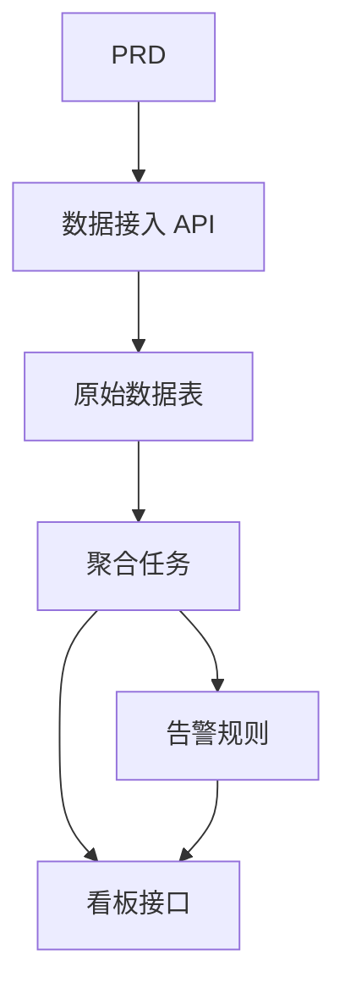

# Go 交通数据分析平台开发实战

这个项目不是“写几个 Go 接口”，而是围绕一份真实 PRD，把一个数据接入、聚合、告警、可视化的产品原型推进出来。

你会同时看到三件事：

- 项目要做成什么
- 如何基于 PRD 拆解并推进开发
- 最后应该交付出什么样的效果

::: tip PRD 入口
本项目的需求文档在 GitHub： [查看 PRD](https://github.com/datawhalechina/easy-vibe/blob/main/docs/zh-cn/stage-2/assignments/traffic-data-visualization-go/PRD.md)
:::

<div style="margin: 32px 0;">
  <ClientOnly>
    <StepBar :active="0" :items="[
      { title: '看 PRD', description: '先明确数据来源、指标、告警规则和看板范围' },
      { title: '生成骨架', description: '让 AI 先产出 API、聚合任务和看板页骨架' },
      { title: '监工迭代', description: '逐模块验收、补接口、修指标口径和告警链路' },
      { title: '交付上线', description: '完成可演示、可运行、可继续开发的数据产品原型' }
    ]" />
  </ClientOnly>
</div>

## 这个项目到底在做什么？

这是一个 Go 交通数据分析平台：

- 接收原始交通事件
- 做窗口聚合
- 计算趋势和拥堵指标
- 生成告警
- 在前端看板中展示结果

## 开发过程怎么走？

### 1. 先看 PRD，不要上来就写代码

先确认：

- 数据来源和字段是否拍板
- 指标口径是否清楚
- 告警规则是否先收敛到简单版本
- 看板页面范围是否合理

### 2. 先让 AI 生成“骨架版”

第一轮先生成：

- Go API 服务骨架
- 数据接入接口
- 聚合任务骨架
- 总览看板、趋势页、告警页

### 3. 再进入“监工模式”

你要重点盯这几件事：

- 原始数据是否正确入库
- 聚合口径是否一致
- 告警规则是否符合预期
- 看板展示和后端数据是否一致
- API 是否有统一返回结构和错误处理

### 4. 最后做联调和上线



## 怎么让 AI 帮你生成？

```text
请基于当前 PRD，帮我生成一个 Go 交通数据分析平台骨架。

要求：
1. 使用 Gin 或 Fiber
2. 提供数据接入接口
3. 提供聚合任务骨架
4. 提供 dashboard 和 alerts 接口骨架
5. 先不做真实复杂分析，只做可运行结构
```

## 怎么“监工”才有效？

| 检查项 | 要看什么 |
|------|------|
| 接口是否对 | ingest、dashboard、alerts 是否闭环 |
| 数据是否对 | 原始表、聚合表、告警表是否一致 |
| 指标是否对 | 趋势、排名、告警口径是否合理 |
| 页面是否对 | 看板展示和后端结果是否对齐 |
| 演示是否对 | 是否能演示“接入 -> 聚合 -> 告警 -> 展示” |

## 最后的预期效果

- 一套可运行的 Go 数据分析平台
- 一份同级 PRD 文档
- 数据接入、聚合、告警、看板展示
- README 和演示方案

## 验收标准

| 维度 | 最低达标 |
|------|------|
| PRD 对齐 | 页面、功能、数据结构基本符合 PRD |
| 产品闭环 | 接入、聚合、告警、看板可以跑通 |
| 分析能力 | 趋势、排行、告警三个核心模块可用 |
| 工程完整度 | Go API、数据库、前端看板链路已接通 |
| 展示能力 | 可以清楚演示“从 PRD 到成品”的过程 |

::: tip 🚀 完成后你会得到什么？
你得到的不只是一个接口项目，而是一套“数据接入 + 数据产品”型项目的开发样例。
:::
