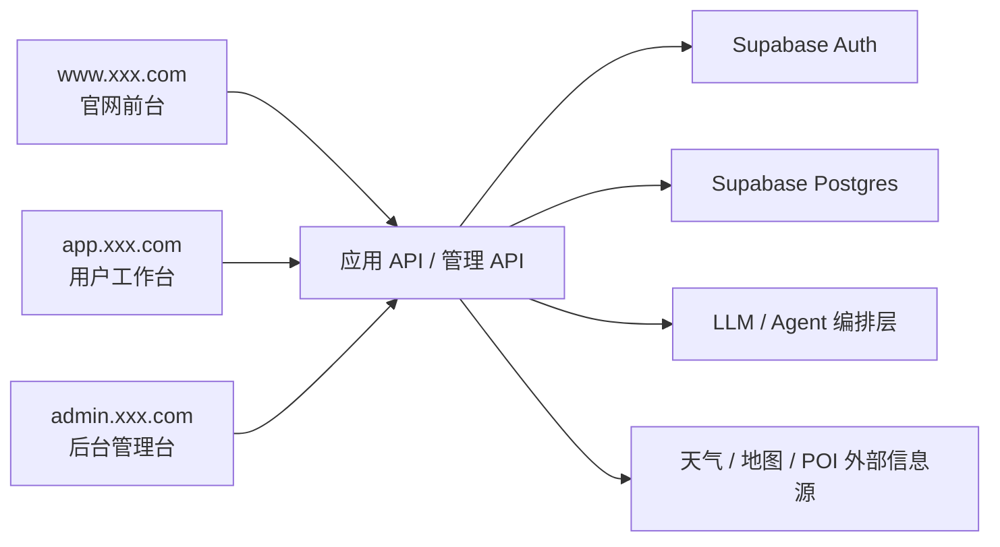
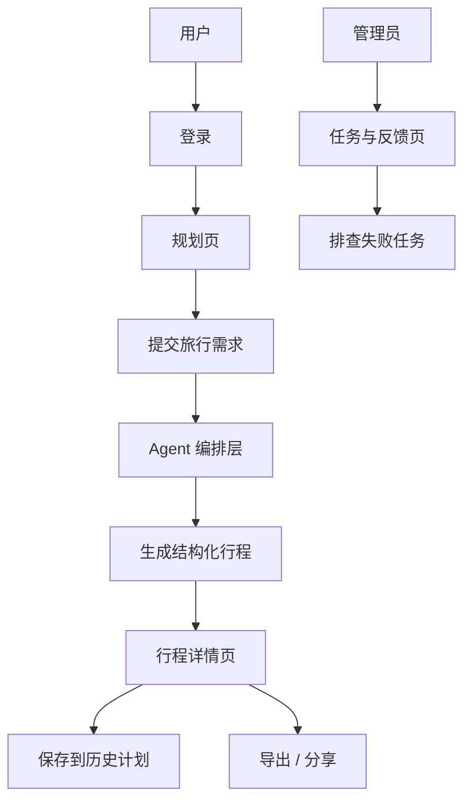

# PRD：智能旅游规划 Agent 编排平台

状态：Draft v0.1  
目标：先确认这个 Agent 产品的最小可用范围，再进入开发。

## 1. 项目定位

这是一个面向真实旅行规划场景的 AI 产品，不只是聊天，而是把结构化输入转成可执行行程。

一句话定义：
做一个可以生成、保存、调整与导出旅行计划的 Agent 编排平台。

系统总览：



## 1.0 技术选型建议

- 前端框架：`Next.js App Router`
- 用户鉴权：`Supabase Auth`
- 数据库：`Supabase Postgres`
- 模型层：统一后端服务调用大模型
- 可选缓存：`Redis`

站点入口约定：

- 官网前台：`www.xxx.com`
- 用户工作台：`app.xxx.com`
- 后台管理台：`admin.xxx.com`

## 1.1 竞品参考（官方）

- [Wanderlog](https://wanderlog.com/)

## 1.2 产品借鉴点

本项目的产品设计建议参考真实旅行规划产品的做法：

- 借鉴 `Wanderlog` 的路线规划表达方式：输入后直接看到可编辑的每日行程，而不是只返回一大段文本
- 行程详情应突出日期、地点、预算、移动顺序和注意事项
- 历史记录页应像“我的行程库”，支持再次打开和二次生成
- 后台页应强调热门目的地、失败任务和用户反馈，而不是只看系统日志
- 整体设计要体现“行程产品”感，而不是“聊天回答”感

## 1.3 竞品页面拆解

建议重点参考的竞品页面结构：

- `Wanderlog` 首页
  - 重点看：如何同时讲清楚 itinerary、map、budget、collaboration 这些核心价值
- `Wanderlog` 行程页
  - 重点看：一天一天的安排、地图与列表并存、预算与预订信息并列
- `Wanderlog` Pro 页面
  - 重点看：如何把高级功能做成清晰权益，而不是一长串技术描述

因此本项目建议：

- 规划页更像“行程编辑台”
- 详情页更像“可执行 itinerary”
- 历史页更像“我的旅行库”
- 后台页更像“运营与任务中心”

## 2. 目标用户与核心目标

目标用户：

- 想快速获得 3 到 7 天行程安排的普通用户
- 需要预算与节奏建议的自由行用户
- 维护平台质量和任务健康状态的管理员

核心目标：

- 用户能在一次表单提交后得到结构化行程
- 用户能保存历史计划并再次编辑/重生成
- 平台能记录失败任务和生成质量反馈

## 3. MVP 范围

第一版必须包含：

- 规划表单页
- 行程详情页
- 历史计划页
- 计划保存与重生成
- 预算拆分
- 导出文本/PDF 占位能力
- 后台查看任务与失败日志

第一版不做：

- 真正的机票/酒店预订
- 多城市复杂路线联排
- 实时票价与库存同步
- 多人协同编辑
- 多语言输出

## 4. 角色与权限

| 角色 | 权限 |
|------|------|
| 普通用户 | 创建计划、查看历史、导出、反馈 |
| 管理员 | 查看热门目的地、失败任务、用户反馈 |

## 5. 前端实现

## 5.1 页面架构总览

当前 PRD 定义为 `3 套入口，8 个大页面`：

- 官网前台 `1` 个大页面
- 用户工作台 `5` 个大页面
- 后台管理台 `2` 个大页面

### A. 官网前台 `www.xxx.com`

#### 1. 官网首页 `www:/`

核心功能：

- 产品介绍
- 典型使用场景
- Demo 行程展示
- CTA

### B. 用户工作台 `app.xxx.com`

#### 2. 登录页 `app:/login`

核心功能：

- 登录
- 注册入口

#### 3. 规划页 `app:/planner`

核心功能：

- 输入旅行需求
- 选择偏好与预算
- 发起规划任务

#### 4. 行程详情页 `app:/trips/:id`

核心功能：

- 查看每日行程
- 查看预算拆分
- 再次生成和导出

#### 5. 历史计划页 `app:/history`

核心功能：

- 查看历史计划
- 重新打开
- 重新生成

#### 6. 反馈与导出页 `app:/exports`

核心功能：

- 导出计划
- 提交反馈

### C. 后台管理台 `admin.xxx.com`

#### 7. 后台首页 `admin:/`

核心功能：

- 热门目的地
- 任务成功率
- 失败任务数

#### 8. 任务与反馈页 `admin:/runs`

核心功能：

- 查看失败任务
- 查看用户反馈
- 排查异常计划

## 5.2 关键用户链路



关键状态流：

- 规划任务：待生成 -> 生成中 -> 成功 / 失败
- 行程：草稿 -> 已保存 -> 已导出
- 反馈：未处理 -> 已查看 -> 已关闭

推荐技术栈：

- Next.js App Router
- TypeScript
- Tailwind CSS

建议页面：

| 页面 | 路径 | 说明 |
|------|------|------|
| 首页 | `/` | 产品介绍与创建入口 |
| 规划页 | `/planner` | 输入需求并提交 |
| 行程详情页 | `/trips/:id` | 查看每日计划、预算和注意事项 |
| 历史记录页 | `/history` | 查看历史计划 |
| 管理后台 | `/admin` | 查看任务状态和平台统计 |

前端关键组件：

- 旅行需求表单
- 任务进度状态条
- Day by Day 行程卡片
- 预算拆分卡片
- 历史记录列表
- 错误重试与反馈组件

## 6. 后端实现

推荐技术栈：

- Node.js + NestJS/Express
- PostgreSQL / Supabase
- LLM API
- 可选 Redis 做短缓存

后端模块：

- `auth`
- `trip-plans`
- `planner`
- `exports`
- `admin`
- `feedback`

建议数据表：

```sql
trip_plans (
  id uuid primary key,
  user_id uuid,
  origin text,
  destination text,
  start_date date,
  end_date date,
  budget numeric,
  preferences jsonb,
  pace text,
  status text,
  created_at timestamptz
)

itinerary_days (
  id uuid primary key,
  trip_plan_id uuid,
  day_index int,
  title text,
  summary text,
  day_budget numeric
)

itinerary_items (
  id uuid primary key,
  itinerary_day_id uuid,
  start_time text,
  end_time text,
  place_name text,
  category text,
  notes text,
  estimated_cost numeric
)

planner_runs (
  id uuid primary key,
  trip_plan_id uuid,
  provider text,
  latency_ms int,
  status text,
  error_message text,
  created_at timestamptz
)

trip_feedback (
  id uuid primary key,
  trip_plan_id uuid,
  user_id uuid,
  score int,
  comment text,
  created_at timestamptz
)
```

## 6.1 后台指标与监控

后台建议至少查看这些指标：

- 日规划任务数
- 规划成功率
- 平均生成耗时
- 热门目的地排行
- 用户反馈评分分布
- 导出次数

基础监控建议：

- 模型调用成功率
- 外部信息源失败率
- 任务重试次数
- 数据库存取耗时

## 7. 功能清单

必须完成：

- 创建旅行计划
- 返回结构化每日行程
- 查看历史计划
- 重生成计划
- 预算拆分
- 管理端查看失败任务

可选增强：

- 热门目的地榜单
- POI 数据二次校验
- 导出为分享图

## 8. 接口草案

| 方法 | 路径 | 说明 |
|------|------|------|
| `POST` | `/api/trips/plan` | 创建新的规划任务 |
| `GET` | `/api/trips/:id` | 获取计划详情 |
| `POST` | `/api/trips/:id/regenerate` | 按原条件重新生成 |
| `PATCH` | `/api/trips/:id/preferences` | 更新偏好后重算 |
| `GET` | `/api/history` | 获取历史计划列表 |
| `POST` | `/api/trips/:id/export` | 导出行程 |
| `POST` | `/api/trips/:id/feedback` | 提交用户反馈 |
| `GET` | `/api/admin/planner-runs` | 获取生成日志 |

`POST /api/trips/plan` 请求示例：

```json
{
  "origin": "上海",
  "destination": "成都",
  "startDate": "2026-05-01",
  "endDate": "2026-05-04",
  "budget": 3500,
  "preferences": ["美食", "历史文化"],
  "pace": "standard"
}
```

## 9. 关键业务规则

- 第一版限制单目的地
- 只支持 3 到 7 天
- 预算必须返回总预算与每日预算
- 失败任务必须可重试
- 生成结果需要有结构化 JSON，不能只返回自由文本

## 10. 非功能要求

- 规划结果要有稳定的结构化 JSON
- 长任务必须有状态反馈
- 外部信息源失败时要优雅降级
- 导出失败可重试
- 移动端至少可查看详情和历史计划

## 11. 开发顺序建议

1. 规划页表单与 mock 结果
2. 创建计划与详情接口
3. 历史记录与重生成
4. 导出与反馈
5. 管理后台日志页

## 12. 待确认项

- 第一版是否需要接外部天气/地图数据
- 导出先做 PDF 还是纯文本下载
- 行程生成是否需要“省钱/均衡/深度游”预设模板
- 管理端是否需要查看用户反馈详情
