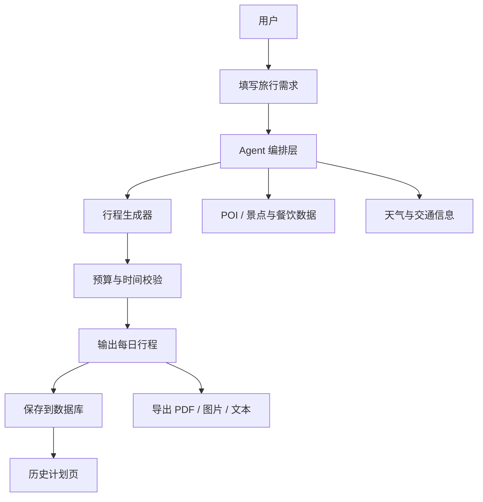
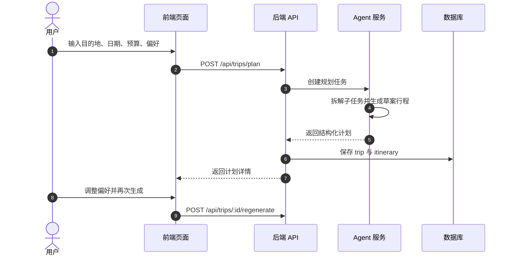

# 智能旅游规划 Agent 平台

很多人做 AI 项目时，常见问题不是模型不会调，而是应用链路不完整：能聊天，但不能真正“规划一趟旅行”。

这个大作业的目标，就是把一个“会说话的 Demo”做成“可执行的产品原型”。

::: tip 🎯 这次做什么？
打造一个 **智能旅游规划 Agent 平台**。用户输入出发地、目的地、日期、预算和偏好后，系统自动生成每日行程、预算拆分、景点与餐饮建议，并支持导出或保存计划。管理员可查看热门目的地、生成成功率和用户反馈。
:::

<div style="margin: 32px 0;">
  <ClientOnly>
    <StepBar :active="0" :items="[
      { title: '定范围', description: '先锁定场景、角色和最小功能闭环' },
      { title: '搭前台', description: '把搜索、行程页、历史页先做出来' },
      { title: '接智能', description: '把 Agent 编排、外部数据和存储接通' },
      { title: '交付上线', description: '补齐后台、部署、README 和演示' }
    ]" />
  </ClientOnly>
</div>

## 为什么这个题目值得做？

因为它同时覆盖了现代 AI 应用最关键的 4 类能力：

- **结构化输入**：把用户偏好转成可计算参数
- **Agent 编排**：任务拆解、信息收集、行程生成与校验
- **真实业务约束**：预算、时长、交通可行性、营业时间
- **产品化交付**：保存历史、查看详情、导出分享

做完这个项目，你学到的不只是“会调用 LLM”，而是“会做一个可落地的 AI 产品”。

## 先看全景：系统主链路是什么？





## 1. 定范围：先把题目收住，避免“越做越大”

### 角色设计

| 角色 | 核心动作 |
|------|------|
| 普通用户 | 创建旅行计划、查看每日行程、调整偏好、保存与导出 |
| 管理员 | 查看使用统计、热门城市、失败任务日志、用户反馈 |

### 核心页面

| 页面 | 路径 | 说明 |
|------|------|------|
| 首页 | `/` | 介绍产品价值与创建入口 |
| 规划页 | `/planner` | 填写需求并发起生成 |
| 行程详情页 | `/trips/:id` | 查看每日计划与预算拆分 |
| 历史记录页 | `/history` | 查看过去的规划任务 |
| 管理后台 | `/admin` | 查看统计数据与任务健康状态 |

### 第一版边界（强烈建议）

- 只做单人行程，不做多人协同编辑
- 只支持 1 个目的地，不做多城市跳转
- 只做 3-7 天行程，不做超长旅行计划
- 先使用一种语言输出，不做多语言切换
- 先接一个外部信息源，避免数据接入过多导致失控

## 2. 搭前台：先把“用户可见闭环”跑通

### 推荐技术栈

- 前端：Next.js / React + TypeScript + Tailwind CSS + 组件库
- 后端：Node.js (Nest/Express) 或 Spring Boot
- 数据库：PostgreSQL / Supabase
- AI：OpenAI / Claude / Gemini 任选其一
- 可选：Redis（缓存热门目的地与提示词模板）

### 第一步：生成页面骨架

把这段提示词给你的 AI IDE：

```text
请帮我生成一个“智能旅游规划 Agent 平台”的前端骨架。

技术栈：
- Next.js App Router
- TypeScript
- Tailwind CSS

页面：
1. 首页 /
2. 规划页 /planner
3. 行程详情页 /trips/[id]
4. 历史记录页 /history
5. 管理页 /admin

要求：
- 规划页左侧是需求表单，右侧是计划预览
- 行程详情按 Day1 / Day2 分段展示
- 有 loading、空状态、错误提示
- 移动端可用
```

### 第二步：补齐规划页交互

```text
请完善 /planner 页面。

输入字段：
- 出发地
- 目的地
- 出行日期（开始/结束）
- 总预算
- 旅行偏好（自然风光/历史文化/亲子/美食）
- 每日节奏（轻松/标准/高强度）

输出区域：
- 每日行程卡片
- 预算拆分
- 交通建议
- 注意事项

要求：
- 点击“生成行程”后显示任务进度
- 失败时显示可重试按钮
- 首屏有示例数据引导
```

<div style="margin: 32px 0;">
  <ClientOnly>
    <StepBar :active="1" :items="[
      { title: '定范围', description: '先锁定场景、角色和最小功能闭环' },
      { title: '搭前台', description: '把搜索、行程页、历史页先做出来' },
      { title: '接智能', description: '把 Agent 编排、外部数据和存储接通' },
      { title: '交付上线', description: '补齐后台、部署、README 和演示' }
    ]" />
  </ClientOnly>
</div>

## 3. 接智能：让 Agent 真正参与业务

### 数据模型建议

```sql
users (
  id uuid primary key,
  email text,
  role text, -- user / admin
  created_at timestamptz
)

trip_plans (
  id uuid primary key,
  user_id uuid,
  origin text,
  destination text,
  start_date date,
  end_date date,
  budget numeric,
  preferences jsonb,
  status text, -- pending / success / failed
  created_at timestamptz
)

itinerary_days (
  id uuid primary key,
  trip_plan_id uuid,
  day_index int,
  title text,
  activities jsonb,
  day_budget numeric
)

generation_logs (
  id uuid primary key,
  trip_plan_id uuid,
  model_name text,
  prompt_snapshot text,
  latency_ms int,
  status text,
  created_at timestamptz
)
```

### 第三步：实现规划接口

```text
请帮我实现 /api/trips/plan 接口。

目标：
1. 接收用户输入（目的地、日期、预算、偏好）
2. 调用 LLM 生成结构化 JSON 行程
3. 校验 JSON 字段完整性
4. 保存到 trip_plans 和 itinerary_days 表
5. 返回给前端展示

要求：
- 明确 DTO 和校验规则
- 返回统一错误码
- 记录模型调用耗时与失败日志
```

### 第四步：实现再生成与优化

```text
请帮我实现“微调行程”接口 /api/trips/:id/regenerate。

用户可输入：
- “预算再低 20%”
- “减少步行”
- “多加亲子场景”

要求：
- 保留旧版本行程
- 生成新版本并对比差异
- 前端支持一键切换版本
```

## 4. 上线与交付

### 交付物

- 完整项目仓库（前后端或单体）
- 可访问演示链接
- README（安装、配置、启动、部署、排障）
- 60 秒左右演示视频
- 至少 4 张截图：首页、规划页、结果页、管理页

### 验收标准

| 维度 | 最低达标 | 加分项 |
|------|------|------|
| 功能闭环 | 可创建计划、查看结果、保存历史 | 可做二次优化并保留版本 |
| 智能质量 | 输出结构化、基本可执行 | 有预算校验和冲突提示 |
| 工程质量 | 接口清晰、错误可追踪 | 有缓存与性能优化 |
| 产品体验 | loading/空态/错误态完整 | 支持导出分享 |
| 运维交付 | 可部署、文档可复现 | 有后台统计看板 |

## 提交前最后检查

<el-card shadow="hover" style="margin: 20px 0; border-radius: 12px;">
  <template #header>
    <div style="font-weight: bold; font-size: 16px;">提交前最后看一眼</div>
  </template>

  <ul style="list-style-type: none; padding-left: 0;">
    <li><label><input type="checkbox" disabled /> 用户可以创建并成功生成一份行程</label></li>
    <li><label><input type="checkbox" disabled /> 行程结果按天展示且可读</label></li>
    <li><label><input type="checkbox" disabled /> 生成记录已写入数据库并可回看</label></li>
    <li><label><input type="checkbox" disabled /> 接口失败时有可理解错误提示</label></li>
    <li><label><input type="checkbox" disabled /> 管理后台可查看基础统计</label></li>
    <li><label><input type="checkbox" disabled /> 项目可部署且 README 可复现</label></li>
  </ul>
</el-card>
