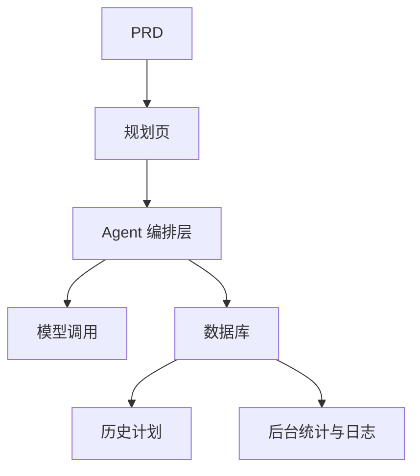

# 智能旅游规划 Agent 平台开发实战

这个项目不是“做一个会聊天的旅行助手”，而是围绕一份真实 PRD，把一个可执行的旅行规划产品从想法推进到可上线原型。

你会同时看到三件事：

- 项目要做成什么
- 如何基于 PRD 拆解并推进开发
- 最后应该交付出什么样的效果

::: tip PRD 入口
本项目的需求文档在 GitHub： [查看 PRD](https://github.com/datawhalechina/easy-vibe/blob/main/docs/zh-cn/stage-2/assignments/travel-planning-agent-platform/PRD.md)
:::

<div style="margin: 32px 0;">
  <ClientOnly>
    <StepBar :active="0" :items="[
      { title: '看 PRD', description: '先明确页面、角色、Agent 编排、外部数据和导出范围' },
      { title: '生成骨架', description: '让 AI 先产出首页、规划页、历史页、后台页骨架' },
      { title: '监工迭代', description: '逐页验收、补接口、修结构化输出和任务状态' },
      { title: '交付上线', description: '完成可演示、可运行、可继续开发的产品原型' }
    ]" />
  </ClientOnly>
</div>

## 这个项目到底在做什么？

这是一个旅行规划 Agent 平台：

- 用户输入出发地、目的地、日期、预算和偏好
- 系统生成每日行程、预算拆分和建议
- 用户可以保存历史计划、再次生成、导出
- 管理员可以查看热门目的地、失败任务和反馈

## 开发过程怎么走？

### 1. 先看 PRD，不要上来就写代码

先确认：

- 第一版是否只做单目的地
- 行程输出是否必须结构化
- 导出能力做多深
- 后台统计和任务日志范围是否清楚

### 2. 先让 AI 生成“骨架版”

第一轮先生成：

- 首页
- 规划页
- 行程详情页
- 历史记录页
- 管理后台页

### 3. 再进入“监工模式”

你要重点盯这几件事：

- 输入表单字段是否和 PRD 一致
- 行程输出是否真的结构化
- 预算、节奏和每日活动是否合理
- 历史计划和重生成是否闭环
- 失败任务有没有被记录

### 4. 最后做联调和上线



## 怎么让 AI 帮你生成？

```text
请基于当前 PRD，帮我生成一个智能旅游规划 Agent 平台的前端骨架。

要求：
1. 页面包括：首页、规划页、行程详情页、历史记录页、管理页
2. 规划页左侧是表单，右侧是结果预览
3. 先只生成页面结构和假数据，不接真实接口
4. 风格要像现代 AI 产品
```

## 怎么“监工”才有效？

| 检查项 | 要看什么 |
|------|------|
| 页面是否对 | 页面数量、功能是否符合 PRD |
| 接口是否对 | 规划、详情、历史、重生成是否闭环 |
| 输出是否对 | 行程结果是不是结构化且可读 |
| 数据是否对 | trip、itinerary、logs 是否一致 |
| 演示是否对 | 是否能演示“输入 -> 生成 -> 保存 -> 再次生成” |

## 最后的预期效果

- 一套可运行的旅行规划 Agent 平台
- 一份同级 PRD 文档
- 首页、规划、详情、历史、后台五类页面
- Agent 编排、结构化输出、历史管理、后台统计
- README 和演示方案

## 验收标准

| 维度 | 最低达标 |
|------|------|
| PRD 对齐 | 页面、功能、数据结构基本符合 PRD |
| 产品闭环 | 规划、保存、历史、重生成可以跑通 |
| 后台能力 | 任务统计和失败日志可以查看 |
| 工程完整度 | 前端、后端、数据库、模型调用链路已接通 |
| 展示能力 | 可以清楚演示“从 PRD 到成品”的过程 |

::: tip 🚀 完成后你会得到什么？
你得到的不只是一个旅游聊天 Demo，而是一套带结构化输入、Agent 编排和任务管理的 AI 产品开发样例。
:::
