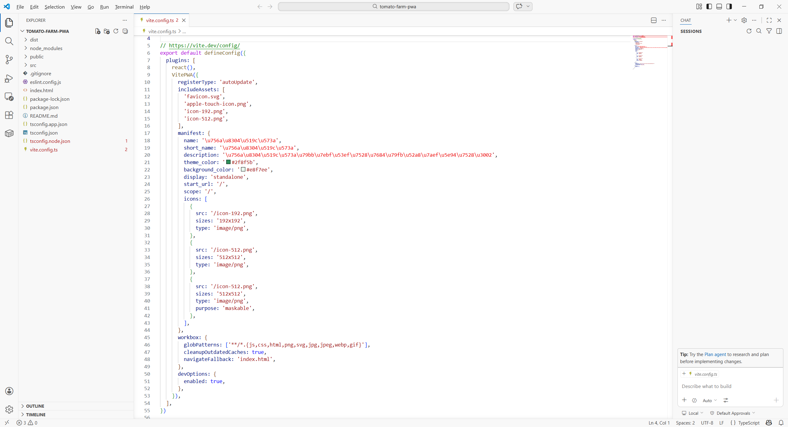
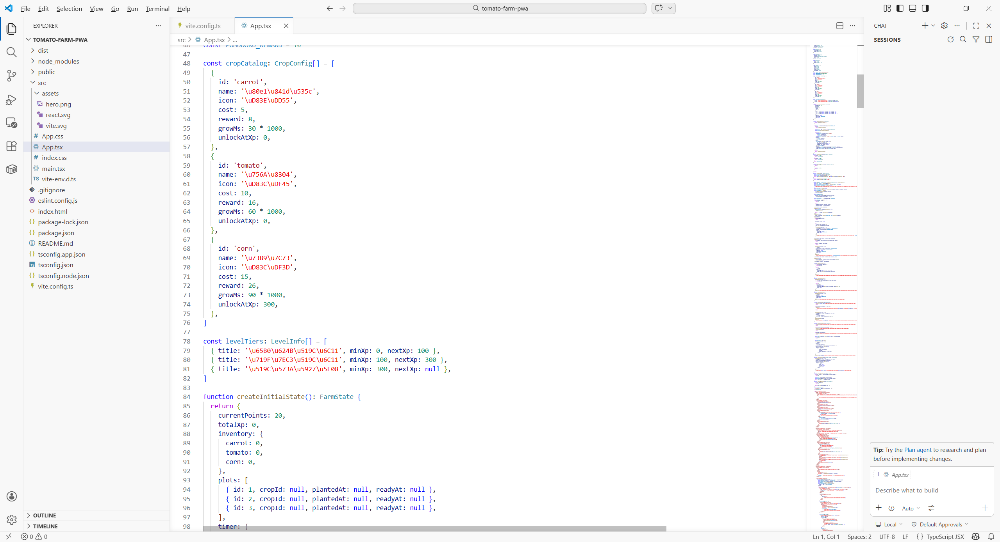
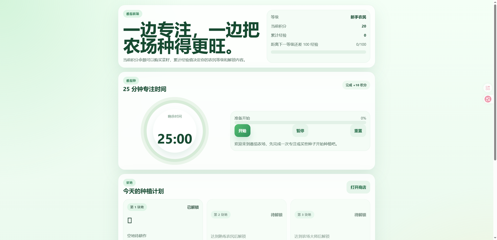
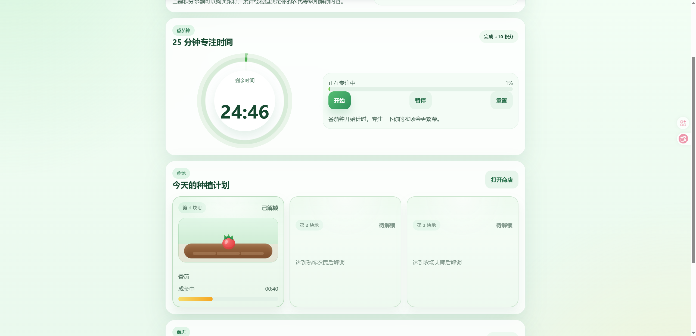
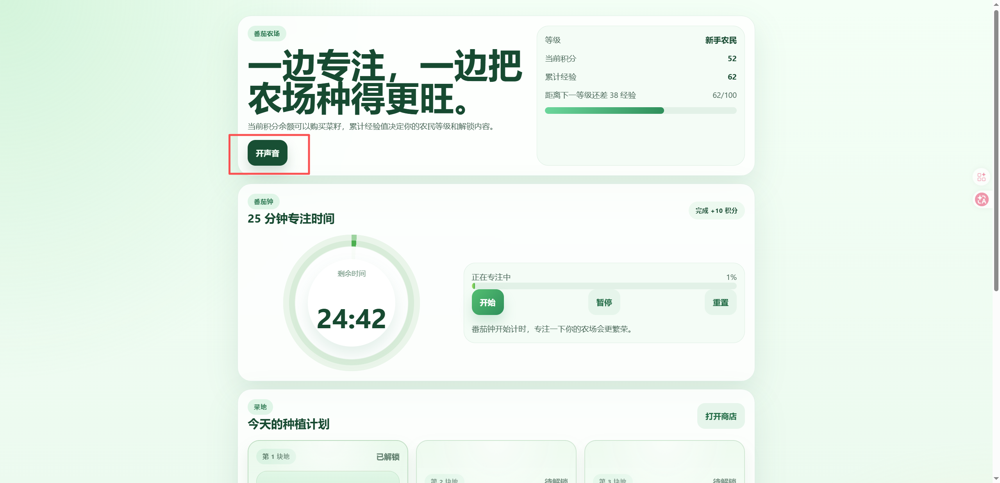
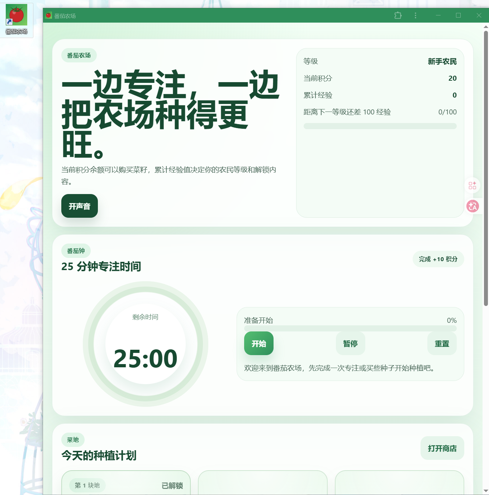
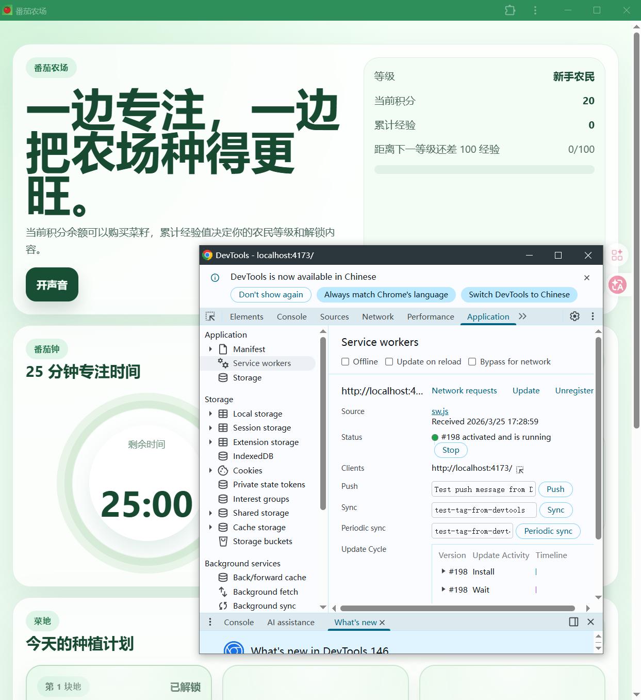
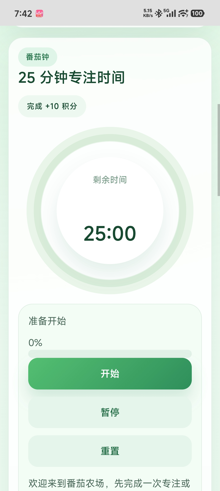
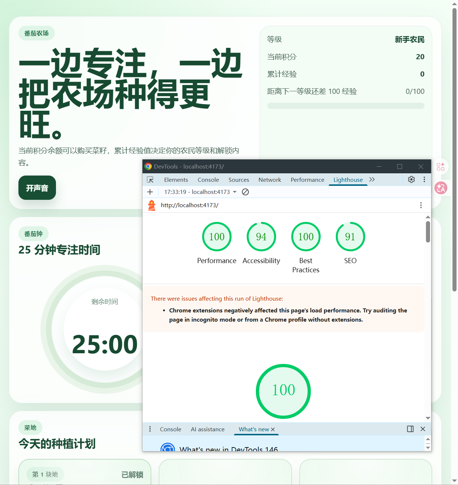
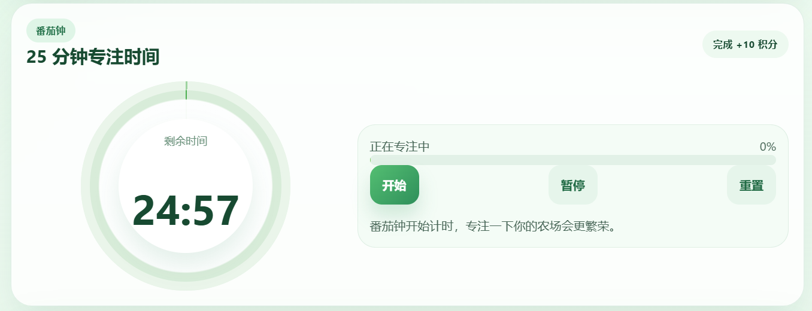

# 如何开发 PWA 本地应用——让网页变成"真正的 App"

# 第 1 章：什么是 PWA 和 PWA 开发

在这篇教程中，我们将完整跑通一条闭环：从一个普通的网页项目，到一个可以安装在电脑桌面和手机主屏幕上、断网也能正常使用的"真正的 App"。你会亲手把一个 React 应用变成 PWA，部署上线后在手机上安装体验。

本次教程，你至少需要具备：

- 一台电脑（Windows 或 Mac 均可）
- Node.js 环境（18.0 以上版本）
- 你的 AI 编程助手（Cursor / Trae / Claude Code 等）
- 一个手机（用于体验移动端安装）

## 1.1 什么是 PWA？

你有没有想过：**一个网页，能不能像微信、抖音一样，直接安装在手机桌面上，点开就用，甚至断网也能跑？**

答案是：可以。这就是 **PWA（Progressive Web App，渐进式 Web 应用）**。

PWA 本质上还是一个网页，但它通过几项关键技术，让自己"进化"成了一个接近原生 App 的存在：

* **可安装**：用户可以把它"安装"到桌面/主屏幕，拥有自己的图标和启动画面，打开后没有浏览器的地址栏，看起来就像一个独立的 App。
* **可离线**：即使没有网络，App 也能正常打开并展示缓存过的内容。
* **可推送**：像原生 App 一样发送通知提醒。

简单来说，PWA 就是 **"穿上了 App 外衣的网页"**。

<!--  -->

## 1.2 PWA 的三大核心技术

要让一个普通网页"进化"成 PWA，需要三样东西：

**1. HTTPS（安全连接）**

PWA 必须运行在 HTTPS 协议下。这是浏览器的硬性要求——只有安全的网站才有资格使用 Service Worker 等高级功能。好消息是，现在主流的部署平台（Vercel、Netlify、GitHub Pages）都自动提供免费的 HTTPS。

**2. Web App Manifest（应用清单）**

这是一个 JSON 配置文件，告诉浏览器："我是一个 App，我叫什么名字、用什么图标、打开后长什么样"。它决定了你的 PWA 安装后的外观和行为。

**3. Service Worker（服务工作线程）**

这是 PWA 的"灵魂"。它是一段运行在浏览器后台的 JavaScript 代码，充当你的 App 和网络之间的"中间人"。它可以拦截网络请求、缓存资源，从而实现离线访问。你可以把它理解为一个 **"住在浏览器里的小管家"**，负责帮你存东西、取东西。

<!--  -->

## 1.3 为什么选择 PWA？

在 Vibe Coding 时代，PWA 是性价比最高的"跨平台方案"之一：

| 对比维度 | 原生 App | PWA |
|---------|---------|-----|
| 开发成本 | 需要分别开发 iOS / Android / 桌面端 | 一套代码，全平台通用 |
| 安装方式 | 需要去应用商店下载 | 浏览器里直接安装，秒装 |
| 更新方式 | 用户需要手动更新 | 自动更新，用户无感 |
| 体积大小 | 动辄几十 MB | 通常只有几百 KB |
| 离线能力 | 天然支持 | 通过 Service Worker 支持 |
| 适用场景 | 需要深度硬件访问（AR/蓝牙等） | 内容展示、工具类、轻量应用 |

**一句话总结**：如果你的应用不需要调用摄像头的 AR 功能或蓝牙硬件，PWA 几乎是最省心的选择。

## 1.4 本教程的路线图

我们将使用 **Vite + React + vite-plugin-pwa** 的技术栈，按以下步骤完成整个流程：

1. **创建项目并配置 PWA**：用 Vite 创建 React 项目，安装并配置 vite-plugin-pwa
2. **本地体验 PWA**：构建生产版本，在电脑上安装并测试离线能力
3. **部署上线**：部署到 Vercel 获得 HTTPS 地址
4. **手机安装**：在 Android 和 iPhone 上安装并使用

# 第 2 章：创建项目并配置 PWA

## 2.1 用 AI 初始化项目

打开你的 AI 编程助手（Cursor / Trae / Claude Code），在对话框中输入以下 Prompt：

```
请帮我创建一个 Vite + React + TypeScript 项目，项目名叫 my-pwa-app。
要求：
1. 使用 npm create vite@latest 创建项目
2. 选择 React 框架和 TypeScript 模板
3. 创建完成后进入项目目录并安装依赖
4. 额外安装 vite-plugin-pwa 插件：npm install vite-plugin-pwa -D
```

等 AI 执行完毕后，你的项目目录结构大致如下：

```
my-pwa-app/
├── public/              # 静态资源（图标放这里）
├── src/
│   ├── App.tsx          # 主组件
│   ├── main.tsx         # 入口文件
│   └── App.css          # 样式
├── index.html           # HTML 入口
├── vite.config.ts       # Vite 配置（PWA 配置写在这里）
├── package.json
└── tsconfig.json
```

## 2.2 准备 App 图标

PWA 需要图标才能被安装。我们至少需要两个尺寸：**192x192** 和 **512x512** 像素的 PNG 图片。

你可以让 AI 帮你生成：

```
请帮我用 HTML Canvas 生成两个简单的 PWA 图标（192x192 和 512x512），
背景色用渐变蓝色，中间写一个白色的字母 "P"。
保存到 public/icon-192.png 和 public/icon-512.png。
```

或者你也可以用任何设计工具（Figma、Canva）做一个你喜欢的图标，放到 `public/` 目录下。

<!--  -->

## 2.3 配置 vite-plugin-pwa

这是最关键的一步。打开 `vite.config.ts`，让 AI 帮你配置 PWA 插件：

```
请帮我修改 vite.config.ts，添加 vite-plugin-pwa 的配置。要求：
1. 引入 VitePWA 插件
2. 注册类型设为 autoUpdate（自动更新）
3. 配置 manifest：
   - name: "My PWA App"
   - short_name: "MyPWA"
   - description: "一个示例 PWA 应用"
   - theme_color: "#4285f4"
   - background_color: "#ffffff"
   - display: "standalone"
   - 图标使用 public 目录下的 icon-192.png 和 icon-512.png
4. workbox 配置：缓存所有 js、css、html、png、svg 文件
```

AI 会帮你生成类似这样的配置：

```typescript
import { defineConfig } from 'vite'
import react from '@vitejs/plugin-react'
import { VitePWA } from 'vite-plugin-pwa'

export default defineConfig({
  plugins: [
    react(),
    VitePWA({
      registerType: 'autoUpdate',
      manifest: {
        name: 'My PWA App',
        short_name: 'MyPWA',
        description: '一个示例 PWA 应用',
        theme_color: '#4285f4',
        background_color: '#ffffff',
        display: 'standalone',
        icons: [
          {
            src: '/icon-192.png',
            sizes: '192x192',
            type: 'image/png'
          },
          {
            src: '/icon-512.png',
            sizes: '512x512',
            type: 'image/png'
          }
        ]
      },
      workbox: {
        globPatterns: ['**/*.{js,css,html,ico,png,svg}']
      }
    })
  ]
})
```

**关键配置解读：**

* `registerType: 'autoUpdate'`：当你发布新版本时，用户下次打开 App 会自动更新，无需手动操作。
* `display: 'standalone'`：安装后以独立窗口运行，没有浏览器地址栏，看起来像原生 App。
* `workbox.globPatterns`：告诉 Service Worker 要缓存哪些类型的文件，这些文件在离线时也能访问。

<!--  -->

## 2.4 给 App 添加一些内容

一个空白页面没什么意思。让 AI 帮你写一个简单但实用的页面，比如一个 **待办事项（Todo）应用**——这样我们还能体验离线数据持久化：

```
请帮我修改 App.tsx，实现一个简单的待办事项应用：
1. 顶部有一个输入框和 "添加" 按钮
2. 下方展示待办列表，每项有完成/删除按钮
3. 数据使用 localStorage 持久化存储
4. 界面风格简洁现代，使用蓝色主题色 #4285f4
5. 适配移动端（响应式布局）
```

这个 Todo 应用非常适合演示 PWA 的能力：即使断网，你依然可以添加和管理待办事项，因为数据存在本地，页面资源也被 Service Worker 缓存了。

<!--  -->

# 第 3 章：本地体验 PWA

## 3.1 构建并预览

PWA 的 Service Worker 只在生产构建中生效（开发模式下不会注册）。所以我们需要先构建，再预览：

```
请帮我执行以下命令：
1. npm run build（构建生产版本）
2. npm run preview（启动本地预览服务器）
```

构建完成后，Vite 会在 `dist/` 目录下生成所有文件，包括自动生成的 `sw.js`（Service Worker）和 `manifest.webmanifest`。

预览服务器启动后，打开浏览器访问提示的地址（通常是 `http://localhost:4173`）。

## 3.2 在电脑上安装 PWA

打开预览地址后，你会注意到浏览器地址栏右侧出现了一个 **安装图标**（一个小小的下载箭头或 "+" 号）。

**Chrome / Edge 安装步骤：**

1. 点击地址栏右侧的安装图标
2. 在弹出的对话框中点击 **"安装"**
3. PWA 会以独立窗口打开，同时在你的桌面/开始菜单/Dock 中创建快捷方式

安装后的 PWA 看起来就像一个原生桌面应用——没有地址栏，没有标签页，有自己的窗口和图标。

<!--  -->

**macOS Safari 安装步骤：**

1. 在 Safari 中打开 PWA 地址
2. 点击菜单栏的 **文件 → 添加到程序坞**
3. PWA 图标会出现在 Dock 中

## 3.3 测试离线能力

这是 PWA 最酷的部分。让我们验证一下离线是否真的能用：

1. 确保 PWA 已经在浏览器中打开过一次（让 Service Worker 缓存资源）
2. **断开网络**（关闭 Wi-Fi 或拔掉网线）
3. 刷新页面——你会发现 **App 依然正常加载！**
4. 添加几个待办事项——数据正常保存在 localStorage 中

你也可以打开 Chrome DevTools（F12）→ Application → Service Workers，查看 Service Worker 的运行状态和缓存的资源列表。

<!--  -->

# 第 4 章：部署上线

PWA 必须运行在 HTTPS 上才能正常工作。好消息是，现在主流的部署平台都自动提供免费的 HTTPS。我们以 **Vercel** 为例（也可以用 Netlify 或 GitHub Pages）。

## 4.1 部署到 Vercel

**第一步：安装 Vercel CLI**

```
请帮我全局安装 Vercel CLI：npm install -g vercel
```

**第二步：部署**

在项目根目录下执行：

```
请帮我执行 vercel 命令部署项目。
当提示 "Set up and deploy?" 时选择 Yes。
当提示 "Which scope?" 时选择你的账号。
当提示 "Link to existing project?" 时选择 No。
当提示 "What's your project's name?" 时输入 my-pwa-app。
当提示 "In which directory is your code located?" 时直接回车（默认当前目录）。
当提示 "Want to modify these settings?" 时选择 No。
```

等待几十秒，Vercel 会自动构建并部署你的项目。完成后，你会得到一个类似 `https://my-pwa-app.vercel.app` 的 HTTPS 地址。

<!--  -->

**第三步：验证 PWA**

在浏览器中打开部署后的地址，你应该能看到：

1. 地址栏右侧出现安装图标
2. 打开 DevTools → Application → Manifest，能看到你配置的 App 信息
3. Service Workers 标签下显示 Service Worker 已激活

## 4.2 使用 GitHub Pages 部署（替代方案）

如果你更喜欢 GitHub Pages，需要额外配置 `base` 路径：

```
请帮我修改 vite.config.ts，添加 base 配置：
base: '/my-pwa-app/'（替换为你的 GitHub 仓库名）
同时更新 manifest 中的 icon 路径，加上 base 前缀。
```

然后将构建产物推送到 GitHub 仓库的 `gh-pages` 分支即可。

# 第 5 章：在手机上安装 PWA

这是最激动人心的部分——让你的网页变成手机上的"App"。

## 5.1 Android 手机安装

1. 在手机的 **Chrome 浏览器** 中打开你部署好的 PWA 地址
2. Chrome 可能会自动弹出 **"添加到主屏幕"** 的横幅提示，直接点击即可
3. 如果没有自动弹出，点击右上角的 **三个点菜单 → "安装应用"** 或 **"添加到主屏幕"**
4. 确认安装后，你的手机桌面上就会出现 App 图标

打开它，你会发现它以全屏模式运行，没有浏览器的地址栏和导航按钮，和原生 App 几乎一模一样。

<!--  -->

## 5.2 iPhone 安装

iOS 上安装 PWA 只能通过 **Safari** 浏览器（其他浏览器不支持）：

1. 在 **Safari** 中打开你的 PWA 地址
2. 点击底部的 **分享按钮**（方框加向上箭头的图标）
3. 在弹出的菜单中选择 **"添加到主屏幕"**
4. 给 App 起个名字，点击 **"添加"**

从 iOS 26 开始，所有添加到主屏幕的网站都会默认以独立 App 模式打开，这是一个重大改进。

<!--  -->

> **iOS 的已知限制**：
> * 推送通知需要 iOS 16.4 以上，且必须先将 PWA 添加到主屏幕
> * 不支持后台同步（Background Sync）
> * 存储空间比 Android 更受限

## 5.3 用 Lighthouse 审计你的 PWA

Google 提供了一个叫 **Lighthouse** 的工具，可以给你的 PWA 打分。打开 Chrome DevTools（F12）→ Lighthouse 标签 → 勾选 "Progressive Web App" → 点击 "Analyze page load"。

一个合格的 PWA 应该在 PWA 评分上拿到满分。如果有扣分项，Lighthouse 会告诉你具体原因和修复建议。

<!--  -->

# 第 6 章：写在最后

恭喜你！你已经成功构建了一个可以安装在电脑和手机上的 PWA 应用。回顾一下我们做了什么：

1. 用 Vite + React 创建了一个 Web 应用
2. 通过 vite-plugin-pwa 添加了 Service Worker 和 Manifest
3. 部署到 Vercel 获得了 HTTPS 地址
4. 在电脑和手机上都成功安装并体验了离线能力

PWA 的魅力在于它的"渐进式"——你不需要一开始就做到完美。先让你的网页能被安装、能离线访问，然后再逐步添加推送通知、后台同步等高级功能。

**进阶方向：**

* **推送通知**：使用 Push API + Notification API，让你的 App 能像微信一样发送消息提醒
* **后台同步**：使用 Background Sync API，在网络恢复时自动同步离线期间的操作
* **更智能的缓存策略**：根据不同类型的资源使用不同的 Workbox 缓存策略（CacheFirst、NetworkFirst、StaleWhileRevalidate）
* **发布到应用商店**：使用 [PWA Builder](https://www.pwabuilder.com/) 可以将 PWA 打包成 Android APK 或 Microsoft Store 应用

***一套代码，全平台通用——这就是 PWA 的力量。***

# 参考文献

* [Vite PWA 官方文档](https://vite-pwa-org.netlify.app/guide/)
* [Google PWA 开发指南](https://web.dev/progressive-web-apps/)
* [MDN Web App Manifest 文档](https://developer.mozilla.org/en-US/docs/Web/Manifest)
* [Workbox 缓存策略详解](https://developer.chrome.com/docs/workbox/caching-strategies-overview/)
* [PWA Builder - 将 PWA 发布到应用商店](https://www.pwabuilder.com/)

