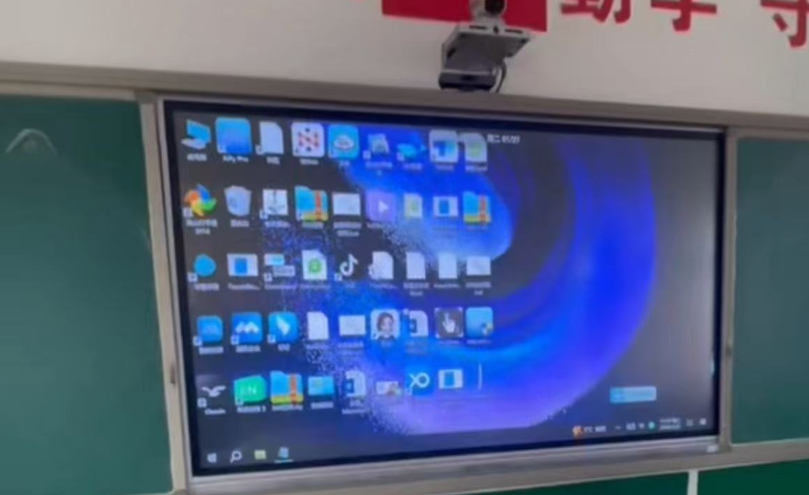
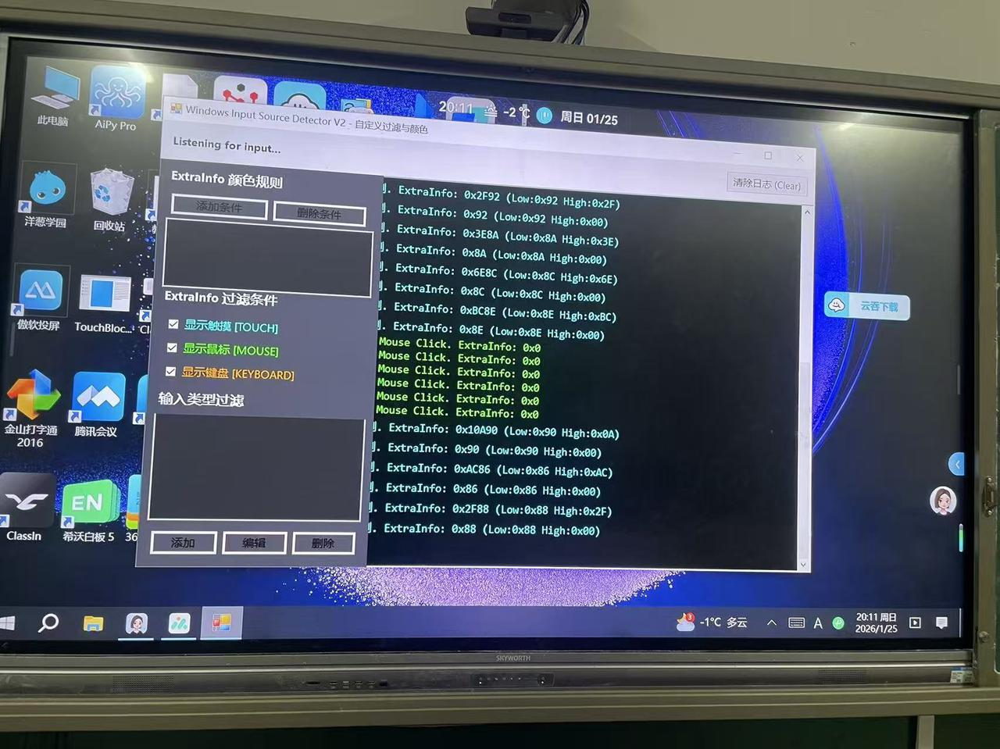
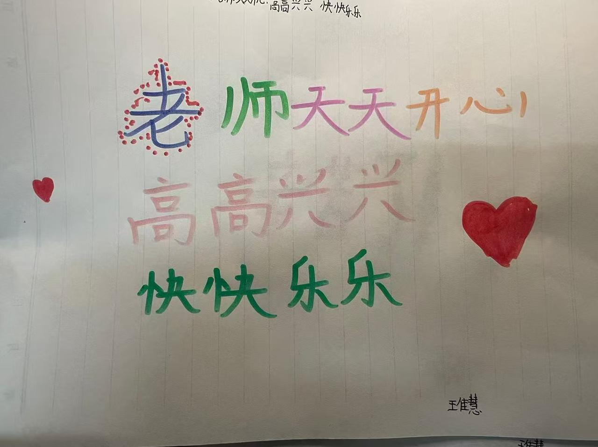

# 放弃月入过万，他在农村小学带孩子们“用AI赶苍蝇”

👨‍🏫

**讲述者：小学老师小浩**

小浩，是一位小学三年级的乡村代课老师。曾经的他做过运营，搞过商业数据分析，也敲过代码，月入过万。在旁人眼里，这个从农村走出来的年轻人算是“混得不错”。但他放弃了令人羡慕的工作，辞职回到老家，只为带农村孩子们去看更大的世界。

## 01 当“人工智能”第一次出现在课堂

刚来村里教书的时候，小浩老师的心里是堵着的。“村里条件有限，孩子们很难有机会看到外面的世界，他们的世界很小，小到只有翻旧的课本和脚下的泥土。”他想让孩子们看看更大的世界，也想告诉他们，这个世界上有一个东西叫“人工智能”。它能画画，会写诗，还能回答脑袋里所有天马行空的问题。

刚开始推进的时候并不顺利。让孩子们自己带手机来学校，通过手机接触 AI，这个想法一度遭到了校领导的坚决反对：“你这是让孩子抄答案！这叫不务正业！”但他没有放弃，三天两头想办法去说服校领导。最后双方各退一步，可以学 AI，但是不能违反学校规定，学生不能自己带手机到课堂上。

于是，小浩老师就自掏腰包，收了几部二手手机，把自己的“豆包”账号登录到这些手机上给孩子们用。就这样，孩子们第一次摸上了“高科技”。他们很快学会了用 AI 搜资料、学舞蹈，甚至玩文生图。AI 第一次帮这些孩子打开了新世界的大门。

## 02 农村课堂的“特产”：苍蝇与误触

现在农村教室也装上了多媒体电子屏，这在很大程度上提高了教学效率，促进了教育公平。但在实际教学环境中，还是有很多难以解决的尴尬。比如，苍蝇。

电子屏发热发光，苍蝇尤其喜欢往上扑。屏幕无法识别是正常操作还是误触，经常造成课件乱跳、视频暂停，甚至中途关机的问题。一节课 40 分钟，得花 20 分钟在讲台上赶苍蝇，好好的课上得稀碎，小浩老师和孩子们都苦不堪言。

突然有一天，一个学生举手对小浩老师说：“老师，我们能不能一起做一个程序，把苍蝇‘关’在外面？”

## 03 和苍蝇的战斗，我们是和 AI “聊天”打赢的

和小学三年级的娃娃一起写代码，还是做这种对技术和知识要求较高的防误触程序，在以前是想都不敢想的。但现在不一样了。有了 AI 的帮助，一切都变得可能。

正好看到一套 Vibe Coding 公益教程，小浩老师就带着孩子们一起“玩”了起来。孩子们出点子，小浩老师负责当“翻译官”，把他们的话喂给 AI。不用去死磕那些复杂语法，指针、句柄、底层消息队列这些拦路虎，统统被 AI 挡在了身后。

- “哎，电脑能不能分清楚，现在是鼠标在点，还是屏幕自己在动？”
- “能不能给屏幕加个‘透明的罩子’，苍蝇撞上去没反应，但我用鼠标还能操作？”

这一问，还真问出了门道。AI 告诉他们要区分 `RawInput`，要识别 `ExtraInfo`。孩子们虽然听不懂这些专业术语，但他们可以通过数据观察和小组讨论，发现不同输入的 `ExtraInfo` 值确实有差别。

就这样，小浩老师和孩子们你一句我一句，和 AI 硬生生“聊”出了现在的【小浩触屏锁】。它的原理很简单：通过识别输入信号的特征，精准拦截掉屏幕的触控信号，只保留鼠标操作。这样一来，不管苍蝇在屏幕上怎么开派对，课件都能稳如泰山。

虽然这个软件不是什么高大上的商业产品，但它真的解决了农村课堂里的真实痛点。它不只是一个程序，更是孩子们第一次参与创造、第一次用技术回应生活问题的答案。

## 04 从写一行代码到敲一扇门

令小浩老师印象最深的，是元旦那天。他问豆包：“怎么带孩子们过一个有意义的节？”AI 没建议开 party，也没建议搞表演，而是说：“与其在教室狂欢，不如去看看村里的孤寡老人。”

于是，他真带着孩子们去看望村里的一位独居五保户大爷。去的时候，大爷正坐在破旧的木凳上吃午饭，桌上只有一碗白水煮面和一盘咸菜。小浩老师心里一揪，后悔没多带些吃的。几个平时调皮捣蛋的孩子都表现得比平时更乖，还和大爷聊起了天。

离开之后，有几个孩子扯着小浩老师的衣角，眼圈红红地说：“老师，我们以后多来帮帮大爷吧。”那天回去的路上，冷风在脸上刮得生疼，他心里却是热乎乎的。

他说：“教育不光是教书本知识，还得教人心。AI 给出的答案，从来不仅仅是技术，更是那颗被它点燃的、想去温暖别人的心。”

## 05 小浩老师的一点心里话

其实做这个软件，最大的收获不是软件本身，而是看到了孩子们眼里的光。以前孩子们觉得，电脑是城里孩子的玩具，编程是天才的事，跟自己没关系。但现在，他们知道，只要有想法，只要敢想，甚至只要会“说话”，他们就能通过 AI 改变自己的生活。

那个提议做软件的孩子，以前最调皮，现在上课听得最认真。因为他知道，他参与创造的东西，正在帮大家解决问题。这种“我也能行”的自信，比考一百分更珍贵。

他也坦白说，自己带孩子们用手机、搞 AI，没少挨批评，也没少听流言蜚语。很多人说他不务正业，带坏风气。但看着孩子们因为 AI 变得更好奇、更善良，他觉得一切都是值得的。

## 06 写在最后

小浩老师真挚地呼吁大家，多多关注公立教育里真实可落地的 AI 电子数字化课堂。农村娃的小小世界，其实更需要 AI 的帮助。AI 不只是工具，更是帮孩子们链接大千世界的一扇窗。

