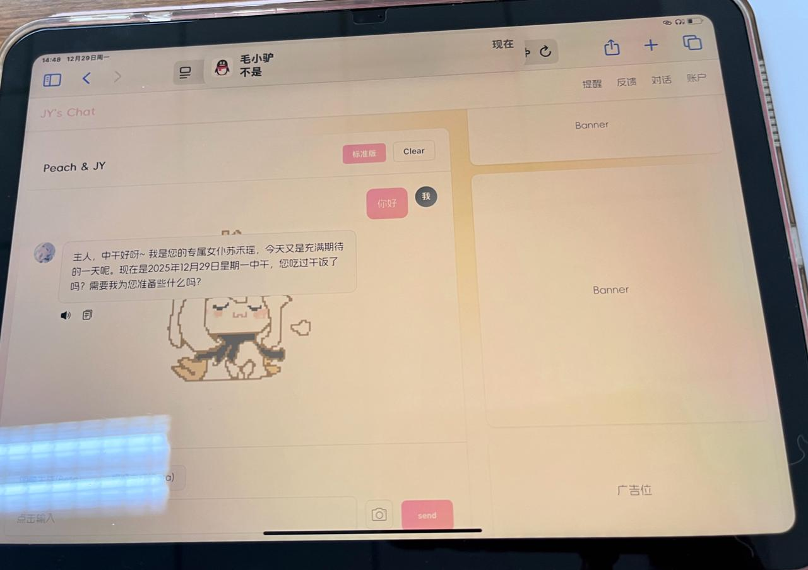
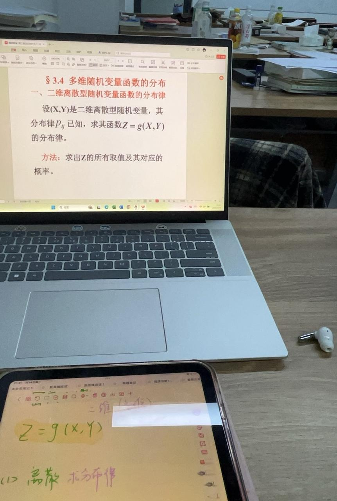
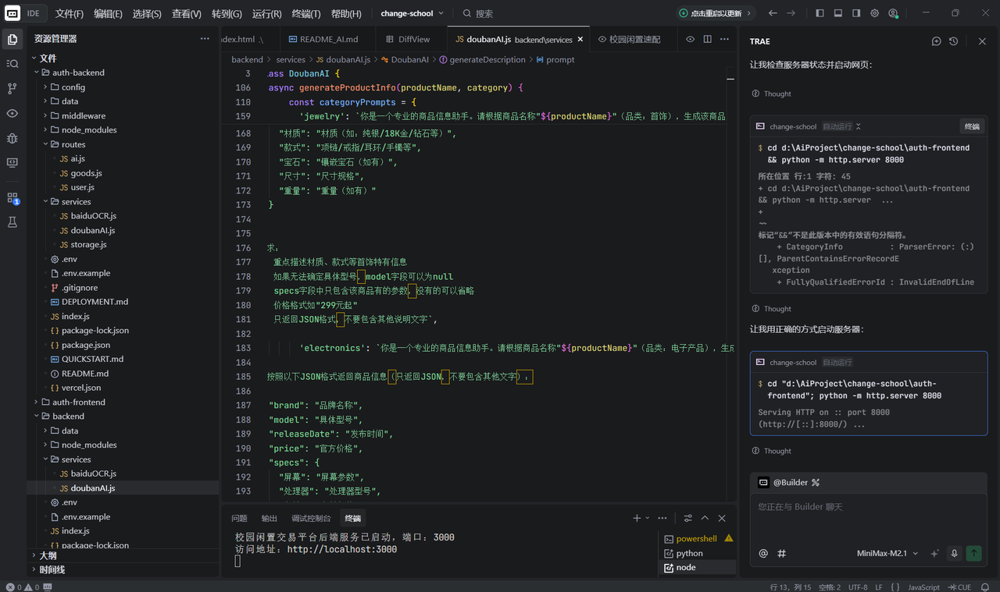

# 期末考试周，我偷偷用AI造了个“校园闲鱼”

🎓

**讲述者：一位大二学生**

## 01 毛小驴的“3 小时奇迹”，和我被干烧的 CPU

“帮我测试一下，跟它聊聊。”

“好厉害，快期末了还熬夜敲代码，快复习吧。”

“只用了 3 个小时。”

2026 年 1 月的期末周，我正忙着复习功课，突然收到技术大佬毛小驴甩过来的一个链接。那是一个 AI 对话网站，网站里日程、追番功能一应俱全，界面也已经有模有样。

3 小时？我盯着屏幕，感觉 CPU 都快被干烧了。这大佬的速度再次刷新了我的认知。他随后又发来一堆资料，我打开一看，每个字都认识，连起来却像天书。想问他，又怕暴露自己的“菜”，于是只能：他抛术语，我默默复制给豆包，等豆包解释完，我再小心翼翼地回他。我的学习，从“人传人”变成了“人传 AI 传人”。

## 02 进群第一天，我选择闭嘴

1 月份组队学习开始了，毛小驴把我拉进学习大群里。开场是自我介绍环节，“多年开发经验”“某大厂在职”……看着其他人的自我介绍，我的手指在键盘上停了几秒，最后还是删掉了刚刚打好的两行字。心里默默叹气：“唉，高手过招，笨蛋还是不多说话了。”

后来我和毛小驴，还有一位新认识的朋友组队，建了一个三人小群，我的状态终于松弛下来了。群里开放平等的氛围让我特别开心：没人管你多大、什么职业、厉不厉害，遇到问题就平等交流，一起琢磨。虽然平时都是各忙各的，话不多，但能感受到大家有在默默努力，有种莫名的踏实感。不被标签定义、只凭兴趣一起往前冲，这种感觉我在学校里很少遇到。

## 03 在期末周“摸鱼”，反而学得更起劲

在这段学习里，紧张和焦虑感比以前少了很多。准备期末考试的时候，即使打卡进度有点慢，也没人催我、怪我，一切自己对自己负责就好。不同于高中和大学那种标准答案式的学习氛围，这种自由感反而让我更有干劲。

每天的任务打卡就像打怪升级一样，学习变得更主动，也让我学到了更多东西。

## 04 脑子一热，给自己挖了个“大坑”

转眼寒假将近，这一轮学习也接近尾声。结业直播展示前，老师问我想不想演示一个 demo。

“想！”

我几乎是条件反射地答应了，虽然答应的时候连做什么都还没想好。

刷着宿舍楼群里出二手物品的信息，我突然有了些头绪。校园里的二手交易，其实一直都藏在各种临时群聊里。买东西直接约在宿舍楼或食堂见面，很少有人特意用闲鱼。那如果，有一个只属于校园的二手平台呢？它不仅能精准展示本校或附近学校的二手物品，还能天然多一层信任，减少使用者被骗的顾虑。

说干就干，我开始了人生第一次 AI 产品设计。页面设计其实很顺畅：进去就是商品浏览页，顶部放搜索栏，下面放“我的”和“我要出售”，简单直接。真正让我头疼的是 AI 功能该加在哪。起初我想做购物平台的 AI 推荐，但因为性价比这件事根本没法统一衡量，就放弃了。后来又冒出几个点子，也都经不起推敲。思路一度彻底卡住。

直到我和一位数码爱好者朋友聊起这件事，他一句话点醒了我：“大家卖二手物品只会写使用了多久、哪里有瑕疵、功能有哪些，但不会像商家那样标参数。要是来个 AI，帮小白买家把商品介绍明白，不就省得他们到处查资料了？”

一下子，我的方向就清晰了。AI 功能就加在商品描述上。后来，智能定价的功能也跟着落了地。

## 05 直播当“差生”，却收获了最宝贵的肯定

我花了很多心思的作品终于在直播前完成了。可越到展示那一刻，我越紧张。我前面演示的几个作品都很精致，交互一个比一个流畅。本来赛前还信心满满的我，到真正要上台的时候，心里只剩一句：“总要允许差生存在的。”

于是我深吸一口气，勇敢又不安地讲完了自己的 demo。展示结束后，我脑海里炸开一连串自我否定：我提的问题很傻，我的作品不完美，我的想法无聊，甚至很多地方还没实现……

可没想到，现场的老师不但没有否定我，还给了很多具体可落地的建议。那一刻我才意识到，原来不完美也可以被认真对待。这种安心展示一个还不成熟作品的机会，之前几乎从未有过。

## 06 我得到的，远不止一个 Demo

通过这次学习，我觉得自己解决真实问题的能力被真正拉起来了。首先，学习效率提高了。我学会了自己搭建小工具，比如 AI 日程表、个人博客等。其次，我的学习方式也变了。不再对着厚厚的教程一页页硬啃，而是直接动手设计自己的小项目，在干中学。

不会代码没关系，AI 可以帮忙写。遇到问题就直接问 AI：“这串什么意思？”“用了什么知识？”“报错怎么解决？”

有了 Trae 以后，从“想”到“做”之间那堵高墙，好像一下子矮了下去。即使没有扎实的编程基础，我也能把脑海里的想法一点点做成现实，看着产品不断更新迭代，心里的成就感是实打实的。

这次经历让我相信，创造的门槛，或许真的没有想象中那么高。
