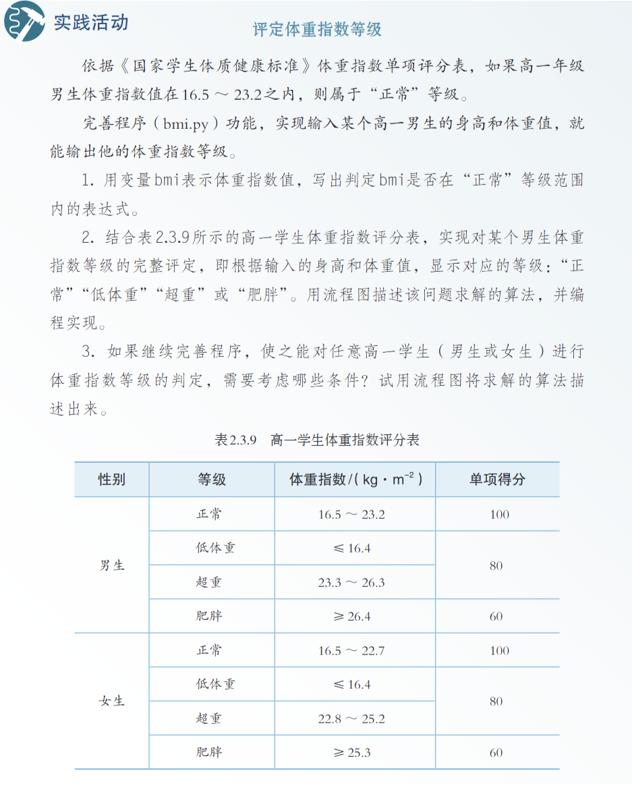
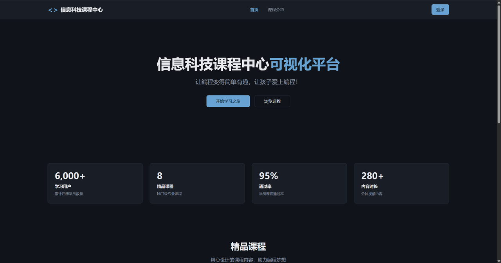

# 我给每个学生，做了一个不会累的“学霸同桌”

🧑‍🏫

**讲述者：一位高中信息技术老师**

我是一名高中信息技术教师，也是学校的信息中心主任，还是石家庄市 AIGC 种子教师的一员。这些身份听起来花里胡哨，但说白了，就是在做三件事：为祖国培养人才、为教师减轻负担、为教学提升效率。

所以我学习人工智能、思考如何应用，一开始既是工作要求，也是个人爱好。但真正让我下决心做点什么的，是我负责教学的那门 Python 实践课。

## 01 那节差点把我“淹没”的 Python 课

我教的 Python 编程课，内容本身并不复杂。只需要学生们写个程序算出 BMI 指数，输入身高体重，判断胖瘦，再输出结果。但是对于没有任何编程基础的学生来说，接触一个全新的领域并理解其中的运行规则，是一件非常困难的事。

很多时候，老师讲的和学生理解的相差甚远。所以一些已经讲过的内容，会被学生反复提问。任务刚布置下去，过不了一会，四面八方都是举起的手，此起彼伏的“老师老师老师”……那种感觉，就像站在菜市场中央，每个摊主都在招呼你。

50 个学生，1 个老师。每个学生卡住的点都不一样：有人不明白 `input()` 是干什么的，有人不知道 `if` 语句怎么写，有人根本搞不懂数据类型转换。一节课 45 分钟，我像个不停拧螺丝的工人，这边刚拧紧一颗，扭头一看，旁边又松了三颗。

虽然一刻都没有停下来，但举手提问的同学好像一点都没少。有的学生等了几分钟还等不到我，就开始自己折腾电脑；还有的学生索性直接趴下睡觉了。下课铃响起的那一刻，我站在机房里，看着眼前一片混乱，突然觉得特别无力。

不是学生的问题，他们已经很努力了。也不是我教得不好，而是这个模式本身就有问题。编程不是数学课，没法把所有人的问题统一讲给全班听，只能一个个去指导。

## 02 给每个学生，配一个不会累的“学霸同学”

那天晚上我失眠了。不是焦虑，而是在想一个问题：如果每个学生都能有一个“助教”，随时解答他的问题，会怎么样？

这个助教不直接给答案，只需要告诉他：“你这里错了”“这个函数是这样用的”“换个思路试试”……

就像以前读书时，坐在旁边的那个学霸同学。你卡住了，问他一句，他点拨你一下，然后你自己就解决了。想到这里，我突然意识到，AI 或许可以变成这样一位“学霸同桌”。

现有的 AI 编程工具虽然可以直接给答案，但还不能做到真正的学习引导。所以我决定自己做一个新的应用，一个会教学、会引导、会陪着学生把问题想清楚的 AI 助教。

## 03 从梦想到现实：编程学伴

我之前只写过一些简单的小软件，但没碰过这么复杂的应用开发。对“接入 AI 的应用开发”更是完全没有经验，所以一开始心里非常没底。也是从那时候开始，我这个“会教书但不会做复杂产品”的老师，第一次真正把脑子里的想法跑了起来，变成了一个可用应用。

那段时间，我连续 5 天每天晚上跟着课程打卡学习。开发过程中最难的地方不是写代码，而是找 AI 的 API：哪个平台免费、哪个速度快、哪个适合教育场景……这些都得一个个试。

我还记得第一次在应用里集成 AI，输入“input 函数怎么用”，看到它真的返回了示例代码和讲解时，那种兴奋和欣慰到现在都记得。我给这个应用起名叫“信息科技课程中心”，核心模块是“编程学伴”。

它能做三件事：

- **基础知识答疑**：学生问“for 循环怎么写”“列表怎么用”，学伴直接给出用法说明和示例代码。因为这是基础知识，不是作业题。
- **作业题引导**：学生拿着老师布置的题目来问，学伴不给完整代码，而是用苏格拉底式提问一步步引导他自己想出来。
- **代码审查**：学生把自己写的代码贴上来，学伴指出问题在哪，但不直接替他改完。

为什么要设计成这样？因为学习的目的不是“完成作业”，而是“学会解决问题”。如果 AI 直接给答案，学生只会复制粘贴，表面上交差了，实际上什么都没学会。

## 04 作业和记录成了新的麻烦

软件做出来之后，我自己测试了一圈，觉得挺好。同事看完也说：“这个太棒了，解决了我们的痛点。”但开学后第一周，新的问题就来了：学生在课上用编程学伴解决了问题，然后作业提交到哪里？

以前我们用的是极域电子教室，学生在机房里提交，我在教师机上收。但这个系统有个致命问题，只能在机房里用，下课就断。学生在机房之外，既无法继续做课程作业，也无法回看之前的学习记录。

于是我又花了几个晚上，给“编程学伴”加了一整套班级和课程管理系统：

- 老师可以创建班级和课程；
- 学生加入班级后，可以看到所有课程内容和作业；
- 课上没完成的，课下还能继续做、继续交；
- 老师可以课下批阅作业，不合格的打回重做；
- 当学生通过某门课的所有作业，系统会自动发一份课程完成证书。

这个“证书”是我特意加的。因为我知道，对于高中生来说，一个小小的认可和仪式感，足以让他觉得“我真的学会了什么”。

编程学伴加上课程管理，形成了一个完整的学习闭环，也让学生的学习更有始有终、更有成就感。

## 05 如果每个老师，都能多一个帮手就好了

现在学生放假了。虽然课程管理系统还没真正在课堂上大规模使用，但同事们测试后的反馈让我很有信心：“这就是我们需要的东西。”更让我没想到的是，这个系统甚至有可能推广到石家庄全市的其他学校。

我一开始做这个系统，只是想解决自己班上那 50 个学生的问题，没想着做多大的事。但转念一想，如果全市的信息技术老师都在面对同样的困境，所有学生都在喊“老师”，而老师只有一个，那这个工具就确实应该被更多人用到。

AI 可能就是那个答案。不是用 AI 替代老师，而是用 AI 帮助老师，让每个学生都能得到个性化的指导。

## 06 结语

最后说说技术实现。我用的是百度秒哒平台，0 成本部署。我们学校没有服务器预算，所以这个“0 成本”特别重要。5 天时间，产品就从想法走到了上线。甚至从学 Vibe Coding 到做出应用，利用的都是晚上的零碎时间。

我不是专业开发者，也不是技术大牛。只是一个普通的高中信息技术老师，在某个失眠的夜晚，想解决一个真实问题。后来我发现，技术真的可以改变教育。不是那种宏大叙事的“教育革命”，而是具体的、微小的、但真实有效的改变。

如果你也是信息技术老师，也在面对类似困境，或者你只是对 AI + 教育感兴趣，欢迎继续交流。我们一起，让技术真正服务教育。
