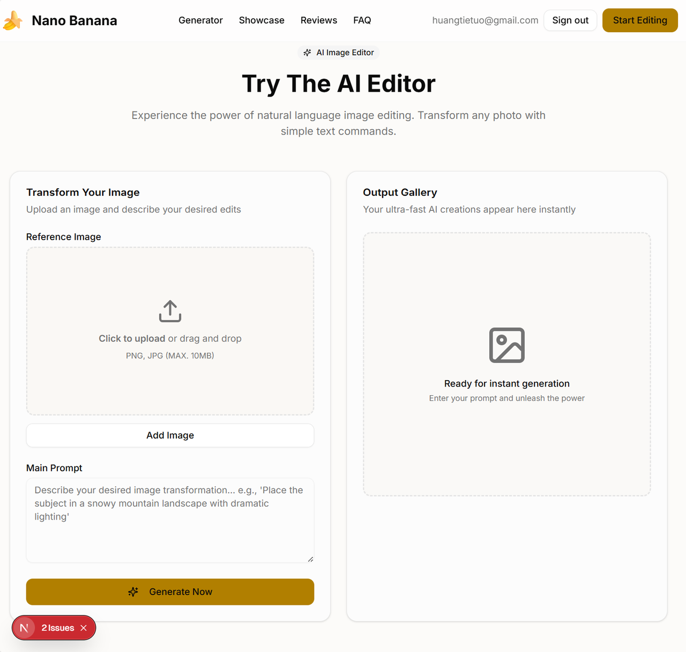
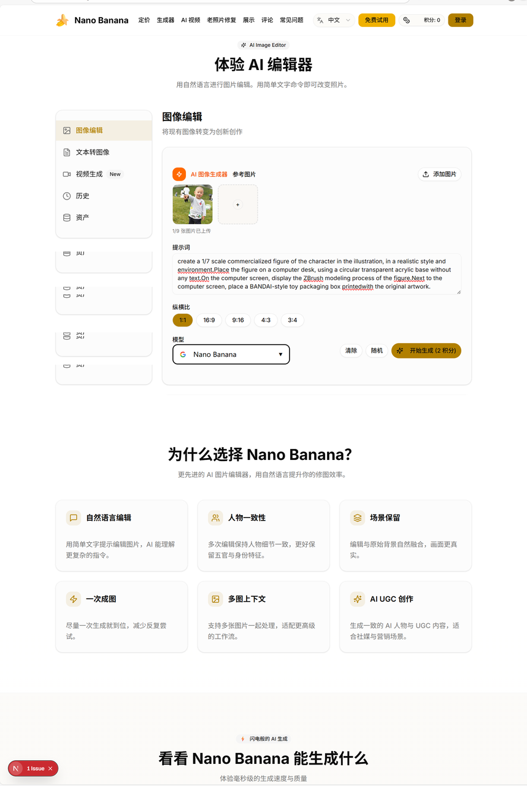

# 48岁货车司机，熬了几个通宵，硬是用AI磕出一个出海工具站

🚚

**讲述者：货车司机老黄**

## 01 “南斯拉夫总统”决定换个赛道

“今年我 48 岁，本命年。在这个‘十年不摸电脑’的年纪，2025 年春节 DeepSeek 的火爆，像一记闷雷把我炸醒了。”

老黄是在焦作这个四线小城长大的“厂二代”，因为小时候有个外号，大家偶尔会拿“南斯拉夫总统”来打趣他。现在，身边的人都直接叫他老黄。

老黄是一位自动售货机货物运输员。DeepSeek 的爆火让他意识到：“时代的列车要开了，不管是在写字楼里喝咖啡的人，还是在货车里啃馒头的人，都会受到 AI 浪潮的冲击。不迎头赶上，就只能被甩在原地吃灰。”

于是，这个彻头彻尾的门外汉决定认真学一学。他想看看，“一个原来只会开车的手，能不能敲响 AI 编程的门。”

## 02 从“手工业”到“指挥艺术”

刚开始学的那两周，老黄心里直打鼓：“我这连代码长啥样都不知道，能行吗？”

但老师和助教们的话给了他信心：AI 编程时代，咱不是代码搬运工，咱是导演。写程序不再需要一砖一瓦地垒，只要和 AI 说清楚，就能一步步做出来。

于是，老黄开始接触 vibe coding。

- “帮我做个贪吃蛇，要好看点，有开始按钮！”
- “生成个动态地图，展示货物从中国发往全球的酷炫效果！”

嗖的一声，应用就出来了。这种奇妙的感觉让他深受震撼。编程从一种枯燥的“手工业”，变成了指挥若定的“艺术”。这双握了半辈子方向盘的手，竟然也能握住数字世界的方向盘。

## 03 在崩溃和坚持里，硬跑通“商业闭环”

“光说不练假把式，得实战！”

课程第五个任务，是要自己完成一个大作业。老黄决定做一个海外 AI 工具站，得能用、能部署、还能收钱，最好形成一个完整的“商业闭环”。

刚开始复刻网站原型还算顺利。但到了第二步，实现“核心功能图生图”时，系统就开始疯狂报错。作为一个小白，老黄只能一边和 AI 对话调试，一边补基础知识。连续四五天，他白天开车补货，晚上回来就和 AI 展开“车轮战”，反复对话、调试、学习。最崩溃的时候，他守在屏幕前，对着 F12 开发者文档一坐就是一个通宵。

他也想过放弃。是学习群里的积极解答、知识分享会的专业分享，把他又拉了回来。这些都成了他坚持下来的力量。后来他用上了国产编程工具 Trae 的免费大模型，报错减少了，沟通也更顺畅了。老黄一口气把文生图、文生视频、老照片修复都接了进去。

最难啃的骨头，其实是设置域名邮箱、配置谷歌登录，以及接入支付系统（Paypal 和 Creem）。老黄对着官方文档，一边问 AI，一边自己做设计和配置。就这样，他一个人完成了从 0 到 1 的支付接口对接。

他说，Nano Banana 顺利跑通的那一刻，自己真想大喊一声：“设计实现一个能真正跑通商业闭环的网站，不再是只有大公司程序员才能干的活！”

## 04 老黄的“零基础开发法则”

老黄一路摸索、一路踩坑，也总结出了几条“带血”的经验：

- **积木法则**：别想一口吃成胖子，一次只改一个小功能，改好了再走下一步。
- **学会举例**：跟 AI 沟通时别说大道理，直接给它看例子、报错信息和理想效果。
- **学会偷师**：别光复制粘贴，尽量理解 AI 为什么这么写。
- **调整心态**：报错了别怕，那是在教你避坑。

## 05 时代列车，人人可上

现在，老黄还是那个在郑州跑货车的司机。但和以前不同的是，现在的他多了一个身份：AI 应用开发者。最近他又给公司开发了一个“速便利校园零食购”小程序，极大提升了老师和同学们的购物体验。

正如老黄所说：“只要有解决问题的冲动，代码就不再是门槛。”

他的寄语也很直接：

> 朋友们别害怕，只要你想出发，什么时候都不晚。  
> 方向盘，就在你自己手里！
