# 用設計和程式設計 Agent 設計網站

## 本章導讀

本章將展示設計與開發如何透過 AI 完美協作。你將扮演產品經理的角色，指揮“設計 Agent”完成 Logo 設計、配色方案與頁面佈局，再協同“程式設計 Agent”將視覺稿轉化為可執行的程式碼。從創意構思到網站上線，體驗全鏈路的 AI 賦能開發流程，讓一個人成為一支隊伍。

---

# 1. 入門指南

## 1. 教程簡介

讓我們使用 AI 設計 Agent 和編碼 Agent，從零開始搭建一個完整的網站。

- **設計 Agent**：負責建立 logo、網頁佈局、配色方案和其他視覺元素
- **編碼 Agent**：根據你在提示中提出的需求與佈局，編寫 HTML/CSS/JS 等實際程式碼，構建可執行的網站

## 2. 設計 Agent 與編碼 Agent

- **設計 Agent**：根據你提供的提示，生成圖片、頁面模型或設計風格的 AI。
- Mastergo
- Lovart
- Figma MCP
- **編碼 Agent**：根據你在提示中請求的功能與佈局，編寫實際的程式碼（HTML/CSS/JS 等）的 AI。
- Z.AI
- Trae
- Cursor
- Lovable

---

# 2. 使用設計 Agent 建立 Logo

## 1. 設計 Logo 時需要考慮的關鍵要素

Logo 是決定你網站第一印象的關鍵元素之一。想要從 AI 設計 Agent 那裡獲得滿意的結果，你需要在提示中清楚地描述你想要的 Logo 型別。

1. **品牌名稱 / 文字**

- 必須出現在 Logo 中的文字（例如：網站標題、品牌名稱等）。

2. **風格（情緒 / 氣氛）**

- Logo 想要傳達的整體感覺或氛圍。
- _示例：極簡、可愛、簡潔、現代、復古、未來感等。_

3. **配色方案**（可選）

- 最好讓 Logo 的配色與整個網站的整體基調相匹配。
- 可以指定具體的十六進位制色號，或大致的色調（冷色、暖色等）。
- _示例：**`#171721`**（黑色）、**`#FF7130`**（橙色）。_

4. **形式（形狀 / 結構）**

- 明確 Logo 是否需要特定的形狀或構圖。
- _示例：文字在圓形內部、圖示 + 文字組合、以圖示為主的 Logo 等。_

5. **圖示 / 符號元素**（可選）

- 希望出現在 Logo 中的圖形或符號。
- _示例：書本圖示、閃電符號、與 AI 相關的圖形、抽象幾何圖形等。_

## 2. 編寫 Logo 設計提示詞

**示例提示詞**

```
"請為我設計一個極簡風格的 Logo，品牌名稱是 ‘My First Website’。
使用黑色 (#171721) 和橙色 (#FF7130)，並將文字放在一個圓形內部。"
```

```
"請設計一個以 ‘AIID’ 為品牌名的 Logo。
整體風格要未來感、乾淨簡潔，主色為藍色與白色。
將象徵 AI 的抽象圖形與文字相結合，並匯出為帶透明背景的 PNG。"
```

## 3. 向 Agent 請求設計

- 輸入上述提示詞 → 比對 Agent 生成的多個設計稿。

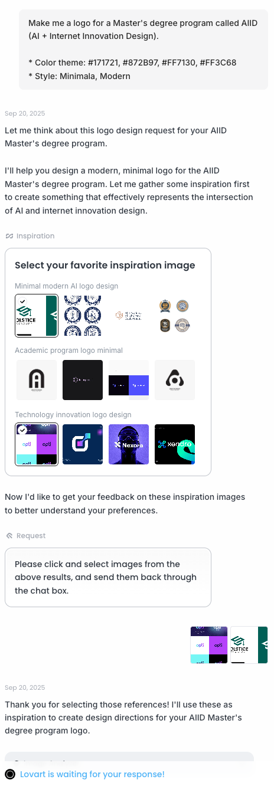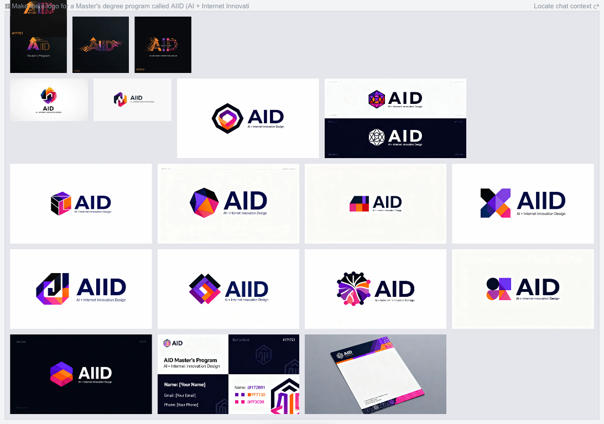

## 4. 確定最終 Logo

- 從草稿中選擇你最喜歡的版本並下載。

---

# 3. 規劃你的網站結構

## 1. 瞭解基礎版塊

在真正開始製作網站前，先規劃好要包含哪些選單（版塊）非常重要。選單的設計取決於你希望訪客看到什麼、以及你希望他們採取什麼行動。
一般來說，網站通常由 **Home / About / Contact** 等基礎版塊構成。

## 2. 自己先畫一個結構草圖（可選）

你可以先根據網站的目標，大致寫出一個簡單的選單結構。

### 基礎選單

1. **Home**
   1. 訪客進入網站後首先看到的主頁面
   2. 通常包含 Logo、主視覺區域和一句簡短的標語或簡介
2. **About**
   1. 介紹你是誰，或者專案 / 服務的目的
   2. 個人作品集：自我介紹 + 簡短履歷
   3. 服務類網站：願景、目標以及核心功能
3. **Contact**
   1. 聯絡方式，如郵箱、電話號碼、社交媒體連結等
   2. 也可以加入一個簡單的聯絡表單

### 可選選單

4. **Services / Projects**
   1. 展示你提供的服務，或你的專案 / 作品集
   2. 通常以列表或卡片形式展示

5. **Gallery**
   1. 用於展示圖片、照片或設計作品

6. **Blog / News**
   1. 用於釋出文章、動態或日誌

7. **FAQ**
   1. 整理訪客經常會問的問題及解答

## 3. 選擇配色方案（可選）

如果你已經有了 Logo，或者想用特定的顏色搭配來設計網站，也可以直接在提示詞中寫上你想使用的顏色程式碼。

**示例：** `#171721, #872B97, #FF7130, #FF3C68`

即使你暫時想不到配色方案，也可以透過配色網站或搜尋關鍵詞來找到靈感。

- **配色參考網站**
  - https://colorhunt.co/
  - https://coolors.co/

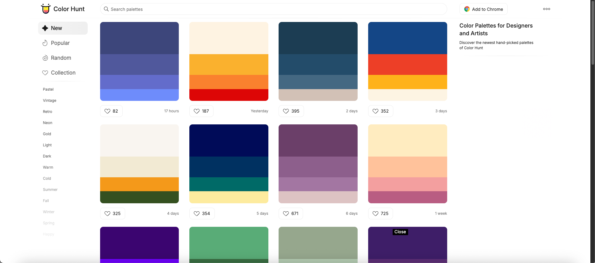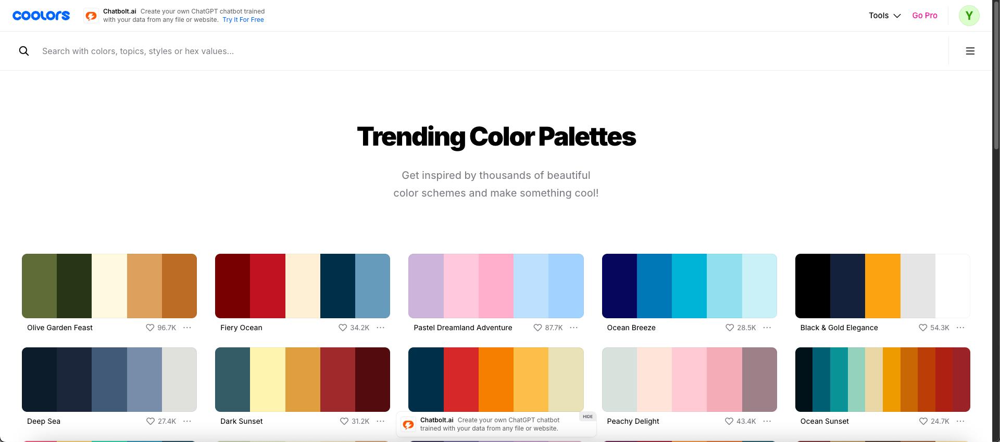

- **在 Google 上透過關鍵詞搜尋配色**

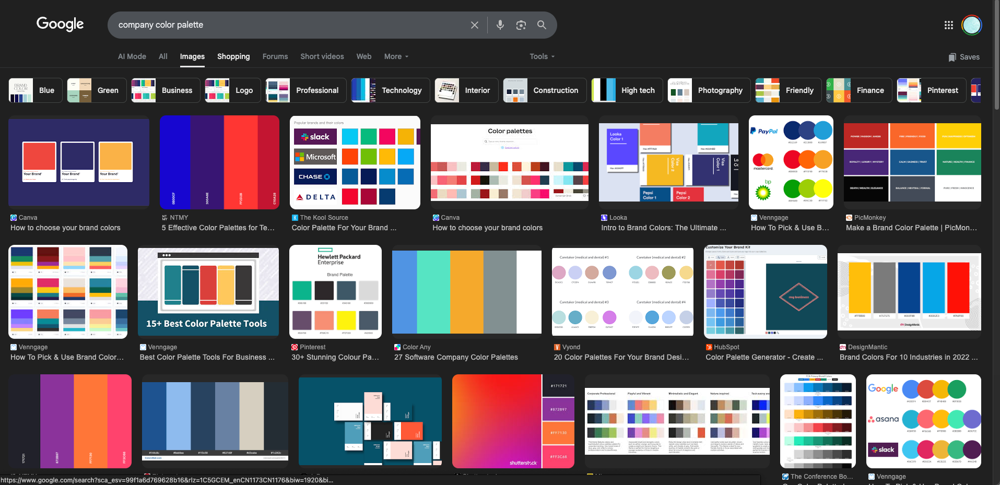

## 4. 編寫網站設計提示詞

**示例提示詞**

```
"請設計一個由 Home、About、Contact 三個版塊構成的單頁網站。
使用配色 #171721、#FF7130 和 #FF3C68。
整體風格要現代、簡潔。"
```

---

# 4. 使用設計 Agent 設計網站

## 1. 輸入提示詞 → 生成設計稿

- 在提示詞中寫出你規劃好的結構以及選定的配色。

**Mastergo 提示詞示例**

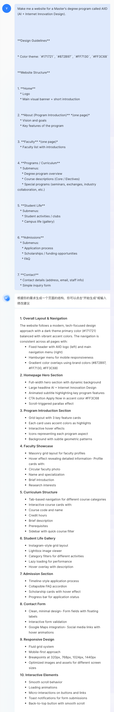

## 2. 審閱設計稿並提出修改意見

你可以根據自己的需求，向 Agent 提出反饋，例如：

- “太花哨了，整體風格改得更簡潔一些。”
- “換一種字型。”
- “調整一下顏色搭配。”
- “把這裡這一塊刪掉。”

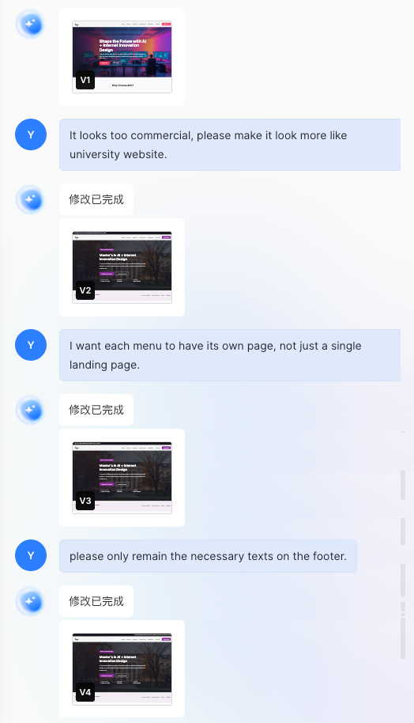

## 3. 確定最終設計

當你對設計稿進行多輪修改並滿意之後，就可以把這個設計轉化為程式碼，讓編碼 Agent 能理解並繼續工作。

將設計轉為程式碼的方式會因平臺而異，但通常是在設計平臺中安裝並使用某些外掛來完成。

**Mastergo 示例**

1. 開啟 [Mastergo 外掛網站](https://mastergo.com/community/plugin)，搜尋 **seal**。

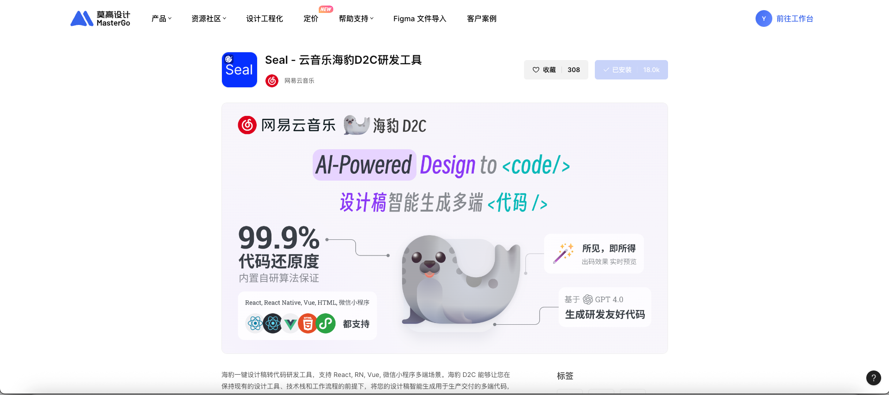

2. 回到設計頁面，點選 **方塊圖示（外掛）**。

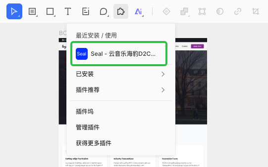

3. 選中你想轉換為程式碼的設計區域，點選 **Generate** 按鈕生成程式碼。

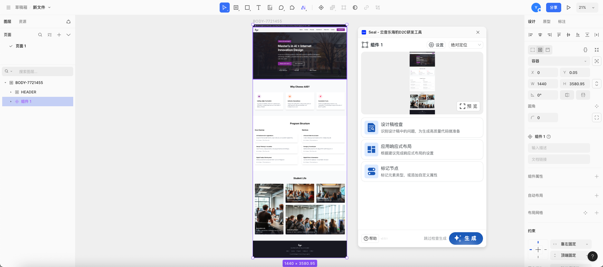

---

# 5. 使用編碼 Agent 搭建網站

## 1. 理解 HTML/CSS/JS 的基礎概念

一個網站本質上由三種語言構成：

- **HTML（HyperText Markup Language）** → 結構（骨架）
- **CSS（Cascading Style Sheets）** → 樣式（外觀）
- **JavaScript（JS）** → 功能（互動）

這三者配合在一起，構成我們看到的完整網頁。

1. **🏗️ HTML（結構）**

- 定義頁面中“展示什麼”
- 用來放置文字、圖片、按鈕、連結等元素
- 類似於建築物的 **牆體和框架**

**示例**

```html
<h1>Hello!</h1>
<p>This is my first website.</p>
<a href="contact.html">Contact</a>
```

2. **🎨 CSS（樣式）**

- 決定“內容怎樣展示”
- 控制文字大小、顏色、間距、背景、按鈕形狀等
- 讓 HTML 有了“衣服”和視覺風格

**示例**

```css
h1 {
  color: #FF7130;   /* Text color */
  font-size: 36px;  /* Font size */
  text-align: center; /* Center alignment */
}

body {
  background-color: #171721; /* Background color */
  color: white; /* Default text color */
}
```

3. **⚙️ JavaScript（JS）（功能）**

- 讓網頁能夠和使用者互動
- 可以實現按鈕點選、選單展開、圖片輪播、表單提交等動態效果
- 如果說 HTML/CSS 是靜態的骨架和外觀，那麼 JS 就是讓網頁“活起來”的 **大腦**

**示例**

```javascript
function showAlert() {
  alert("The button has been clicked!");
}
```

```html
<button onclick="showAlert()">Click me</button>
```

## 2. 讓編碼 Agent 生成程式碼

**示例提示詞**

```
"請為一個包含 Home、About 和 Contact 版塊的單頁網站編寫 HTML 和 CSS。
使用配色 #171721、#FF7130、#FF3C68。
背景為黑色，文字為白色。"
```

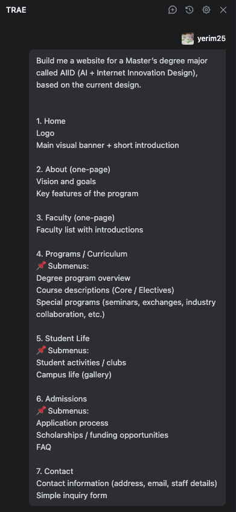

## 3. 執行網站

當草稿程式碼生成後，Agent 通常會自動啟動專案，並展示生成好的網站頁面。

如果你重新啟動了 Agent，或者網站畫面沒有出現，可以輸入類似這樣的提示：

```
"Please activate the project"
```

讓 Agent 重新啟動專案並開啟預覽頁面，方便你檢視當前的效果。

## 4. 進行簡單修改

你可以繼續透過自然語言對草稿進行微調，例如：

- “把按鈕做大一點。”
- “字型粗一點。”

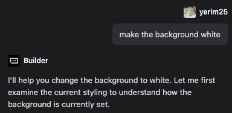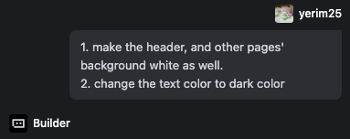

## 5. 修改網站文案內容

Agent 生成的初版網站，通常會包含一些自動生成的佔位文字。為了讓它更貼近你的真實場景，你可以提前準備好實際內容，再讓 Agent 幫你替換。

**應用示例**：更新 AIID 網站的 About 頁面

1. 先寫好你想在 About 頁面展示的內容。為了方便 Agent 理解，可以將內容儲存為 Markdown 格式。

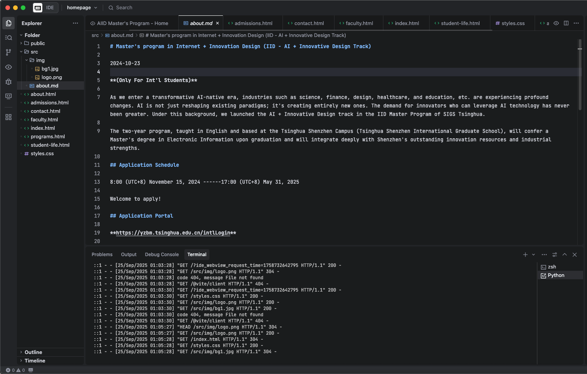

2. 然後在對話中告訴 Agent，將該檔案中的內容應用到指定頁面上。

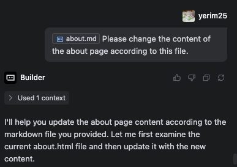

3. 檢視應用內容後的更新版本。

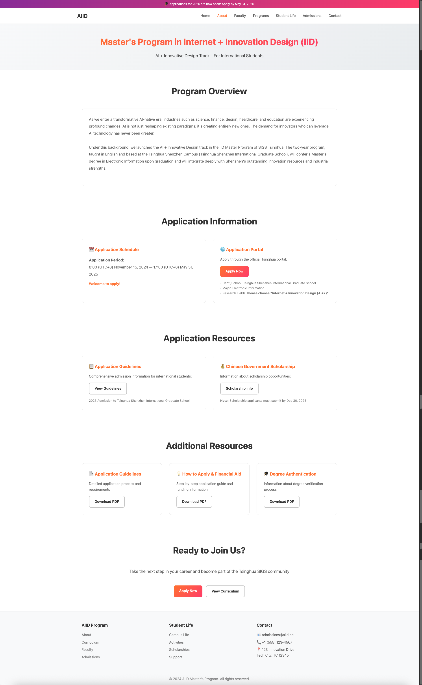

## 6. 插入圖片

如果你想加入特定圖片（例如 Logo、背景圖等），可以先把圖片上傳到專案資料夾中，然後在提示詞裡說明要在頁面的什麼位置使用這些圖片。

- **示例：**

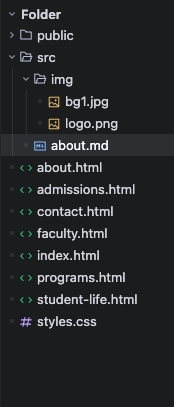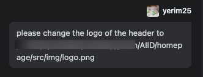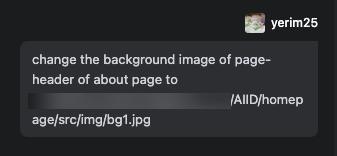

- **結果：**

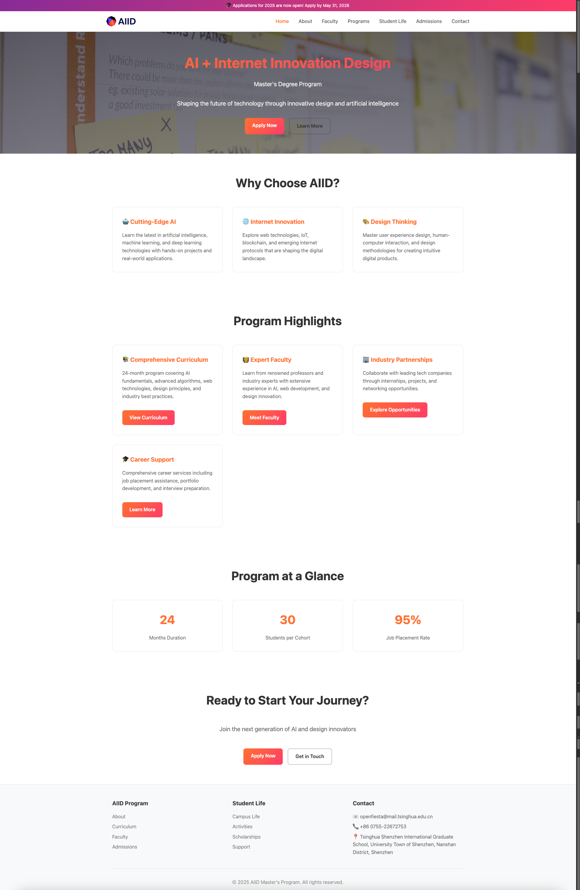

---

# 6. 將設計與程式碼整合

## 1. 將設計檔案與網站程式碼整合（可選）

當你從設計 Agent 那裡下載到了程式碼檔案後，可以把它們移動到當前專案目錄中，然後請編碼 Agent 幫你將這些設計程式碼與現有專案進行合併。

- **示例：**

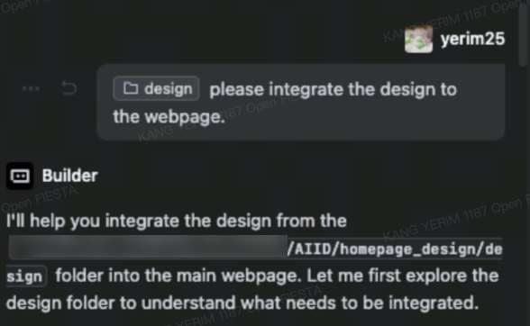

- **結果：**

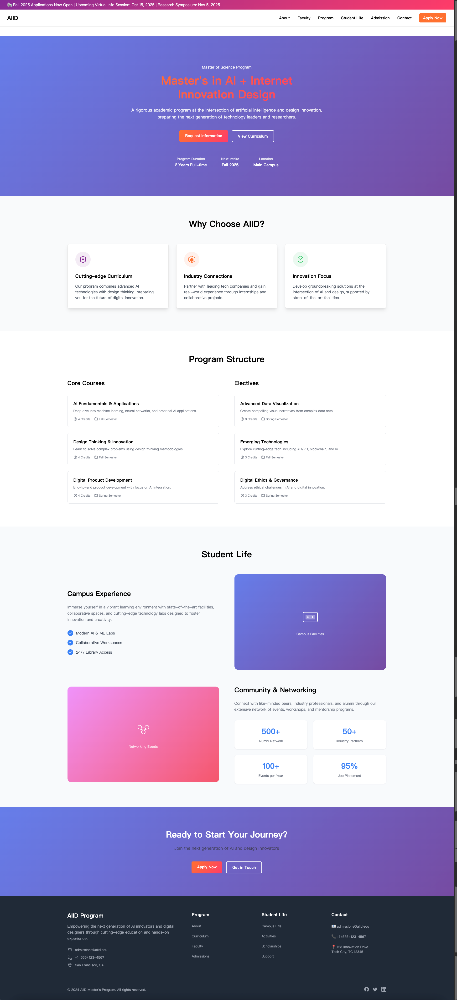
---
title: '用設計與編程 Agent 設計網站'
description: '從創意到上線：用設計 Agent 產出視覺方案，再用編程 Agent 把設計稿變成可運行網站，總結可復用的協作流程。'
---
