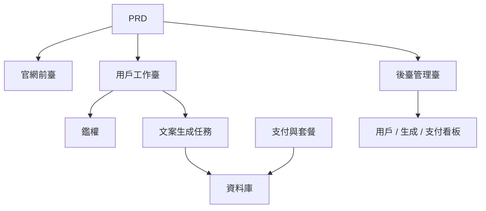

# AI 營銷文案 SaaS 開發實戰

## 概述

本實戰項目要求你圍繞一份真實的 PRD，從零完成一個面向獨立開發者和內容團隊的 AI 營銷文案 SaaS 產品。你將使用 Supabase 作為後端服務、Stripe 作為支付系統，完成從需求分析到部署上線的全過程。

這是 Stage 2 的綜合實戰環節。在前面幾章中，你已經分別學習了前端頁面搭建、後端接口開發、資料庫操作、支付集成等單項技能——這個項目要求你把它們全部串起來，交付一個可運行的產品原型。

## 前置知識

在開始本項目之前，你應該已經掌握以下內容：

- 前端頁面設計與組件庫使用（[UI 設計](../../frontend/ui-design/)、[現代組件庫](../../frontend/modern-component-library/)）
- 後端接口設計與開發（[接口程式碼編寫](../../backend/ai-interface-code/)）
- 資料庫基礎與 Supabase（[從資料庫到 Supabase](../../backend/database-supabase/)）
- 支付集成（[Stripe 收費系統](../../backend/stripe-payment/)）
- Git 工作流與部署（[Git 和 GitHub](../../backend/git-workflow/)、[部署 Web 應用](../../backend/zeabur-deployment/)）

## 學習目標

完成本實戰後，你將能夠：

1. 閱讀並理解一份真實的 PRD，從中提取開發任務清單
2. 使用 AI 輔助分步生成前端頁面和後端接口
3. 使用 Supabase 實現用戶鑑權、資料庫操作
4. 集成 Stripe 實現付費訂閱功能
5. 搭建管理後臺並完成端到端聯調

## 項目簡介

你要構建的產品是一個 AI 營銷文案 SaaS，包含三個子系統：

| 子系統 | 職責 |
|--------|------|
| **官網前臺** | 產品介紹、定價、FAQ、註冊轉化 |
| **用戶工作臺** | 輸入產品資訊、生成文案、查看歷史、升級套餐 |
| **後臺管理臺** | 用戶管理、生成記錄、支付資料、運營概覽 |

後端使用 Supabase 提供資料庫和鑑權能力，使用 Stripe 處理支付，使用 AI 模型生成營銷文案。

::: tip PRD 入口
本項目的需求文檔在 GitHub： [查看 PRD](https://github.com/datawhalechina/easy-vibe/blob/main/docs/zh-tw/stage-2/assignments/copywriting-platform-supabase/PRD.md)
:::

<div style="margin: 32px 0;">
  <ClientOnly>
    <StepBar :active="0" :items="[
      { title: '需求分析', description: '閱讀 PRD，明確頁面、功能、鑑權、支付範圍' },
      { title: '搭建骨架', description: '用 AI 生成三套前端骨架（www / app / admin）' },
      { title: '後端集成', description: 'Supabase 鑑權、生成接口、Stripe 支付' },
      { title: '聯調上線', description: '端到端跑通，部署並準備演示' }
    ]" />
  </ClientOnly>
</div>

## 第一部分：需求分析

### 1.1 閱讀 PRD

打開 PRD 文檔，重點回答以下問題：

- 系統有幾個入口？各自覆蓋哪些頁面？
- 每個頁面的核心功能是什麼？
- 後端包含哪些模塊和資料表？
- 套餐定價、支付流程、免費額度如何設計？
- MVP 範圍是什麼？第一版哪些做，哪些不做？

::: warning
如果以上問題沒有明確答案，不要開始寫程式碼。需求理解不清楚是導致返工的最常見原因。
:::

### 1.2 確認系統架構

根據 PRD 梳理出系統的整體架構：



## 第二部分：搭建項目骨架

### 2.1 生成前端頁面

使用 AI 先生成所有頁面的基本結構和假資料。

提示詞參考：

```text
請基於當前 PRD，幫我生成一個 AI 營銷文案 SaaS 的前端骨架。

要求：
1. 分成三個入口：www、app、admin
2. 官網包括：首頁、定價、FAQ
3. app 包括：登錄、註冊、生成工作臺、歷史記錄、套餐頁
4. admin 包括：後臺首頁、用戶管理、生成記錄、支付訂單
5. 先只生成頁面結構和假資料，不接真實接口
6. 風格要像現代 SaaS，不像課堂 demo
```

### 2.2 完善核心頁面

骨架搭好後，重點完善文案生成工作臺（Dashboard）頁面：

```text
請繼續完善 /dashboard 頁面。

這是一個 AI 營銷文案工作臺。

左側表單字段：
- 產品名
- 一句話介紹
- 目標用戶
- 3 個賣點
- 投放渠道（官網、朋友圈、小紅書、抖音、郵件）

右側結果區域預留：
- 主標題
- 副標題
- CTA
- 3 版短文案
- 長文案

先用 mock 資料跑通交互。

要求：
- 點擊"生成文案"後有 loading 狀態
- 結果區域設計空狀態
- 響應式佈局，寬屏窄屏都能正常顯示
```

### 2.3 驗證頁面結構

逐項檢查：

- [ ] 三個入口的路由是否獨立
- [ ] 頁面數量是否與 PRD 一致
- [ ] Dashboard 的表單和結果區域佈局合理
- [ ] 假資料展示了基本的 UI 狀態

### 遇到阻礙？

如果你在前端搭建階段卡住，可以回顧這些章節：

- [UI 設計](../../frontend/ui-design/)
- [參考 UI 設計規範設計頁面和按鈕](../../frontend/multi-product-ui/)
- [用 LLM 和 Skills 讓界面變好看](../../frontend/llm-skills-beautiful/)
- [從設計原型到項目程式碼](../../frontend/design-to-code/)
- [使用現代組件庫更新你的界面](../../frontend/modern-component-library/)

## 第三部分：後端集成

### 3.1 接入 Supabase 登錄

```text
請把我當成 0 基礎，一步一步帶我完成 Supabase 登錄接入。

需要你幫我完成：
1. 項目接入 Supabase
2. 實現註冊、登錄、退出功能
3. 登錄成功後跳轉到 /dashboard
4. 未登錄用戶訪問 /dashboard、/billing、/admin 時自動跳轉 /login
5. 創建 profiles 表
6. 用戶註冊成功後自動在 profiles 表創建記錄
7. profiles 表包含 email、role、plan 字段

實現要求：
- 每步都說明在修改哪些文件
- 密鑰不要硬編碼
- 需要在 Supabase 後臺手動操作的地方請明確標註
- 完成後說明如何驗證註冊和登錄
```

### 3.2 接入生成接口和資料庫

```text
請把我當成 0 基礎，幫我完成網站的核心功能：生成營銷文案並保存。

目標效果：
1. 用戶在 /dashboard 填寫表單，點擊"生成文案"
2. 後端接收：產品名、介紹、目標用戶、賣點、投放渠道
3. 後端調用模型生成結果
4. 頁面展示生成結果
5. 輸入和輸出都保存到資料庫
6. 用戶下次進入可查看歷史記錄

需要你完成：
- 創建生成接口 /api/generate
- 創建 generations 表
- 設計輸入和輸出字段
- Dashboard 頁面讀取當前用戶的歷史記錄

用戶體驗：
- 按鈕 loading 狀態
- 生成失敗時的錯誤提示
- 無歷史記錄時的空狀態

完成後請說明：
- 前端頁面文件位置
- 後端接口文件位置
- 資料寫入資料庫的邏輯位置
- 如何測試完整生成鏈路
```

### 3.3 接入 Stripe 付費

```text
請把我當成 0 基礎，幫我給 LaunchKit 加上最簡可用的 Stripe 付費。

不需要複雜系統，先跑通最基本的付費鏈路。

需要你完成：
1. /billing 頁面展示 free 和 pro 兩個套餐
2. 用戶點擊升級後跳轉 Stripe Checkout
3. 支付成功後返回網站
4. 支付結果保存到 subscriptions 表
5. 同步更新 profile.plan 字段
6. free 用戶每日限 3 次生成，pro 用戶不限

實現原則：
- 先跑通主流程，暫不考慮複雜邊界
- 需要在 Stripe 後臺配置的地方請寫清楚
- 完成後說明如何測試完整支付流程
```

### 3.4 搭建管理後臺

```text
請把我當成 0 基礎，幫我做一個簡潔可用的管理後臺。

僅限管理員訪問。

需要你完成：
1. 僅 role = admin 的用戶可訪問 /admin
2. 後臺包含 3 個 Tab：用戶列表、生成記錄、訂閱狀態
3. 用戶列表顯示：email、plan、創建時間
4. 生成記錄顯示：用戶、產品名、渠道、創建時間
5. 訂閱狀態顯示：用戶、套餐、支付狀態

要求：
- 界面簡潔清晰
- 使用現有組件庫的表格、Tab、Badge
- 完成後說明如何將賬號設為 admin
```

### 遇到阻礙？

如果你在後端開發階段卡住，可以回顧這些章節：

- [從資料庫到 Supabase](../../backend/database-supabase/)
- [大模型輔助編寫接口程式碼與接口文檔](../../backend/ai-interface-code/)
- [如何集成 Stripe 等收費系統](../../backend/stripe-payment/)

## 第四部分：聯調與上線

### 4.1 端到端測試

至少驗證以下場景：

- 註冊 → 登錄 → 生成文案 → 查看歷史 → 升級套餐
- 管理員登錄 → 查看用戶資料 → 查看生成記錄 → 查看支付狀態

部署前檢查：

```text
請把我當成 0 基礎，幫我檢查項目是否具備部署條件。

檢查重點：
- 環境變量是否完整
- 登錄回調地址是否正確
- Stripe 支付回調地址是否正確
- 頁面是否缺少 loading、空狀態、錯誤提示
- README 是否包含啟動說明和部署說明

需要你：
1. 按優先級列出待修復事項
2. 標註哪些必須先修
3. 說明修復後的部署步驟
```

### 4.2 部署

將項目部署到公網環境。部署教程參考：[Git 和 GitHub 工作流](../../backend/git-workflow/)、[如何部署 Web 應用](../../backend/zeabur-deployment/)。

## 交付物

完成本項目後，你需要提交以下內容：

- [ ] 可訪問的線上演示鏈接
- [ ] 源碼倉庫鏈接（含 README）
- [ ] PRD 文檔
- [ ] 核心頁面截圖（首頁、Dashboard、Billing、Admin）
- [ ] 60 秒演示影片（覆蓋註冊 → 生成 → 支付 → 後臺）

README 至少包含：項目簡介、核心頁面說明、技術棧、本地啟動步驟、環境變量清單。

## 評分標準

| 維度 | 基本要求 | 進階要求 |
|------|---------|---------|
| 產品完整度 | 首頁、登錄、Dashboard、Billing、Admin 都能訪問 | 首頁文案和視覺風格像真實 SaaS |
| 業務閉環 | 註冊 → 登錄 → 生成 → 查看歷史可以跑通 | 免費/Pro 權限差異清晰可見 |
| 資料正確性 | 生成結果和支付狀態都寫入資料庫 | 有明確的錯誤提示、空狀態和 loading |
| 權限與安全 | 未登錄不能訪問受保護頁面，普通用戶不能進 Admin | 有基本的輸入校驗和服務端鑑權 |
| 工程交付 | 項目可本地啟動，也可部署到公網 | README 清楚，演示影片結構完整 |

::: tip
如果你覺得任務太大，記住一個原則：**先保證"能跑通"，再去追求"做漂亮"。**
:::

## 提交前檢查

<el-card shadow="hover" style="margin: 20px 0; border-radius: 12px;">
  <template #header>
    <div style="font-weight: bold; font-size: 16px;">提交前最後看一眼</div>
  </template>

  <ul style="list-style-type: none; padding-left: 0;">
    <li><label><input type="checkbox" disabled /> 首頁、登錄頁、Dashboard、Billing、Admin 均已完成</label></li>
    <li><label><input type="checkbox" disabled /> 用戶可以註冊、登錄、退出</label></li>
    <li><label><input type="checkbox" disabled /> 生成結果真實寫入資料庫</label></li>
    <li><label><input type="checkbox" disabled /> 支付主流程已跑通</label></li>
    <li><label><input type="checkbox" disabled /> 管理員可查看用戶、生成記錄和支付狀態</label></li>
    <li><label><input type="checkbox" disabled /> 項目已部署到公網</label></li>
  </ul>
</el-card>

## 參考資料

- [UI 設計](../../frontend/ui-design/)
- [參考 UI 設計規範設計頁面和按鈕](../../frontend/multi-product-ui/)
- [用 LLM 和 Skills 讓界面變好看](../../frontend/llm-skills-beautiful/)
- [從設計原型到項目程式碼](../../frontend/design-to-code/)
- [使用現代組件庫更新你的界面](../../frontend/modern-component-library/)
- [從資料庫到 Supabase](../../backend/database-supabase/)
- [大模型輔助編寫接口程式碼與接口文檔](../../backend/ai-interface-code/)
- [Git 和 GitHub 工作流](../../backend/git-workflow/)
- [如何部署 Web 應用](../../backend/zeabur-deployment/)
- [如何集成 Stripe 等收費系統](../../backend/stripe-payment/)
