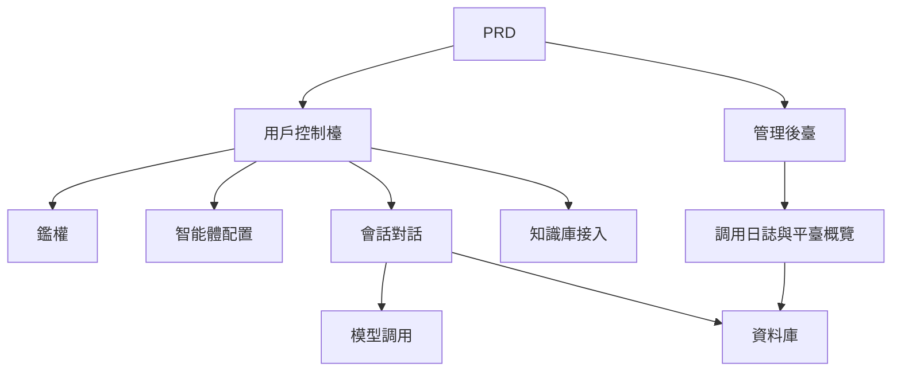

# 類 Dify 智能體平臺開發實戰

## 概述

本實戰項目要求你圍繞一份真實的 PRD，從零完成一個模仿 Dify 核心體驗的智能體平臺。你將構建用戶控制檯、管理後臺和平臺後端，實現智能體管理、對話、日誌和知識庫等核心功能。

這是 Stage 2 的綜合實戰環節。與前面的單頁面或單功能項目不同，這個項目要求你構建一個有"平臺感"的 AI 產品——包含多角色、多模塊、資料持久化和模型調用鏈路。

## 前置知識

在開始本項目之前，你應該已經掌握以下內容：

- 前端頁面設計與組件庫使用（[UI 設計](../../frontend/ui-design/)、[現代組件庫](../../frontend/modern-component-library/)）
- 後端接口設計與開發（[接口程式碼編寫](../../backend/ai-interface-code/)）
- 資料庫基礎與 Supabase（[從資料庫到 Supabase](../../backend/database-supabase/)）
- Git 工作流與部署（[Git 和 GitHub](../../backend/git-workflow/)、[部署 Web 應用](../../backend/zeabur-deployment/)）

## 學習目標

完成本實戰後，你將能夠：

1. 閱讀並理解一份真實的 PRD，從中提取開發任務清單
2. 設計智能體平臺的頁面架構和資料模型
3. 實現智能體創建、對話、日誌記錄的完整鏈路
4. 使用 AI 輔助完成平臺型產品開發
5. 完成端到端聯調，交付一個可演示的 AI 平臺原型

## 項目簡介

你要構建的產品是一個類 Dify 智能體平臺，包含兩個子系統：

| 子系統 | 職責 |
|--------|------|
| **用戶控制檯** | 創建智能體、配置 Prompt、發起對話、查看日誌、管理知識庫 |
| **管理後臺** | 查看用戶資料、平臺資源使用情況、調用統計 |

後端需要支持以下核心能力：智能體管理、會話管理、消息存儲、模型調用、調用日誌記錄、知識庫接入。

::: tip PRD 入口
本項目的需求文檔在 GitHub： [查看 PRD](https://github.com/datawhalechina/easy-vibe/blob/main/docs/zh-tw/stage-2/assignments/custom-dify-agent-platform/PRD.md)
:::

<div style="margin: 32px 0;">
  <ClientOnly>
    <StepBar :active="0" :items="[
      { title: '需求分析', description: '閱讀 PRD，明確頁面、能力邊界、鑑權、資料模型' },
      { title: '搭建骨架', description: '用 AI 生成用戶控制檯和管理後臺骨架' },
      { title: '迭代開發', description: '逐模塊補充智能體、對話、日誌、知識庫' },
      { title: '聯調上線', description: '端到端跑通，部署並準備演示' }
    ]" />
  </ClientOnly>
</div>

## 第一部分：需求分析

### 1.1 閱讀 PRD

打開 PRD 文檔，重點回答以下問題：

- 智能體、會話、日誌、知識庫哪些要進 MVP？
- 頁面和路由清單是否拍板？
- 模型調用和日誌記錄的邊界是什麼？
- 多租戶和複雜工作流是否先不做？

::: warning
如果以上問題沒有明確答案，不要開始寫程式碼。需求理解不清楚是導致返工的最常見原因。
:::

### 1.2 確認系統架構

根據 PRD 梳理出系統的整體架構：



## 第二部分：搭建項目骨架

### 2.1 生成前端頁面

提示詞參考：

```text
請基於當前 PRD，幫我生成一個類 Dify 智能體平臺的前端骨架。

要求：
1. 用戶側包括：登錄、智能體列表、智能體配置、對話頁、日誌頁、知識庫頁
2. 後臺側包括：後臺首頁、用戶概覽、資源使用概覽
3. 先只生成頁面結構和假資料，不接真實接口
4. 風格要像現代 AI 平臺
```

### 2.2 驗證頁面結構

逐項檢查：

- [ ] 用戶控制檯和管理後臺入口是否分開
- [ ] 智能體列表、配置、對話、日誌、知識庫頁面是否完整
- [ ] 管理後臺首頁、用戶概覽頁面是否可訪問
- [ ] 假資料展示了基本的 UI 狀態

## 第三部分：迭代開發

### 3.1 按模塊推進

在骨架的基礎上，按以下順序逐模塊補充功能：

1. **鑑權**：註冊、登錄、角色區分
2. **智能體管理**：創建、編輯、刪除、Prompt 配置
3. **對話功能**：會話創建、消息收發、模型調用
4. **日誌記錄**：耗時、token 用量、錯誤記錄
5. **知識庫接入**（加分項）：文檔上傳、檢索、結果注入
6. **管理後臺**：用戶資料、資源使用、調用統計

每完成一個模塊，使用下表進行自檢：

| 檢查項 | 驗證方法 |
|--------|----------|
| 頁面一致性 | 頁面數量、功能是否符合 PRD |
| 接口閉環 | agents、chat、logs、knowledge 接口是否完整 |
| 權限隔離 | 用戶是否只能管理自己的 agent 和會話 |
| 資料一致性 | messages、logs、documents 資料是否對得上 |
| 可演示性 | 是否能演示"創建 agent → 對話 → 查看日誌"完整鏈路 |

### 3.2 知識庫接入（加分項）

如果你想增加知識庫能力，可以給每個智能體增加一個"知識庫開關"：

- 開啟後先檢索知識片段，再和用戶問題一起發送給模型
- 關閉後按普通對話模式響應

第一版不必追求複雜 RAG，只要有"檢索結果可見、調用鏈路可解釋"即可。

## 第四部分：聯調與上線

### 4.1 端到端測試

至少驗證以下場景：

- 註冊 → 創建智能體 → 配置 Prompt → 發起對話 → 查看日誌
- 管理員登錄 → 查看用戶資料 → 查看調用統計

部署前檢查：

- [ ] 所有核心接口都做了登錄校驗
- [ ] 智能體歸屬權限檢查通過
- [ ] 會話記錄、日誌記錄真實落庫
- [ ] 模型 Key 使用環境變量，不硬編碼
- [ ] 錯誤提示可在前端看到，不只打控制檯

### 4.2 部署

將項目部署到公網環境。部署教程參考：[Git 和 GitHub 工作流](../../backend/git-workflow/)、[如何部署 Web 應用](../../backend/zeabur-deployment/)。

## 交付物

完成本項目後，你需要提交以下內容：

- [ ] 可訪問的線上演示鏈接
- [ ] 源碼倉庫鏈接（含 README）
- [ ] PRD 文檔
- [ ] 核心頁面截圖（智能體管理頁、對話頁、日誌頁、後臺首頁）
- [ ] 60 秒演示影片（覆蓋創建智能體 → 對話 → 查看日誌）

README 至少包含：項目簡介、架構說明、技術棧、本地啟動步驟、環境變量清單、接口說明。

## 評分標準

| 維度 | 基本要求 | 進階要求 |
|------|---------|---------|
| 平臺完整度 | agents / chat / logs 三頁可用 | 有清晰導航與統一設計語言 |
| 業務閉環 | 可創建智能體並真實對話 | 支持多智能體切換與歷史會話 |
| 資料與追蹤 | 消息與調用日誌可查詢 | 有 token / 耗時統計看板 |
| 權限安全 | 僅登錄用戶可訪問核心接口 | 資源歸屬校驗完善 |
| 工程交付 | 可部署、可演示、README 清晰 | 接入知識庫並可解釋檢索結果 |

## 提交前檢查

<el-card shadow="hover" style="margin: 20px 0; border-radius: 12px;">
  <template #header>
    <div style="font-weight: bold; font-size: 16px;">提交前最後看一眼</div>
  </template>

  <ul style="list-style-type: none; padding-left: 0;">
    <li><label><input type="checkbox" disabled /> 登錄後可訪問智能體管理、對話、日誌頁面</label></li>
    <li><label><input type="checkbox" disabled /> 至少可以創建 1 個智能體併成功對話</label></li>
    <li><label><input type="checkbox" disabled /> 每輪問答都能在資料庫查到記錄</label></li>
    <li><label><input type="checkbox" disabled /> 調用失敗時前端可見錯誤資訊且日誌已記錄</label></li>
    <li><label><input type="checkbox" disabled /> 項目已部署，README 和演示影片齊全</label></li>
  </ul>
</el-card>

## 參考資料

- [UI 設計](../../frontend/ui-design/)
- [使用現代組件庫更新你的界面](../../frontend/modern-component-library/)
- [從資料庫到 Supabase](../../backend/database-supabase/)
- [大模型輔助編寫接口程式碼與接口文檔](../../backend/ai-interface-code/)
- [Git 和 GitHub 工作流](../../backend/git-workflow/)
- [如何部署 Web 應用](../../backend/zeabur-deployment/)
