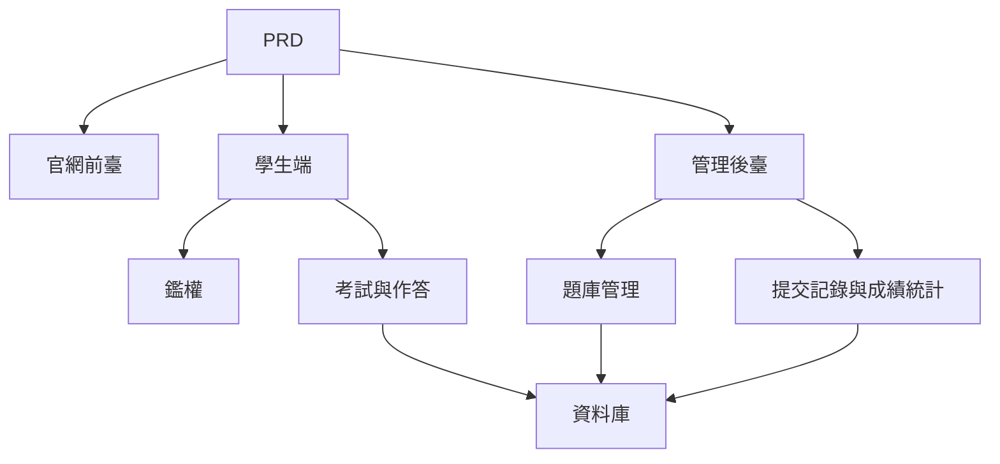

# 在線考試與管理系統開發實戰

## 概述

本實戰項目要求你圍繞一份真實的 PRD，從零完成一個在線考試與管理系統。這個項目的特別之處在於它包含多個角色（學生和管理員），每個角色看到的頁面和能執行的操作不同。你將使用 Express 構建後端，實現完整的考試業務鏈路。

這是 Stage 2 的綜合實戰環節。多角色權限系統在實際工作中非常常見，掌握這種模式後，你能夠應對教培、SaaS、後臺管理等各類業務場景。

## 前置知識

在開始本項目之前，你應該已經掌握以下內容：

- 前端頁面設計與組件庫使用（[UI 設計](../../frontend/ui-design/)、[現代組件庫](../../frontend/modern-component-library/)）
- 後端接口設計與開發（[接口程式碼編寫](../../backend/ai-interface-code/)）
- 資料庫基礎與 Supabase（[從資料庫到 Supabase](../../backend/database-supabase/)）
- Git 工作流與部署（[Git 和 GitHub](../../backend/git-workflow/)、[部署 Web 應用](../../backend/zeabur-deployment/)）

## 學習目標

完成本實戰後，你將能夠：

1. 閱讀並理解一份真實的 PRD，從中提取開發任務清單
2. 設計多角色系統的權限控制和頁面路由
3. 使用 Express 實現完整的後端 API
4. 實現考試、提交、自動判分的業務鏈路
5. 完成端到端聯調，交付一個可演示的業務系統原型

## 項目簡介

你要構建的產品是一個在線考試與管理系統，包含三個子系統：

| 子系統 | 職責 |
|--------|------|
| **官網前臺** | 平臺介紹、登錄入口 |
| **學生端** | 考試列表、答題、提交、成績查看 |
| **管理後臺** | 題庫管理、考試管理、提交記錄、成績統計 |

後端使用 Express，需要支持：登錄鑑權、角色權限、考試和題庫管理、提交流程與自動判分、成績和統計管理。

::: tip PRD 入口
本項目的需求文檔在 GitHub： [查看 PRD](https://github.com/datawhalechina/easy-vibe/blob/main/docs/zh-tw/stage-2/assignments/exam-management-express/PRD.md)
:::

<div style="margin: 32px 0;">
  <ClientOnly>
    <StepBar :active="0" :items="[
      { title: '需求分析', description: '閱讀 PRD，明確角色、頁面、考試鏈路和資料模型' },
      { title: '搭建骨架', description: '用 AI 生成學生端和管理端頁面骨架' },
      { title: '後端開發', description: 'Express 接通登錄、考試、提交、判分' },
      { title: '聯調上線', description: '端到端跑通，部署並準備演示' }
    ]" />
  </ClientOnly>
</div>

## 第一部分：需求分析

### 1.1 閱讀 PRD

打開 PRD 文檔，重點回答以下問題：

- 系統包含哪幾個角色？各自能做什麼？
- 頁面清單是否完整？學生端和管理端分別有哪些頁面？
- 支持哪些題型？每種題型的判分邏輯是什麼？
- 考試的完整流程是什麼？（發佈 → 開始 → 作答 → 提交 → 判分 → 查看成績）

::: warning
如果以上問題沒有明確答案，不要開始寫程式碼。需求理解不清楚是導致返工的最常見原因。
:::

### 1.2 確認系統架構

根據 PRD 梳理出系統的整體架構：



## 第二部分：搭建項目骨架

### 2.1 生成前端頁面

提示詞參考：

```text
請基於當前 PRD，幫我生成一個在線考試與管理系統的前端骨架。

技術棧要求：
- Next.js App Router
- TypeScript
- Tailwind CSS
- shadcn/ui

頁面清單：
1. 首頁 /
2. 登錄頁 /login
3. 學生考試列表頁 /student/exams
4. 學生答題頁 /student/exams/[id]
5. 學生成績頁 /student/history
6. 管理後臺首頁 /admin
7. 考試管理頁 /admin/exams
8. 題庫管理頁 /admin/questions
9. 提交記錄頁 /admin/submissions

要求：
- 學生端頁面強調清晰、專注、易答題
- 管理端頁面使用側邊欄 + 頂部欄佈局
- 先使用 mock 資料，不接真實接口
- 注意桌面端和移動端的基本可用性
```

### 2.2 完善學生答題頁

答題頁是學生端的核心頁面，重點完善：

```text
請繼續完善學生答題頁。

這是一個在線考試系統的答題頁面，需要包含：
- 頂部顯示考試標題、倒計時、已答題數量
- 中間顯示題乾和選項
- 支持單選、判斷、簡答三種題型
- 左側或頂部有答題卡，顯示每道題是否已作答
- 點擊提交前彈出確認框

先用 mock 資料實現交互，不接真實接口。

要求：
- 界面簡潔，不要像後臺表格頁
- 倒計時要醒目，但不要製造過強壓迫感
- 有空狀態和 loading 狀態
```

### 2.3 完善管理員後臺

管理員後臺第一版聚焦三個核心區域：

- **考試管理**：創建考試、設置時長、發佈狀態
- **題庫管理**：新增題目、編輯題目、按題型篩選
- **提交記錄**：查看學生提交、分數、時間

### 2.4 驗證頁面結構

逐項檢查：

- [ ] 學生端和管理端入口是否分開
- [ ] 登錄頁、考試列表、答題頁、成績頁是否完整
- [ ] 管理端題庫、考試管理、提交記錄頁是否可訪問
- [ ] 學生端和管理端的頁面風格有明顯區分

### 遇到阻礙？

如果你在前端搭建階段卡住，可以回顧這些章節：

- [從資料庫到 Supabase](../../backend/database-supabase/)
- [應用後端接口設計與開發](../../backend/ai-interface-code/)
- [使用現代組件庫更新你的界面](../../frontend/modern-component-library/)

## 第三部分：後端開發

### 3.1 登錄與權限控制

```text
請把我當成 0 基礎，幫我完成在線考試系統的登錄與權限控制。

後端使用 Express。

目標：
1. 學生和管理員都可以登錄
2. 登錄後返回用戶角色
3. 學生只能訪問 /student/* 相關接口
4. 管理員只能訪問 /admin/* 相關接口
5. 未登錄用戶訪問受保護頁面時跳轉 /login

實現要求：
- 給出清晰的目錄結構建議
- 明確說明中間件負責什麼
- 涉及環境變量的地方不要硬編碼
- 完成後說明如何驗證權限是否生效
```

### 3.2 考試與題庫管理接口

建議按以下模塊實現：

| 模塊 | 推薦接口 |
|------|----------|
| 考試管理 | `GET /api/exams`、`POST /api/admin/exams`、`PATCH /api/admin/exams/:id` |
| 題庫管理 | `GET /api/admin/questions`、`POST /api/admin/questions` |
| 開始考試 | `POST /api/submissions/start` |
| 提交試卷 | `POST /api/submissions/:id/submit` |
| 成績記錄 | `GET /api/student/history`、`GET /api/admin/submissions` |

提示詞參考：

```text
請幫我為在線考試系統設計並實現 Express API。

功能範圍：
- 管理員創建考試
- 管理員維護題庫
- 學生查看已發佈考試
- 學生開始考試並創建 submission
- 學生提交答案後自動判分單選題和判斷題
- 簡答題先標記為待複核
- 學生查看自己的歷史成績
- 管理員查看所有提交記錄

要求：
- 接口命名清晰
- 返回統一 JSON 結構
- 程式碼中區分 controller、service、middleware、db 層
- 說明每個接口如何測試
```

### 3.3 判分邏輯

判分邏輯是考試系統的核心業務規則：

- **單選題**：用戶答案與標準答案一致則得分
- **判斷題**：同樣可以自動判分
- **簡答題**：第一版先只保存答案，分數為空，狀態為 `reviewed = false`

::: tip 加分項
如果你想增加 AI 能力，可以讓管理員在後臺輸入"主題 + 難度"，由模型先生成一批候選題，再人工審核後入庫。但這屬於加分項，不是必須的。
:::

## 第四部分：聯調與上線

### 4.1 端到端測試

至少驗證以下場景：

- 學生登錄 → 查看考試列表 → 開始答題 → 提交 → 查看成績
- 管理員登錄 → 創建考試 → 添加題目 → 發佈 → 查看提交記錄

### 4.2 部署

- 前端部署到 Vercel / Zeabur
- Express API 部署到 Zeabur / Railway / Render
- 資料庫用 Supabase Postgres 或託管 PostgreSQL

部署前檢查：

- [ ] 環境變量是否齊全
- [ ] 前後端 API 地址是否正確
- [ ] 登錄態在生產環境是否正常
- [ ] 管理員賬號是否能真實訪問後臺
- [ ] README 是否包含啟動、部署、測試說明

## 交付物

完成本項目後，你需要提交以下內容：

- [ ] 可訪問的線上演示鏈接
- [ ] 源碼倉庫鏈接（含 README）
- [ ] PRD 文檔
- [ ] 核心頁面截圖（首頁、學生考試列表、答題頁、管理後臺）
- [ ] 60 秒演示影片（覆蓋學生答題流程和管理員管理流程）

README 至少包含：項目簡介、核心頁面說明、技術棧、本地啟動步驟、環境變量清單。

## 評分標準

| 維度 | 基本要求 | 進階要求 |
|------|---------|---------|
| 頁面完整度 | 學生端和管理端主要頁面都可訪問 | 頁面風格統一，移動端基本可用 |
| 業務閉環 | 學生可登錄、參加考試、提交併查看成績 | 管理員可完整創建併發布考試 |
| 資料正確性 | 提交答案後能寫入資料庫，客觀題能自動判分 | 簡答題支持人工複核或 AI 輔助 |
| 權限控制 | 學生與管理員訪問邊界清晰 | 服務端接口也有角色校驗 |
| 工程交付 | 項目可運行、可部署、README 清晰 | 有演示影片和測試說明 |

## 提交前檢查

<el-card shadow="hover" style="margin: 20px 0; border-radius: 12px;">
  <template #header>
    <div style="font-weight: bold; font-size: 16px;">提交前最後看一眼</div>
  </template>

  <ul style="list-style-type: none; padding-left: 0;">
    <li><label><input type="checkbox" disabled /> 首頁、登錄頁、學生端、管理端頁面均已完成</label></li>
    <li><label><input type="checkbox" disabled /> 學生可以正常開始考試並提交答案</label></li>
    <li><label><input type="checkbox" disabled /> 管理員可以創建考試並查看提交記錄</label></li>
    <li><label><input type="checkbox" disabled /> 客觀題分數能夠自動計算並寫入資料庫</label></li>
    <li><label><input type="checkbox" disabled /> 學生與管理員權限邊界已驗證</label></li>
    <li><label><input type="checkbox" disabled /> 項目已部署或具備完整本地運行說明</label></li>
  </ul>
</el-card>

## 參考資料

- [UI 設計](../../frontend/ui-design/)
- [使用現代組件庫更新你的界面](../../frontend/modern-component-library/)
- [從資料庫到 Supabase](../../backend/database-supabase/)
- [大模型輔助編寫接口程式碼與接口文檔](../../backend/ai-interface-code/)
- [Git 和 GitHub 工作流](../../backend/git-workflow/)
- [如何部署 Web 應用](../../backend/zeabur-deployment/)
