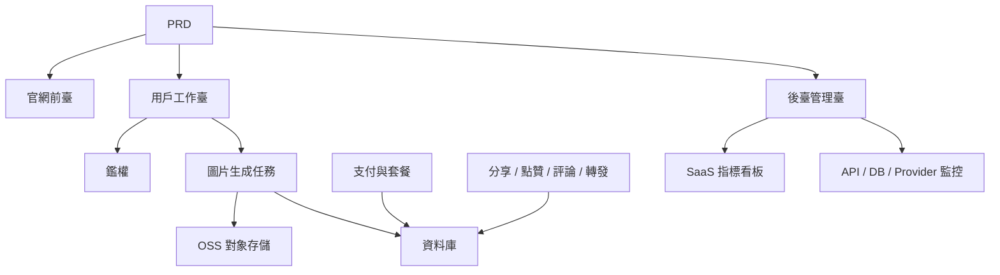

# 現代 AI 生圖 SaaS 開發實戰

## 概述

本實戰項目要求你圍繞一份真實的 PRD（產品需求文檔），從零完成一個參考 Midjourney 體驗的 AI 生圖 SaaS 產品。你將完整經歷需求分析、項目拆解、迭代開發、聯調上線的全過程。

這是 Stage 2 的綜合實戰環節。在前面幾章中，你已經分別學習了前端頁面設計、後端接口開發、資料庫操作、支付集成等單項技能——這個項目要求你把它們全部串起來，交付一個可運行的產品原型。

## 前置知識

在開始本項目之前，你應該已經掌握以下內容：

- 前端頁面設計與組件庫使用（[UI 設計](../../frontend/ui-design/)、[現代組件庫](../../frontend/modern-component-library/)）
- 後端接口設計與開發（[接口程式碼編寫](../../backend/ai-interface-code/)）
- 資料庫基礎與 Supabase（[從資料庫到 Supabase](../../backend/database-supabase/)）
- 支付集成（[Stripe 收費系統](../../backend/stripe-payment/)）
- Git 工作流與部署（[Git 和 GitHub](../../backend/git-workflow/)、[部署 Web 應用](../../backend/zeabur-deployment/)）

## 學習目標

完成本實戰後，你將能夠：

1. 閱讀並理解一份真實的 PRD，從中提取開發任務清單
2. 基於 PRD 拆分模塊，制定分步推進計劃
3. 使用 AI 輔助完成前端骨架搭建和後端接口開發
4. 對每個模塊進行驗證和迭代優化
5. 完成端到端聯調，將項目從"能跑"推進到"能交付"

## 項目簡介

你要構建的產品是一個現代 AI 生圖 SaaS 平臺，包含三個子系統：

| 子系統 | 職責 |
|--------|------|
| **官網前臺** | 產品介紹、定價、FAQ、註冊轉化 |
| **用戶工作臺** | Prompt 輸入、圖片生成、圖庫、積分、套餐、社區互動 |
| **後臺管理臺** | 用戶管理、任務管理、支付管理、內容審核、SaaS 指標、系統監控 |

後端需要支持以下核心能力：用戶鑑權、圖片生成任務、OSS 對象存儲、積分與套餐支付、圖片社交互動、運營資料監控。

::: tip PRD 入口
本項目的需求文檔在 GitHub： [查看 PRD](https://github.com/datawhalechina/easy-vibe/blob/main/docs/zh-tw/stage-2/assignments/modern-landing-page/PRD.md)
:::

<div style="margin: 32px 0;">
  <ClientOnly>
    <StepBar :active="0" :items="[
      { title: '需求分析', description: '閱讀 PRD，提取頁面、模塊、資料模型和邊界' },
      { title: '搭建骨架', description: '用 AI 生成三套前端骨架（www / app / admin）' },
      { title: '迭代開發', description: '逐模塊補充接口、權限、支付、監控' },
      { title: '聯調上線', description: '端到端跑通，部署並準備演示' }
    ]" />
  </ClientOnly>
</div>

## 第一部分：需求分析

### 1.1 閱讀 PRD

打開 PRD 文檔，重點回答以下問題：

- 系統有幾個入口？各自覆蓋哪些頁面？
- 每個頁面的核心功能是什麼？
- 後端包含哪些模塊和資料庫表？
- MVP 範圍是什麼？第一版哪些做，哪些不做？

::: warning
如果以上問題沒有明確答案，不要開始寫程式碼。需求理解不清楚是導致返工的最常見原因。
:::

### 1.2 確認系統架構

根據 PRD 中的描述，梳理出系統的整體架構：



建議你用自己的話把架構圖畫一遍，確認你對系統的理解是完整的。

## 第二部分：搭建項目骨架

### 2.1 生成前端頁面

使用 AI 先生成所有頁面的基本結構和假資料。這一步的目標是搭出資訊架構和路由，不需要接真實接口。

提示詞參考：

```text
請基於當前 PRD，幫我生成一個現代 AI 生圖 SaaS 的前端骨架。

要求：
1. 分成三個入口：www、app、admin
2. 官網包括：首頁、定價、FAQ
3. app 包括：登錄、註冊、生成工作臺、圖庫、套餐、積分、社區、作品詳情、個人中心
4. admin 包括：後臺首頁、用戶管理、任務管理、內容管理、套餐管理、支付訂單、運營配置、SaaS 指標、系統監控
5. 先只生成頁面結構和假資料，不接真實接口
6. 風格參考 Midjourney，簡潔、現代、帶產品感
```

### 2.2 驗證頁面結構

骨架生成後，逐項檢查：

- [ ] 三個入口的路由是否獨立（`/`、`/app`、`/admin`）
- [ ] 頁面數量是否與 PRD 一致
- [ ] 每個頁面是否可以正常訪問和導航
- [ ] 假資料是否展示了基本的 UI 狀態（列表、空狀態、表單等）

## 第三部分：迭代開發

### 3.1 按模塊推進

在骨架的基礎上，按以下順序逐模塊補充功能：

1. **鑑權**：註冊、登錄、角色區分
2. **資料庫**：資料表創建、讀寫接口
3. **核心業務**：圖片生成任務、結果存儲
4. **OSS 存儲**：圖片上傳與訪問
5. **支付**：套餐、積分、Stripe 集成
6. **社交互動**：分享、點贊、評論
7. **後臺管理**：用戶管理、任務管理、內容審核
8. **資料監控**：SaaS 指標看板、系統監控

每完成一個模塊，使用下表進行自檢：

| 檢查項 | 驗證方法 |
|--------|----------|
| 頁面一致性 | 頁面數量、入口、功能是否符合 PRD |
| 接口正確性 | 請求參數、返回結構、狀態處理是否合理 |
| 權限隔離 | 普通用戶和管理員是否互相隔離 |
| 資料一致性 | 資料庫、OSS、支付、積分是否對得上 |
| 可演示性 | 是否能給別人完整演示一條業務鏈路 |

::: tip
如果發現 AI 生成的內容偏離了 PRD，不要整頁推翻重來，直接讓它修改具體模塊即可。
:::

### 3.2 角色與分工

在迭代過程中，你需要同時扮演三個角色：

- **產品經理**：確認每個模塊的功能是否符合 PRD
- **技術負責人**：確認實現方案是否合理
- **測試工程師**：確認功能是否跑得通

## 第四部分：聯調與上線

### 4.1 端到端測試

最後階段的重點不是補新頁面，而是把完整業務鏈路跑通。至少驗證以下場景：

- 註冊 → 購買積分 → 生成圖片 → 查看歷史 → 分享互動
- 管理員登錄 → 查看用戶資料 → 查看任務統計 → 查看系統監控

### 4.2 部署

將項目部署到公網環境，確保：

- 環境變量配置完整
- 登錄回調地址正確
- 支付回調地址正確
- 頁面無缺失的 loading、空狀態、錯誤提示

部署教程參考：[Git 和 GitHub 工作流](../../backend/git-workflow/)、[如何部署 Web 應用](../../backend/zeabur-deployment/)。

## 交付物

完成本項目後，你需要提交以下內容：

- [ ] 可訪問的線上演示鏈接
- [ ] 源碼倉庫鏈接（含 README）
- [ ] PRD 文檔
- [ ] 核心頁面截圖（官網首頁、生圖工作臺、圖庫、套餐頁、後臺首頁）
- [ ] 60 秒演示影片（覆蓋註冊 → 生成 → 查看 → 後臺管理）

README 至少包含：項目簡介、核心頁面說明、技術棧、本地啟動步驟、環境變量清單。

## 評分標準

| 維度 | 基本要求 | 進階要求 |
|------|---------|---------|
| PRD 對齊 | 頁面、功能、資料結構基本符合 PRD | 能清晰說明每個設計決策與 PRD 的對應關係 |
| 產品閉環 | 註冊 → 購買積分 → 生成圖片 → 查看歷史 → 分享互動可跑通 | 支付狀態、積分餘額、生成次數資料一致 |
| 後臺能力 | 用戶、任務、支付、內容管理可查看 | SaaS 指標看板和系統監控頁完整可用 |
| 工程完整度 | 前端、後端、資料庫、OSS、支付鏈路已接通 | 有錯誤處理、空狀態、loading 狀態 |
| 交付質量 | 可部署、可運行 | README 清楚、演示影片結構完整 |

## 參考資料

- [UI 設計](../../frontend/ui-design/)
- [參考 UI 設計規範設計頁面和按鈕](../../frontend/multi-product-ui/)
- [用 LLM 和 Skills 讓界面變好看](../../frontend/llm-skills-beautiful/)
- [從設計原型到項目程式碼](../../frontend/design-to-code/)
- [使用現代組件庫更新你的界面](../../frontend/modern-component-library/)
- [從資料庫到 Supabase](../../backend/database-supabase/)
- [大模型輔助編寫接口程式碼與接口文檔](../../backend/ai-interface-code/)
- [Git 和 GitHub 工作流](../../backend/git-workflow/)
- [如何部署 Web 應用](../../backend/zeabur-deployment/)
- [如何集成 Stripe 等收費系統](../../backend/stripe-payment/)
