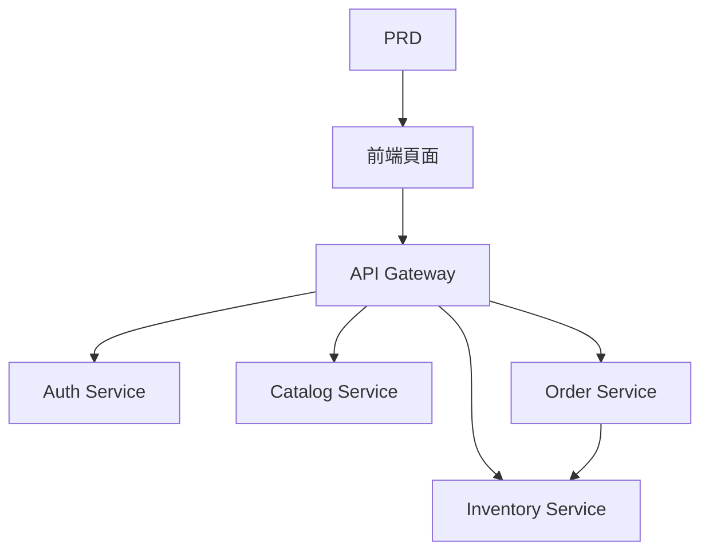

# 生鮮電商微服務系統開發實戰

## 概述

本實戰項目要求你圍繞一份真實的 PRD，從零完成一個生鮮電商微服務系統。與前面的單服務項目不同，這個項目的後端按業務拆分成多個獨立服務，通過 API 網關統一對外。你將學習如何設計服務邊界、如何處理跨服務的資料一致性問題。

這是 Stage 2 的綜合實戰環節。微服務架構在實際工作中非常常見，掌握服務拆分和網關路由的基本思路後，你能夠應對更復雜的後端系統設計。

## 前置知識

在開始本項目之前，你應該已經掌握以下內容：

- 前端頁面設計與組件庫使用（[UI 設計](../../frontend/ui-design/)、[現代組件庫](../../frontend/modern-component-library/)）
- 後端接口設計與開發（[接口程式碼編寫](../../backend/ai-interface-code/)）
- 資料庫基礎與 Supabase（[從資料庫到 Supabase](../../backend/database-supabase/)）
- Git 工作流與部署（[Git 和 GitHub](../../backend/git-workflow/)、[部署 Web 應用](../../backend/zeabur-deployment/)）

## 學習目標

完成本實戰後，你將能夠：

1. 閱讀 PRD 並提取微服務系統的開發任務清單
2. 按業務領域拆分服務邊界（鑑權、商品、庫存、訂單）
3. 設計和實現 API 網關路由
4. 處理庫存扣減和訂單一致性等跨服務問題
5. 完成端到端聯調，交付可演示的微服務原型

## 項目簡介

你要構建的產品是一個生鮮電商微服務系統：

| 子系統 | 職責 |
|--------|------|
| **用戶端** | 瀏覽商品、下單、查看訂單 |
| **管理端** | 商品管理、庫存管理、訂單管理 |

後端按業務拆分為以下服務：

| 服務 | 職責 |
|------|------|
| **API Gateway** | 統一入口、路由轉發、鑑權校驗 |
| **Auth Service** | 用戶註冊、登錄、JWT 頒發 |
| **Catalog Service** | 商品資訊管理 |
| **Inventory Service** | 庫存數量管理 |
| **Order Service** | 訂單創建、狀態管理 |

::: tip PRD 入口
本項目的需求文檔在 GitHub： [查看 PRD](https://github.com/datawhalechina/easy-vibe/blob/main/docs/zh-tw/stage-2/assignments/simple-grocery-microservices/PRD.md)
:::

<div style="margin: 32px 0;">
  <ClientOnly>
    <StepBar :active="0" :items="[
      { title: '需求分析', description: '閱讀 PRD，明確服務拆分、頁面和交易鏈路' },
      { title: '搭建骨架', description: '生成前端、網關和各服務骨架' },
      { title: '迭代開發', description: '逐模塊補接口、修庫存與訂單一致性' },
      { title: '聯調上線', description: '端到端跑通，部署並準備演示' }
    ]" />
  </ClientOnly>
</div>

## 第一部分：需求分析

### 1.1 閱讀 PRD

打開 PRD 文檔，重點回答以下問題：

- 服務如何拆分？每個服務的職責邊界是什麼？
- 前臺和管理端分別有哪些頁面？
- 下單後庫存扣減的策略是什麼？成功 / 失敗 / 超時各怎麼處理？
- 第一版哪些複雜能力（如分佈式事務、消息隊列）先不做？

::: warning
如果以上問題沒有明確答案，不要開始寫程式碼。需求理解不清楚是導致返工的最常見原因。
:::

### 1.2 確認系統架構



## 第二部分：搭建項目骨架

### 2.1 生成項目結構

提示詞參考：

```text
請基於當前 PRD，幫我生成一個生鮮電商微服務系統的項目骨架。

要求：
1. 生成前端用戶端和管理端骨架
2. 生成 api-gateway、auth-service、catalog-service、inventory-service、order-service 五個目錄
3. 每個服務先只做最小可運行入口
4. 先不接真實資料庫和支付
```

### 2.2 驗證項目結構

逐項檢查：

- [ ] 五個服務目錄結構清晰
- [ ] API Gateway 可以啟動並轉發請求
- [ ] 各服務健康檢查接口可用
- [ ] 前端用戶端和管理端頁面可訪問

## 第三部分：迭代開發

### 3.1 按模塊推進

1. **API Gateway**：路由配置、JWT 校驗中間件
2. **Auth Service**：註冊、登錄、JWT 頒發
3. **Catalog Service**：商品 CRUD、列表查詢
4. **Inventory Service**：庫存查詢、庫存扣減
5. **Order Service**：訂單創建、狀態流轉、庫存聯動
6. **管理端**：商品管理、庫存管理、訂單管理

### 3.2 模塊自檢

| 檢查項 | 驗證方法 |
|--------|----------|
| 網關路由 | 各服務接口是否通過網關正確轉發 |
| 權限隔離 | 用戶端和管理端接口是否隔離 |
| 資料一致 | 商品和庫存資料是否同步 |
| 交易閉環 | 下單後庫存扣減、訂單狀態是否一致 |
| 失敗處理 | 庫存不足或超時時是否有補償機制 |

## 第四部分：聯調與上線

### 4.1 端到端測試

至少驗證以下場景：

- 瀏覽商品 → 加入購物車 → 下單 → 查看訂單
- 管理員 → 添加商品 → 更新庫存 → 查看訂單

## 交付物

完成本項目後，你需要提交以下內容：

- [ ] 可訪問的線上演示鏈接
- [ ] 源碼倉庫鏈接（含 README）
- [ ] PRD 文檔
- [ ] 核心頁面截圖（商品列表、下單頁、訂單頁、管理後臺）
- [ ] 60 秒演示影片

## 評分標準

| 維度 | 基本要求 | 進階要求 |
|------|---------|---------|
| PRD 對齊 | 頁面、功能、服務拆分基本符合 PRD | 能清晰說明服務拆分的理由 |
| 產品閉環 | 瀏覽 → 下單 → 庫存扣減 → 查看訂單可跑通 | 訂單超時或庫存不足有補償機制 |
| 服務架構 | 各服務可獨立啟動，通過網關統一訪問 | 服務間通信有錯誤處理和重試 |
| 後臺能力 | 商品、庫存、訂單管理可操作 | 管理端有資料統計 |
| 工程完整度 | 前端、網關、服務、資料庫鏈路已接通 | 有 Docker Compose 或類似編排 |

## 參考資料

- [UI 設計](../../frontend/ui-design/)
- [使用現代組件庫更新你的界面](../../frontend/modern-component-library/)
- [從資料庫到 Supabase](../../backend/database-supabase/)
- [大模型輔助編寫接口程式碼與接口文檔](../../backend/ai-interface-code/)
- [Git 和 GitHub 工作流](../../backend/git-workflow/)
- [如何部署 Web 應用](../../backend/zeabur-deployment/)
