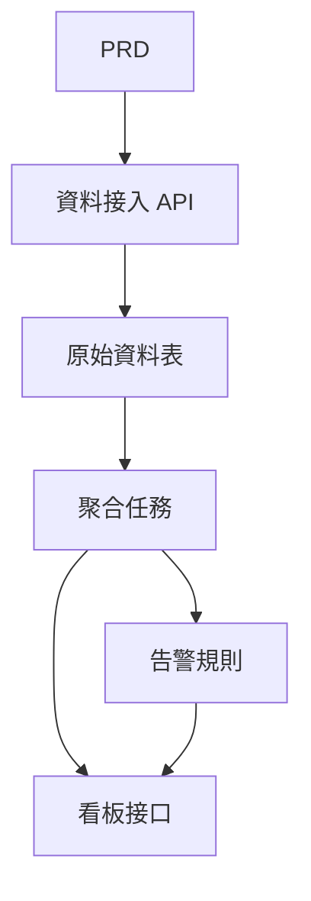

# Go 交通資料分析平臺開發實戰

## 概述

本實戰項目要求你圍繞一份真實的 PRD，使用 Go 完成一個交通資料分析平臺。這個項目的方向與前面的增刪改查系統不同——你需要構建一條"資料接入 → 聚合 → 告警 → 可視化"的完整資料鏈路。這種資料產品在 IoT、監控、運營分析等場景中非常常見。

這是 Stage 2 的綜合實戰環節，也是你第一次接觸 Go 語言。不用擔心，有了前面 JavaScript / TypeScript 的基礎，學習 Go 並不難——重點是理解資料鏈路的設計思路。

## 前置知識

在開始本項目之前，你應該已經掌握以下內容：

- 前端頁面設計與組件庫使用（[UI 設計](../../frontend/ui-design/)、[現代組件庫](../../frontend/modern-component-library/)）
- 後端接口設計與開發（[接口程式碼編寫](../../backend/ai-interface-code/)）
- 資料庫基礎與 Supabase（[從資料庫到 Supabase](../../backend/database-supabase/)）
- Git 工作流與部署（[Git 和 GitHub](../../backend/git-workflow/)、[部署 Web 應用](../../backend/zeabur-deployment/)）

## 學習目標

完成本實戰後，你將能夠：

1. 閱讀 PRD 並提取資料產品的開發任務清單
2. 使用 Go（Gin 或 Fiber）搭建後端 API 服務
3. 設計資料接入、窗口聚合和告警的完整鏈路
4. 讓後端資料和前端看板保持一致
5. 完成端到端聯調，交付可演示的資料產品原型

## 項目簡介

你要構建的產品是一個 Go 交通資料分析平臺：

| 模塊 | 職責 |
|------|------|
| **資料接入** | 接收原始交通事件併入庫 |
| **資料聚合** | 按時間窗口計算趨勢和擁堵指標 |
| **告警** | 基於規則生成告警記錄 |
| **看板展示** | 在前端展示趨勢圖、排行榜和告警列表 |

::: tip PRD 入口
本項目的需求文檔在 GitHub： [查看 PRD](https://github.com/datawhalechina/easy-vibe/blob/main/docs/zh-tw/stage-2/assignments/traffic-data-visualization-go/PRD.md)
:::

<div style="margin: 32px 0;">
  <ClientOnly>
    <StepBar :active="0" :items="[
      { title: '需求分析', description: '閱讀 PRD，明確資料來源、指標口徑和告警規則' },
      { title: '搭建骨架', description: '用 AI 生成 Go API 服務和前端看板骨架' },
      { title: '迭代開發', description: '補充聚合邏輯、告警規則和看板接口' },
      { title: '聯調上線', description: '端到端跑通，部署並準備演示' }
    ]" />
  </ClientOnly>
</div>

## 第一部分：需求分析

### 1.1 閱讀 PRD

打開 PRD 文檔，重點回答以下問題：

- 資料來源是什麼？字段有哪些？
- 核心指標的定義是什麼？（比如"擁堵"的具體標準）
- 告警規則是什麼？第一版是否先收斂到簡單規則？
- 看板包含哪些頁面和圖表？

::: warning
如果以上問題沒有明確答案，不要開始寫程式碼。需求理解不清楚是導致返工的最常見原因。
:::

### 1.2 確認資料鏈路



## 第二部分：搭建項目骨架

### 2.1 生成 Go API 服務

提示詞參考：

```text
請基於當前 PRD，幫我生成一個 Go 交通資料分析平臺骨架。

要求：
1. 使用 Gin 或 Fiber
2. 提供資料接入接口
3. 提供聚合任務骨架
4. 提供 dashboard 和 alerts 接口骨架
5. 先不做真實複雜分析，只做可運行結構
```

### 2.2 驗證項目結構

逐項檢查：

- [ ] Go 服務可以正常啟動
- [ ] 資料接入接口可接收並存儲資料
- [ ] 聚合任務框架已搭好
- [ ] 前端看板頁面可展示基本圖表

## 第三部分：迭代開發

### 3.1 按模塊推進

1. **資料接入 API**：接收原始交通事件，寫入資料庫
2. **資料聚合**：按時間窗口聚合，計算趨勢和擁堵指標
3. **告警規則**：基於閾值生成告警記錄
4. **看板接口**：提供趨勢資料、排行資料、告警列表
5. **前端看板**：趨勢圖、排行榜、告警列表頁面

### 3.2 模塊自檢

| 檢查項 | 驗證方法 |
|--------|----------|
| 資料接入 | 原始資料是否正確入庫 |
| 聚合口徑 | 趨勢、排名指標的計算邏輯是否一致 |
| 告警規則 | 告警觸發條件是否符合預期 |
| 資料一致性 | 看板展示和後端資料是否對得上 |
| API 規範 | 是否有統一返回結構和錯誤處理 |

## 第四部分：聯調與上線

### 4.1 端到端測試

至少驗證以下場景：

- 接入一批測試資料 → 聚合任務執行 → 看板展示更新
- 觸發告警條件 → 告警記錄生成 → 告警頁面顯示

## 交付物

完成本項目後，你需要提交以下內容：

- [ ] 可訪問的線上演示鏈接
- [ ] 源碼倉庫鏈接（含 README）
- [ ] PRD 文檔
- [ ] 核心頁面截圖（資料接入演示、趨勢看板、告警列表）
- [ ] 60 秒演示影片

## 評分標準

| 維度 | 基本要求 | 進階要求 |
|------|---------|---------|
| PRD 對齊 | 功能和資料結構基本符合 PRD | 能清晰說明指標口徑和聚合邏輯 |
| 資料鏈路 | 接入 → 聚合 → 告警 → 看板可跑通 | 聚合任務支持增量更新 |
| 分析能力 | 趨勢、排行、告警三個模塊可用 | 指標可配置、告警規則可自定義 |
| 前端展示 | 看板能展示基本圖表 | 圖表支持時間範圍篩選 |
| 工程完整度 | Go API、資料庫、前端鏈路已接通 | API 有統一錯誤處理和日誌 |

## 參考資料

- [UI 設計](../../frontend/ui-design/)
- [使用現代組件庫更新你的界面](../../frontend/modern-component-library/)
- [從資料庫到 Supabase](../../backend/database-supabase/)
- [大模型輔助編寫接口程式碼與接口文檔](../../backend/ai-interface-code/)
- [Git 和 GitHub 工作流](../../backend/git-workflow/)
- [如何部署 Web 應用](../../backend/zeabur-deployment/)
