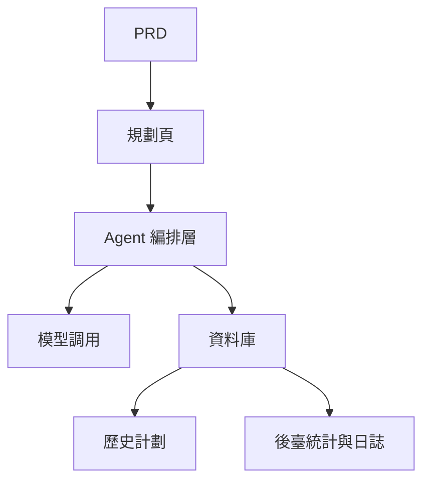

# 智能旅遊規劃 Agent 平臺開發實戰

## 概述

本實戰項目要求你圍繞一份真實的 PRD，從零完成一個智能旅遊規劃 Agent 平臺。你將構建一個能接收結構化輸入、生成每日行程、支持保存和重用的完整 AI 產品——不只是聊天機器人，而是一個有任務管理能力的產品。

這是 Stage 2 的綜合實戰環節。這個項目的核心挑戰在於：如何讓 AI 生成結構化、可用的行程規劃，而不是一大段不可操作的文字。

## 前置知識

在開始本項目之前，你應該已經掌握以下內容：

- 前端頁面設計與組件庫使用（[UI 設計](../../frontend/ui-design/)、[現代組件庫](../../frontend/modern-component-library/)）
- 後端接口設計與開發（[接口程式碼編寫](../../backend/ai-interface-code/)）
- 資料庫基礎與 Supabase（[從資料庫到 Supabase](../../backend/database-supabase/)）
- Git 工作流與部署（[Git 和 GitHub](../../backend/git-workflow/)、[部署 Web 應用](../../backend/zeabur-deployment/)）

## 學習目標

完成本實戰後，你將能夠：

1. 閱讀 PRD 並從中提取 Agent 平臺的開發任務清單
2. 設計結構化的輸入表單和結構化的輸出格式
3. 實現 Agent 編排層，處理用戶輸入、模型調用和結果存儲
4. 構建"生成 → 保存 → 重用"的業務閉環
5. 完成端到端聯調，交付可演示的 AI 產品原型

## 項目簡介

你要構建的產品是一個智能旅遊規劃 Agent 平臺：

| 功能 | 描述 |
|------|------|
| **行程規劃** | 用戶輸入出發地、目的地、日期、預算和偏好，系統生成每日行程 |
| **預算拆分** | 行程結果包含預算分配和建議 |
| **歷史管理** | 用戶可以保存歷史計劃、再次生成、導出 |
| **管理後臺** | 管理員查看熱門目的地、失敗任務和用戶反饋 |

::: tip PRD 入口
本項目的需求文檔在 GitHub： [查看 PRD](https://github.com/datawhalechina/easy-vibe/blob/main/docs/zh-tw/stage-2/assignments/travel-planning-agent-platform/PRD.md)
:::

<div style="margin: 32px 0;">
  <ClientOnly>
    <StepBar :active="0" :items="[
      { title: '需求分析', description: '閱讀 PRD，明確頁面、Agent 編排、輸入輸出結構' },
      { title: '搭建骨架', description: '用 AI 生成首頁、規劃頁、歷史頁、後臺頁骨架' },
      { title: '迭代開發', description: '逐模塊補充結構化輸出、任務狀態、歷史管理' },
      { title: '聯調上線', description: '端到端跑通，部署並準備演示' }
    ]" />
  </ClientOnly>
</div>

## 第一部分：需求分析

### 1.1 閱讀 PRD

打開 PRD 文檔，重點回答以下問題：

- 第一版是否只做單目的地？
- 行程輸出是否必須結構化？結構是什麼？
- 導出能力做多深？（分享鏈接 / PDF / 圖片）
- 後臺統計和任務日誌的範圍是什麼？

::: warning
如果以上問題沒有明確答案，不要開始寫程式碼。需求理解不清楚是導致返工的最常見原因。
:::

### 1.2 確認系統架構



## 第二部分：搭建項目骨架

### 2.1 生成前端頁面

提示詞參考：

```text
請基於當前 PRD，幫我生成一個智能旅遊規劃 Agent 平臺的前端骨架。

要求：
1. 頁面包括：首頁、規劃頁、行程詳情頁、歷史記錄頁、管理頁
2. 規劃頁左側是表單，右側是結果預覽
3. 先只生成頁面結構和假資料，不接真實接口
4. 風格要像現代 AI 產品
```

### 2.2 驗證頁面結構

逐項檢查：

- [ ] 規劃頁的表單字段是否與 PRD 一致
- [ ] 結果預覽區域能展示結構化的行程資料
- [ ] 歷史記錄頁可以展示多條計劃
- [ ] 管理後臺頁可以展示統計資料

## 第三部分：迭代開發

### 3.1 按模塊推進

1. **鑑權**：註冊、登錄
2. **規劃表單**：結構化輸入（出發地、目的地、日期、預算、偏好）
3. **Agent 編排**：接收輸入 → 調用模型 → 解析結構化輸出
4. **結果展示**：行程按天展示、預算拆分、建議
5. **歷史管理**：保存計劃、再次生成、導出
6. **管理後臺**：熱門目的地、失敗任務、用戶反饋
7. **任務狀態**：生成中 / 成功 / 失敗的狀態管理和錯誤記錄

### 3.2 模塊自檢

| 檢查項 | 驗證方法 |
|--------|----------|
| 輸入完整性 | 表單字段是否與 PRD 一致 |
| 輸出結構化 | 行程結果是不是結構化資料（而非一大段文字） |
| 資料一致性 | trip、itinerary、logs 資料是否對得上 |
| 閉環驗證 | 是否能演示"輸入 → 生成 → 保存 → 再次生成" |

## 第四部分：聯調與上線

### 4.1 端到端測試

至少驗證以下場景：

- 輸入行程參數 → 生成每日行程 → 查看預算拆分 → 保存到歷史
- 從歷史記錄中再次生成行程
- 管理員查看任務統計和失敗日誌

## 交付物

完成本項目後，你需要提交以下內容：

- [ ] 可訪問的線上演示鏈接
- [ ] 源碼倉庫鏈接（含 README）
- [ ] PRD 文檔
- [ ] 核心頁面截圖（規劃頁、行程詳情頁、歷史記錄頁、管理後臺）
- [ ] 60 秒演示影片

## 評分標準

| 維度 | 基本要求 | 進階要求 |
|------|---------|---------|
| PRD 對齊 | 頁面、功能、資料結構基本符合 PRD | 能清晰說明設計決策 |
| 產品閉環 | 規劃 → 保存 → 歷史 → 重生成可跑通 | 支持導出和分享 |
| 輸出質量 | 行程結果結構化且可讀 | 預算拆分合理、建議有針對性 |
| 後臺能力 | 任務統計和失敗日誌可查看 | 有熱門目的地分析 |
| 工程完整度 | 前端、後端、資料庫、模型調用鏈路已接通 | 任務狀態管理完善，錯誤可追溯 |

## 參考資料

- [UI 設計](../../frontend/ui-design/)
- [使用現代組件庫更新你的界面](../../frontend/modern-component-library/)
- [從資料庫到 Supabase](../../backend/database-supabase/)
- [大模型輔助編寫接口程式碼與接口文檔](../../backend/ai-interface-code/)
- [Git 和 GitHub 工作流](../../backend/git-workflow/)
- [如何部署 Web 應用](../../backend/zeabur-deployment/)
