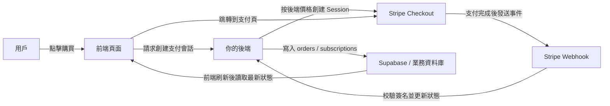
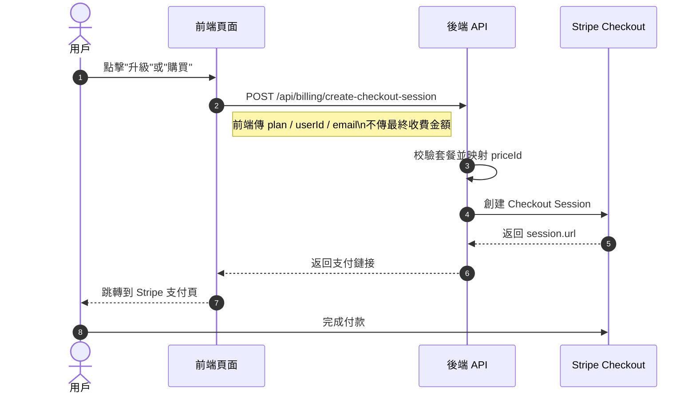
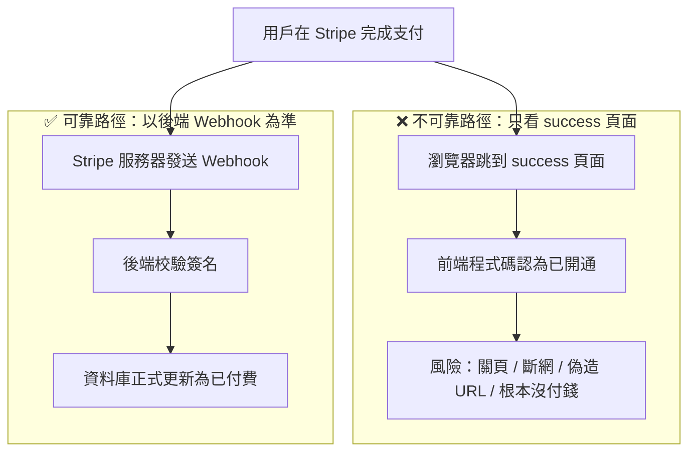
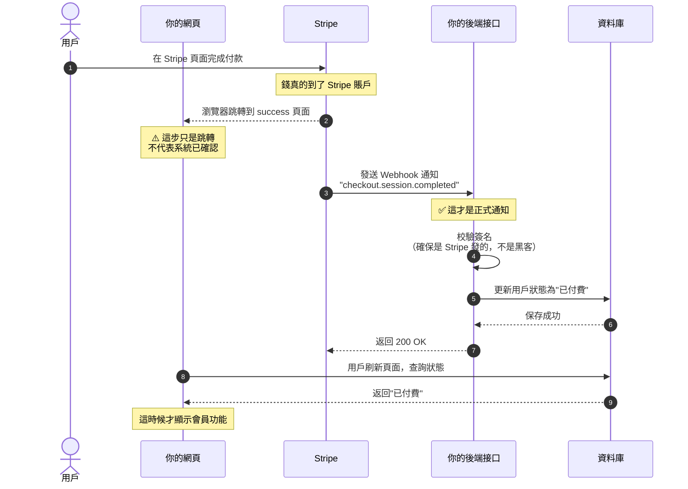
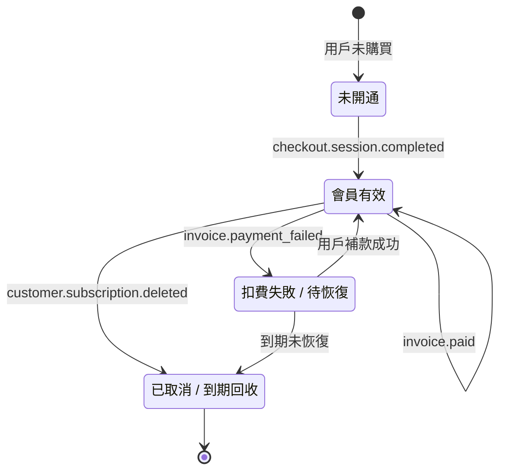
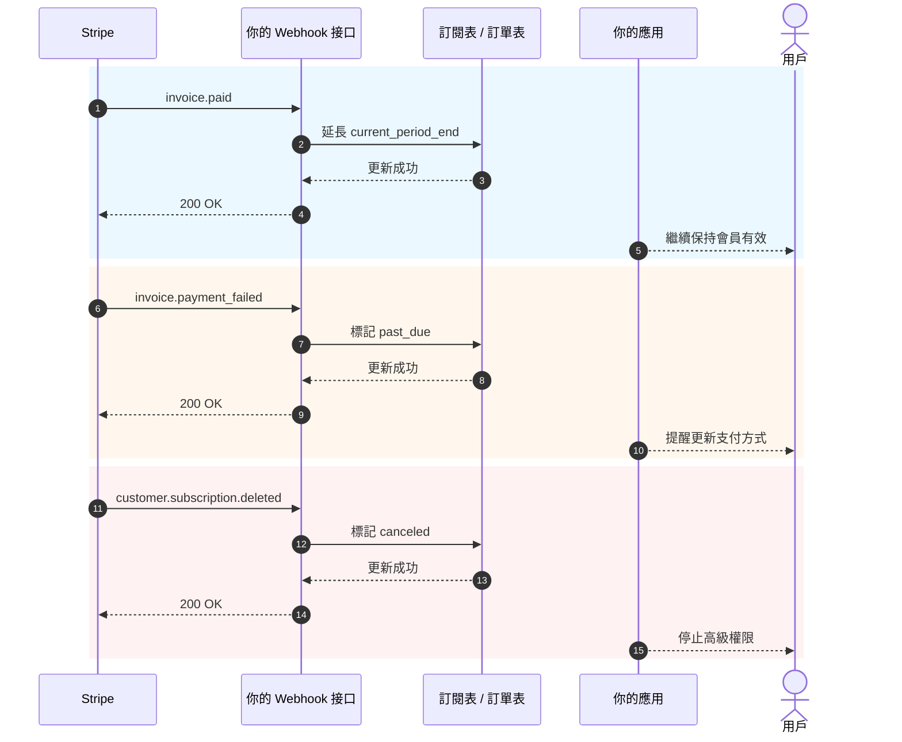

# 如何集成 Stripe 等收費系統

當你的產品已經有了頁面、登錄、資料庫和基礎後端之後，下一個現實問題就是：**怎麼收費**。

很多人第一次接支付，會把注意力全放在"怎麼跳轉到付款頁"上。但真正決定系統是否穩定的，不是按鈕，而是整條收費鏈路：誰決定價格、誰確認支付成功、誰更新資料庫、誰回收權限。

這篇文章我幫你拆成兩部分：

- **前半部分**只講最實用的基礎接入，目標是讓你儘快把 Stripe 接進項目。
- **後半部分**統一放到附錄，包含 Webhook 細節、訂閱事件、不同國家和地區的支付方案差異。

> 💡 建議先學完這些章節再繼續
>
> - [從資料庫到 Supabase](../database-supabase/)
> - [大模型輔助編寫接口程式碼與接口文檔](../ai-interface-code/)
> - [如何部署 Web 應用](../zeabur-deployment/)

# 你將學到

1. 最小可行的支付系統到底長什麼樣。
2. 如何用最快的方式把 Stripe 接進你的項目。
3. 如何寫提示詞，讓 AI 直接幫你加支付系統。
4. 如果不是做海外 Stripe 項目，不同地區應該優先考慮什麼支付方案。

---

# 第一部分：基礎上手

## 1. 先記住 3 個原則

如果你只記住三件事，就記住下面這三條：

1. **價格必須由後端決定**，不能相信前端傳來的金額。
2. **真正讓權限生效的是 Webhook**，不是 `success` 頁面。
3. **你自己的資料庫必須保存支付狀態**，不能只依賴 Stripe 後臺。

這三條是支付系統最核心的邊界。只要邊界沒錯，後面換 Stripe、PayPal、支付寶、微信支付，本質上都只是"接口換了，架構不變"。

## 2. 如果不在後端處理，而是前端直接連 Stripe，會怎麼樣？

這是很多人第一次做支付時最自然的想法：

- 頁面上已經有"購買"按鈕了
- 那我能不能讓前端自己去連 Stripe
- 這樣是不是就不用做後端了

如果你只是做一個假的演示頁面，這樣想當然沒問題。  
但如果你是真的要收錢，**這條路通常會把事情做壞**。

最常見的問題有這幾個：

1. **價格容易被改**
   瀏覽器裡的請求，是用戶自己電腦上發出去的。別人是可以改請求內容的。
2. **敏感資訊容易暴露**
   真正重要的密鑰、價格邏輯、會員開通邏輯，本來就不該放在前端。
3. **你沒法可靠確認"這筆錢到底算不算成功"**
   用戶跳到成功頁，不代表你的資料庫已經同步對了。
4. **資料庫狀態會亂**
   用戶可能說"我明明已經付錢了"，但你自己的系統里根本沒記上。

所以更安全的分工應該是：

- 前端負責：展示按鈕、發起購買、跳轉頁面
- 後端負責：決定價格、創建支付會話、接收 Webhook、更新資料庫

::: info 這一段你可以直接記成一句話
**前端可以負責跳轉，後端必須負責定價和確認。**

只要是真收錢，就不要把"最終價格決定權"和"支付成功後的開通邏輯"放在前端。
:::

## 3. 什麼時候適合先用 Stripe

如果你做的是下面這些場景，Stripe 往往是最順手的起點：

- 面向海外用戶的 SaaS
- 訂閱制會員產品
- 數字產品、模板、AI 積分包
- 想先快速驗證商業化，而不是一開始就處理太多本地支付細節

如果你的主要用戶在中國大陸，那通常不會把 Stripe 當第一選擇，這個我放到附錄裡統一講。

## 4. 最小可行支付鏈路

先看最小版本。只要這條鏈路能跑通，你的支付系統就有了骨架。



把它翻譯成人話就是：

1. 用戶點按鈕。
2. 前端找後端要支付鏈接。
3. 後端用 Stripe 密鑰創建支付會話。
4. 用戶去 Stripe 頁面付款。
5. Stripe 把"付款真的成功了"這件事通過 Webhook 通知你。
6. 你的後端再去更新資料庫。

## 5. 發起付款的標準時序圖

如果你習慣看更規範的系統圖，可以直接看這張時序圖：



## 6. 快速開始

如果你想最快把它接進項目，照著下面這 5 步做就夠了。

### 6.1 第一步：在 Stripe 後臺創建商品和價格

這一步的目的，不是"先隨便配點東西"，而是先把 **你到底在賣什麼、打算怎麼收費** 這件事在 Stripe 裡定義清楚。

在 Stripe 的模型裡：

- **Product** 表示"你賣的是什麼"，比如 `Pro 會員`
- **Price** 表示"這個東西賣多少錢、按什麼週期賣"，比如 `月付 9.9 美元`、`年付 99 美元`

為什麼要先做這一步？  
因為後面當你的後端創建 Checkout Session 時，並不是直接傳一個金額給 Stripe，而是要傳一個已經存在的 `price_id`。Stripe 再根據這個 `price_id` 去生成真正的支付頁、金額、幣種和訂閱週期。

如果你跳過這一步，後面的"創建支付鏈接"其實就沒法做。

::: info 為什麼這裡要先停一下
很多新手看到 `Product`、`Price` 這兩個詞會有點煩，覺得像是在學 Stripe 的內部術語。

但實際上，這一步是在做一件很樸素的事：
- 把"賣什麼"定義清楚
- 把"賣多少錢"定義清楚
- 讓後端之後能拿一個穩定的 `price_id` 去創建支付鏈接

只要把這層想明白，後面的 Checkout Session 就不會覺得抽象。
:::

對於一個最小可行的訂閱系統，你至少先建這兩個層級：

- 一個 `Product`
- 一個或多個 `Price`

你可以直接打開這些頁面：

- Stripe Dashboard 登錄頁：[Dashboard Login](https://dashboard.stripe.com/login)
- Stripe 商品與價格管理文檔：[Manage products and prices](https://docs.stripe.com/products-prices/manage-prices)
- Stripe Checkout 快速開始文檔：[Build a Stripe-hosted checkout page](https://docs.stripe.com/checkout/quickstart?lang=node)
- Stripe Dashboard 商品頁：[Product catalog](https://dashboard.stripe.com/test/products)

推薦你先在 **Test mode（測試模式）** 下操作，不要一開始就在正式環境裡建。

一個最常見的最小配置是：

- `Product`: `Pro Plan`
- `Price 1`: `pro_monthly`
- `Price 2`: `pro_yearly`

你在後臺操作時，可以按這個順序理解：

1. 先創建一個商品 `Pro Plan`
2. 再在這個商品下面掛兩個價格
3. 月付和年付其實是同一個商品的兩種收費方式

完成後，你至少要記下這些資訊：

- 月付價格的 `price_id`
- 年付價格的 `price_id`
- 你自己的套餐名，例如 `pro_monthly`、`pro_yearly`

如果你是第一次進 Stripe 後臺，建議你把這一步理解成：

- `Product` 決定支付頁裡賣的是什麼
- `Price` 決定支付頁裡收多少錢
- 後端之後真正會用到的，主要是 `price_id`

::: info 真正要記下來的值
這一頁裡最重要的不是商品名稱，而是 `price_id`。

後面無論是讓 AI 幫你接後端，還是你自己排查問題，真正會頻繁用到的，通常都是：
- `STRIPE_PRICE_PRO_MONTHLY`
- `STRIPE_PRICE_PRO_YEARLY`
- 它們背後對應的兩個 `price_id`
:::

如果你想讓 AI 先帶你把後臺配置做完，可以直接用這個 prompt：

```text
我現在是第一次用 Stripe，你先不要改程式碼，先帶我在 Stripe 後臺把最基本的付費配置做好。

請基於這些官方文檔給我一步一步的操作說明：
- https://docs.stripe.com/products-prices/manage-prices
- https://docs.stripe.com/checkout/quickstart?lang=node

我的情況是：
- 我想做一個最簡單的會員付費
- 只有兩個套餐：月付和年付
- 我現在還不懂 Product、Price 這些詞

請你：
1. 先用最簡單的話告訴我 Product 和 Price 分別是什麼。
2. 再按"先打開哪個頁面 -> 點哪裡 -> 填什麼"的順序教我操作。
3. 最後提醒我，做完以後我需要從後臺複製哪些內容給後端使用。
4. 如果我容易走錯，請順便提醒我應該一直在測試模式裡操作。
```

### 6.2 第二步：準備環境變量

你通常至少需要準備這些環境變量：

- `STRIPE_SECRET_KEY`
- `STRIPE_WEBHOOK_SECRET`
- `STRIPE_PRICE_PRO_MONTHLY`
- `STRIPE_PRICE_PRO_YEARLY`
- `APP_URL`
- `SUPABASE_URL`
- `SUPABASE_SERVICE_ROLE_KEY`

你可以直接打開這些頁面：

- Stripe API Keys 文檔：[API keys](https://docs.stripe.com/keys)
- Stripe Dashboard API Keys 頁面：[API Keys](https://dashboard.stripe.com/test/apikeys)
- Stripe Webhooks 文檔：[Receive Stripe events in your webhook endpoint](https://docs.stripe.com/webhooks)
- Stripe Dashboard Webhooks 頁面：[Workbench Webhooks](https://dashboard.stripe.com/test/workbench/webhooks)

> ⚠️ `STRIPE_SECRET_KEY` 和 `SUPABASE_SERVICE_ROLE_KEY` 都只能放在後端。

::: info 環境變量這一步的目的
這一步不是為了"先把 `.env` 填滿"，而是為了把支付系統裡最敏感的幾樣東西放到後端保管：

- Stripe 的後端密鑰
- Webhook 驗籤密鑰
- 你自己的價格映射

簡單理解：  
前端只負責發起購買，真正的秘密和定價邏輯都應該留在服務端。
:::

這一步也可以直接讓 AI 幫你整理：

```text
請你先看看我這個項目現在是怎麼放環境變量的，然後幫我把 Stripe 需要的環境變量整理出來。

請參考這些文檔：
- https://docs.stripe.com/keys
- https://docs.stripe.com/webhooks

我的情況是：
- 我是零基礎
- 我分不清哪些變量應該放前端，哪些應該放後端
- 我也不確定當前項目應該改 `.env`、`.env.local` 還是別的文件

請你：
1. 先搜索當前項目裡環境變量通常寫在哪。
2. 幫我列出 Stripe 接入最少需要哪些變量。
3. 用最簡單的話告訴我每個變量是幹什麼的。
4. 告訴我每個變量應該去哪一個 Stripe 頁面複製。
5. 如果項目裡有示例環境變量文件，請直接幫我補上變量名。
```

### 6.3 第三步：後端創建 Checkout Session

這一步你不用自己寫接口，直接讓 AI 參考官方文檔幫你實現。

先把這些文檔給它：

- Stripe Checkout 快速開始：[Build a Stripe-hosted checkout page](https://docs.stripe.com/checkout/quickstart?lang=node)
- Checkout Sessions API：[Create a Checkout Session](https://docs.stripe.com/api/checkout/sessions/create)
- 訂閱說明：[Subscriptions](https://docs.stripe.com/payments/subscriptions)

然後直接貼這個 prompt：

```text
請你先看看我當前項目的後端程式碼是怎麼組織的，然後幫我把 Stripe 支付接進去。

請參考這些官方文檔：
- https://docs.stripe.com/checkout/quickstart?lang=node
- https://docs.stripe.com/api/checkout/sessions/create
- https://docs.stripe.com/payments/subscriptions

我的目標很簡單：
- 用戶點購買按鈕後，能跳到 Stripe 的付款頁面
- 套餐只有月付和年付兩種
- 不要讓我自己決定程式碼該放在哪，你先看項目再幫我放到合適的位置

請你：
1. 先搜索項目，弄清楚後端入口文件、路由文件、環境變量寫法分別在哪裡。
2. 再參考官方文檔，幫我把"創建 Stripe 支付鏈接"這一步接進去。
3. 不要讓我自己傳金額，價格請用後端環境變量來決定。
4. 做完後告訴我你改了哪些文件。
5. 最後告訴我，我還需要去 Stripe 後臺補哪些配置。
```

### 6.4 第四步：前端跳轉到支付頁

這一步的目標非常簡單：讓定價頁按鈕調用你的後端接口，再跳轉到 Stripe Checkout。

參考文檔：

- Stripe Checkout 集成說明：[Build an integration with Checkout](https://docs.stripe.com/payments/checkout/build-integration)

給 AI 的 prompt：

```text
幫我把項目裡的"購買"按鈕接上 Stripe。

要求：
- 不動現有頁面，只改按鈕點擊後的邏輯
- 點擊後調用後端接口獲取支付鏈接，然後跳轉到 Stripe
- 如果出錯，給用戶一個簡單提示（比如"支付暫時不可用，請稍後再試"）

參考文檔：https://docs.stripe.com/payments/checkout/build-integration
```

### 6.5 第五步：Webhook 更新資料庫狀態

這是最關鍵的一步。

::: info 為什麼這一步最關鍵
很多人會以為"用戶付完款並且跳轉到了 success 頁面"就算完成了。

不是。

對你的系統來說，真正重要的是：  
**Stripe 有沒有正式把事件打到你的 Webhook，而你的後端有沒有把資料庫狀態更新成功。**
:::

你也可以讓 AI 按 Stripe 官方 Webhook 文檔直接實現，不要自己手寫。

參考文檔：

- Stripe Webhooks：[Receive Stripe events in your webhook endpoint](https://docs.stripe.com/webhooks)
- Stripe CLI：[Stripe CLI](https://docs.stripe.com/stripe-cli)
- Stripe CLI 用法：[Use the Stripe CLI](https://docs.stripe.com/stripe-cli/use-cli)

給 AI 的 prompt：

```text
請繼續幫我把 Stripe 的"付款成功後自動生效"這一步接好。

請參考這些官方文檔：
- https://docs.stripe.com/webhooks
- https://docs.stripe.com/stripe-cli
- https://docs.stripe.com/stripe-cli/use-cli

我的目標是：
- 用戶付完錢後，不只是跳轉到成功頁面
- 而是真的把我資料庫裡的會員狀態改成已開通

請你：
1. 先搜索當前項目裡資料庫相關程式碼和用戶狀態是怎麼存的。
2. 再幫我加 Stripe webhook。
3. 支付成功後，把對應用戶改成 active，或者更新成項目裡現在已經在用的會員狀態字段。
4. 如果項目裡已經有訂閱表、訂單表、用戶表，請優先沿用現有結構。
5. 做完後告訴我你改了哪些文件。
6. 順便告訴我本地怎麼測試這一步有沒有真的生效。
```

## 7. 讓 AI 幫你快速接入的提示詞

如果你用的是 Codex、Claude Code、Trae、Cursor 一類工具，可以直接把下面這個提示詞貼給它，讓它在你的項目裡做支付接入。

```text
請你幫我把當前項目接上 Stripe 支付，我希望做一個最簡單能跑起來的會員收費功能。

我的要求：
1. 我是零基礎，請你先自己看項目，再決定程式碼應該改哪裡。
2. 不要讓我自己判斷目錄結構、路由結構、資料庫結構。
3. 我只想先做最簡單版本：月付和年付兩個套餐。
4. 用戶點擊購買後，能跳到 Stripe 付款頁面。
5. 付款成功後，我資料庫裡的會員狀態能變成已開通。
6. 不要一開始加太多複雜功能，比如優惠券、升級降級、複雜發票。

輸出要求：
1. 先給我一個改動計劃。
2. 然後直接修改程式碼。
3. 最後告訴我怎麼一步一步本地測試。
4. 如果有哪個步驟還需要我去 Stripe 後臺操作，請直接把鏈接和要點告訴我。
```

如果你希望 AI 更貼近你的項目，還可以在開頭補上：

- 你的前端框架
- 你的後端目錄結構
- 你的資料庫表名
- 你現在的用戶系統是 Supabase Auth 還是自建 Auth

## 7.1 本地聯調也儘量交給 AI

如果你希望連本地聯調都讓 AI 幫你串起來，可以直接用下面這段：

```text
請繼續幫我把 Stripe 支付真正跑通，我想一步一步照著做，不想自己猜。

請參考官方文檔：
- https://docs.stripe.com/webhooks
- https://docs.stripe.com/stripe-cli
- https://docs.stripe.com/stripe-cli/use-cli

我的目標：
1. 告訴我先打開哪些 Stripe 頁面。
2. 告訴我如何拿到 STRIPE_WEBHOOK_SECRET。
3. 告訴我如何使用 stripe login 和 stripe listen。
4. 告訴我怎樣驗證 checkout.session.completed 已經成功打到本地 webhook。
5. 如果當前項目需要先啟動前端和後端，也請順帶告訴我具體命令。
6. 不要只講原理，請按實際操作步驟輸出。
7. 如果我某一步做錯了，也請告訴我最常見的報錯會長什麼樣。
```

## 8. 最容易踩坑的 4 件事

1. **把 `success` 頁面當成支付成功**
   真正決定狀態的是 Webhook，不是前端跳轉。
2. **讓前端傳金額**
   這會帶來嚴重的價格篡改風險。
3. **Webhook 路由被 `express.json()` 提前處理**
   Stripe 驗籤需要原始請求體。
4. **沒有做冪等處理**
   Webhook 可能重試，如果你每次都重複加會員或積分，就會出事故。

## 9. 一句話選型建議

如果你現在只是想先把收費跑起來：

| 你的主要用戶 | 最先嚐試的方案 |
| :--- | :--- |
| 海外 SaaS / 國際用戶 | Stripe |
| 中國大陸用戶 | 支付寶 / 微信支付 |
| 香港或跨境團隊 | Stripe + 本地錢包 / FPS 聚合方案 |

後面的具體區別，我統一放到附錄。

::: info 最簡單的選型思路
不要一開始就想"我要把全球支付方式一次全接完"。

更實際的順序通常是：
- 先按主要用戶所在地區選一條主支付鏈路
- 先把最小可行支付跑通
- 再根據真實用戶來源補第二、第三種支付方式
:::

## 10. 小結

到這裡，你已經掌握了最基礎但最重要的一條收費鏈路：

1. 前端發起購買。
2. 後端創建 Checkout Session。
3. 用戶在 Stripe 頁面支付。
4. Stripe 通過 Webhook 通知後端。
5. 後端更新資料庫。
6. 前端刷新後顯示新的會員或訂單狀態。

如果你只想快速把支付接進項目，前面的內容已經夠用了。下面的附錄你可以在真正遇到問題時再回來看。

---

# 附錄

## 附錄 A：Stripe 裡最常見的幾個對象

第一次看 Stripe 文檔，最容易被這些對象名繞暈。你其實只需要先理解下面幾個：

| 對象 | 作用 | 你可以把它理解成什麼 |
| :--- | :--- | :--- |
| `Product` | 描述賣的是什麼 | 商品或會員套餐 |
| `Price` | 描述賣多少錢、週期怎麼收費 | 月付、年付、買斷 |
| `Checkout Session` | Stripe 託管的支付流程 | 付款頁 |
| `Subscription` | 週期訂閱關係 | 自動續費會員 |
| `Customer` | 付款用戶 | Stripe 中的客戶檔案 |
| `Webhook` | 異步通知 | Stripe 告訴你"這筆款怎麼樣了" |

## 附錄 B：為什麼 `success` 頁面不等於支付成功

很多人以為"用戶付完錢，跳到了 success 頁面"就算支付成功了。這是最容易踩的坑。

### 先講一個真實場景

假設你做了一個會員網站：
1. 用戶點擊"購買會員"
2. 跳轉到 Stripe 付款頁面
3. 用戶輸入信用卡，點擊付款
4. 頁面跳轉到你的 `success.html`
5. 你在 success 頁面寫程式碼："既然到了這頁，就給用戶開通會員"

**問題在哪？**

用戶可能根本沒付錢，或者付到一半關頁面了，也能直接訪問 `success.html`。

### 兩條完全不同的路徑



**關鍵區別：**

| | success 頁面跳轉 | Webhook 通知 |
| :--- | :--- | :--- |
| 誰發起的 | 用戶的瀏覽器 | Stripe 的服務器 |
| 能偽造嗎 | 能，直接訪問 URL 就行 | 不能，有簽名驗證 |
| 一定代表付款成功嗎 | 不一定 | 一定 |
| 你的系統怎麼知道 | 前端程式碼猜的 | Stripe 正式通知的 |

### 完整流程應該是怎樣的



### 每個環節的卡點

**第 1 步：用戶在 Stripe 付款**

這是唯一確定"錢真的付了"的時刻：
- 用戶輸入信用卡資訊，點擊確認
- 銀行從用戶卡里扣款
- Stripe 確認收到這筆錢

**第 2 步：瀏覽器跳轉到 success 頁面（問題最大）**

這一步完全不可靠，因為：
- 用戶可以直接在瀏覽器輸入 `yoursite.com/success`，根本沒付錢也能訪問
- 用戶付到一半關頁面了，但之前複製了 success 鏈接，之後直接打開
- 網路問題導致跳轉失敗，但錢已經扣了（用戶付了錢卻沒看到成功頁面）
- 用戶點返回鍵，又付了一次錢，但兩次都跳轉到同一個 success 頁面

**第 3 步：Stripe 發送 Webhook**

這是 Stripe 主動通知你的服務器"這筆款到賬了"：
- 只有 Stripe 的服務器能發起這個請求
- 請求裡帶有簽名，你的後端可以驗證是不是真的 Stripe 發的
- 即使 success 頁面沒打開、用戶斷網了，Webhook 也會發送

**第 4 步：後端校驗簽名**

為什麼要校驗？防止黑客偽造通知。

假設沒有校驗，黑客可以直接給你的服務器發一個假通知："用戶 A 付了 1000 元"。你的系統就會給黑客開通會員。

校驗的過程：
- Stripe 用你們約定的密鑰對通知內容生成簽名
- 你的後端用同樣的密鑰驗證簽名是否匹配
- 匹配 = 100% 是 Stripe 發的，不匹配 = 直接拒絕

**第 5 步：更新資料庫**

只有校驗通過後，才更新資料庫：
- 把用戶狀態從"待付款"改成"已付費"
- 記錄訂單號、金額、付款時間
- 開通對應的會員權限

**第 6 步：前端查詢狀態**

success 頁面不要自己判斷"到了這頁就是成功了"。正確的做法：
- 頁面加載時，向後端發送請求："這個用戶付費了嗎？"
- 後端查資料庫，返回真實狀態
- 根據返回結果顯示"開通成功"或"等待確認"

### 一個常見的錯誤做法

```javascript
// 錯誤：在 success 頁面直接開通
// success.html
if (window.location.pathname === '/success') {
  // 危險！任何人都能訪問 /success
  activateMembership();
}
```

```javascript
// 正確：每次刷新都查後端
// success.html
async function checkStatus() {
  const response = await fetch('/api/user/status');
  const data = await response.json();
  
  if (data.paymentStatus === 'paid') {
    showMemberFeatures();
  } else {
    showPendingMessage();
  }
}
```

### 總結一句話

**success 頁面只是"瀏覽器跳轉成功"，Webhook 才是"Stripe 正式確認收款"。**

你的系統必須以 Webhook 為準，不能相信前端的跳轉。

## 附錄 C：訂閱系統最值得監聽的事件

| 事件 | 含義 | 你通常要做什麼 |
| :--- | :--- | :--- |
| `checkout.session.completed` | 首次開通成功 | 創建本地訂閱記錄 |
| `invoice.paid` | 自動續費成功 | 延長有效期 |
| `invoice.payment_failed` | 自動扣費失敗 | 標記風險狀態並提醒用戶 |
| `customer.subscription.deleted` | 訂閱取消 | 回收權限或標記到期後失效 |

### 訂閱狀態圖



### 續費 / 失敗 / 取消時序圖



## 附錄 D：其他支付方案怎麼選

### 1. 中國大陸

主要用戶在大陸的話，首選還是 **[支付寶](https://open.alipay.com/)** 和 **[微信支付](https://pay.wechatpay.cn/)**。

**業務模式：**

兩者都是"支付網關"模式。你需要：
- 申請商戶資質（營業執照、對公賬戶）
- 用戶付的錢直接到你的商戶賬戶
- 你自己負責稅務、退款、對賬

**技術模式：**

兩者都是"後端下單 + 前端調起 + 後端通知"的模型，跟 Stripe 思路一樣。

**支付寶接入流程：**
1. 在支付寶開放平臺創建應用
2. 配置公私鑰和回調地址
3. 後端調用統一下單接口，生成支付鏈接或二維碼
4. 用戶掃碼或跳轉付款
5. 支付寶異步通知你的後端，更新訂單狀態

**微信支付接入流程：**
- JSAPI 支付：適合公眾號、小程序，用戶在微信內直接付款
- Native 支付：PC 端生成二維碼，用戶掃碼付款
- H5 支付：手機瀏覽器內拉起微信 App 付款

流程：後端下單 → 拿到 `prepay_id` 或 `code_url` → 前端調起支付 → 後端接收通知確認成功

**參考鏈接：**
- 支付寶開放平臺：https://open.alipay.com/
- 微信支付商戶文檔：https://pay.wechatpay.cn/doc/v3/merchant/

### 2. 香港

香港市場比較混合，常見組合：

- 銀行卡：Visa / Mastercard
- FPS（轉數快）：香港本地即時轉賬
- AlipayHK / WeChat Pay HK：香港版支付寶和微信

**推薦組合：**
- 用 **[Stripe](https://stripe.com/hk)** 覆蓋國際卡和訂閱
- 用 **[Airwallex](https://www.airwallex.com/)** 或 **[Adyen](https://www.adyen.com/)** 補本地錢包和 FPS

### 3. 海外 / 國際 SaaS

#### [Stripe](https://stripe.com/)

**業務模式：** 支付網關

- 你需要自己申請商戶資質（部分國家 Stripe 可以幫你搞定）
- 用戶付的錢到你的 Stripe 賬戶，再結算到你的銀行賬戶
- 你自己負責稅務申報

**技術模式：**

- API 體驗最好，文檔清晰
- 支持 Checkout（託管頁面）、Elements（自定義表單）、Payment Links（無程式碼）
- Webhook 通知支付狀態
- 支持訂閱、發票、多幣種

**適合誰：** 海外 SaaS、獨立開發者、需要靈活定製的團隊

**參考鏈接：** https://docs.stripe.com/

#### [PayPal](https://www.paypal.com/)

**業務模式：** 支付網關

- 用戶付的錢到你的 PayPal 賬戶，再提現到銀行
- 你自己負責稅務

**技術模式：**

- 一次性支付：前端放按鈕，後端創建/確認訂單
- 訂閱制：先建 Product 和 Plan，再用 SDK 拉起
- 同樣需要後端和 Webhook，不要只看前端回調

**適合誰：** 需要補充渠道的海外業務，用戶習慣用 PayPal 付款

**參考鏈接：** https://developer.paypal.com/docs/

#### [Paddle](https://www.paddle.com/)

**業務模式：** Merchant of Record (MoR)

- Paddle 是"記錄商家"，法律上由 Paddle 向用戶收款
- Paddle 幫你處理全球稅務、VAT、退款、合規
- 用戶付的錢到 Paddle，Paddle 扣除稅費和手續費後結算給你
- 你不需要在每個國家註冊公司或處理稅務

**技術模式：**

- Paddle.js：前端嵌入托管結賬頁
- 後端 API：創建 transaction，交給 checkout 處理
- Webhook 同步訂閱狀態

**適合誰：** 不想處理全球稅務的 SaaS 團隊，尤其是 B2B SaaS

**參考鏈接：** https://developer.paddle.com/

#### [Lemon Squeezy](https://www.lemonsqueezy.com/)

**業務模式：** Merchant of Record (MoR)

- 和 Paddle 類似，Lemon Squeezy 是"記錄商家"
- 幫你處理全球稅務、VAT、合規
- 2024 年被 Stripe 收購，但獨立運營

**技術模式：**

- Hosted Checkout：最簡單，直接生成付款鏈接
- Checkout Overlay：浮層嵌入你的頁面
- 後端 API：創建 checkout，靈活控制

**適合誰：** 獨立開發者、數字產品、軟體授權

**參考鏈接：** https://docs.lemonsqueezy.com/

### 4. 企業級方案

#### [Airwallex（空中雲匯）](https://www.airwallex.com/)

**業務模式：** 支付網關 + 全球賬戶

- 提供全球收款賬戶（類似虛擬銀行賬戶）
- 支持多幣種收款、換匯、付款
- 你自己負責稅務

**技術模式：**

- Payment Links：幾乎不用程式碼，生成付款鏈接
- Hosted Payment Page：託管頁面
- Drop-in / Embedded / Native API：深度接入，自定義程度高
- 支持 Alipay HK、FPS、WeChat Pay 等本地支付方式

**適合誰：** 香港團隊、跨境業務、需要多幣種賬戶的公司

**參考鏈接：** https://www.airwallex.com/docs/

#### [Adyen](https://www.adyen.com/)

**業務模式：** 支付網關

- 企業級支付平臺，年處理交易額萬億歐元
- 支持線上、線下、移動端全渠道
- 你自己負責稅務

**技術模式：**

- Pay by Link：最簡單，生成付款鏈接
- Drop-in / Components：標準線上接入
- 後臺可啟用 Alipay、Alipay HK、PayMe 等本地支付方式

**適合誰：** 大型企業、需要全渠道支付的公司

**參考鏈接：** https://docs.adyen.com/

### 5. 方案對比

| 方案 | 業務模式 | 稅務處理 | 適合誰 |
| :--- | :--- | :--- | :--- |
| Stripe | 支付網關 | 自己處理 | 海外 SaaS、開發者 |
| PayPal | 支付網關 | 自己處理 | 海外補充渠道 |
| Paddle | MoR | Paddle 代處理 | B2B SaaS、不想管稅務 |
| Lemon Squeezy | MoR | LS 代處理 | 獨立開發者、數字產品 |
| Adyen | 支付網關 | 自己處理 | 大型企業 |
| Airwallex | 支付網關 + 賬戶 | 自己處理 | 跨境業務、香港團隊 |
| 支付寶/微信 | 支付網關 | 自己處理 | 大陸用戶 |

### 6. 按地區選方案

| 你的市場 | 推薦方案 |
| :--- | :--- |
| 中國大陸 | 支付寶 / 微信支付 |
| 香港 | Stripe + Airwallex / Adyen |
| 海外 SaaS | Stripe（自己管稅務）或 Paddle（MoR 代管） |
| 海外數字產品 | Stripe / Lemon Squeezy / Paddle |
| 多地區企業級 | Adyen / Airwallex / Stripe 組合 |
