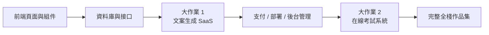

# 初中級開發

歡迎來到 **初中級開發** 階段！在這裡，你將深入全棧開發，掌握前端組件化、資料庫設計、後端 API 開發與部署上線。

## 你將學到什麼

### 前端開發

掌握現代前端開發，學習組件庫與設計工具的使用：

<NavGrid>
  <NavCard
    href="/zh-tw/stage-2/frontend/lovart-assets/"
    title="從Lovart出發，搭建自己的素材生產Agent"
    description="從零開始，利用Nanobanana和Lovart批量生成高質量的設計素材，並動手構建一個能意圖識別的繪圖Agent"
  />
  <NavCard
    href="/zh-tw/stage-2/frontend/figma-mastergo/"
    title="Figma 與 MasterGo 入門"
    description="掌握專業 UI 設計工具的基礎操作，從設計稿到程式碼的協作流程"
  />
  <NavCard
    href="/zh-tw/stage-2/frontend/ui-design/"
    title="構建第一個現代應用程序 - UI 設計"
    description="學習現代應用程序的 UI 設計基礎"
  />
  <NavCard
    href="/zh-tw/stage-2/frontend/multi-product-ui/"
    title="參考 UI 設計規範設計頁面和按鈕"
    description="學習主流 UI 設計規範，設計更清晰的頁面層級與按鈕層級"
  />
  <NavCard
    href="/zh-tw/stage-2/frontend/llm-skills-beautiful/"
    title="用 LLM 和 Skills 讓界面變好看"
    description="使用提示詞與插件實戰，讓 AI 生成美觀獨特的界面"
  />
  <NavCard
    href="/zh-tw/stage-2/frontend/hogwarts-portraits/"
    title="一起做霍格沃茨畫像"
    description="實戰項目：結合 AI 生成的圖像，構建一個交互式的霍格沃茨畫像應用"
  />
  <NavCard
    href="/zh-tw/stage-2/frontend/design-to-code/"
    title="從設計原型到項目程式碼"
    description="學習如何將設計工具中的原型轉化為真正能在瀏覽器裡運行的前端程式碼"
  />
  <NavCard
    href="/zh-tw/stage-2/frontend/modern-component-library/"
    title="使用現代組件庫更新你的界面"
    description="學習使用組件庫快速構建專業級界面"
  />
</NavGrid>

### 後端開發

學習 API 設計、資料庫管理以及應用部署策略：

<NavGrid>
  <NavCard
    href="/zh-tw/stage-2/backend/git-workflow/"
    title="學會使用 Git 與 Github"
    description="掌握 Git 版本控制系統的核心操作與協作流程"
  />
  <NavCard
    href="/zh-tw/stage-2/backend/database-supabase/"
    title="從資料庫到 Supabase"
    description="掌握關聯式資料庫基礎，並學習使用 Supabase 這一現代 BaaS 平台"
  />
  <NavCard
    href="/zh-tw/stage-2/backend/ai-interface-code/"
    title="應用後端接口設計與開發"
    description="利用 AI 輔助生成後端接口程式碼及標準的接口文檔，提升開發效率"
  />
  <NavCard
    href="/zh-tw/stage-2/backend/zeabur-deployment/"
    title="發布你的產品原型"
    description="學習使用 Zeabur 快速部署你的全棧應用到雲端"
  />
  <NavCard
    href="/zh-tw/stage-2/backend/modern-cli/"
    title="從 IDE 到 CLI AI 程式設計工具"
    description="探索現代 CLI 工具，提升命令行環境下的開發體驗"
  />
  <NavCard
    href="/zh-tw/stage-2/backend/stripe-payment/"
    title="如何集成 Stripe 等收費系統"
    description="實戰：為你的應用集成 Stripe 支付功能，實現商業化變現"
  />
</NavGrid>

### 大作業

前面的章節是在學「零件」，大作業才是在學「怎麼把零件裝成一個能跑、能演示、能上線的產品」。

建議你按 **大作業 1 -> 大作業 2** 的順序來做：

- **大作業 1** 先帶你跑通現代 SaaS 最常見的主鏈路：登錄、生成、資料庫、支付、管理後台。
- **大作業 2** 再帶你進入更像業務系統的場景：角色權限、題庫、考試、提交記錄、管理台。

如果你不知道先做哪個，可以直接參考下面這張對比表：

| 項目 | 你會重點練到什麼 | 最適合誰 | 最終交付物 |
|------|------|------|------|
| 大作業 1：文案生成網站 | SaaS 頁面結構、用戶登錄、AI 生成、Stripe 支付、後台管理 | 第一次做完整商業化網站的人 | 一個可註冊、可生成、可付費、可管理的 SaaS 雛形 |
| 大作業 2：在線考試與管理系統 | 角色權限、題庫建模、考試流程、提交記錄、批改與統計 | 想把「業務系統」真正做完整的人 | 一個有學生端和管理端的考試平台 |

無論做哪一個，大作業都建議至少準備這 3 個交付物：

- 一個可運行的項目倉庫
- 一個可訪問的演示鏈接
- 一份 README 和一段演示影片

<NavGrid>
  <NavCard
    href="/zh-tw/stage-2/assignments/copywriting-platform-supabase/"
    title="大作業 1：第一個 SaaS 全棧應用——文案生成網站"
    description="從零打造一個 AI 營銷文案工作台，涵蓋登錄、生成、支付、管理後台"
  />
  <NavCard
    href="/zh-tw/stage-2/assignments/exam-management-express/"
    title="大作業 2：在線考試與管理系統"
    description="構建在線考試系統，支持自動出題、答題、後台管理"
  />
</NavGrid>

如果你已經完成了上面兩個主線項目，或者想按自己的技術方向做作品集，可以繼續從下面這些擴展選題裡選一題深入：

<NavGrid>
  <NavCard
    href="/zh-tw/stage-2/assignments/modern-landing-page/"
    title="擴展作業：現代 Web 落地頁工程"
    description="練習價值表達、轉化路徑、CTA 設計與基礎埋點，做一個真正能承接流量的頁面"
  />
  <NavCard
    href="/zh-tw/stage-2/assignments/custom-dify-agent-platform/"
    title="擴展作業：類 Dify 智能體編排平台"
    description="實現智能體管理、對話、日誌與權限控制，做一個最小可用的 AI 平台"
  />
  <NavCard
    href="/zh-tw/stage-2/assignments/travel-planning-agent-platform/"
    title="擴展作業：智能旅遊規劃 Agent 編排平台"
    description="圍繞結構化輸入、Agent 編排和歷史計劃管理，做一個可執行的 AI 旅行規劃產品"
  />
  <NavCard
    href="/zh-tw/stage-2/assignments/movie-recommendation-springboot/"
    title="擴展作業：Spring Boot 電影推薦系統"
    description="結合 Spring Boot、評分收藏與可解釋推薦，完成一個完整推薦系統原型"
  />
  <NavCard
    href="/zh-tw/stage-2/assignments/simple-grocery-microservices/"
    title="擴展作業：生鮮電商微服務系統"
    description="練習服務拆分、網關轉發、庫存與訂單協作，體驗從單體到微服務的工程思路"
  />
  <NavCard
    href="/zh-tw/stage-2/assignments/traffic-data-visualization-go/"
    title="擴展作業：Go 交通資料分析與可視化平台"
    description="從資料接入、窗口聚合到趨勢看板與告警，做一個完整的資料產品原型"
  />
</NavGrid>

### AI 能力擴展

<NavGrid>
  <NavCard
    href="/zh-tw/stage-2/ai-capabilities/dify-knowledge-base/"
    title="Dify 入門與知識庫集成"
    description="學習使用 Dify 構建 AI 應用，並集成私有知識庫"
  />
</NavGrid>

## 適合人群

- 有一定程式設計基礎，想系統學習全棧開發的開發者
- 希望從產品經理轉型為全棧工程師的學習者
- 想要掌握現代開發工具和工作流的初中級開發者
- 希望獨立開發完整產品的創業者

## 前置要求

- 完成「新手與產品原型」階段，或具備同等基礎知識
- 了解基本的 HTML/CSS/JavaScript 概念
- 對 AI 程式設計工具有初步了解

準備好深入全棧開發了嗎？點擊左側導航開始學習吧！
