隨著大型語言模型（LLM）被廣泛採用，企業面臨一個非常實際的問題：當模型的問題依賴於內部文件、即時資料或特定領域知識時，如何讓模型準確地回答這些問題？畢竟，模型的訓練資料是有限的、有時間邊界的，不可能涵蓋企業特定的業務知識或持續更新的資訊。

一個直覺的想法是：既然上下文視窗（context window）越來越大，從 8K 到 128K，現在甚至超過一百萬 token，為什麼不直接把相關文件塞進提示詞裡，讓模型從這些素材中直接回答？

然而，能夠處理長上下文，和能夠在企業場景中穩定、高效、可控地提供正確答案，是完全不同的兩回事。盲目依賴長上下文會帶來一系列嚴峻的挑戰，包括成本爆炸、注意力稀釋和知識更新不及時。

為了解決這些痛點，一種稱為檢索增強生成（Retrieval-Augmented Generation，簡稱 RAG）的技術應運而生。在模型生成答案之前，RAG 先檢索精確的外部知識。與單純以暴力方式擴展上下文長度相比，RAG 以更低的成本、更高的準確性和更強的可控性滿足了企業對事實準確性和知識新鮮度的要求。因此，它已成為建構可信 AI 應用的關鍵基礎。

在本教學中，我們將系統性地講解 RAG 是什麼，追溯其出現的背景和核心原理，然後探討它從基礎形式到進階形式的演進，以及未來可能的發展方向。

# 本課你將學到什麼

- RAG 的核心價值：深入理解它如何解決長上下文在成本、注意力和知識新鮮度方面的核心問題
- RAG 的運作方式：透過具體範例了解它如何完成從檢索到生成的完整流程
- RAG 的演進：從基礎的 Naive RAG 到 Advanced RAG，再到 Modular RAG
- RAG 的模型選擇：了解如何評估和選擇三種關鍵模型類型——Embedding、Rerank 和 LLM
- 企業 RAG 實踐：學習從資料預處理到系統部署和評估的全鏈建構指南
- RAG 評估與最佳化：了解核心指標、主流框架和持續改進方法
- RAG 的前沿趨勢：探索 RAG 如何與 Agent、多模態等新興技術結合

# 本課你將獲得什麼

完成本教學後，你將建立對 RAG 技術的系統性入門理解。你不僅會知道它是什麼，還會理解它為什麼有效。你還將獲得一個清晰的藍圖，了解如何評估、選擇和設計一個高效、可靠、可控且符合企業需求的 RAG 系統，為建構真正的企業級 RAG 應用奠定堅實基礎。

# 1. 為什麼需要 RAG

檢索增強生成（Retrieval-Augmented Generation，簡稱 RAG）是當今生成式 AI 中最重要的技術方法之一。其基本想法很簡單：在讓大型模型生成答案之前，系統先從外部知識庫中檢索與使用者問題相關的資訊，然後將檢索到的資訊和原始問題一起傳遞給模型，讓模型基於真實素材來回答。那個外部知識庫可以是企業的內部政策、流程文件和產品知識，也可以是行業資料庫、法規語料庫、標準庫等。

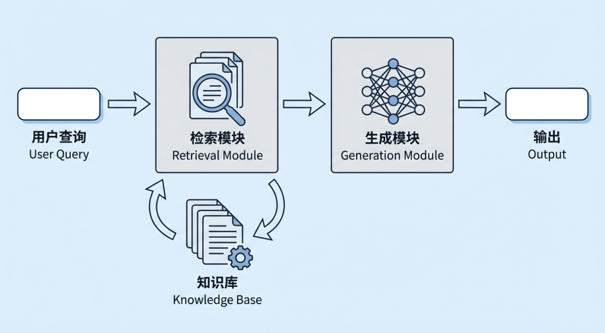

此時，一個自然的問題出現了：如果大型模型已經能夠「直接回答問題」，為什麼還要增加一個叫做檢索增強生成的環節？尤其是現在上下文視窗越來越大，似乎直接把所有相關材料交給模型就能解決大部分需求。

真正的差異在於，「能夠產生答案」和「能夠在真實業務環境中持續、穩定、可控地產生正確答案」是完全不同的兩回事。如果你只依賴模型的參數記憶，或者只是將大量文件倒入長上下文中，在企業使用中至少會出現三個典型問題。

1. 成本和效率問題：
   即使上下文視窗不斷擴大，一次性將所有文件倒入上下文的想法在實際系統中仍然不切實際。核心矛盾體現在兩個方面：
2. 推理成本與上下文長度呈強正相關。上下文越長，推理成本上升越快，幾乎是線性的，有時甚至是超線性的。對於單次呼叫，8K token 和 200K token 的價格和延遲範圍完全不同，長上下文的成本門檻要高得多。

   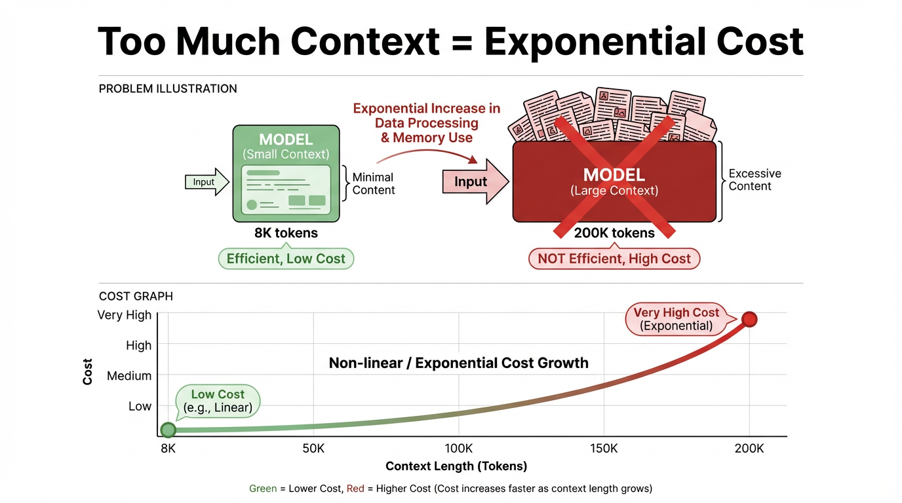

   > 在語義上，上下文是模型在回答問題時「參考」的背景資訊和對話歷史。在技術上，它是一次推理中輸入給模型的全部 token 序列，包括系統和使用者指令、訊息歷史和檢索到的段落。
   >
   > 「上下文視窗」是該輸入的容量限制。在目前主流的大型模型架構中（如 Transformer），這些 token 在每一層都參與注意力計算。一旦視窗變長、token 數量增加，計算量和成本會以倍增的方式上升，甚至接近指數成長。

3. 大量計算被浪費。大多數任務只需要極少量與當前問題高度相關的資訊。將整個文件集塞入上下文會造成嚴重的閒置和計算浪費，降低系統吞吐量，拖慢回應速度，最終損害使用者體驗。
4. 注意力和聚焦問題：
   大型模型可能能夠「覆蓋」超長上下文，但無法以同等品質使用每個段落。一旦上下文長度超過某個閾值，模型就開始出現明顯的注意力偏差：
5. 注意力衰減：模型對上下文早期和中段部分的注意力逐漸減弱，更傾向於依賴後面讀到的文字，因此早期關鍵資訊可能被有效忽略。
6. 資訊干擾：模型很容易被上下文中不相關、重複甚至矛盾的資訊帶偏。最終答案可能聽起來邏輯連貫，但仍然偏離了核心問題，使得準確性難以保證。
   沒有檢索階段來過濾和排序相關性，上下文越長，就越難讓答案聚焦於真正關鍵的證據。長上下文的優勢可能被資訊干擾完全抵消。
7. 知識新鮮度和可控性問題：
   如果所有知識都完全儲存在模型參數中，或手動複製到提示詞中，會出現兩個不可避免的缺陷：
8. 知識更新困難：一旦知識發生變化（如政策變更、產品迭代或價格更新），你要麼需要重新訓練或微調模型（成本高且速度慢），要麼手動維護提示詞模板（同樣成本高且容易出錯）。
9. 可追溯性差：當模型回答時，往往難以從黑盒參數或長提示詞中定位確切的證據來源。這使得合規審計、風險說明等需要明確決策依據的任務變得極為困難。

在這些實際約束下，RAG 的優勢就變得更加清晰。其核心方法是在生成之前定位相關且可靠的資訊，讓模型僅從必要的知識中回答。知識可以獨立儲存在外部知識庫中，便於更新和管理。同時，生成的結果可以包含引用來源，提高可解釋性和可信度。即使未來上下文視窗繼續增長，RAG 仍然能以相對較低的成本實現高效的知識管理和使用，支援流程可觀察、行為可追溯的企業級知識應用。

從企業需求的角度來看，與僅依賴內部參數的傳統 LLM 相比，RAG 主要解決了以下實際部署問題：

1. 新鮮度：
   傳統模型通常不知道訓練截止日期之後出現的新法規、新產品或新工作流程，但 RAG 可以直接讀取最新的政策文件、業務資料庫和知識庫。無需頻繁重新訓練，答案就能與最新業務狀態保持同步。
2. 專業化：
   在醫療、化工、金融等垂直領域，通用模型往往理解不夠深入、表達不夠精確。連接企業自有的領域文件和行業標準後，答案可以基於權威素材，更貼近實際業務實踐。
3. 幻覺問題：
   透過要求答案必須基於檢索到的段落並提供引用，系統可以在機制層面減少無根據的編造，讓「聽起來正確」更接近「實際上正確」。
4. 可解釋性和可審計性：
   純參數模型往往無法回答「這個結論是從哪條規則推匯出來的？」RAG 讓每個答案都能追溯到特定的政策條款、業務文件或歷史案例。這幫助業務人員檢查和修正答案，也為審計、風險和合規團隊提供了所需的可追溯性。
5. 計算成本和資源效率：
   讓模型將所有企業知識記憶在參數中通常意味著需要更大的模型和更高的推理成本。RAG 將大部分知識儲存在模型外部的向量儲存和文件儲存中，按需檢索，使企業即使使用較小的模型和有限的計算資源也能獲得更廣的覆蓋範圍和更精確的細節。

因此，對於想在真實業務場景中長期、穩定、可控地使用大型模型的企業來說，RAG 不是一個可選的增強功能。它幾乎是建構高品質企業知識應用系統的必備基礎技術。

# 2. RAG 是什麼

RAG 的核心理念——檢索增強生成——是讓大型模型在回答問題時，不僅使用訓練時學到的靜態知識，還使用在執行時從外部知識庫中提取的最新且可靠的資訊。

在典型的 RAG 系統中，使用者的問題不會直接發送給大型模型。相反，一個檢索模組先從企業知識庫中找到最相關的文件段落，然後將這些段落與原始問題組合成一個完整的上下文，最後交給模型生成答案。這種「先檢索，後生成」的模式讓模型能夠基於真實的參考資料進行推理，而不是僅僅從參數記憶中猜測。我們來看一個典型案例：

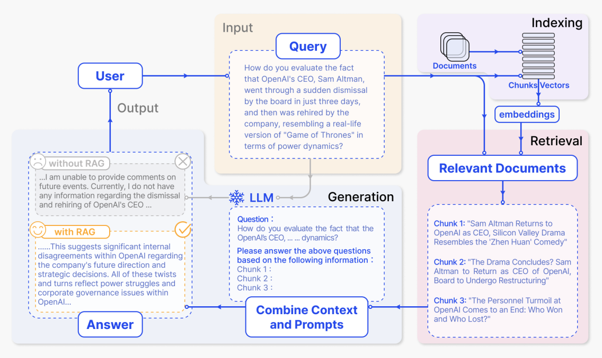

1. 索引階段

   在索引階段，系統首先處理原始素材，如企業內部文件、網頁和報告。它將它們切分為更小的語義區塊，然後使用嵌入模型為每個區塊生成向量表示，並建立索引。之後，當使用者問題到達時，系統可以在向量空間中快速找到語義最相似的區塊。

   在圖中，這對應右上角紫色的「Indexing」區域。從「Documents」經過「Chunks / Vectors」到「embeddings」的路徑顯示了文件被切分、轉換為向量並寫入索引的過程。更具體地：

   - 文件被劃分為一組語義連貫的區塊，每個區塊可能對應一段新聞報導、解釋或分析。
   - 每個區塊由嵌入模型轉換為高維向量並儲存在向量索引中。
   - 該索引支援後續的基於相似度的檢索，為系統在回答問題時準備了一個可查詢的知識庫。

2. 檢索階段加上從檢索結果生成答案

   使用者提出問題後，系統先從索引中檢索相關內容，然後將問題和檢索到的文字一起發送給大型模型生成答案。在圖中，從上到下、從右到左的關鍵區域恰好對應這個完整流程。

   (1) 使用者輸入問題：黃色的 Input - Query 區域

   > 「你怎麼評價 OpenAI 的 CEO Sam Altman 在短短三天內經歷了被董事會突然解僱，然後又被公司重新聘用，這場權力鬥爭宛如真人版《權力遊戲》？」
   >
   > 「How do you evaluate the fact that OpenAI CEO Sam Altman was suddenly dismissed by the board and then rehired by the company just three days later, making the power struggle resemble a real-life version of Game of Thrones?」

   這大段文字是圖中「Query」框的內容，對應使用者的自然語言問題。系統將該問題向量化，並用它在上方的索引中搜尋相關的文件區塊。

   (2) 檢索到的相關文件：右下角粉色的 Relevant Documents 區域

   檢索後，系統取得了幾個與問題最相關的文件區塊。在圖中，它們顯示為三個區塊：

   > 「Sam Altman 回歸 OpenAI 擔任 CEO，矽谷大戲宛如《甄嬛傳》」
   > 「Sam Altman returns as OpenAI CEO, and this Silicon Valley drama resembles a court-intrigue comedy.」
   >
   > 「大戲落幕？Sam Altman 將回任 OpenAI 執行長，董事會將重組」
   > 「Is the drama ending? Sam Altman will return as CEO of OpenAI, while the board will be restructured.」
   >
   > 「OpenAI 人事動盪落幕：誰贏了，誰輸了？」
   > 「OpenAI's personnel turmoil comes to an end: who won and who lost?」

   (3) 組合提示詞並生成答案：藍色的 LLM / Combine Context and Prompts 區域

   系統接著將原始使用者問題和檢索到的區塊組合成一個完整的提示詞並發送給模型。圖中下方的虛線框顯示了一個提示詞範例：

   > 「問題：
   > 你怎麼評價 OpenAI CEO ... 權力鬥爭？
   >
   > 請根據以下資訊回答上述問題：
   > 區塊 1：
   > 區塊 2：
   > 區塊 3：」
   >
   > 「Question:
   > How do you evaluate the power struggle in the OpenAI CEO incident?
   >
   > Please answer the above question based on the information below:
   > Chunk 1:
   > Chunk 2:
   > Chunk 3:」

   (4) 有無 RAG 的答案對比：左下角灰色和黃色的 Output - Answer 區域

   最後，模型根據提供的資訊生成答案。圖中還比較了有無 RAG 的輸出。沒有 RAG 時，模型沒有外部素材，只能給出一個模糊的回應，對應灰色框：

   > 「...我無法對未來事件發表評論。目前我沒有關於 OpenAI CEO 被解僱和重新聘用的任何資訊...」

   有 RAG 時，模型可以使用檢索到的新聞和分析產出更具資訊量的答案，對應黃色框：

   > 「...這表明 OpenAI 內部在公司未來方向和戰略決策方面存在重大分歧。所有這些曲折都反映了 OpenAI 內部的權力鬥爭和公司治理問題...」

上面的範例展示了典型 RAG 系統的完整流程，幫助我們理解其核心階段和資訊如何在其中流動。但許多重要的技術細節仍處於黑盒之中：向量匹配究竟是如何進行的？提示詞應該如何組織才能讓模型更有效地使用檢索到的內容？這些細節在很大程度上決定了 RAG 的實際品質。接下來，我們將深入 RAG 的內部機制，從向量化原理和相似度計算到提示詞工程，一步步拆解。

# 3. RAG 的運作原理

我們可以透過一個簡單的問答範例來拆解，該範例建立在一個關於「蘋果」的知識庫上。

## 3.1 文件向量化階段

假設我們有一個簡化的知識庫，包含以下三段文件：

1. 段落 A：蘋果公司（Apple Inc.）由 Steve Jobs、Steve Wozniak 和 Ronald Wayne 於 1976 年 4 月 1 日創立，總部位於加州庫比蒂諾。
2. 段落 B：蘋果是一種富含維生素 C 和膳食纖維的水果，有助於消化和免疫系統健康。
3. 段落 C：蘋果公司於 2007 年推出了第一代 iPhone，從根本上改變了智慧型手機產業。

當我們使用嵌入模型（如 OpenAI 的 `text-embedding-ada-002` 或開源的 BGE 模型）處理這些文件時，每段文字都會被轉換為一個高維向量，通常為 768、1024 或 1536 維。

> 向量本質上是一個由許多數值組成的陣列。每個維度對應文字的一個語義特徵。例如，「貓」的向量可能包含與哺乳動物、家庭寵物和毛茸茸相關的維度。最終的數值組合捕捉了文字的語義含義，使電腦能夠「理解」文字之間的關係。

簡化的範例，實際向量維度要高得多：

- 段落 A 的向量（關於蘋果公司創立）：`[0.85, -0.23, 0.41, -0.56, 0.12, 0.78, ...]`
- 段落 B 的向量（關於蘋果這種水果）：`[-0.12, 0.95, -0.34, 0.67, -0.89, 0.05, ...]`
- 段落 C 的向量（關於 iPhone 發布）：`[0.79, -0.18, 0.52, -0.61, 0.23, 0.81, ...]`

這些向量接下來需要儲存在向量資料庫中（如 Pinecone、Weaviate 或 FAISS），以便後續的檢索和召回。

> 資料庫是一個以結構化方式儲存和管理資料的系統，實現有序儲存和高效檢索。常見的例子包括通訊錄和電商商品目錄。
>
> 向量資料庫是一種特殊類型的資料庫。與儲存文字、表格等普通資料結構的傳統資料庫不同，向量資料庫專門設計用來儲存向量（即高維數值陣列），並針對 AI 場景中的相似度搜尋進行了最佳化。

## 3.2 使用者查詢、檢索與回應階段

知識庫完成向量化並儲存後，RAG 系統就可以支援即時的使用者查詢。當使用者提出問題時，系統執行一個連續的流程：先將問題轉換為向量，然後透過相似度計算從知識庫中檢索最相關的資訊，最後以這些段落為基礎生成答案。我們可以用三個具體的查詢來說明這個過程。

### 查詢 1：「蘋果公司是什麼時候成立的？」

在查詢向量化階段，問題被嵌入模型轉換為語義向量，例如 `[0.82, -0.21, 0.38, -0.58, 0.15, 0.76, ...]`。這個數值模式與儲存的段落 A（關於公司創立的那個）的向量高度相似。

系統接著執行相似度檢索（Top-K，K = 2），透過計算查詢向量與知識庫中所有文件向量的餘弦相似度。結果如下：

- 與段落 A（創立段落）的相似度：0.97，高度相關
- 與段落 C（iPhone 發布段落）的相似度：0.88，相關（因為也與公司有關）
- 與段落 B（水果營養段落）的相似度：0.12，幾乎不相關

> Top-K 是向量檢索中常見的選擇策略。意思是將所有匹配結果按相似度從高到低排序，保留前 K 個結果。K = 2 表示系統只保留相似度最高的兩個文件向量，過濾掉排名較低的，所以下一階段只從兩個最相關的文件段落生成答案。

透過相似度過濾的結果稱為召回結果。系統返回 Top-2 段落作為證據：

1. 段落 A，相似度 0.97：「蘋果公司（Apple Inc.）由 Steve Jobs、Steve Wozniak 和 Ronald Wayne 於 1976 年 4 月 1 日創立，總部位於加州庫比蒂諾。」
2. 段落 C，相似度 0.88：「蘋果公司於 2007 年推出了第一代 iPhone，從根本上改變了智慧型手機產業。」

在答案生成階段，系統透過將召回內容放入參考資訊區段並與系統提示詞一起發送，建立一個完整的結構化輸入：

```text
[系統提示詞]
你是一個專業的問答助手。請嚴格按照使用者提供的「參考資訊」來回答問題。
如果參考資訊中包含答案，請直接基於它回答。
如果參考資訊中不包含答案，請明確告訴使用者「根據目前可用的資料無法回答該問題」，不要編造資訊。
請說明你的答案是基於哪個資訊點。

[檢索到的上下文]
蘋果公司（Apple Inc.）由 Steve Jobs、Steve Wozniak 和 Ronald Wayne 於 1976 年 4 月 1 日創立，總部位於加州庫比蒂諾。
蘋果公司於 2007 年推出了第一代 iPhone，從根本上改變了智慧型手機產業。

[使用者查詢]
蘋果公司是什麼時候成立的？
```

接收到這個結構化輸入後，LLM 遵循系統指令，將檢索到的上下文視為唯一可信的回答來源。其最終回應如下：

> 根據提供的參考資訊，蘋果公司成立於 1976 年 4 月 1 日。[依據：資訊 1]

### 查詢 2：「吃蘋果有什麼好處？」

在查詢向量化階段，這個問題被轉換為語義向量，如 `[-0.08, 0.92, -0.31, 0.71, -0.85, 0.08, ...]`。其數值模式與儲存的段落 B（關於蘋果營養的那個）高度相似。

系統再次執行 Top-K 相似度檢索（K = 2），計算餘弦相似度：

- 與段落 B（水果營養）的相似度：0.95，高度相關
- 與段落 C（iPhone 發布）的相似度：0.18，幾乎不相關
- 與段落 A（公司創立）的相似度：0.15，幾乎不相關

系統返回 Top-2 段落作為證據：

1. 段落 B，相似度 0.95：「蘋果是一種富含維生素 C 和膳食纖維的水果，有助於消化和免疫系統健康。」
2. 段落 C，相似度 0.18：「蘋果公司於 2007 年推出了第一代 iPhone，從根本上改變了智慧型手機產業。」這只是弱相關，在實踐中通常會被閾值過濾。

完整的結構化輸入如下：

```text
[系統提示詞]
你是一個專業的問答助手。請嚴格按照使用者提供的「參考資訊」來回答問題。
如果參考資訊中包含答案，請直接基於它回答。
如果參考資訊中不包含答案，請明確告訴使用者「根據目前可用的資料無法回答該問題」，不要編造資訊。
請說明你的答案是基於哪個資訊點。

[檢索到的上下文]
蘋果是一種富含維生素 C 和膳食纖維的水果，有助於消化和免疫系統健康。
蘋果公司於 2007 年推出了第一代 iPhone，從根本上改變了智慧型手機產業。

[使用者查詢]
吃蘋果有什麼好處？
```

其最終回應如下：

> 根據提供的參考資訊，蘋果富含維生素 C 和膳食纖維，吃蘋果有助於消化和免疫系統健康。[依據：資訊 1]

### 查詢 3：「今天天氣怎麼樣？」

在查詢向量化階段，這個問題變成了一個與天氣和氣象相關的語義向量，例如 `[0.10, -0.05, 0.30, -0.12, 0.21, 0.08, ...]`。在語義空間中，這個向量與所有關於蘋果的文件向量（無論是公司還是水果）都相距甚遠，因此沒有顯著的相似性。

系統再次執行 Top-K 檢索（K = 2）。由於問題主題與知識庫無關，整體相似度分數都非常低：

- 與段落 B（水果營養）的相似度：0.18，極低
- 與段落 C（iPhone 發布）的相似度：0.10，幾乎不相關
- 與段落 A（公司創立）的相似度：0.08，幾乎不相關

Top-K 仍然返回排名最高的 K 個結果，但在這種情況下這些結果不提供有效的證據。在實踐中，系統通常會設定一個最低相似度閾值，直接返回空召回（即無有效結果），以減少不相關的干擾。

返回的兩個段落仍然是：

1. 段落 B，相似度 0.18：「蘋果是一種富含維生素 C 和膳食纖維的水果，有助於消化和免疫系統健康。」
2. 段落 C，相似度 0.10：「蘋果公司於 2007 年推出了第一代 iPhone，從根本上改變了智慧型手機產業。」

完整的輸入如下：

```text
[系統提示詞]
你是一個專業的問答助手。請嚴格按照使用者提供的「參考資訊」來回答問題。
如果參考資訊中包含答案，請直接基於它回答。
如果參考資訊中不包含答案，請明確告訴使用者「根據目前可用的資料無法回答該問題」，不要編造資訊。
請說明你的答案是基於哪個資訊點。

[檢索到的上下文]
蘋果是一種富含維生素 C 和膳食纖維的水果，有助於消化和免疫系統健康。
蘋果公司於 2007 年推出了第一代 iPhone，從根本上改變了智慧型手機產業。

[使用者查詢]
今天天氣怎麼樣？
```

LLM 會先判斷參考資訊中是否包含直接的天氣或即時氣象資訊。確認不包含後，它會遵循指令回答無法回答：

> 目前可用的資料無法回答「今天天氣怎麼樣？」這個問題，因為參考資訊只包含與蘋果、水果營養和蘋果公司產品相關的內容，不包含天氣資訊或即時氣象資料。[依據：檢索到的上下文中不存在天氣相關資訊]

從這三個範例中，我們可以看出 RAG 對話階段的關鍵。系統提示詞定義了 LLM 的角色和回應規則，檢索到的證據提供了具體且可信的素材，使用者的問題定義了任務目標。這種結構化輸入模式正是 RAG 能有效引導和約束一個可能產生幻覺的 LLM，將其轉變為一個能產生穩定可靠答案的系統的關鍵。它確保模型被用於理解和組織既有資訊，而不是編造沒有依據的資訊。

# 4. RAG 的演進

RAG 並非起源於大型模型時代。更早的研究中已經包含了相同想法的雛形。從歷史角度來看，RAG 的出現源於對傳統 LLM 局限性的認識。早期的大型語言模型主要依賴預訓練資料，而這些資料在訓練完成後就固定了。例如，GPT-3 等模型的知識截止日期與訓練資料的收集時間相關，無法獲取後續的知識。針對特定領域重新訓練或微調 LLM 也需要大量資源和專業知識，成本高且難以快速迭代。

RAG 的根源可以追溯到 2017 年的 DrQA 框架，該框架首次嘗試將檢索與語言模型結合。隨後在 2020 年，Dense Passage Retrieval（DPR）帶來了重大突破，使用預訓練的神經模型進行語義檢索，取代了傳統的基於詞頻的方法（如 TF-IDF 和 BM25）。2021 年，RAG 被正式提出並系統化，成為解決 LLM 知識截止和幻覺問題的標準方法。

廣義上講，RAG 的演進可以分為三個階段：

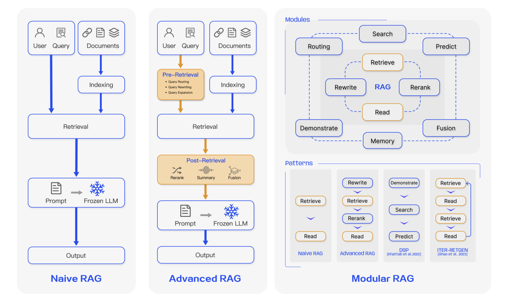

## 4.1 第一代 RAG：Naive RAG

Naive RAG 是 RAG 最基本的形式。從工程角度來看，它遵循一個非常直接的三步流程：

1. 文件預處理和索引。原始文件經過清洗、按固定長度切分為文字區塊，由嵌入模型編碼為向量，並寫入向量資料庫。
2. 基於相似度的檢索。使用者的自然語言問題被編碼為向量，系統在向量儲存上執行 Top-K 相似度搜尋。
3. 簡單的檢索增強生成。檢索到的區塊與原始問題直接拼接成一個長提示詞，發送給 LLM 進行答案生成。

這個階段的價值在於以非常低的門檻驗證了「先檢索再回答」確實有效。與僅依賴模型內部記憶相比，它已經顯著減少了知識截止問題和部分幻覺，因此在早期原型、Demo 和入門教學中扮演了重要角色。

然而，第一代 RAG 的局限性也很明顯。首先，切分策略通常比較粗糙。大多數系統只是按固定長度切分，這可能會在一個連貫的語義段落中間切斷，或者在一個區塊中混合多個主題。這會降低檢索準確性，也讓 LLM 更難理解。其次，檢索信號過於簡單。排名通常只依賴向量相似度，沒有使用更豐富的結構化線索（如關鍵字、時間戳記、來源可信度或存取許可權）。第三，檢索結果幾乎沒有治理：有雜訊的、重複的甚至矛盾的區塊可能未經處理就被塞入上下文，導致大量低價值資訊佔據了本已有限的上下文視窗。

簡而言之，第一代解決了「是否需要檢索」的問題。但在「如何更好地檢索」和「如何更合理地使用檢索到的資訊」這些問題上，它仍然處於相當初級的階段。

## 4.2 第二代 RAG：Advanced RAG

隨著 RAG 從 Demo 走向真實業務場景，對穩定性、可控性和輸出品質的要求急劇上升。第二代通常統稱為 Advanced RAG，仍然遵循「先檢索後生成」的模式，但在檢索前後引入了系統性的改進。換句話說，系統不再滿足於僅僅檢索到一些東西。它現在的目標是正確地儲存正確的東西、清楚地提出正確的問題，並謹慎地治理檢索到的上下文。

檢索前的重點在於儲存好和問得好：

- 在索引方面，切分從固定長度切分演進為語義感知切分和分層索引。系統可以沿章節、小節、段落或句子邊界進行切分，結合滑動視窗和多粒度索引結構。
- 每個文件區塊可以攜帶豐富的元資料（如來源、時間戳記、作者、主題和文件類型），為後續的過濾和排名提供更多維度。
- 在查詢方面，使用者的原始問題可以透過 Query Rewrite、Multi-Query、Sub-Query 分解和 Step-back Prompting 等技術進行改寫、擴展或分解，將模糊或口語化的使用者查詢轉換為檢索系統更容易理解的形式。

  > 1. Query Rewrite（查詢改寫）
  >
  > 核心想法是將使用者模糊的、口語化的或不標準的查詢轉換為檢索系統更容易理解的標準化表達，補充關鍵資訊並消除歧義。
  >
  > - 例如，「我要怎麼查北京明天天氣？」可能被改寫為更標準化的「查詢北京明天全天即時天氣。」
  > - 或者「推薦好電影」可能在查看使用者歷史後被改寫為「推薦 2024 年高評分懸疑電影。」
  >
  > 2. Multi-Query（多查詢）
  >
  > 系統從原始問題生成多個語義相關但角度不同的查詢，以減少遺漏並涵蓋使用者未明確表達的潛在需求。
  >
  > 3. Sub-Query（子查詢）
  >
  > 對於包含多個目標的複合問題，系統將其拆分為更小、更簡單的子查詢，讓檢索可以精確匹配每個需求。
  >
  > 4. Step-back Prompting（後退提示）
  >
  > 系統先生成一個更抽象、更高層級的問題，然後用它來引導檢索方向，減少因原始問題過於聚焦細節而造成的偏差。

檢索後的重點在於治理檢索到的內容：

- 專門的重排模型甚至 LLM 可以對候選文件進行精細重排，使最重要和最相關的內容優先進入上下文。
  > 重排模型是資訊檢索管線中的關鍵元件。它對召回階段返回的候選結果進行第二階段排名，使用更強的語義理解（通常基於 Transformer 架構）來修正第一階段的語義排名錯誤，將最符合使用者需求的結果進一步提前。
- 檢索到的段落可以被過濾、去重和壓縮，移除明顯不相關或高度重複的區塊，減少長上下文系統忽略中間有用資訊的傾向。
- 必要時，可以對模型進行輕微微調，讓 LLM 更傾向於從檢索證據中回答並包含明確的引用或來源。

總體而言，Advanced RAG 不再只關注是否需要檢索或能否檢索到東西。它關注的是三個更大的挑戰：能否精確定位真正關鍵的段落，交給大型模型的上下文是否簡潔、結構良好且易於高效使用，以及整個系統在面對雜訊、衝突或多源資訊需求時是否保持穩定可靠。

大量實驗和工程證據表明，Advanced RAG 在答案準確性、幻覺抑制、系統穩健性和可解釋性方面顯著優於 Naive RAG。這就是為什麼它逐漸取代了傳統的基本方法，成為目前建構 RAG 系統的主流工業範式。

## 4.3 第三代 RAG：Modular RAG

在複雜的企業應用中，需求往往跨越多個領域。在這些情況下，簡單的檢索、重排和生成的線性流程往往不夠：

1. 同一個系統可能需要同時支援簡單的 FAQ、長報告生成、程式碼檢索和資料庫呼叫。
2. 它可能需要同時連接向量儲存、全文檢索、關聯式資料庫、知識圖譜和外部搜尋引擎。
3. 它可能需要在多輪中保留使用者偏好和歷史決策，同時應用合規檢查和答案追溯。

在這個背景下，RAG 開始向模組化系統形態演進。Modular RAG 不再被視為一個固定的管線。它被視為一組可插拔、可替換、可組合的功能模組，可以根據需要進行編排。典型的模組包括：

1. 查詢理解與路由
   此模組處理意圖識別、問題改寫、子任務分解和路徑選擇。它決定一個請求應主要依賴內部知識、外部檢索還是特定的工具或資料庫。
2. 多源檢索與融合
   此模組同時連接向量資料庫、全文搜尋、結構化資料庫和知識圖譜，查詢它們並將結果合併和重排為一個統一的證據集。
3. 記憶與個人化
   此模組維護長期的使用者畫像、短期的對話記憶和領域知識快取，使系統能夠持續積累和使用歷史資訊。
4. 任務適配與治理
   此模組為不同任務載入不同的適配器，約束輸出格式、語調和風格，並透過事實核查、風險過濾和引用對齊來治理輸出。

簡而言之，傳統 RAG 通常在一次檢索加一次生成後就結束了。Modular RAG 打破了這種單流程模式。如果系統在生成過程中發現資訊仍然不足，它可以主動觸發新的檢索輪次，甚至在檢索和生成之間多次來回以完成更複雜的任務。

更進一步，模型可以學會自己做決策：在信心高時直接從內部知識或短上下文回答，只有在不確定性高時才啟動檢索或外部工具呼叫。這在保持品質的同時提高了效率並節省了資源。對於嚴重欠明確或不完整的查詢，模型甚至可以先生成一個假設性的中間答案或草稿文件，然後用它作為進一步檢索的線索，逐步接近可靠來源。

在這個階段，RAG 不再只是一個在大型模型上附加幾段參考段落的簡單元件。它正在成為企業智慧應用內部的中央知識編排層，協調多個資料來源、多個工具和多個任務。

# 5. 從 Demo 到企業級 RAG

從企業工程的角度來看，建構 RAG 系統不能僅限於檢索增強生成。前面的內容仍然更接近 Demo 級別的介紹。在真實業務場景中，資料通常有雜訊且格式不一致，因此需要在預處理、清洗和入庫方面投入更多精力，並且在每個關鍵節點都需要謹慎處理模型選擇。

一個完整的企業級 RAG 系統通常可以分為三個核心模組：版面分析與知識入庫、知識庫建構和基於 RAG 的問答服務。在整個技術鏈中，會出現幾個關鍵的模型選擇決策，包括嵌入模型、重排模型和 LLM。只有在每個階段做出合理的技術選擇，系統才能在整體上取得強大的效果。

1. 版面分析與本地知識文件讀取

   此模組將不同格式的本地知識資產轉換為可用於檢索的文字。輸入可能包括 PDF、TXT、HTML、Word、Excel 和 PPT 檔案，以及掃描的圖片檔案（如 PNG 和 JPG），甚至錄音檔案。

   系統需要針對每種格式進行適當的解析，對文字文件進行版面分析和結構提取，區分標題、正文、表格、頁首和頁尾，並恢復合理的閱讀順序。它對圖片檔案執行 OCR，對語音執行 ASR，最終將所有內容轉換為相對乾淨的知識文字，同時保留基本的元資料（如檔案名稱、章節、頁碼和時間戳記），以便後續的切分和索引。

2. 知識庫建構：切分、嵌入和索引

   取得清洗後的知識文字後，系統進行切分，將長文件拆分為語義連貫且長度適中的區塊（通常按段落、標題結構或滑動視窗），同時保留每個區塊的來源和元資料。

   然後使用所選的嵌入模型（如 `text-embedding-3-small`、Sentence Transformers 或 BGE）為每個區塊計算向量表示，並使用 Faiss、Milvus 或託管的向量搜尋服務等工具建立向量索引。至此，一個支援快速語義檢索的知識庫就建好了。

3. 基於 RAG 的問答：召回、重排、拼接和生成

   在線上問答階段，使用者發送查詢。系統將其嵌入為查詢向量，從向量索引中檢索一批最相似的文字區塊，這被視為粗排階段。然後可以使用重排模型（如 BGE reranker）甚至讓 LLM 作為重排器，對查詢-文件對再次評分，只保留真正最相關的 Top-K 文件作為知識上下文。

   接下來，結合精心設計的系統提示詞（如「請嚴格根據以下材料回答」），系統將使用者查詢和檢索到的文件段落拼接起來，將合併後的提示詞發送給 LLM。模型接著從這些檢索到的證據中生成最終答案，並在需要時包含引用或來源。

## 5.1 模型選擇

接下來我們重點討論模型選擇。一個完整的 RAG 系統通常涉及三個核心模型類別：嵌入模型、重排模型和大型語言模型。每個都有自己的角色，它們共同構成了從檢索到答案生成的完整路徑。嵌入模型將文字轉換為可搜尋的語義向量，重排模型精煉初始檢索結果，LLM 根據選定的知識上下文生成最終答案。

### 5.1.1 嵌入模型

在 RAG 系統中，嵌入模型的工作是將文字（如使用者查詢和知識庫內容）轉換為高維向量。語義相似的文字在向量空間中被放置得更近，使系統能夠透過相似度快速定位相關知識。因此，選擇合適的嵌入模型是建構高效能 RAG 系統最關鍵的步驟之一，因為它直接決定了召回品質。

要選擇一個強大的模型，使用系統性的基準測試會有所幫助。最廣泛使用的是 MTEB（Massive Text Embedding Benchmark）。

MTEB 為許多嵌入模型提供了統一且客觀的評估框架。透過八大任務類別和 56 個資料集，它評估了檢索、聚類、分類、重排、文字匹配、語義相似度等多個方面的效能。一個模型的整體 MTEB 分數反映了其向量表示的通用性和穩健性，可以作為模型選擇的重要參考。最新排名可以在 Hugging Face MTEB 排行榜上查詢：

[HuggingFace MTEB Leaderboard](https://huggingface.co/spaces/mteb/leaderboard)

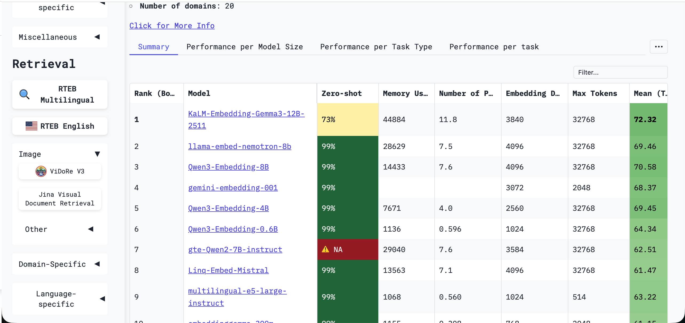

雖然排行榜上有很多模型，但你不需要掌握所有模型。在實踐中，選擇大型模型提供商打包的嵌入模型，或使用已經被許多人驗證過的雲端服務模型，通常是安全的選擇。你也可以在側邊欄按類別或語言過濾排行榜：

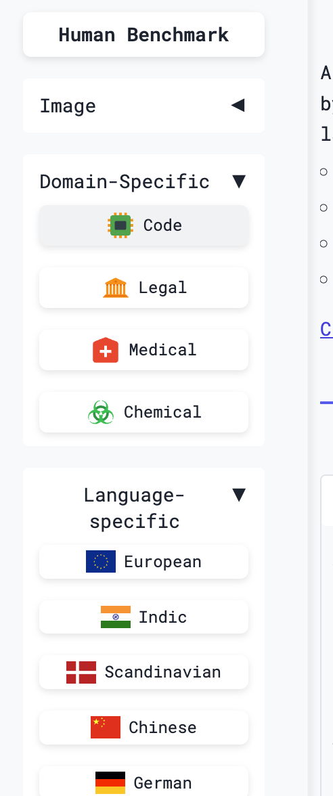

在篩選嵌入模型時，有兩個參數尤其重要，因為它們直接影響 RAG 效能：維度和上下文長度。

維度是向量輸出的維度數，如 128、768 或 1536。它大致反映了向量能表達多少語義特徵。更高維度的向量可以捕捉更豐富的語義細節和更強的區分能力。例如，一個 768 維向量可以從品種、口感、產地等數百個角度來表示「蘋果」，適合需要精確檢索的專業場景（如醫療或法律）。較低的維度則降低了計算和儲存成本，提高了檢索速度，適合對高併發和強即時性要求高的大規模通用場景。

上下文長度是嵌入模型一次能處理的最大文字長度（以 token 計）。一個英文 token 大約是 3/4 個單字，一個中文 token 大約是一個中文字。超過最大長度的部分會被截斷。這直接決定了模型是否能充分理解文字。如果因為長度太短而丟失了重要資訊，檢索準確性會急劇下降。對於短的使用者查詢和短的問答對，512 到 1024 個 token 通常足夠。對於較長的文字（如論文和報告），通常需要 2048 個 token 或更多。

以下是幾個常見嵌入模型的比較。在實踐中，你需要在成本和效能之間權衡來做出選擇。沒有普遍最好的模型，只有在你自己的使用場景中比較幾個選項後最適合的模型。

| 模型名稱 | 模型規模 | 核心優勢 | 適用場景 |
| :--- | :--- | :--- | :--- |
| OpenAI `text-embedding-3-large` | 閉源 API | MTEB 上長期領先，成熟穩定 | 追求極致效能且預算充足的雲端 API 場景 |
| `jina-embeddings-v2` | 支援最長 8K 上下文的長文字 | 透過非同步編碼設計在長文件檢索中表現強 | 文件分析、法律合規、學術檢索 |
| `multilingual-e5-large` | 大規模 | 經典的多語言選擇 | 跨語言 RAG、國際化產品、多語言支援系統 |
| `Qwen/Qwen2-Embedding-8B` | 8B 參數，最高支援 4096 自訂維度 | 前多語言 MTEB 冠軍，在長文字、多語言任務和程式碼方面表現強 | 高精度中英文 RAG、長文件分析、程式碼檢索 |
| `Qwen/Qwen2-Embedding-4B` | 4B 參數 | 效能和效率的良好平衡 | 大規模生產 RAG 系統 |
| `Qwen/Qwen2-Embedding-0.6B` | 0.6B 參數 | 適合邊緣裝置 | 資源受限、速度優先的場景 |
| `BAAI/bge-m3` | 支援混合檢索（dense + sparse + multi-vector） | 在 MIRACL 等多語言基準測試上表現強 | 需要混合檢索的複雜多語言場景 |
| `BAAI/bge-large-zh-v1.5` | 大規模 | 穩定的中文 RAG 基線，社群驗證充分 | 文件較短的純中文專案 |
| ZhipuAI `Embedding-3` | 閉源雲端 API | 支援 256 到 2048 的自訂維度 | 偏好雲端 API 的中文應用 |

### 5.1.2 重排模型

在 RAG 系統中，重排模型負責精細地重排初始檢索結果。它以使用者查詢和候選文件作為輸入，為每個查詢-文件對計算精確的相關性分數。分數越高，匹配越好。因此，在基於嵌入的召回之上加入重排模型是提高檢索精度的關鍵步驟。

對於嵌入模型，我們可以使用 MTEB 等基準測試。對於重排模型，一個有用的參考是 Agentset 的重排模型排行榜：

[Reranker Leaderboard](https://agentset.ai/rerankers)

Agentset 基準測試首先使用 FAISS 從大型文件庫中檢索 50 個最相關的候選結果，然後讓被評估的重排模型對這 50 個文件進行重排。該基準測試同時關注排名品質和延遲。在實際應用中，追求精度而忽略速度會損害使用者體驗，而追求速度而犧牲排名品質則會損害實用性。

Agentset 還引入了 ELO 評分機制。對於每個查詢，GPT-5 作為裁判，比較兩個不同重排模型的排名輸出，決定哪一個將真正相關的文件放在更合理的位置。經過大量這樣的成對比較後，贏得更多的模型獲得更高的 ELO 分數，提供了一個直觀的整體效能信號。

該基準測試還使用了兩組互補的指標：

- `nDCG@5/10`，關注相關文件是否被放在靠前的位置，因此反映了排名精度
- `Recall@5/10`，關注是否能找到所有相關文件，因此反映了覆蓋率

這些指標共同提供了重排效能的更完整畫面。

不過在實踐中，你不需要只從排行榜上選擇重排模型。工業實用性和排行榜分數並不總是一致的。一個實用的方法是從你的雲端供應商推薦的重排模型或大型模型供應商提供的預設重排 API 開始，或者測試你已經在使用的模型系列中的匹配重排模型（如 Qwen 對應的重排模型）。

### 5.1.3 LLM

經過嵌入模型的語義檢索和重排模型的精細過濾後，相關的文件段落與使用者的原始問題組合成一個提示詞。LLM 接著執行閱讀理解、資訊整合和自然語言生成，輸出一個連貫、準確且符合上下文的答案。

在實作層面，在 RAG 中使用 LLM 主要有兩種方式：

1. 私有部署的大型模型。
   這適合關心資料隱私、可控成本或深度定制的場景。主流的開源模型（如 Qwen、Llama 和 GLM）在 RAG 任務中表現良好。例如，7B 或 14B 範圍的 Qwen2.5 在保持適度資源使用的同時提供了良好的指令遵循和中文理解能力，適合本地企業部署。也可以根據特定業務需求考慮 KIMI、Minimax 和 DeepSeek 等模型。
2. 雲端 API 大型模型。
   這適合優先考慮快速上線、彈性擴展和持續模型升級的場景。OpenAI、Anthropic、Google、阿里巴巴和智譜 AI 等主要供應商都提供穩定的 API 服務。這些模型通常具有強大的語言理解和生成能力，能夠在 RAG 場景中很好地綜合答案。

選擇雲端模型時，有幾個重要考量：答案品質是否準確流暢、價格是否合理、延遲是否可接受、上下文視窗是否足夠大以容納多個檢索到的文件。在實踐中，你應該在自己的資料上比較幾個候選模型，看看哪個給出最完整和準確的答案。如果成本是考量因素，一個有用的方法是大小模型搭配：對簡單問題使用便宜的小模型，對困難情況保留昂貴的大模型。由於模型更新很快，定期重新測試候選模型也是明智的。

對於廣泛的對話和問答能力，LMSYS Chatbot Arena（現為 LMArena）是最廣泛認可的評估參考之一：

[LMSYS Chatbot Arena (LMArena)](https://lmarena.ai/)

它使用盲測的成對人類比較來排名模型。該排名提供了一個有用的初步篩選，但在實際 RAG 選擇中它應該只是一個起點。在醫療、法律和金融等專業領域，通用排行榜的排名可能與你在業務資料上的實際表現有很大差異。

LLM 選擇的最佳實踐是建立一個小但具代表性的測試集，包含 20 到 30 個典型業務問題，並透過完整的端到端 RAG 管線來評估候選模型，而不是只看孤立的模型基準測試。是否使用推理模型或非推理模型，或哪個模型大小最適合平衡品質和速度等問題，最好都透過在自己使用場景上的實際測試來回答。

## 5.2 執行框架

在實際工程實踐中，你通常不需要從零開始建構整個 RAG 系統。已經存在許多成熟的開源框架，每個在架構、模組整合和開發效率方面都有各自的優勢。企業可以根據自己的技術儲備和業務場景來選擇。

常見的框架類型包括：

**低程式碼或視覺化平台**

- [Dify](https://dify.ai)：提供直覺的視覺化介面，用於快速建構 RAG 應用，適合非技術團隊或快速原型驗證。內建多模型存取、工作流編排和提示詞管理。
- [Coze](https://www.coze.cn/)：位元組跳動推出的 AI Bot 開發平台，提供零程式碼視覺化建構。它與位元組跳動模型服務深度整合，支援外掛市場、定時任務和多通道發布，適合消費者端的助手或企業內部 Bot。
- [n8n](https://n8n.io/)：開源的節點式工作流自動化平台。在 RAG 場景中，它可以編排複雜的業務邏輯，將預處理、向量資料庫操作、模型呼叫和後續動作（如發送電子郵件或更新工單）連接成一個自動化流程。
- [RAGFlow](https://ragflow.io/)：專注於深度版面分析和知識提取，在多欄 PDF 和表格密集的複雜文件上表現良好。
- [FastGPT](https://fastgpt.io/en)：中國開源方案，整合了知識庫管理、對話編排和應用發布，中文文件豐富，適合快速部署中文 RAG 應用。

**程式碼框架和開發庫**

以下工具通常有不同的後端語言實作。你可以根據應用的技術堆疊選擇對應的語言版本。

- [LlamaIndex](https://www.llamaindex.ai/)：一個專為 RAG 設計的 Python 框架，具有豐富的連接器、索引結構和查詢引擎。其模組化設計適合深度定制的檢索策略或與許多資料來源的整合。
- [LangChain](https://www.langchain.com/)：一個通用 LLM 應用框架，RAG 只是其中一個使用場景。其優勢在於豐富的生態系統和元件覆蓋，包括對複雜 Agent 和工作流編排的支援，但學習曲線較陡。

如果團隊的技術儲備有限且速度最重要，Dify、Coze 或 FastGPT 等低程式碼平台是很好的首選。如果需要深度定制、特殊資料來源整合或精細的性能調優，LlamaIndex 和 LangChain 提供了更多靈活性。在實踐中，混合路線也很常見：先用低程式碼平台進行快速可行性驗證，然後再用程式碼框架進行生產部署和最佳化。這些框架大多也支援與主流嵌入、重排和 LLM 模型的快速整合，讓你能夠按照上面討論的模型選擇原則靈活組合。

## 5.3 效果評估

對於部署 RAG 系統的企業來說，最大的挑戰往往不是建構系統，而是調優。生產級 RAG 包含兩個不確定性的階段——檢索和生成——因此傳統的軟體測試是不夠的。這就是為什麼建構一個科學的評估體系（即 RAG 評估）如此重要。

### 5.3.1 入門範例：基於 LLM 的 RAG 評估

為了幫助建立對 RAG 評估的直覺理解，我們可以看一個基於 LLM-as-a-judge 想法的簡單自動化管線：

https://huggingface.co/learn/cookbook/rag_evaluation

該流程通常包含三個關鍵步驟：

- 首先，透過從知識庫中取樣文件並讓 LLM 生成高品質的問答對來合成評估資料集，然後按相關性和可靠性進行過濾，形成基準集。
- 其次，在測試集中的每個問題上執行 RAG 系統並收集生成的答案。
- 第三，呼叫另一個 LLM 作為裁判進行自動評分，將生成的答案與參考答案進行比較，並在準確性和完整性等維度上給出量化分數。

一個簡單的範例：

1. 問題生成。假設知識庫中有一條產品說明寫道「該裝置支援無線充電，電池容量為 5000mAh。」我們讓一個模型充當出題者，生成一個問題如「該裝置的電池容量是多少？」標準答案是「5000mAh」。
2. 問題解答。我們將這個問題發送給 RAG 系統，系統檢索相關資料並回答，例如「該裝置電池容量為 5000mAh。」
3. 評分。我們讓另一個模型充當評分者，比較問題、生成的答案和參考答案，使用提示詞如「判斷生成的答案是否正確。只輸出正確或不正確。」

透過大規模執行這個流程，我們可以計算準確率等指標。這形成了一個評估、最佳化、再評估的實用迴圈。

如果你想深入了解 RAG 評估，包括指標定義、框架使用和基準資料集，以下兩篇調查論文很有用：

- [https://arxiv.org/pdf/2504.14891](https://arxiv.org/pdf/2504.14891)，*Retrieval Augmented Generation Evaluation in the Era of Large Language Models: A Comprehensive Survey*
- [https://arxiv.org/pdf/2405.07437](https://arxiv.org/pdf/2405.07437)，*Evaluation of Retrieval-Augmented Generation: A Survey*

### 5.3.2 評估指標

RAG 評估本質上圍繞兩個問題：檢索模組能否找到正確的材料，生成模組能否從這些材料中產出高品質的答案？相應地，評估體系分為檢索評估和生成評估，並輔以 LLM-as-a-judge 評分。

#### 檢索評估：召回準確性和排名品質

檢索模組是 RAG 系統的第一道關卡。其評估關注三個維度：是否找到了正確的東西、是否找到了足夠多的、以及排名是否良好。

**基本召回品質指標**

經典的基本指標是 Recall@K、Precision@K 和 F1：

- **Recall@K** 衡量前 K 個結果中恢復的相關文件的比例。如果存在 5 個相關文件，在前 10 個中找到了 3 個，Recall@10 為 60%。這告訴我們檢索覆蓋面有多廣。
- **Precision@K** 衡量前 K 個結果中真正相關的比例。如果前 10 個中有 3 個相關、7 個不相關，Precision@10 為 30%。這反映了檢索的精確性。
- **F1** 是 Recall 和 Precision 的調和平均數，平衡了兩者。

這些指標對於快速診斷基本召回問題很有用。如果 Recall 低，說明相關文件根本沒找到。如果 Precision 低，說明檢索雜訊太高。

**排名品質指標**

找到相關文件只是第一步。更重要的是把最相關的放在前面。為此我們看 MRR、NDCG@K 和 MAP：

- **MRR（Mean Reciprocal Rank）** 衡量第一個相關文件出現的排名位置的倒數。如果第一個相關文件出現在第 3 位，倒數排名就是 1/3。MRR 特別適合一個正確答案就夠的場景。
- **NDCG@K（Normalized Discounted Cumulative Gain）** 同時考慮分級相關性和位置折扣。它不僅問一個文件是否相關，還問有多相關，並獎勵高度相關的文件出現在前面。
- **MAP（Mean Average Precision）** 對所有相關文件的位置敏感，反映了整體排名品質。

在實際工程中，一個常見的組合是 Recall@K 加上 MRR@K。例如，如果 Recall@10 是 80% 但 MRR@10 只有 0.3，說明相關文件被找到了但埋得太深，這表明重排需要改進。

必要時還可以加入 Coverage 指標來監控知識庫的覆蓋範圍，揭示系統性的盲點。

#### 生成品質評估：準確性和事實忠實度

檢索提供了原材料。下一個問題是生成模組能否從這些材料中產出高品質的答案。這裡的核心維度是答案的準確性和對檢索證據的忠實度。

**精確匹配和文字相似度**

最簡單的指標是 **EM（Exact Match）**，它要求生成的答案與參考答案完全匹配。這適合固定形式、唯一正確答案的事實問題（如日期或總部位置），但它太嚴格了，因為不同但同樣正確的表面形式可能無法匹配。

這就是為什麼基於 n-gram 重疊的指標（如 **ROUGE**、**BLEU** 和 **METEOR**）也被廣泛使用。它們透過比較生成答案與參考答案的詞彙重疊來評分。ROUGE-L 關注最長公共子序列，BLEU 來自機器翻譯並強調精確性，METEOR 則加入了同義詞和詞幹的考量。

為了克服純詞彙重疊的限制，我們還可以使用 **BERTScore** 或直接的向量相似度。這些使用預訓練的語義表示，因此能更好地容忍表面變化。

**事實忠實度和幻覺檢測**

對於 RAG 系統來說，答案與參考答案的相似度是不夠的。更重要的問題是答案是否真正基於檢索到的文件，還是它編造了沒有依據的內容。

這就是為什麼 **幻覺率** 和 **忠實度（Faithfulness）** 等指標很重要。第二個 LLM 可以充當事實核查者，逐句檢查生成的答案，判斷每個論述是否可以被檢索到的文件支援。對於醫療、法律和金融等高風險領域，這類指標尤其重要，一些企業甚至將幻覺率閾值作為生產發布標準。

#### LLM-as-a-Judge：多維度評分

每個自動化指標都有其限制。大多數表面形式的指標無法完全捕捉語義品質或整體有用性。這正是 LLM-as-a-judge 特別有價值的地方。

基本方法是將問題、檢索到的文件、系統答案和參考答案輸入一個強大的獨立模型（如 GPT-4 或 Claude），讓它跨以下維度評分：

- 問題相關性
- 資訊完整性
- 事實忠實度
- 整體正確性

LLM 裁判的優勢在於它能做出更像人類的整體判斷。當然，裁判提示詞仍然需要精心設計並與人工標註的範例進行校準，以保持評分的一致性和可靠性。

#### 建構實用的指標組合

有這麼多指標可用，團隊常常不知道該用哪些。一個實用的建議是從一個精簡的組合開始，逐步擴展：

- 對於檢索，從 Recall@K 加上 MRR@K 開始
- 對於生成，根據任務類型從 EM、ROUGE-L 和 BERTScore 中選擇一兩個基線指標
- 對於整體評估，引入一個關注相關性、完整性和忠實度的 LLM 裁判

然後透過評估、問題診斷、策略調整和再評估的迴圈來迭代。

### 5.3.3 評估框架

隨著 RAG 的快速發展，學術界和工業界都產生了許多強大的評估框架。這些框架不僅打包了常見的指標，還提供了標準化的資料集、基準測試流程和端到端的工作流程。

#### 框架的基本分類

我們可以大致將 RAG 評估框架分為三類：

- **研究框架**，專注於學術探索和精細診斷。例子包括 FiD-Light 和 Diversity Reranker。
- **基準框架**，提供標準化的測試集和工作流程，用於系統間的橫向比較。這些包括 RAGAS、ARES、RGB、MultiHop-RAG 和 CRUD-RAG 等框架。
- **工具框架**，強調工程的易用性和與開發框架的整合。例子包括 TruEra RAG Triad、LangChain Benchmarks 和 RECALL。

近年來，評估框架變得更加專業化。例如，醫學領域有 MedRAG，法律領域有 LegalBench-RAG，金融領域也有自己的專門框架。這些領域框架通常不僅提供專門的資料集，還提供專門的指標（如醫學準確性或法律引用相關性）。

在實踐中，一個好的經驗法則是：

- 如果你需要快速建立基線，從更通用的框架（如 RAGAS）開始。
- 如果你正在診斷特定問題，選擇更有針對性的框架。
- 如果你在醫學、法律、金融或其他專業領域，盡可能優先選擇領域適配的框架。
- 優先選擇維護活躍、文件完善且社群回應積極的工具。

社群中常推薦的工具包括 Ragas、Continuous Eval、TruLens-Eval、LlamaIndex 內建的評估功能、Phoenix、DeepEval、LangSmith 和 OpenAI Evals。

### 5.3.4 評估基準

評估基準的重要性往往被低估。許多團隊只用少量手寫的測試問題開始評估 RAG 系統，然後發現實際上線表現與離線印象相差甚遠。根本原因是缺乏代表性和系統性的評估資料。

一個能良好支援系統迭代的基準通常具有三個核心特徵：

- 代表性，即涵蓋高頻使用者問題、邊界情況和異常輸入
- 標準化，即問題和答案格式、難度級別和評分規則一致
- 可演進性，即基準能隨著系統能力和業務需求的演變而更新

對於大多數企業來說，由於業務場景的獨特性，最終的答案通常是建立自己的評估資料集。

- 從業務日誌中提取真實的使用者問題，按類型、頻率和難度進行取樣。
- 對於簡單情況，讓領域專家直接標註。對於更複雜的問題，先讓強大的 LLM 生成候選答案，然後由專家修訂。
- 除了答案本身，還要標註相關文件、答案類型和難度級別等元資料。
- 定期用線上發現的新困難案例更新資料集。

如果資源有限且需要快速建立基線，公開基準仍然是有用的起點。截至 2025 年，已經有許多針對通用和垂直場景的公開基準：

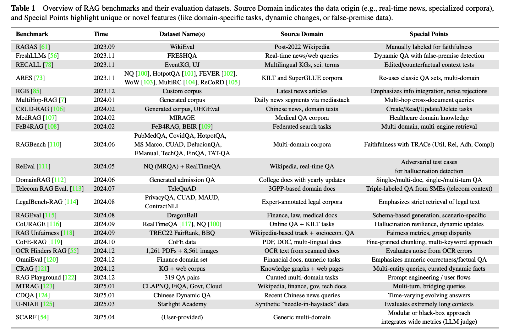

選擇時，首先要明確目標。你是要建立基線，還是在上線前驗證系統？然後檢查基準是否涵蓋你關心的場景和難度分佈。對於新聞或金融等時間敏感的領域，確保基準包含時間敏感性的測試。

在實踐中，將自己的領域內資料集與公開基準結合通常是最穩健的路徑，因為它既保持了評估與真實業務需求的貼近，又保留了一定的橫向可比性。

# 6. 深入探索：從競賽和開放教學中學習（選修）

上面的原理和基線實作已經足夠幫助你建構一個可用的原型，但距離解決生產中出現的更難的問題還有一段距離。如果你想了解更實用、經過實戰檢驗的 RAG 技術，最高效的方式之一就是研究競賽獲獎方案和優秀的開放教學。這些方案通常凝聚了強大團隊在真實場景中經過反覆嘗試後發現的最佳實踐。

以下範例具有代表性而非窮盡性。當你在實踐中遇到特定問題（如 PDF 解析、多模態檢索或低延遲最佳化）時，搜尋與該問題相關的競賽並研究獲獎團隊的技術報告和開源程式碼通常很有效。

## 6.1 語義快取：最佳化高頻查詢

Hugging Face 提供了一個基於 Chroma 向量資料庫建構的語義快取實作：

[https://huggingface.co/learn/cookbook/semantic_cache_chroma_vector_database](https://huggingface.co/learn/cookbook/semantic_cache_chroma_vector_database)

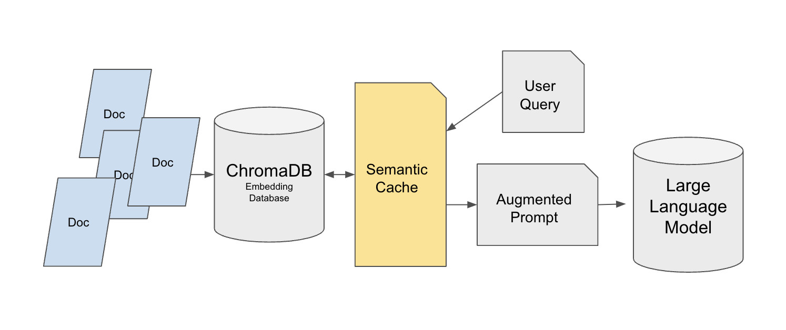

背景：大多數教學 RAG 系統都是為單使用者測試而建構的。但一旦部署到生產環境，系統可能會收到數十或數千次重複查詢，例如支援使用者反覆詢問退款流程。如果每次重複查詢仍然觸發向量檢索和 LLM 呼叫，延遲和成本會快速上升。語義快取層可以大幅減少原始資料來源的壓力，同時保持答案品質。

這個設計使用雙層檢索架構。基礎層將原始知識庫儲存在 Chroma 中，使用 MedQuad 等資料集作為範例，並為每個條目分配唯一 ID 以便精確引用。快取層建構在 FAISS 上，使用 FlatL2 索引。語義快取位於使用者查詢和 Chroma 之間，而不是直接快取 LLM 的最終答案。這個設計很重要，因為直接快取答案可能會破壞個人化的答案需求（如「用簡單的語言解釋這個」）。

快取系統使用 `all-mpnet-base-v2` SentenceTransformer 生成查詢向量，並使用歐幾里得距離（閾值為 0.35）來判斷查詢是否相似。當快取滿時（由 `max_response` 參數控制），使用 FIFO 移除最舊的條目。快取資料也可以儲存到 JSON 檔案中以供跨會話重用。

在小規模測試中，第一次查詢（如「疫苗如何運作？」）從 Chroma 取得需要 0.057 秒，而從快取提供的類似查詢只需要 0.016 秒。在大規模生產場景中，這種方法在高重複環境中可以產生 90% 到 95% 的效能最佳化，顯著降低向量儲存和 API 成本。

## 6.2 非結構化資料處理：多格式文件的統一解析

另一個 Hugging Face 教學展示了如何使用 Unstructured 函式庫建構一個完整的非結構化文件處理管線：

[https://huggingface.co/learn/cookbook/rag_with_unstructured_data](https://huggingface.co/learn/cookbook/rag_with_unstructured_data)

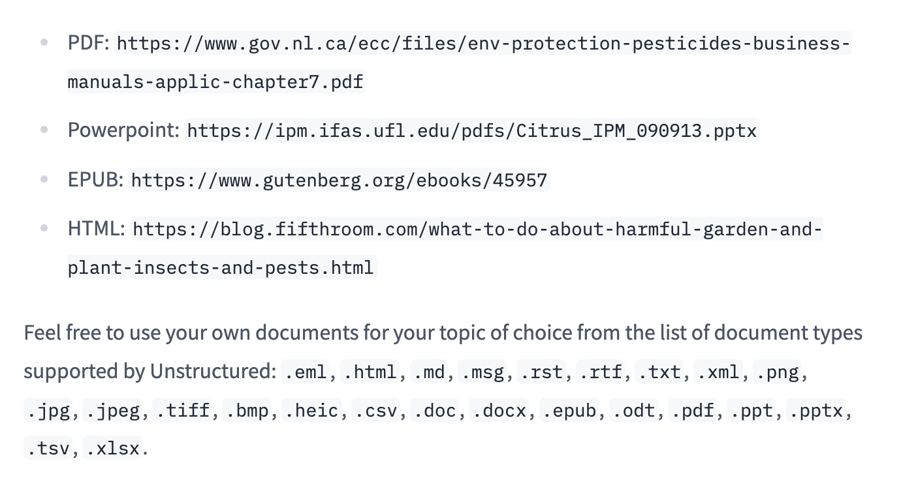

背景：在企業場景中，知識通常散布在 PDF、PowerPoint 簡報、EPUB、HTML 網頁和許多其他格式中。傳統的預處理方法要么只支援一種格式，要么在轉換過程中丟失關鍵的結構資訊（如表格和標題層級）。這使得 RAG 系統難以正確理解和檢索內容。

該方案首先下載多格式的測試文件，例如包含許多表格的加拿大農藥手冊 PDF 和包含圖表和多層標題的佛羅里達大學柑橘 IPM PowerPoint 檔案。然後使用 Unstructured 的 Local Runner 進行解析。設定包括處理器設定、可選使用 API 分割模式以獲得更強 OCR 的分割設定，以及定義輸入路徑的本地設定。解析後的文件被轉換為包含型別化元素（如正文、標題和表格）的 JSON。

系統接著使用 `chunk_by_title`，設定最大長度為 512 個字元，並合併連續短於 200 個字元的片段以保持語義連貫性。在轉換為 LangChain Document 物件時，複雜的元資料欄位被過濾以適應 Chroma。向量階段使用 `BAAI/bge-base-en-v1.5` 嵌入模型，搭配 4 位元量化的 `Llama-3-8B-Instruct` 和 LangChain RetrievalQA 鏈來建構完整的 RAG 系統。

產生的系統可以準確處理多格式文件。對於「蚜蟲是害蟲嗎？」等問題，它可以從解析後的文件中提取關鍵事實並生成基於相關材料的答案。這對於需要處理多種文件類型的企業知識庫特別有用。

## 6.3 企業文件問答：高精度和可追溯的 RAG

Enterprise RAG Challenge 的冠軍方案展示了如何在嚴格的時間和精度要求下建構生產級 RAG 系統：

- [https://abdullin.com/ilya/how-to-build-best-rag/](https://abdullin.com/ilya/how-to-build-best-rag/)
- [https://hustyichi.github.io/2025/07/03/rag-complete/](https://hustyichi.github.io/2025/07/03/rag-complete/)

背景：參賽者需要在 2.5 小時內解析 100 份真實企業年報 PDF，每份報告最多 1000 頁，包含複雜的財務表格、多欄版面和圖表。解析完成後，系統需要回答 100 個精確的業務問題，答案類型明確（如是/否、公司名稱、精確數值指標或高管職稱），並且必須引用頁碼作為證據。

冠軍團隊選擇了 IBM 開源的 Docling 作為 PDF 解析器，因為它在複雜表格和多欄文字上表現最佳。他們改進了 Docling 的程式碼，使其能夠輸出帶有元資料的 JSON 和 Markdown-plus-HTML，特別改進了表格解析。為了加速處理，他們租用了 RTX 4090 GPU，在 40 分鐘內完成了 100 份報告的解析。

文字切分使用 300 個 token 的區塊和 50 個 token 的重疊，並採用遞迴切分以保持語義連貫性。為避免跨公司污染，每家公司都有自己獨立的 FAISS 向量儲存，使用 `IndexFlatIP` 索引。檢索分三個階段：透過向量檢索 Top-30 區塊，按父頁面去重（因為多個區塊可能來自同一頁面），然後用 GPT-4o-mini 對頁面進行重排。最終排名混合了向量檢索和 LLM 重排分數，權重比例為 0.3 比 0.7。

生成階段針對不同的答案類型使用不同的提示詞模板。對於數值型問題（如年收入），系統使用五步分析流程確保指標匹配、單位一致和交叉核對。輸出結構化地包含分析過程和頁碼引用以供追溯。

該系統贏得了兩個獎項並在排行榜上排名第一。一個重要的觀察是，即使是較小的模型（如 Llama 8B）也優於 80% 以上的參賽者，而 Llama 3.3 70B 的表現接近 GPT-4o-mini，這表明良好的系統設計可以成功平衡準確性、效率和成本。

## 6.4 AIOps 場景：文字和圖片混合資料的智慧處理

AIOps RAG 競賽中的 EasyRAG 專案專注於運維場景的問答：

[http://blog.csdn.net/hustyichi/article/details/143323746](http://blog.csdn.net/hustyichi/article/details/143323746)

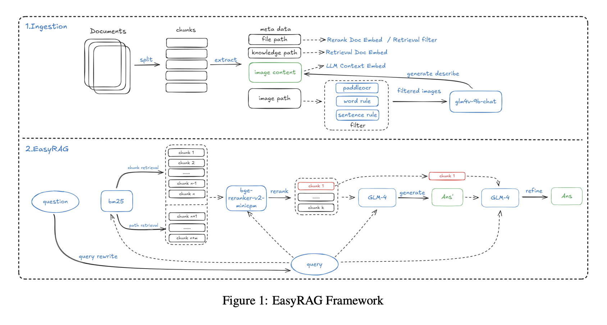

背景：運維工程師經常需要閱讀技術文件，這些文件不僅包含文字，還包括監控圖表、系統架構圖和性能曲線。例如，在診斷系統問題時，「當 CPU 使用率超過 80% 時我該怎麼辦？」的答案可能散布在文字描述和監控圖之間。傳統的純文字 RAG 無法理解圖表趨勢和數值，因此答案不完整。

索引階段使用了改進的 SentenceSplitter，設定 1024 個 token 的區塊和 200 個 token 的重疊。一個關鍵創新是為每個區塊添加了知識庫路徑和檔案路徑等元資料，這將召回率提高了 2%。對於圖片資料，系統先使用 PaddleOCR 從圖表和截圖中提取文字，然後使用多模態模型 GLM-4V-9B 生成圖片的自然語言描述（例如描述下午 CPU 使用率曲線峰值達到 90%）。OCR 文字和圖片描述隨後被一起索引。

檢索使用雙路 BM25 加向量的策略進行廣泛召回。BM25 涵蓋區塊檢索和路徑檢索，幫助按檔案路徑過濾不相關的文件，而向量檢索使用 `gte-Qwen2-7B-instruct`。重排使用 `bge-reranker-v2-minicpm-layerwise`，28 層設定在實驗中表現最佳。

答案生成使用兩步策略：先從 Top-6 文件生成草稿以最大化資訊覆蓋，然後用 Top-1 最相關文件最佳化答案以突出核心答案。

為了處理長文字場景（如數百頁的完整運維手冊），系統還實作了基於 BM25 的上下文壓縮，將文件切分為句子，對句子與查詢的相似度進行評分，只拼接最相關的句子。在 50% 壓縮率下，該方法在僅 7.7 秒內達到了 86.48% 的準確率，優於 LLMLingua 等工具。

## 6.5 多源資料融合：結構化與非結構化知識的協作

KDD Cup 2024 Meta RAG 挑戰賽的獲獎方案展示了如何整合非結構化的網頁內容和結構化的知識圖譜：

- [https://blog.csdn.net/m0_59164520/article/details/143694213](https://blog.csdn.net/m0_59164520/article/details/143694213)
- https://arxiv.org/pdf/2410.00005

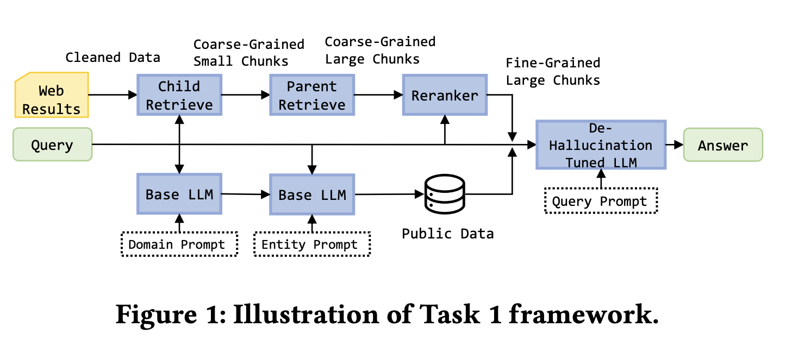

背景：任務 1 要求從五個網頁進行檢索摘要。任務 2 新增了一個模擬 API 代表結構化知識圖譜，可以直接存取電影資料庫和實體關係等內容。任務 3 提高了難度，使用五十個網頁加上模擬 API 來回答更複雜的查詢，例如識別諾蘭執導的票房超過 5 億美元的電影。每個查詢必須在 30 秒內完成。

對於任務 1，獲獎團隊建構了一個精細的網頁處理管線。他們使用 BeautifulSoup 提取頁面文字，使用 ParentDocumentRetriever 管理父子區塊關係，使用 200 token 的子區塊進行檢索，使用 500 到 2000 token 的父區塊進行生成。嵌入模型是 `bge-base-en-v1.5`，向量儲存是 Chroma，重排使用 `bge-reranker-v2-m3`。團隊還從公開資料集補充了電影和金融資料，並使用 LoRA 在包含無效問題和參考答案的訓練資料上微調了 `Llama-3-8B-instruct`。

對於任務 2 和 3，關鍵創新是優先使用知識圖譜。系統定義了標準化的 API 呼叫（如 `get_person` 和 `get_movie`），支援過濾和排序。它首先呼叫知識圖譜 API，只有在圖譜結果缺失或無效時才回退到網頁檢索。這同時提高了速度和答案準確性。

由於系統優先使用知識圖譜並使用結構化的輸出格式，幻覺明顯減少。如果圖譜可以直接提供確定性答案，系統直接返回而不需要生成步驟。如果需要網頁檢索，答案必須遵循嚴格的引用和逐步推理規則。

該方案在三個任務中都獲得了第一名。主要啟示是，在包含結構化和非結構化資料的企業場景中，檢索策略應根據資料類型設計：優先使用確定性的結構化資料，將非結構化來源作為補充。

在這些實際案例中，幾個共同的原則反覆出現：

- 根據業務場景選擇快取、檢索和生成策略
- 為不同格式和模態設計專門的解析和索引路徑
- 將混合檢索加重排視為標準配置
- 使用任務特定的提示詞和結構化輸出來提高準確性和可追溯性

這些來自真實競賽和開放專案的經驗教訓是建構更強大企業 RAG 系統時的寶貴參考。

# 7. 廣泛探索：RAG 的未來演進（選修）

在學習了 RAG 的實用技能和最佳化方法後，你已經可以在具體場景中提升系統效能。但如果想要更廣泛地把握 RAG 的發展方向，僅了解局部的工程技巧是不夠的。我們還需要關注更廣泛的演進方向。

RAG 現在正在快速突破傳統的「檢索文字區塊然後生成」的模式。本節我們聚焦幾個這樣的方向：從區塊檢索走向圖結構檢索、將圖片和音訊結合為多模態 RAG、透過向量化的延遲切分改善長文件處理，以及 RAG 如何逐漸演進為 Agent 導向的系統。

## 7.1 Graph RAG：用關係網路重塑深度檢索

相關研究：

- [https://arxiv.org/pdf/2410.05779](https://arxiv.org/pdf/2410.05779)
- [https://arxiv.org/pdf/2502.11371](https://arxiv.org/pdf/2502.11371)
- https://arxiv.org/pdf/2404.16130

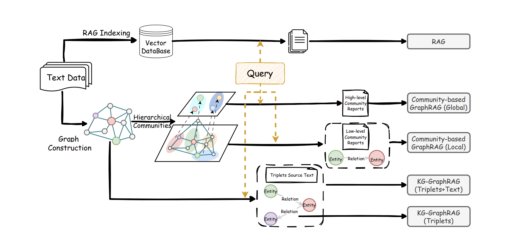

傳統 RAG 的運作方式是找到與問題相似的文字段落，這就像從一堆資料中挑出看起來最相關的幾段。這對直接的事實查詢很有效。但如果一個問題需要連接多個文件並結合不同的線索，表現就會下降。

例如，一位醫生可能會問：「根據這些病例和最新的治療指南，我們應該如何評估某種藥物對老年患者的益處和風險？」或者一個專案團隊可能會問：「回顧過去兩年的需求文件、審查記錄和線上問題報告，我們的系統架構哪個部分故障最頻繁？」這類問題不是要找一個單獨的句子。它們需要識別散布在多個資料中的人物、物件、事件和關係，並形成一個完整的畫面。

Graph RAG 主動建構這個畫面。系統使用大型模型從文字中識別關鍵實體（如人物、組織、功能模組、事件和資料）以及它們之間的關係（如因果、依賴、變化和矛盾）。然後建立一個隨著更多資料加入而成長的知識網路。透過自動分組，密切相關的實體和關係被組織為主題，每個主題可以提前摘要。當使用者提出問題時，系統不再只搜尋看起來相似的文字段落。它首先找到最相關的實體和局部圖結構，透過相關的主題組擴展，然後將分析路徑、節點描述和來源段落一起交給 LLM 進行推理。

在這個框架下，Graph RAG 和傳統 RAG 互為補充。傳統 RAG 在答案可以在一步中找到的細節問題上仍然很強。Graph RAG 更接近人類研究者的思考方式：先組織整體結構和主題，再填充證據，最後產出帶有邏輯和條件的結論。現有的比較表明，在多跳推理任務中，Graph RAG 通常涵蓋更多關鍵內容並提供更廣闊的視角。兩種方法的靈活組合通常比單獨使用任何一種都更好。

## 7.2 多模態 RAG

相關研究：

- https://arxiv.org/pdf/2502.08826

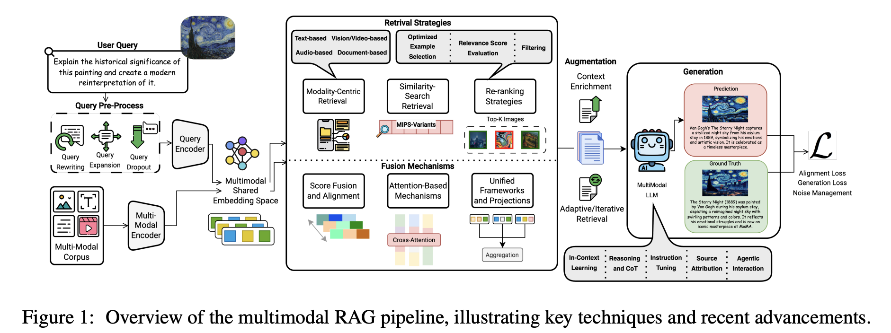

真實世界的資料從來不只有文字。工程師診斷伺服器故障需要同時看溫度曲線、裝置截圖和日誌。醫生做診斷需要同時看 CT 或 MRI 影像、檢驗報告和電子病歷。傳統的純文字 RAG 最多只能檢索到「溫度異常」或「疑似肺部結節」等詞句，但難以將這些描述與實際的圖表趨勢或影像病灶形狀關聯起來，也無法從圖片、音訊或影片反向搜尋文件或知識。

多模態 RAG 解決了不同模態之間無法互相「看見」的問題。其核心是跨模態語義對齊。系統使用適合的編碼器處理圖片、影片、音訊和文字，結合 OCR、ASR 和版面分析，從視覺和聽覺來源提取關鍵資訊，並將不同模態映射到一個共享的語義空間，在其中可以建立統一的多模態索引。

在檢索和生成時，無論使用者要求查看顯示 2023 年第三季度銷售高峰的圖表，還是上傳一張草圖或操作影片，系統首先在統一空間中找到最近的多模態證據，按文字相似度和圖片相似度等信號進行過濾，保留最有用的片段，然後將這些圖片、文字段落和表格一起交給多模態 LLM。模型接著可以結合跨模態的證據來回答，並且理想情況下可以指明來源或在圖片或文件中高亮相關區域。

與純文字 RAG 相比，多模態 RAG 可以使用更多種類的證據，通常能減少幻覺，同時產出更完整且更可驗證的答案。

## 7.3 Late Chunking：為長文件保留完整上下文

相關介紹：

- https://jina.ai/news/late-chunking-in-long-context-embedding-models/

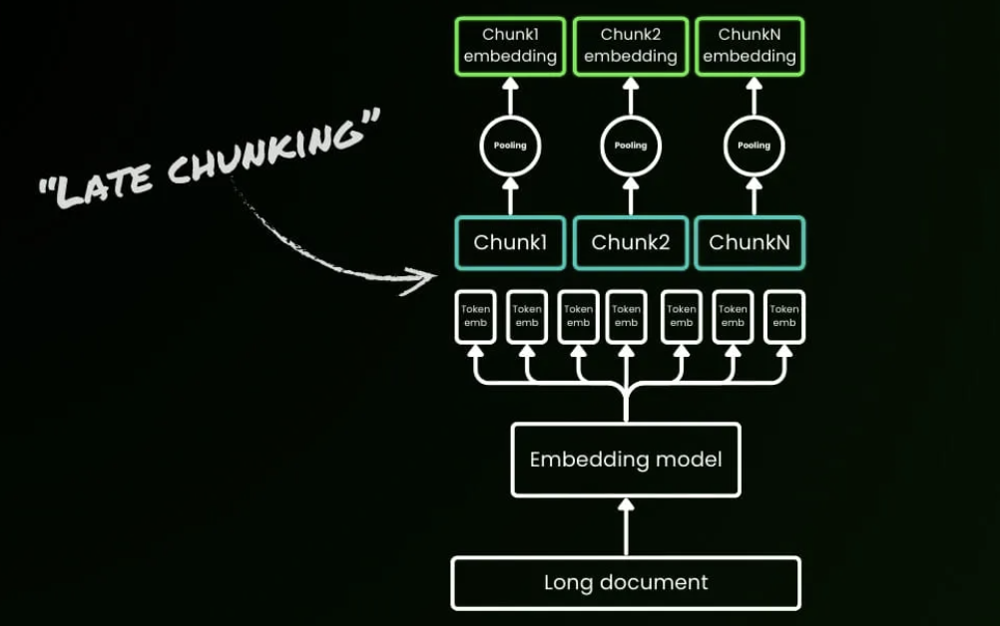

想像閱讀一篇關於柏林的維基百科文章。傳統 RAG 會先把它切成獨立的段落，然後再嵌入每個區塊。如果第一句話說「柏林是德國的首都」，後面的「該城市」或「其人口」等詞語一旦被分開就失去了與柏林的關聯。像「柏林的人口是多少？」這樣的查詢可能會失敗，因為「柏林」這個詞和人口資訊從未出現在同一個區塊中。這個問題對於長文件來說更加嚴重。在一份 200 頁的保險合約中，免賠額的定義可能出現在第 5 頁，而其適用條件出現在第 30 頁。固定長度切分可能將這些相關的部分切分到數十個孤立的區塊中，實驗表明這種情況下語義相似度會急劇下降。

Late Chunking 顛覆了傳統的「先切分再嵌入」的管線，改為「先嵌入再切分」。使用能處理約 8192 token 的長上下文嵌入模型，整個文件先通過 Transformer，產生已經看過完整文件的 token 級別嵌入。之後才根據區塊邊界將這些全域資訊化的 token 嵌入池化為區塊嵌入。產生的區塊不再是孤立的島嶼。它們是保留了跨段落引用和概念關係的上下文相關嵌入。

在 BEIR 基準資料集上，Late Chunking 廣泛優於傳統切分，在較長文件上的優勢尤為顯著。在短文字場景中，差異基本消失，這驗證了一個關鍵規則：文件越長，Late Chunking 的優勢越大。該方法現已整合到 Jina Embeddings v3 中。雖然先編碼整個長文件會增加 10% 到 20% 的推理時間，但在病歷、法律文件和技術手冊等場景中的檢索收益可以輕鬆證明這個成本是值得的。

Late Chunking 表明，在這些場景中 8K 以上的長上下文嵌入模型並非過度設計。它們往往是產生高品質區塊嵌入所必需的，代表了一個從「先切分再嵌入」到「先嵌入再切分」的轉變。

## 7.4 從 RAG 到 Agent 時代的 RAG

相關討論：

- [https://ragflow.io/blog/rag-at-the-crossroads-mid-2025-reflections-on-ai-evolution](https://ragflow.io/blog/rag-at-the-crossroads-mid-2025-reflections-on-ai-evolution)
- [https://arxiv.org/pdf/2501.09136](https://arxiv.org/pdf/2501.09136)
- [https://www.letta.com/blog/rag-vs-agent-memory](https://www.letta.com/blog/rag-vs-agent-memory)
- [https://www.linkedin.com/posts/richmondalake_100daysofagentmemory-rag-memorizz-activity-7348281860843577346-LM7Y/](https://www.linkedin.com/posts/richmondalake_100daysofagentmemory-rag-memorizz-activity-7348281860843577346-LM7Y/)
- https://www.llamaindex.ai/blog/rag-is-dead-long-live-agentic-retrieval

RAG 已經從一個檢索增強生成工具發展成為 Agent 認知架構的關鍵部分。傳統 RAG 建立在簡單的「提問、檢索、回答」模式上，本質上是被動的。它等待查詢，不會主動行動。為了突破這種被動性並處理更複雜的認知任務，RAG 與 Agent 能力進行了深度融合，催生了一種新範式：Agentic RAG。

在這個範式下，RAG 的角色發生了根本性變化。它不再僅僅是被動的外部知識提供者。相反，它成為支援 Agent 在主動規劃、目標導向和自我反思下實現智慧行為的核心處理單元。這種融合賦予了整體系統目標導向、迭代最佳化和自主決策的能力，大幅深化了人機互動的品質。Agentic RAG 能夠理解複雜任務、進行分解、規劃檢索策略，並評估初始結果的品質以決定是否需要更深入的探索。

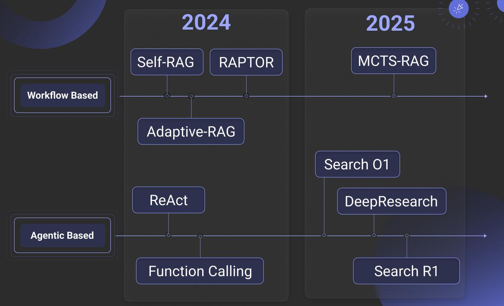

這種能力的關鍵在於多層主動迴圈。面對一個複雜查詢，Agent 首先分析問題的性質，將其分解為子問題，並為每個子問題設計精確的檢索策略。接收到初始結果後，它評估這些結果，判斷資訊是否完整和相關，識別知識缺口，並動態生成更精確的新查詢。這個迭代過程通常包括多跳檢索，其中一輪結果揭示了下一輪的新方向，產生類似人類研究者工作方式的知識探索鏈。

為了支援這種持續的、迭代的智慧行為，特別是當個人化和長期知識積累很重要時，僅靠短期對話上下文遠遠不夠。這就引出了對長期、結構化記憶的需求。

這正是為什麼 RAG 越來越多地被賦予 Agent 長期記憶系統的角色，用來建構完整的外部記憶架構。這種長期記憶與負責維護當前對話上下文的短期記憶互補。長期記憶系統依賴三個關鍵機制：

1. 結構化索引能力：
   這使 Agent 能夠在大量非結構化資料上建立多維索引（按時間、主題、實體關係等），支援從多角度高效檢索，就像人類透過不同線索回憶資訊一樣。
2. 智慧遺忘：
   透過價值評估演算法，系統可以衰減或選擇性丟棄低頻、弱相關或過時的資訊，保持記憶系統的精簡和高效，防止過載。
3. 知識鞏固：
   系統將零散的對話和互動經驗提煉為結構化知識。透過實體識別、關係提取和語義聚類，將碎片化資訊連接成知識圖譜，將短期經驗轉化為長期知識。

這種建構在 RAG 之上的外部記憶系統不僅大幅擴展了 Agent 的認知邊界，還賦予了它持續學習和演進知識的能力。它使 Agent 能夠在長期互動中積累經驗，形成個人化的運作模式和領域知識體系，並支援更複雜、更長時間執行的任務。

# 總結

檢索增強生成不僅是補償大型模型幻覺和知識過時的技術方法。它也是將通用 AI 能力轉化為深層企業價值的關鍵橋樑。從 Naive RAG 到模組化和 Agentic 形態的演進表明，RAG 的每個部分都需要持續深化，包括更精細的資料處理、跨越嵌入、重排和 LLM 階段更科學的模型選擇，以及更系統化的評估。所有這些都是朝著建構可控、可信且高效的企業知識系統的必要步驟。同時，從競賽和工程案例中汲取經驗是加深對技術細節理解的最佳方式之一。

隨著 Graph RAG、多模態理解和 Late Chunking 的持續發展和結合，RAG 正穩步突破舊有的檢索和生成邊界，朝著更深層的語義關聯和更可持續的記憶能力邁進。希望這篇綜述式的文章能幫助你建立從原理到實踐、從評估到演進的全鏈方法論，讓你在快速變化的技術環境中能夠建構出真正落地於真實世界、能應對複雜業務挑戰的高品質智慧應用。

# 參考資料

[1] Ask in Any Modality: A Comprehensive Survey on Multimodal Retrieval-Augmented Generation.

https://arxiv.org/pdf/2502.08826

[2] Retrieving Multimodal Information for Augmented Generation: A Survey.

https://arxiv.org/pdf/2303.10868

[3] A Survey on RAG Meeting LLMs: Towards Retrieval-Augmented Large Language Models.

https://arxiv.org/pdf/2405.06211

[4] Retrieval-Augmented Generation for Large Language Models: A Survey.

https://arxiv.org/pdf/2312.10997

[5] LightRAG: Simple and Fast Retrieval-Augmented Generation.

https://arxiv.org/pdf/2410.05779

[6] Agentic Retrieval-Augmented Generation: A Survey on Agentic RAG.

https://arxiv.org/pdf/2501.09136

[7] ERAGent: Enhancing Retrieval-Augmented Language Models with Improved Accuracy, Efficiency, and Personalization.

https://arxiv.org/pdf/2405.06683

[8] Graph Retrieval-Augmented Generation: A Survey.

https://www.arxiv.org/pdf/2408.08921

[9] Evaluation of Retrieval-Augmented Generation: A Survey.

https://arxiv.org/pdf/2405.07437

[10] Retrieval Augmented Generation Evaluation in the Era of Large Language Models: A Comprehensive Survey.

https://arxiv.org/pdf/2504.14891

[11] From Local to Global: A Graph RAG Approach to Query-Focused Summarization.

https://arxiv.org/pdf/2404.16130

[12] RAG vs. GraphRAG: A Systematic Evaluation and Key Insights.

https://arxiv.org/pdf/2502.11371

[13] Introduction to RAG | LlamaIndex Python Documentation.

https://developers.llamaindex.ai/python/framework/understanding/rag/

[14] All-in-RAG | A Full-Stack Guide to RAG in Large-Model Application Development.

https://datawhalechina.github.io/all-in-rag/#/en/

[15] Ilya Rice: How I Won the Enterprise RAG Challenge.

https://abdullin.com/ilya/how-to-build-best-rag/

[16] RAG Research Table - Awesome Generative AI Guide (GitHub).

https://github.com/aishwaryanr/awesome-generative-ai-guide/blob/main/research_updates/rag_research_table.md

[17] RAG is dead, long live agentic retrieval.

https://www.llamaindex.ai/blog/rag-is-dead-long-live-agentic-retrieval

[18] LLM/RAG Zoomcamp 課外補充 5：RAG 演進中的常見評估方法和市場偏好。

https://vip.studycamp.tw/t/llmrag-zoomcamp-%E8%AA%B2%E5%A4%96%E8%A3%9C%E5%85%85-5%EF%BC%9Arag-evolution-%E5%B8%B8%E8%A6%8B%E8%A9%95%E4%BC%B0%E6%96%B9%E6%B3%95%E5%92%8C%E5%B8%82%E5%A0%B4%E5%81%8F%E5%A5%BD/8185

[19] How to Evaluate Retrieval Augmented Generation (RAG) Applications.

https://zilliz.com.cn/blog/how-to-evaluate-rag-zilliz

[20] RAG is not Agent Memory.

https://www.letta.com/blog/rag-vs-agent-memory

[21] Richmond Alake. LinkedIn post on #100DaysOfAgentMemory, RAG and MemoRizz.

https://www.linkedin.com/posts/richmondalake_100daysofagentmemory-rag-memorizz-activity-7348281860843577346-LM7Y/
