# 如何製作一個簡單的 Android 應用程式 - 原生 Compose 開發

# 1 什麼是 Android 應用程式與 Android 開發

在本教學中，我們將完成一個完整的閉環：**從你腦中的一個想法，到一個能夠成功安裝並在 Android 手機上運行的真實應用程式。**

進行本教學，你至少需要具備：

- 一台效能不錯的電腦（Windows 或 Mac）
- 一支 Android 手機（選配；如果沒有，我們將使用模擬器）
- 已安裝 Android Studio（用於建置）
- 已安裝並註冊 Trae（用於 AI 編程）

## 1.1 Android 應用程式的定義

Android 應用程式是運行在 Android 作業系統上的原生應用。與小程式不同，它不依賴像微信這樣的宿主。它直接在系統層級運行，擁有自己的主畫面圖示，啟動快速、體驗流暢，並且可以深度存取藍牙、感測器、背景服務等系統級功能。


## 1.2 Android 應用程式開發

Android 開發是指建置此類應用程式的整個過程。在本教學採用的 Vibe Coding 開發模式中，透過 **AI 輔助編程**，開發者的角色從「程式碼撰寫者」轉變為「產品架構師」：

1. **你（架構師 / PM）**：負責業務邏輯設計、提示詞撰寫以及最終驗收。
2. **Trae（AI 工程師）**：負責執行指令，將自然語言轉換為標準的 Kotlin 程式碼和 Jetpack Compose 佈局，並處理語法錯誤和邏輯細節。
3. **Android Studio（建置工廠）**：負責提供編譯環境，將程式碼打包為可運行的應用程式，並提供模擬器預覽。

## 1.3 常見的 Android 應用程式建置方式

在實際開發中，建置 Android 應用程式的方式不止一種。我們在此不深入探討，僅提供整體概念。

**第一種方式：原生開發**
這是 Google 官方推薦的路線。你直接使用 **Kotlin** 和 **Jetpack Compose** 進行開發。其優勢在於效能最佳，且能完整存取手機硬體。

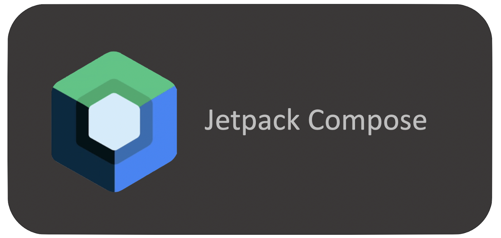

**第二種方式：跨平台開發**
例如 Flutter 或 React Native。其核心思想是「寫一份程式碼，同時產生 Android 和 iOS 應用程式」。

**第三種方式：混合開發**
本質上是在應用程式外殼中包裹一個網頁。開發速度快，但體驗和流暢度通常不如原生應用程式，也難以打造精緻、沉浸式的小工具。

**本教學的選擇：原生開發（Kotlin + Compose）** 結合 AI 工具進行編碼。
原因很簡單：原生 Jetpack Compose 程式碼結構非常清晰，非常適合 AI 理解和生成。我們不需要從零開始手寫程式碼，而是用自然語言引導 Trae 生成高品質的原生程式碼。


## 1.4 本教學涵蓋的 Android 應用程式開發步驟

為了讓學習過程更有趣，本教學圍繞一個輕鬆但技術上具代表性的案例——**電子木魚**。我們將 Trae 的 Vibe Coding 模式與一條你可以反覆重用的路線結合：

1. **建立認知與環境**：了解什麼是 Android 應用程式，安裝 Android Studio 和 Trae，並配置國內友善的鏡像源，讓工具鏈順暢運作。
2. **建置專案骨架**：建立一個能在模擬器中成功運行的空白 Android 專案。
3. **AI 疊代開發**：在 Trae 中開啟專案，透過與 AI 的對話，逐步實現木魚圖片、點擊動畫、音效、浮動文字等功能。
4. **真機調試與打磨**：超越模擬器，將應用程式安裝到你的實體手機上，體驗真實的震動回饋，並讓 AI 協助排查問題。
5. **打包與發佈**：產生正式的 APK，並了解如何分享或發佈。

本節只描繪大方向，不展開所有指令。現在只需記住主線：**環境搭建 → 骨架建置 → AI 描述與生成 → 真機打磨 → 打包交付**。接下來的章節，我們將帶你一步步完成。

# 2 開發環境搭建

## 2.1 本教學使用的工具

在整個開發過程中，我們同時使用三種工具，分別扮演「設計」、「建置」和「驗收」的角色。

- **Trae**：這是你的 **AI 編程夥伴**。在 Vibe Coding 模式下，我們不再需要逐行輸入程式碼，而是主要用自然語言告訴 AI 我們想要什麼，由它負責程式碼的生成和修改。
- **Android Studio**：這是 Google 官方的 **應用程式建置工廠**。雖然它有很多按鈕，但本教學主要使用它來建立專案骨架，以及將 Trae 生成的程式碼編譯成可安裝到手機上的應用程式。
- **Android 裝置**：這是作為查看結果的 **測試終端**。你可以將其連接到電腦進行真機調試，感受真實的震動回饋。如果沒有，Android Studio 內建的 **模擬器** 可以完美模擬一台虛擬手機，足以應付早期開發。

## 2.2 下載 Trae

Trae 是我們進行 **Vibe Coding** 的主戰場。你可以簡單地將它理解為一個 **「AI 驅動的程式碼編輯器」。**

造訪官方網站 [https://www.trae.cn](https://www.trae.cn)，下載與你電腦系統匹配的版本（Windows 或 Mac），然後像安裝普通軟體一樣雙擊安裝程式並按照提示操作。準備好這個工具後，在後續實踐中我們將不再盯著枯燥的程式碼視窗，而是在這裡開啟專案，用自然語言告訴 AI 要建造什麼。

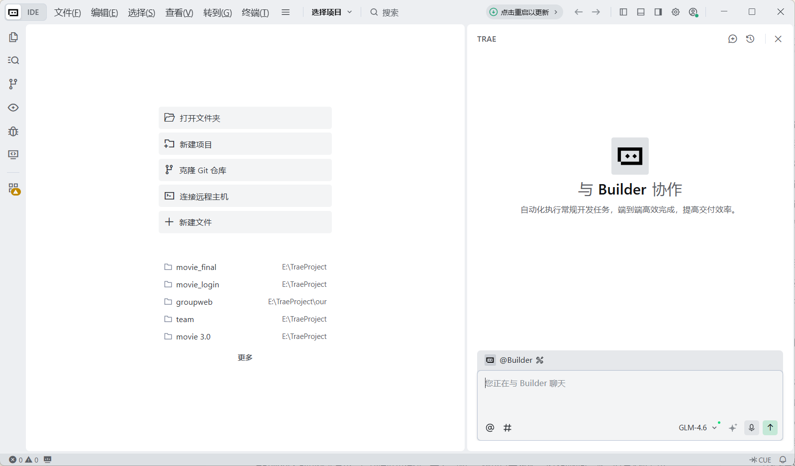

## 2.3 下載 Android Studio

我們需要 Android Studio 來提供運行應用程式所需的 Android SDK 和模擬器。造訪官方下載頁面 [https://developer.android.com/studio?hl=zh-cn](https://developer.android.com/studio?hl=zh-cn)，下載適合你作業系統的安裝包（本教學基於 **2025.2.3** 版本）。下載後，像安裝普通軟體一樣安裝，全程保持預設選項。

**初學者特別提醒：**

雖然現代版本的 Android Studio 已大幅簡化了配置，但它底層仍然依賴 **JDK（Java Development Kit）**。如果你是第一次進行開發，或者在安裝過程中遇到環境變數或 SDK 配置相關的錯誤，不要驚慌。你可以參考這篇詳細的設定指南：[Android Studio 2024 安裝設定：SDK 和 Gradle 配置](https://blog.csdn.net/keiraee/article/details/142321644?ops_request_misc=elastic_search_misc&request_id=a2b858d1f665095c53afa9114ad8864d&biz_id=0&utm_medium=distribute.pc_search_result.none-task-blog-2~all~top_positive~default-2-142321644-null-null.142^v102^pc_search_result_base4&utm_term=android%20studio%E5%AE%89%E8%A3%85%E5%8F%8A%E9%85%8D%E7%BD%AE&spm=1018.2226.3001.4187)


## 2.4 建立新專案

開啟 Android Studio，在歡迎畫面上點擊 **New Project**。

**第一步：選擇範本**

在範本列表中，選擇 **Empty Activity**（注意上面的 Jetpack Compose 圖示）。


**第二步：填寫專案配置**

接著你會看到一個配置表單。大致按照以下方式填寫，其餘保持預設：

| **欄位** | **建議值** | **說明** |
| ----------------- | -------------------------------------------------- | ---------------------------------------- |
| **Name** | My Application 1 | 手機主畫面上顯示的應用程式名稱 |
| **Package name** | com.example.myapplication1 | 應用程式的唯一識別碼 |
| **Save location** | 自訂路徑（例如 `E:\AndroidProjects\Myapplication1`） | 專案儲存位置；不建議放在 C 槽 |
| **Minimum SDK** | API 30 | 覆蓋超過 90% 的活躍裝置，同時平衡相容性和功能 |
| **Language** | Kotlin（推薦） | Kotlin 是 Google 官方推薦的語言，更簡潔安全 |

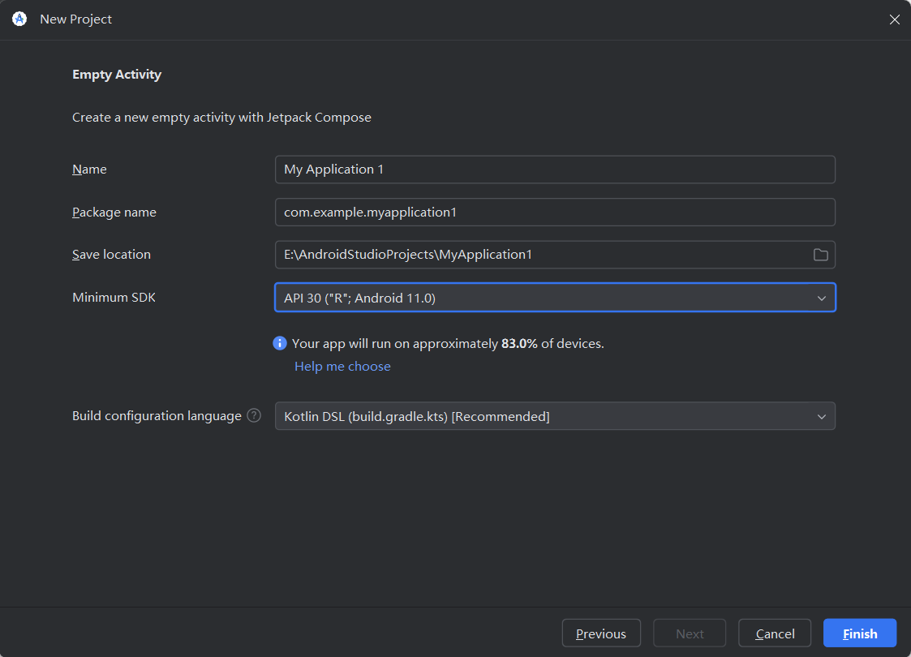

**第三步：等待專案建置**

點擊 **Finish**。Android Studio 會自動下載依賴項並建置專案（你會在右下角看到進度條）。

- _注意：首次建立專案可能需要幾分鐘。請耐心等待直到底部進度完成，左側的專案檔案樹完全載入。_

## 2.5 依賴配置：Gradle 下載與 Gradle 倉庫鏡像

> 這是 Vibe Coding 工作流程中少數建議 **手動操作** 的步驟之一。雖然 AI 也能幫忙修改配置，但環境配置涉及底層檔案，手動修改更可靠。

為什麼需要修改配置？

預設情況下，Android Studio 連接到海外伺服器，下載建置工具和依賴項可能需要一個小時甚至失敗。切換到國內鏡像後，通常幾分鐘內就能完成。**這是一次性的工作，受益終身。**

1. **準備工作**

如果 Android Studio 右下角的狀態列目前顯示 `Gradle Building...` 之類的進度條，先暫停正在進行的依賴下載，以避免檔案衝突。


2. **加速 Gradle 下載**

在左側的專案檔案樹中，展開 `gradle` -> `wrapper`，然後開啟 `gradle-wrapper.properties`。將下載來源改為騰訊鏡像：

```text
distributionUrl=https\://mirrors.cloud.tencent.com/gradle/gradle-8.7-bin.zip
```

請注意：你只需要將 `services.gradle.org/distributions` 替換為 `mirrors.cloud.tencent.com/gradle`。不要更改其他內容。


3. **加速依賴倉庫下載**

接著，開啟專案根目錄的 `settings.gradle.kts`，將 `repositories` 區塊中的內容替換為以下內容：

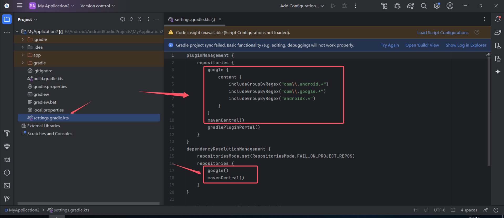

將高亮部分替換為以下程式碼（截至 2025-02-21 的最新來源列表）：

```json
        // 阿里雲鏡像（涵蓋 Maven Central、Google、JCenter 等）
        maven { setUrl("https://maven.aliyun.com/repository/public/") }
        maven { setUrl("https://maven.aliyun.com/repository/google/") }
        maven { setUrl("https://maven.aliyun.com/repository/jcenter/") }
        maven { setUrl("https://maven.aliyun.com/repository/gradle-plugin/") }
        // 華為雲鏡像
        maven { setUrl("https://repo.huaweicloud.com/repository/maven/") }
        // 騰訊雲鏡像
        maven { setUrl("https://mirrors.cloud.tencent.com/nexus/repository/maven-public/") }
        // 網易鏡像
        maven { setUrl("https://mirrors.163.com/maven/repository/maven-public/") }
```

替換後應如下圖所示：

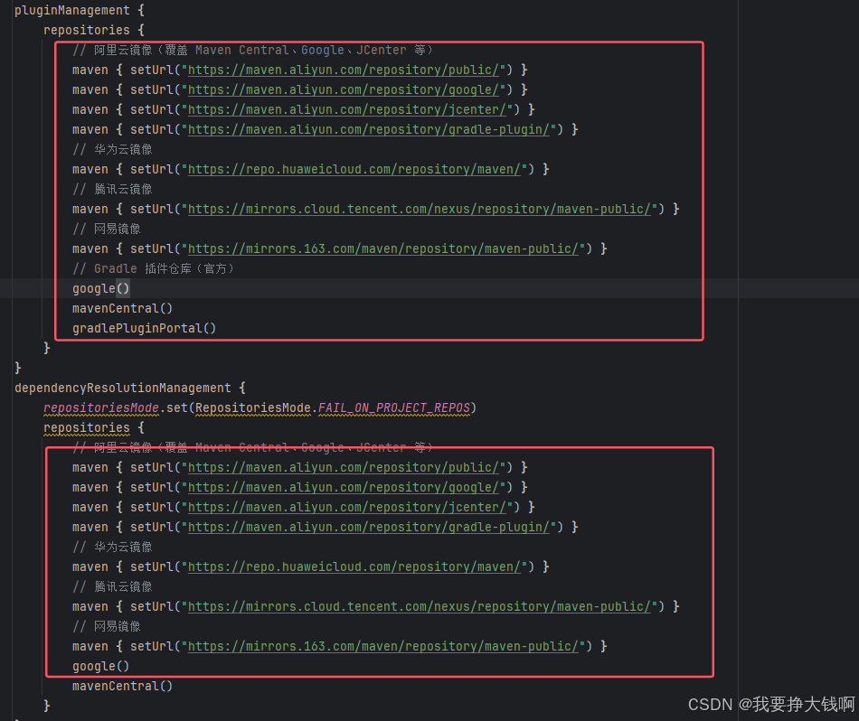

4. **儲存並套用變更**

此時儲存檔案，點擊右上角的 `Try Again`。Android Studio 會重新執行下載。等待幾分鐘。當控制台顯示 `BUILD SUCCESSFUL` 時，表示環境搭建已全部完成，我們可以開始編碼了。

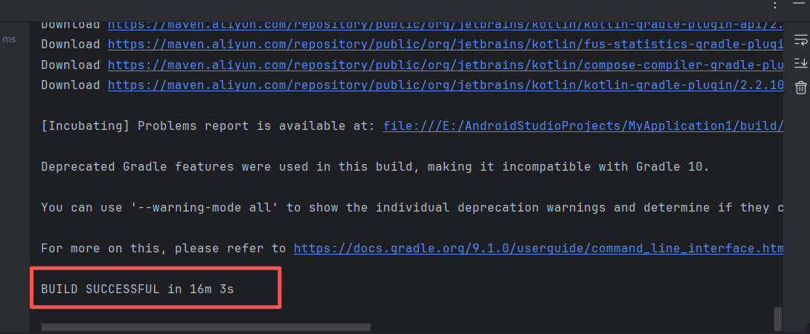

## 2.6 了解專案結構

專案建立成功後，左側會出現 **Project** 面板。切換到 **Android** 視圖（預設），你會看到以下關鍵目錄：

```text
app/
├── manifests/
│   └── AndroidManifest.xml            <- 應用程式「身分證」，宣告應用程式名稱和入口 Activity（MainActivity）
│
├── java/
│   └── com.example.myapplication1/
│       ├── MainActivity.kt            <- 應用程式入口，使用 Jetpack Compose 建立 UI
│       │
│       └── ui/                        <- 控制整體 UI 風格（顏色、字型）
├── res/
│   ├── drawable/                      <- 圖片資源（例如 ic_launcher.png）
│   ├── mipmap/                        <- 應用程式圖示
│   ├── values/                        <- 文字、顏色、主題樣式
│   │   ├── colors.xml
│   │   ├── strings.xml
│   │   └── themes.xml
│   └── xml/                           <- 系統相關配置檔案（非 UI）
└── build.gradle (Module: app)         <- 應用程式建置配置（初學階段通常不需要修改）
```

作為初學者，我們通常只需要關注三個檔案：

- `MainActivity.kt`：控制行為，決定「螢幕上顯示什麼」
- `AndroidManifest.xml`：註冊元件，決定「應用程式從哪裡啟動」
- `Theme.kt`：定義視覺外觀

# 3 Android 應用程式開發

在前兩章中，我們已經了解了什麼是 Android 應用程式，並磨利了兩個關鍵工具：Trae 和 Android Studio。從本節開始，我們告別紙上談兵，進入實際操作。我們將採用 Vibe Coding 模式，從零開始建置一款非常受歡迎的解壓應用——**電子木魚**。它很符合「Vibe」的主題（簡單放鬆），同時涵蓋了 Android 開發的三個核心部分：**UI 互動（點擊）、資料儲存（功德計數）和多媒體（音效）**。

現在，跟著我們一起向 AI 發送第一條指令。

## 3.1 第一個「大師提示詞」：從零到一

在 Vibe Coding 模式下，我們不需要像傳統開發那樣先建立佈局檔案再撰寫邏輯程式碼。我們需要做的是 **一次性清楚描述需求，讓 AI 生成第一個可運行的原型**。

在 Trae 中開啟我們剛建立的專案目錄，在右側的聊天面板中輸入以下提示詞：

```text
你是一位資深的 Android 開發專家。請改寫目前的 MainActivity.kt，將其變成一個「電子木魚」應用程式。需求：
1. 螢幕背景為黑色。
2. 在螢幕中央顯示一個木魚圖形，大小適中，顏色為白色。
3. 在其上方顯示一行白色文字：「功德：0」。
4. 點擊中央的木魚時，數字加 1，並出現簡單的縮放動畫效果（模擬敲擊的感覺）。
5. 使用 Jetpack Compose。
```

發送後，Trae 會開始分析你的專案結構。幾秒鐘後，它會直接生成 `MainActivity.kt` 的完整程式碼。

1. 從它的回覆中，我們可以看到它的推理邏輯和互動邏輯
2. 我們可以直接看到程式碼的哪些部分被改寫了
3. 如果對結果不滿意，我們可以回滾到之前的版本


## 3.2 運行與預覽（模擬器調試）

此時，AI 已經完成了第一輪開發。但請記住，我們在 Trae 中看到的只是程式碼的「藍圖」，而不是真正可互動的應用程式。Trae 本身無法直接運行 Android 應用程式，所以我們需要依賴 Android Studio 提供的 **虛擬裝置模擬器**。它就像把你的電腦螢幕變成一台虛擬 Android 手機，讓我們可以立即安裝程式碼並查看真實效果。

接下來，讓我們配置這台「虛擬手機」。

**第一步：建立模擬器**

回到 Android Studio，在右側工具列中找到並點擊 **Device Manager**。如果找不到，從 `View -> Tool Windows -> Device Manager` 開啟。

在面板中點擊 **Add a new device**，然後選擇 **Create Virtual Device** 進入裝置選擇視窗。


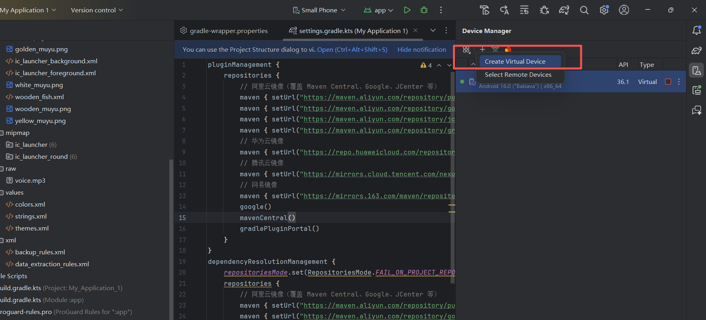

在硬體選擇視窗中，選擇 **Phone**，然後選擇 **Smart Phone**（中等螢幕尺寸），或你喜歡的其他裝置設定檔如 Pixel，然後點擊 **Next**。

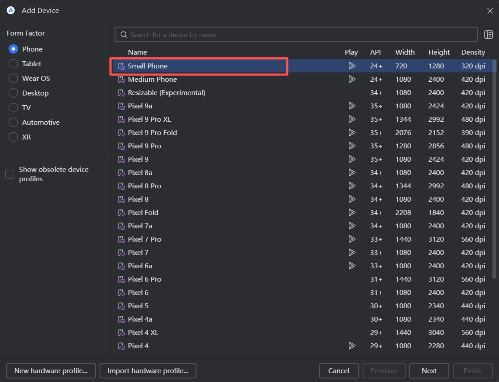

**第二步：配置系統映像**

在 **System Image** 對話框中，選擇 **API 36.1**。如果尚未下載，先點擊 **Download**，下載完成後選擇它，然後點擊 **Finish**。


**第三步：啟動模擬器**

建立成功後，你的新手機會出現在裝置管理員列表中。點擊右側的 **三角形播放按鈕**。短暫等待後，會彈出一個手機形狀的視窗——這就是你的 Android 模擬器。


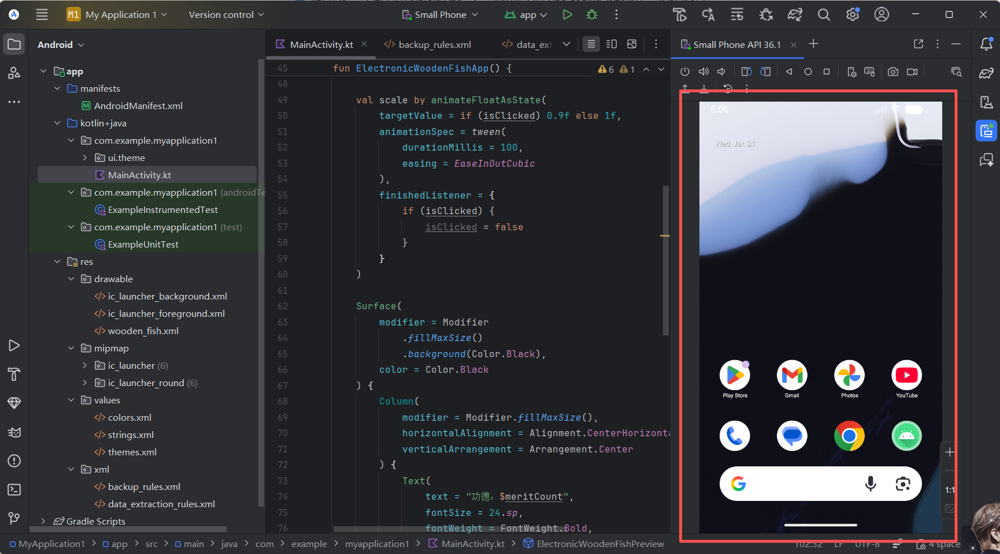

**第四步：運行應用程式**

現在是見證奇蹟的時刻。確保模擬器已啟動並顯示桌面，然後點擊 Android Studio 頂部工具列中醒目的 **綠色運行三角形**（或使用快捷鍵 `Shift + F10`）。Android Studio 會自動編譯 Trae 撰寫的程式碼，將其打包為應用程式，並安裝到模擬器中。

幾秒鐘內，你應該會看到模擬器螢幕亮起，中央顯示一個白色木魚圖形，上方有「功德：0」的文字。試著點擊它，看看數字是否增加、動畫是否生效。這就是你的第一個 Android 應用程式。


## 3.3 最佳化疊代（添加素材和音效）

到了這個階段，我們的應用程式已經有了基本雛形：點擊可以增加數字。但它還只是一個「無聲」的白色幾何圖形，缺乏趣味性。接下來，我們將透過添加真實的圖片和敲擊音效，讓電子木魚變得更加沉浸。

**這正是 Vibe Coding 模式最吸引人的地方。** 在傳統開發中，添加音效和更複雜的動畫往往是初學者的噩夢。你需要管理 `MediaPlayer` 的資源載入和釋放（否則可能導致記憶體洩漏），還需要計算動畫曲線。在 Vibe Coding 模式下，你完全不需要關心這些底層細節。你只需要像導演一樣告訴 AI：「換道具，點擊時加個音效」，實作方案就會立即出現。

**第一步：準備素材**
你需要一張木魚圖片（`png`）和一個敲擊音效（`mp3`）。

- **圖片素材**：將準備好的 `white_muyu.png` 複製到 `app/src/main/res/drawable`
- **音訊素材**：在 Android Studio 中，右鍵點擊左側專案面板的 `res` 資料夾，選擇 `New -> Android Resource Directory`，選擇 **raw** 作為資源類型，點擊 OK，然後將 `voice.mp3` 複製到新建的 `res/raw` 資料夾中。_（注意：如果你打算商業發佈，請確保所有素材都有合法的使用權。）_

以下是我為你找到的圖片和聲音素材。如果不方便自行搜尋，可以直接使用。


敲擊音效下載連結：https://www.aigei.com/s?q=%E6%9C%A8%E9%B1%BC&type=sound
選擇第一個 1 秒的音效。

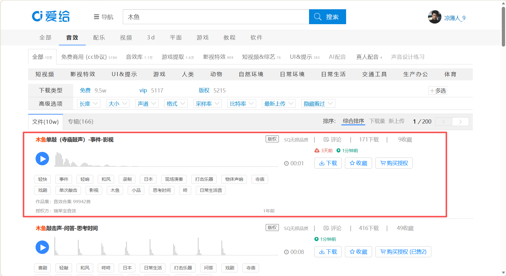

**第二步：發送疊代指令**

素材準備好後，回到 Trae。Trae 會再次修改程式碼，為你處理音訊載入和動畫邏輯。你只需要告訴它要使用哪些素材。輸入以下提示詞：

```text
我已經添加了素材。圖片路徑是 res/drawable/white_muyu.png，音效路徑是 res/raw/voice.mp3。請更新程式碼：
1. 將中央的木魚圖示替換為我的圖片。
2. 每次點擊木魚時播放敲擊音效。
3. 點擊時，在木魚上方顯示臨時的「+1」文字，然後讓它向上飄浮並消失（類似遊戲中的浮動分數文字）。
```

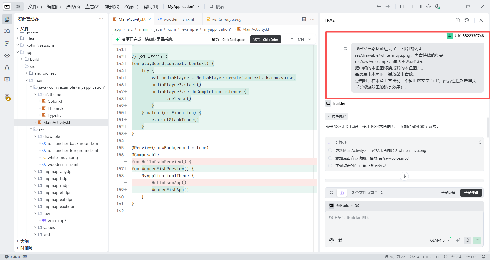

**第三步：驗證結果**

Trae 修改完程式碼後，回到 Android Studio，再次點擊綠色運行按鈕（重新運行）以重啟模擬器。此時，你的應用程式會讓人耳目一新。試著連續點擊——你應該能聽到清脆的「篤篤」聲，並看到浮動的「功德 +1」文字跳出。這樣就完成了從「展示品」到「產品」的關鍵轉變。


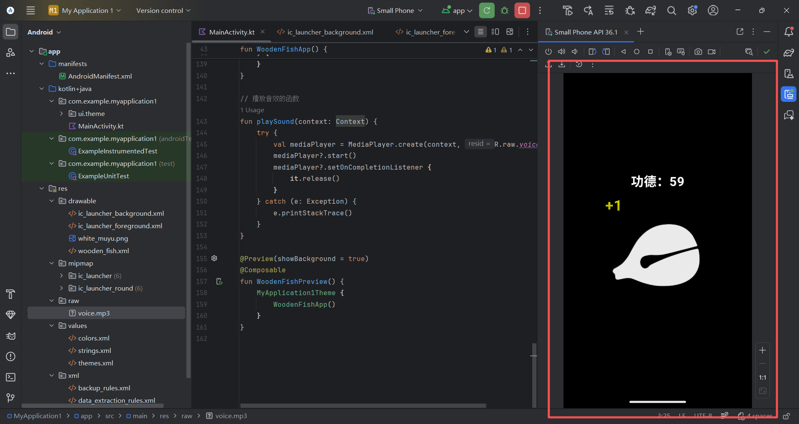

## 3.4 如果出現問題怎麼辦？（與 AI 的除錯迴圈）

AI 生成的程式碼不保證第一次就完美無缺，就像頂尖工程師也不能承諾一次就寫出沒有問題的程式碼一樣。但在 Vibe Coding 模式下，問題不再是阻擋你的牆，而是你與 AI 協作的墊腳石。

**情況一：應用程式當機**

假設點擊運行後應用程式立即當機，或者點擊木魚沒有播放聲音。在傳統方式下，你需要搜尋錯誤代碼，瀏覽數十個技術論壇，閱讀大量晦澀的英文文章。在 Vibe Coding 模式下，你只需要做一件事——**當快遞員**。

**步驟：**

1. **開啟日誌**：找到 Android Studio 底部的 **Logcat** 面板（小貓圖示）。
2. **定位錯誤**：你會看到滾動的日誌，其中 **紅色行** 通常是關鍵錯誤。
3. **複製貼上**：選取紅色的英文錯誤文字，複製並貼到 Trae 中：「運行時出現了這個錯誤，請幫我修復。」
4. AI 可能會立即告訴你類似這樣的資訊：「這是因為在 `AndroidManifest.xml` 中沒有宣告震動權限」，然後給你修復後的程式碼。你只需點擊套用，繼續前進。

**情況二：應用程式可以運行，但體驗不佳**

有時應用程式不會當機，但仍然讓人不滿意。例如，快速點擊木魚時，你可能會發現新的「+1」動畫要等到前一個「+1」完全消失後才會出現。這使得回饋感遲滯、不夠爽快。你不需要自己研究多執行緒或動畫佇列，只需要清楚地向 AI 描述那種不適感。

向 Trae 發送這個「進階指令」：

```text
請修改目前的動畫邏輯，解決「快速點擊不觸發」的問題。
目前問題：似乎只有一個動畫狀態，所以必須等到前一個「+1」完全消失後，下一次點擊才會回應。
需求：
1. 將單一動畫狀態替換為基於 mutableStateListOf 的列表。
2. 每次點擊木魚時，立即向列表中添加一個新的「+1」實例（擁有自己的 ID 和初始位置），不管前一個動畫是否結束。
3. 在 UI 中遍歷這個列表，讓每個「+1」獨立執行自己的向上飄浮 + 淡出動畫。
4. 「+1」動畫結束後，自動從列表中移除，以防止記憶體洩漏。
請直接提供更新後的 MainActivity.kt 程式碼。
```

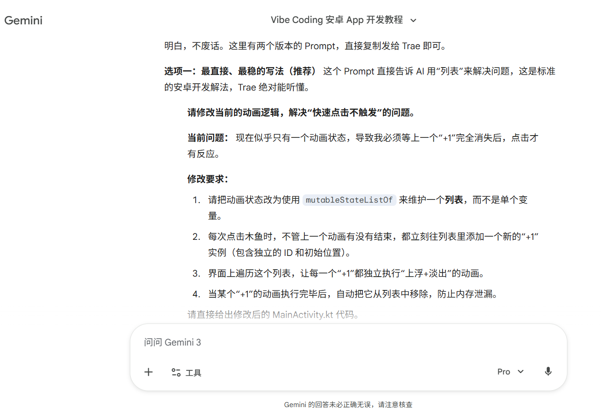

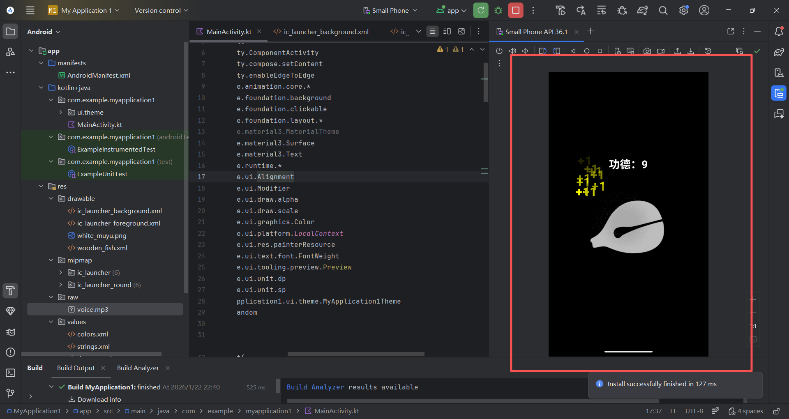

## 3.5 最終成果展示

在前面的步驟中，我們已經完成了一個看得見、聽得到的電子木魚。為了讓它更接近可發佈的應用程式，我們將透過最後一次疊代來添加 **觸覺回饋** 和 **自訂功能**。我們將實現兩個核心功能：第一，**震動回饋**，讓每次點擊都能得到手機馬達的物理回應，大幅提升沉浸感；第二，**自訂文字**，允許使用者修改螢幕上的文字，例如將「功德 +1」改為「薪資 +1」或「煩惱 -1」。

向 Trae 發送以下精心設計的提示詞。它會一次性處理對話框邏輯、狀態切換和硬體互動：

```text
角色：你是 Android Jetpack Compose 專家。
任務：請在現有的電子木魚應用程式中添加「自訂文字」和「震動回饋」功能。
需求：
1. 觸覺回饋
每次使用者點擊木魚時，除了音效和動畫外，呼叫手機的觸覺回饋（使用 LocalHapticFeedback.current）給予輕微的觸感回應。
2. 自訂文字功能（UI 和互動）
入口：在頂部文字（如「功德 +1」）旁邊添加一個小編輯圖示（可以使用 Icons.Default.Edit）。
對話框邏輯：點擊圖示時，顯示一個對話框（Dialog/AlertDialog）。
    對話框標題：「修改內容」
    輸入：允許使用者輸入想要累積的文字（預設為「功德」）
    值選擇：在輸入框下方提供兩個選項（例如 RadioButton 或切換按鈕），讓使用者選擇「+1」或「-1」
    儲存按鈕：點擊儲存後，關閉對話框並將新設定套用到主畫面
    資料刷新：如果使用者更新了內容，將頂部計數器重設為 0，從零重新開始計數
3. 效果更新
儲存後，頂部計數器文字和點擊木魚時顯示的浮動動畫文字都應改為使用者的自訂格式。
    浮動文字大小不應超過頂部計數器文字的大小
    範例：如果使用者輸入「薪資」並選擇「+1」，頂部計數器邏輯變為 +1，浮動文字變為「薪資+1」
    如果使用者輸入「煩惱」並選擇「-1」，頂部計數器邏輯變為 -1，浮動文字變為「煩惱-1」
4. 技術要求：
確保新狀態（文字和數字）正確影響動畫。
請直接提供完整更新後的 MainActivity.kt，同時保持之前的音效和動畫邏輯不變。
```


# 4 真機調試與打磨

模擬器很方便，但它無法模擬真實的手機震動，也無法完全反映真實的觸控延遲。為了獲得最準確的「手感」，我們需要將應用程式安裝到真正的 Android 手機上。以下是兩種連線方式供你選擇：

1. **無線調試（Wi-Fi）**：不需要資料線，方便日常查看。但你的電腦和手機必須在 **同一個 Wi-Fi 網路** 下。
2. **USB 有線調試**：更穩定，不容易斷線，適合網路不佳或首次安裝失敗時使用。

## 4.1 無線調試

這是 Android 11 及以上版本最方便的方法。

**第一步：準備手機**

1. 確保手機和電腦連接到 **同一個 Wi-Fi**。
2. 開啟 **開發人員選項**，啟用 **無線調試**。
3. 點擊 **無線調試** 進入詳細設定，然後選擇 **使用 QR code 配對裝置**。手機會開啟掃描器畫面。

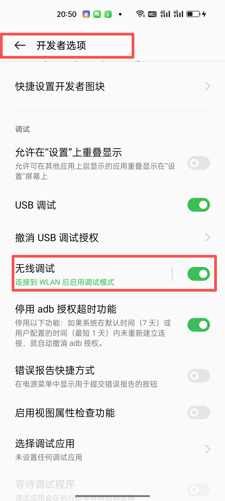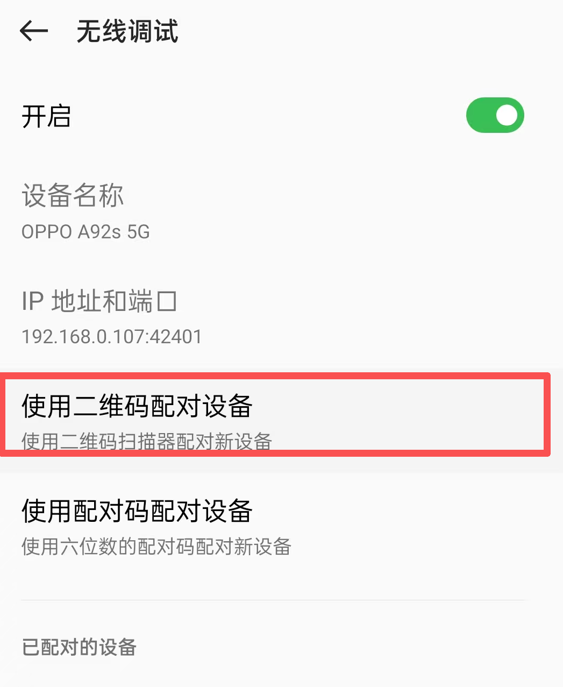

**第二步：在電腦上配對**

1. 回到 Android Studio，點擊頂部工具列中的裝置選擇器。
2. 從下拉選單中選擇 **Pair Devices Using Wi-Fi**。
3. 螢幕上會彈出一個 QR code。


**第三步：掃描連線**

1. 使用手機掃描電腦螢幕上的 QR code。
2. 手機和電腦都應顯示「配對成功」。
3. 此時，Android Studio 頂部的裝置欄會自動顯示你的手機型號（例如 `Google Pixel 8`）。


4. 點擊 ▶️ 運行應用程式

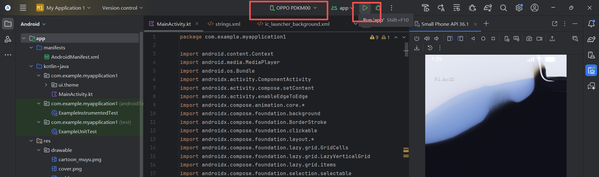

## 4.2 USB 有線調試

如果無線連線不穩定，或者你的網路環境比較複雜，插上線纜永遠是最可靠的解決方案。雖然不太方便，但它的傳輸速度最快，幾乎不會斷線。

### 4.2.1 在 Android Studio 中準備 USB 驅動程式（僅限 Windows）

Mac 使用者可以跳過此步驟，因為 macOS 通常可以直接識別手機。Windows 使用者需要確保電腦能識別 Android 手機，這通常意味著需要安裝 Google 的 USB 驅動程式：

1. 在 Android Studio 中，點擊 `Tools -> SDK Manager`（或在 `Settings -> Languages & Frameworks -> Android SDK` 下找到）
2. 切換到 **SDK Tools** 標籤
3. 勾選 **Google USB Driver**，點擊 **Apply** 下載並安裝

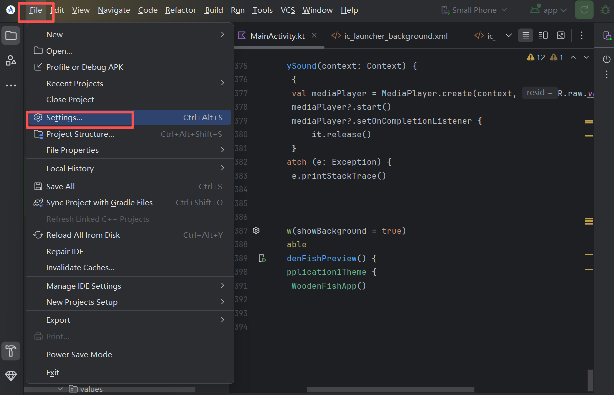

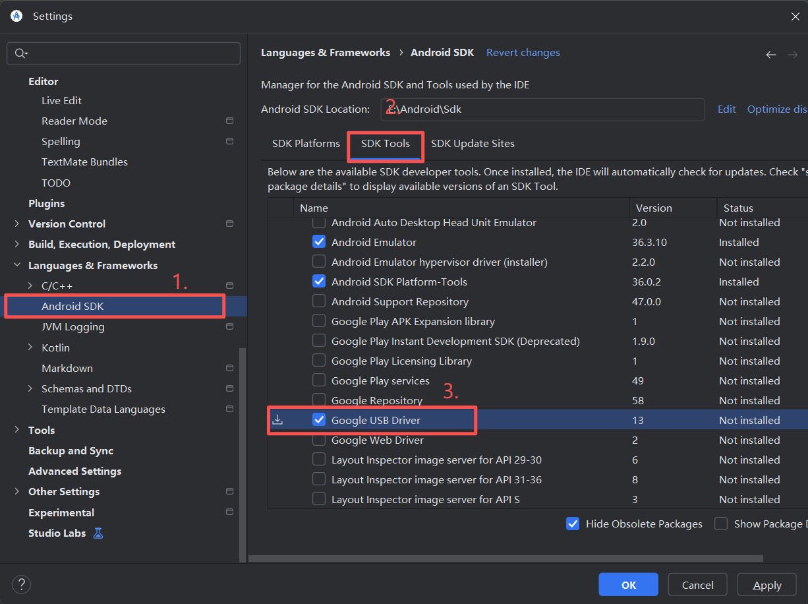

### 4.2.2 下載與真機相同的 SDK 版本

**第一步：檢查手機的 Android 版本**

以 OPPO 手機為例：開啟設定 -> 關於手機 -> 查看 Android 版本（範例中為 Android 12）。


**第二步：在 Android Studio 中下載對應的 Android 平台版本**

1. 在 Android Studio 中，點擊 `Tools -> SDK Manager`
2. 保持在預設的 **SDK Platforms** 標籤
3. 選擇 Android 12.0，點擊 Apply 下載

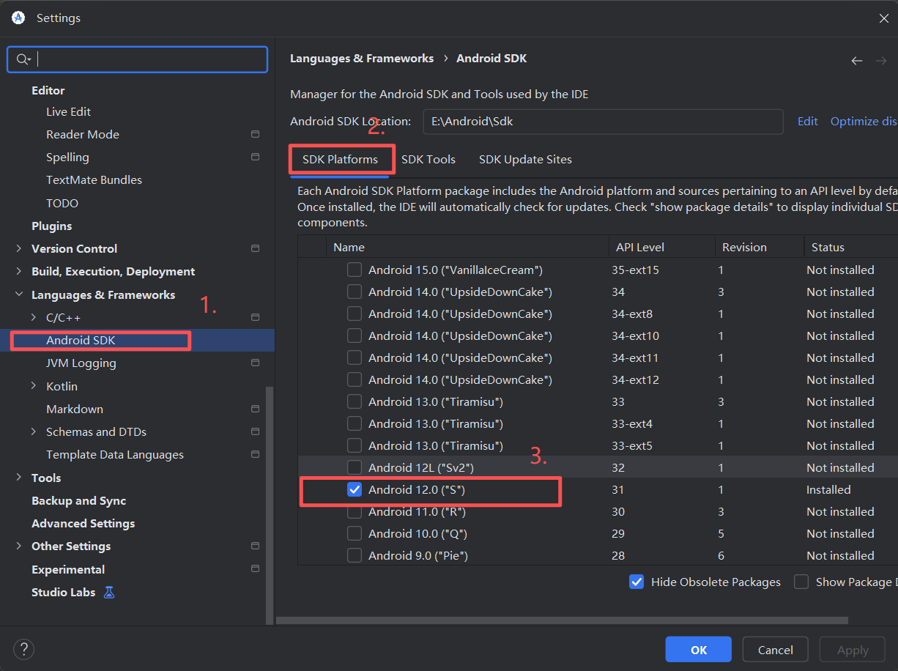

### 4.2.3 在手機上啟用開發者模式

開啟手機設定，進入開發人員選項，開啟 **USB 調試**。


### 4.2.4 在手機上安裝 USB 驅動程式授權

此時拿起你的手機。它應該會顯示一個重要的安全對話框：「允許 USB 調試嗎？」請確保勾選 **一律允許**，然後點擊 **允許** 或 **確定**。這是賦予電腦調試控制權的關鍵授權。


### 4.2.5 在手機上運行應用程式

1. 在 Android Studio 頂部的裝置選擇器中，你現在應該能看到你的手機型號（例如 `OPPO-PDKM00`）
2. 點擊 ▶️ 運行。你的手機會顯示「允許 USB 調試嗎？」的對話框；勾選「一律允許」並確認
3. 應用程式會自動安裝並啟動

現在試著在手機上點擊木魚，感受真實的震動馬達回饋。這才是完整的 Vibe Coding 體驗。

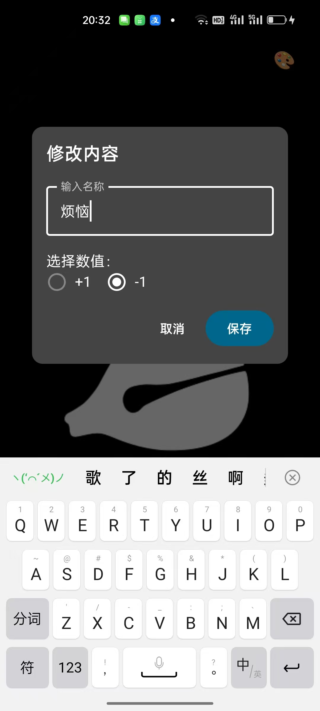

# 5 將應用程式打包為 APK

程式碼已經完成，真機測試也成功了。現在我們需要把應用程式從 Android Studio 中「取出來」，變成一個你可以發送給朋友安裝的檔案。這個過程稱為 **打包**。在 Android 開發中，打包有兩種完全不同的模式，我們根據使用場景來選擇。

## 5.1 打包除錯版本（用於快速分享）

如果你只是想把應用程式分享給朋友快速試用，或者發送到測試手機上驗證，**除錯版本** 是最快的選擇。它就像一份「草稿」——功能完整，但沒有正式簽名，所以不能提交到應用程式商店。

**步驟非常簡單：** 在 Android Studio 的頂部選單中，找到 `Build`，將滑鼠懸停在 `Generate App Bundles or APKs` 上，然後從子選單中點擊 `Generate APKs`。

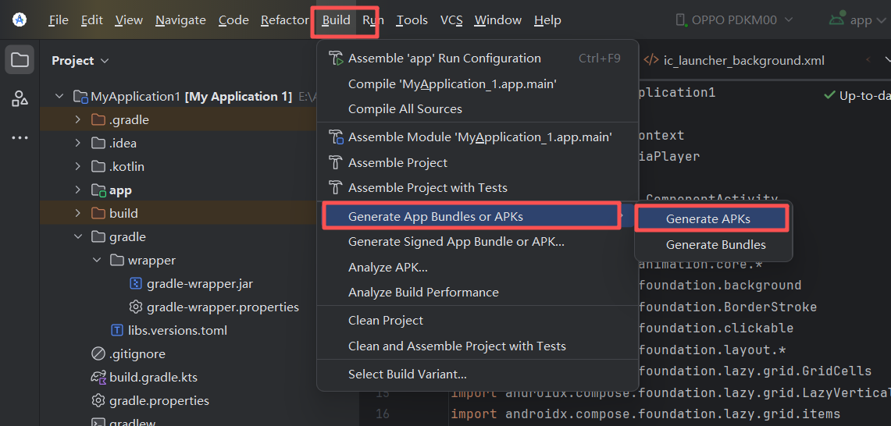

根據專案大小等待約 5 秒。在 Android Studio 右下角的控制台區域會出現提示。點擊藍色的 `locate` 連結，輸出資料夾會自動開啟。名為 `app-debug.apk` 的檔案就是我們要的安裝包。

你可以直接透過微信或 QQ 發送給任何 Android 手機，接收者即可安裝使用。注意，除錯版本不是正式發行版本。

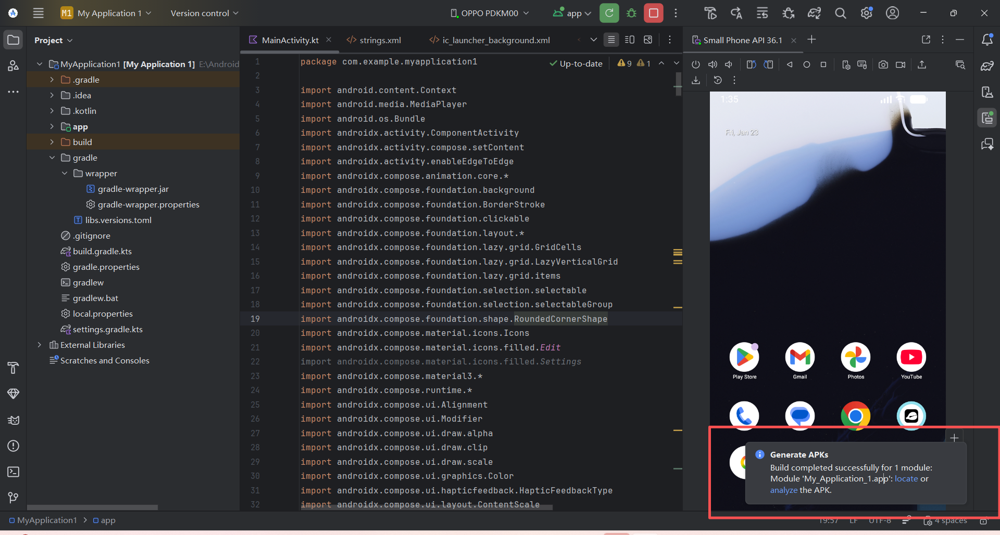

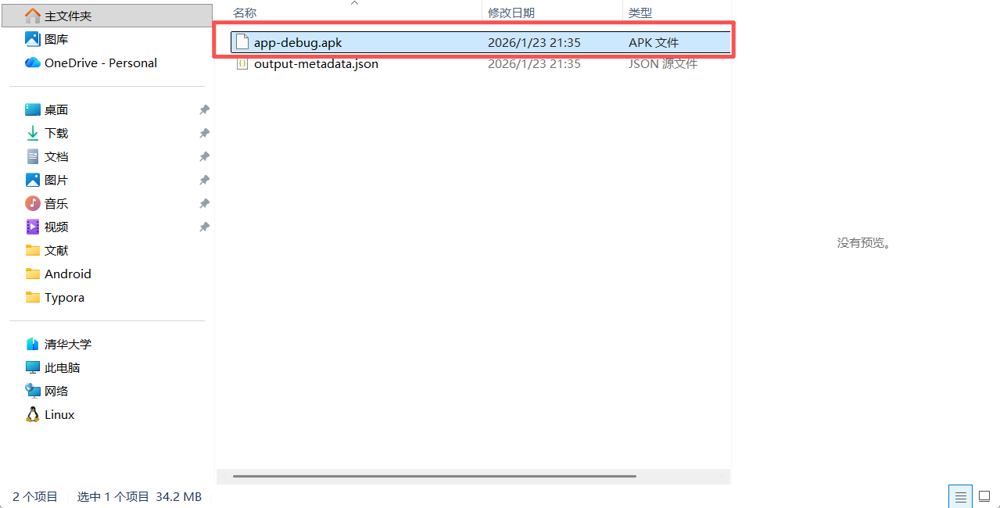

## 5.2 打包正式版本

如果你想將應用程式發佈到應用程式商店（如 Google Play 或華為應用市場），或者避免安裝時出現「不安全的應用程式」警告，那麼你必須打包一個 **正式版本**。這個版本需要一個唯一的 **數位簽章**，就像一個防偽印章，證明這個應用程式是你開發的，且未被竄改。

> 簽章的核心目的
>
> - 確定發佈者身份：因為相同套件名稱的應用程式可以替換已安裝的程式，簽章可以防止這種行為被濫用
> - 確保應用程式完整性：簽章過程涵蓋安裝包中的每個檔案，確保它們事後不會被替換

Android 應用程式簽章就像蓋印章。印章蓋上後，應用程式和開發者就綁定在一起了：應用程式是你的，你對它負責。別人無法冒充你，你也無法冒充別人。

**第一步：啟動簽章精靈**

在頂部選單中，選擇 `Build`，然後點擊 `Generate Signed Bundle / APK`。在彈出的視窗中，你會面臨兩個選擇：

- Android App Bundle（`.aab`）：Google Play 要求的格式，體積較小，但不能直接安裝到手機上
- APK：標準安裝包，可以直接安裝
_為了示範，我們先選擇 APK，點擊 Next。_

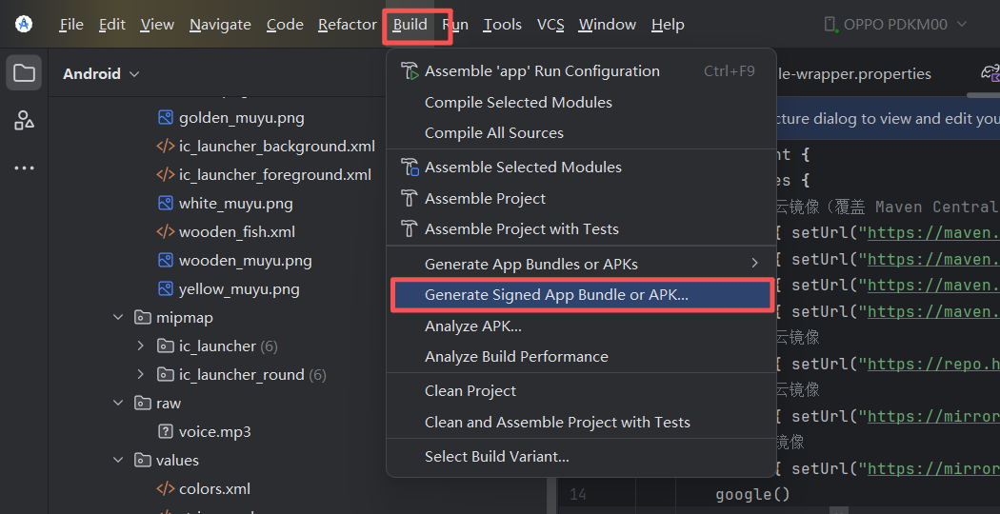

**第二步：建立數位金鑰（KeyStore）**

這是初學者最容易卡住的地方。因為這是你第一次進行正式版打包，你需要建立一個新的 **金鑰儲存庫（keystore）**。在 `Key store path` 下方點擊 **Create new**。

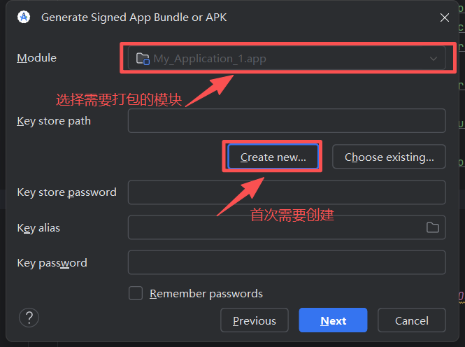

在彈出的視窗中填寫所需資訊，類似於註冊帳號。我們強烈建議金鑰儲存庫密碼和金鑰別名密碼 **保持一致**，並且 **務必妥善記錄**。如果遺失此密碼，你的應用程式未來將永遠無法更新。

完成後點擊 OK。你會回到上一個畫面，剛才填寫的金鑰資訊會自動帶入。

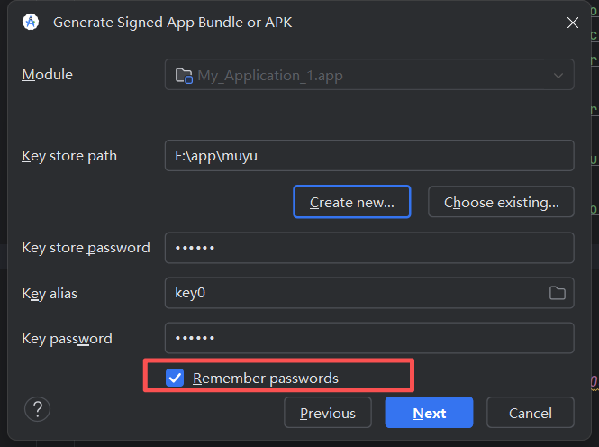

**第三步：生成正式安裝包**

點擊 Next，在 Build Variants 中選擇 **release**，最後點擊 **Create**。

短暫等待後，Android Studio 會在右下角再次顯示「Generate Signed APK」成功提示。點擊 **locate**，這次你會在資料夾中看到經過數位簽章的正式安裝包（通常命名為 `app-release.apk`）。這個檔案就是你作為開發者交付的最終產品。


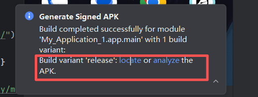

# 6 正式發佈到應用程式商店 / 市場

當你的應用程式開發完成、正式安裝包準備好後，下一步就是發佈讓更多人可以下載使用。目前主要的發佈管道分為兩類：**國內 Android 應用程式商店** 和 **海外應用程式商店（Google Play）**。

## 6.1 發佈到國內市場

中國大陸的 Android 生態系統比較特殊。沒有統一的官方商店（因為 Google Play 無法直接存取）。市場由 **手機廠商應用程式商店** 和 **第三方平台** 分割。主要的 **廠商商店** 包括華為、小米、OPPO、vivo、魅族、三星等。由於預裝在裝置上，它們擁有最大的流量。主要的 **第三方平台** 包括騰訊應用寶和 360 手機助手。

### 6.1.1 核心難點：個人開發者的「路障」

在註冊帳號之前，有一件非常重要的事情你必須了解：**國內應用程式市場對個人開發者的審核非常嚴格。**

目前，幾乎所有主要的國內應用程式商店（華為、小米、OPPO、vivo、應用寶等）都 **要求** 提供 *電腦軟體著作權登記證書* 才能提交。

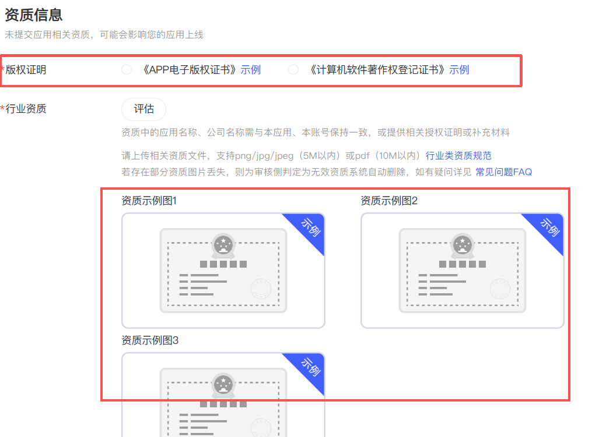

- **這是什麼？** 它是證明應用程式屬於你的法律文件。
- **取得成本**：你需要透過版權局申請。自行辦理通常需要 2-3 個月；透過代理機構加急處理可能需要數百到一千多元人民幣。
- **現實情況**：沒有此證書，你的應用程式很可能無法通過審核，甚至可能無法建立應用程式條目。此外，新聞、金融、醫療等類別可能還需要 ICP 備案或其他資質。

所以，如果你的應用程式只是個人練習專案或小工具，不想花時間和金錢申請此證書，建議直接跳到第 6.2 節考慮 Google Play，或者乾脆直接將 APK 檔案分享給朋友。

### 6.1.2 註冊開發者帳號

如果你已經準備好了所需的資質，或者已經決定在國內市場發佈，第一步就是帳號註冊。各大平台的流程類似，通常需要個人身份驗證或企業營業執照驗證。

以下是主要應用程式市場的開發者平台網址：

騰訊開放平台：https://open.tencent.com/

360 開放平台：http://dev.360.cn

百度開發者平台：http://app.baidu.com

小米開發者平台：https://dev.mi.com

華為開發者聯盟：http://developer.huawei.com/consumer/cn

阿里巴巴開發者平台：http://open.uc.cn
阿里巴巴分發整合了豌豆莢、阿里九游、PP 助手、UC 應用商店、神馬搜尋和 YunOS 應用商店。你只需要註冊一個阿里巴巴開發者帳號。

三星開發者平台：http://support-cn.samsung.com/App/DeveloperChina/Home/Index

OPPO 開發者聯盟：http://open.oppomobile.com

vivo 開發者聯盟：https://dev.vivo.com.cn

聯想開放平台：http://open.lenovo.com

魅族開發者聯盟：http://open.flyme.cn

金立開發者聯盟：https://open.appgionee.com

**以騰訊應用寶為例：** 造訪騰訊開放平台並點擊註冊。建議直接使用 QQ 帳號登入。請注意，QQ 帳號一旦綁定就難以解綁，所以最好使用專門的工作 QQ 帳號。按照提示選擇「個人開發者」或「企業開發者」，上傳身分證照片並完成人臉驗證。通過驗證後，點擊 **建立應用程式** 開始。

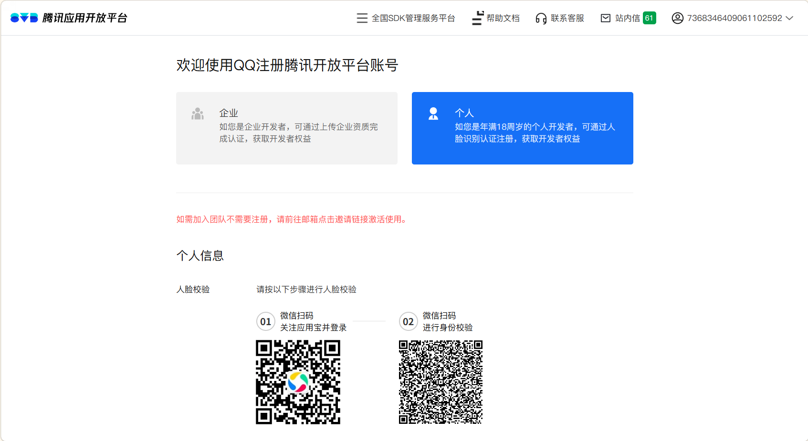


### 6.1.3 提交流程與必備資料

帳號審核通過後，你就可以建立應用程式並提交審核了。你需要準備以下「四件套」：

1. **安裝包**：第 5 章打包的 **Release APK**
2. **文字資訊**：
3. **應用程式名稱**：不得包含敏感詞彙
4. **一句話簡介**：20 個中文字以內，簡潔明瞭（例如：「一款輕鬆的電子木魚應用程式」）
5. **詳細描述**：200 字以上的中文，介紹應用程式的功能和使用場景
6. **視覺素材**：
7. **應用程式圖示**：高清 PNG，通常為 512x512
8. **應用程式截圖**：準備 4-5 張清晰的使用中截圖，最好涵蓋主要頁面，尺寸統一，如 1080x1920
9. **資質文件**：上傳電腦軟體著作權登記證書的掃描件

**提交與審核：** 填寫所有資訊並上傳 APK 後，點擊 **提交審核**。審核週期通常為 1-3 個工作天。在此期間，請注意電子郵件或簡訊通知。審核人員可能會因為截圖不清晰、描述不規範或缺少必要資質而拒絕申請。遇到這種情況，你只需根據回饋進行修改並重新提交。

## 6.2 發佈到海外市場（Google Play）

如果你不想處理國內應用程式商店中軟體著作權證書和備案的複雜手續，或者你的目標受眾是全球使用者，Google Play 是個人開發者的最佳選擇。

### 6.2.1 準備工作

- **Google 帳號**：一個普通的 Gmail 帳號即可
- **25 美元註冊費**：這是一次性的終身費用，需要一張支援美元支付的信用卡（Visa / Mastercard）
- **穩定的網路環境**：你需要能夠順利存取 Google Play Console
- **正式安裝包**：請注意，Google Play 要求 **.aab**（Android App Bundle）格式，而非 APK。在 Android Studio 中打包時選擇 Android App Bundle。步驟與打包 APK 幾乎相同。

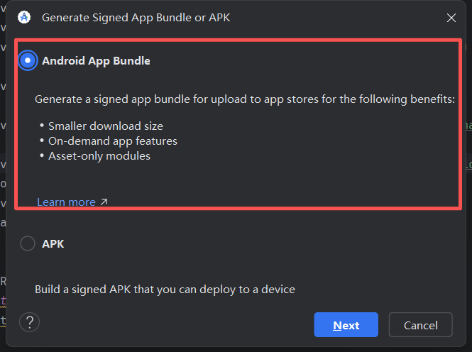

### 6.2.2 Google Play Console 發佈流程（概覽）

由於 Google Play 的註冊和付款仍然存在一些門檻（例如需要海外信用卡），本教學暫不提供逐步截圖。但以下是常見的四步流程：

**第一步：建立應用程式並進入控制台**

點擊 `Create app`，填寫應用程式名稱（`Electronic Wooden Fish`），選擇英文作為語言，選擇 App 和 Free 作為應用程式類型，然後勾選協議。之後你就可以進入後台了。

**第二步：裝飾商店頁面**

這是使用者的第一印象。你需要上傳準備好的應用程式 **圖示**（512x512）和一張 **特色圖片**（1024x500）。至於英文描述，你可以直接請 Trae 幫忙：**「請幫我撰寫一篇在 Google Play 上發佈電子木魚的英文描述，語氣輕鬆活潑。」** AI 通常寫得比直接翻譯更自然。

**第三步：隱私權與內容分級**

- 隱私權政策：搜尋「App Privacy Policy Generator」，生成一個免費連結貼上即可
- 內容分級：填寫一份簡單的問卷（例如是否有暴力或賭博內容）。電子木魚通常會獲得通用 3+ 分級。

**第四步：上傳並發佈**

在 `Production` 選單下，點擊 `Create new release`，上傳你的 `.aab` 檔案，儲存並提交審核。Google Play 的審核通常很快（1-3 天）。一旦通過，你的應用程式就可以在全球下載了。


_如果你已經完成開發者帳號註冊，這部影片教學可以引導你完成剩餘流程：_ [完整工作流程：上傳 Android 應用程式到 Google Play](https://www.bilibili.com/video/BV16REQzGEnk/?share_source=weixin&vd_source=b42f227a4f2d413fbde18499d83227cf)

# 7 結語

教學到此結束。看著手機上由你親手打造的電子木魚，不知道你有什麼感受。

作為一個接受過軟體工程訓練的人，在如今 AI 快速發展的時代，我其實感觸頗深。過去，我們啃厚厚的程式設計書籍，學習複雜的語法，與環境配置作鬥爭，花大半天的時間對付紅色的錯誤訊息。但時代變了，現在我們越來越多地在學習如何指揮 AI。

透過這次 Vibe Coding 實踐，你已經體驗了完整的 Android 應用程式開發流程。技術門檻確實在降低。我們不再需要時刻枯燥地寫程式碼，可以把更多精力放在決定 **做什麼** 上。但不管工具多強大，它們終究只是工具。不要讓這個應用程式在你的手機上吃灰。繼續折騰它，弄壞了再修好。只有當你開始有了自己的想法並將其實現時，你才真正跨越了門檻。

如果本教學讓你覺得「做一個應用程式其實沒那麼難」，那我很榮幸能幫助這個開發世界又多了一位新世代的建造者。

我非常期待你的下一個作品。繼續加油！


**_祝你在 Android 開發的世界裡玩得愉快！_**

# 參考資料

CSDN：[如何打包/建置 Android Studio 專案（2024-03-04）](https://blog.csdn.net/GenuineMonster/article/details/136443130?ops_request_misc=&request_id=&biz_id=102&utm_term=android%20studio%20%E6%89%93%E5%8C%85%20APK%20%E5%B9%B6%E5%88%86%E4%BA%AB&utm_medium=distribute.pc_search_result.none-task-blog-2~all~sobaiduweb~default-1-136443130.142^v102^pc_search_result_base4&spm=1018.2226.3001.4187)

CSDN：[Android Studio 安裝與配置](https://blog.csdn.net/Changersh/article/details/149838228?ops_request_misc=&request_id=&biz_id=102&utm_term=android%20studio%E5%AE%89%E8%A3%85%E5%8F%8A%E9%85%8D%E7%BD%AE&utm_medium=distribute.pc_search_result.none-task-blog-2~all~sobaiduweb~default-0-149838228.142^v102^pc_search_result_base4&spm=1018.2226.3001.4187)
